# 103：互相关与卷积的区别 🔄

在本节课中，我们将探讨深度学习中一个术语上的细节：卷积神经网络（CNN）中实际执行的操作与信号处理中定义的“卷积”之间的区别。我们将明确互相关与卷积在数学定义和实际操作上的不同，并解释为何在深度学习中我们通常使用“卷积”这一术语。

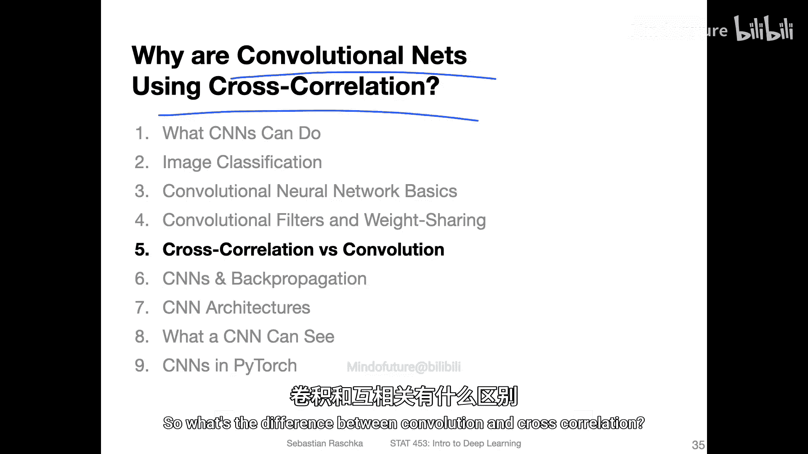

## 概述

在之前的课程中，我们学习了卷积神经网络的基本操作。本节我们将深入一个技术细节：在深度学习中，我们通常所说的“卷积”操作，在数学上更准确的称呼是“互相关”。理解这两者的细微差别有助于澄清术语，并明白这在实际应用中并不影响模型的功能。

## 互相关与卷积的数学定义

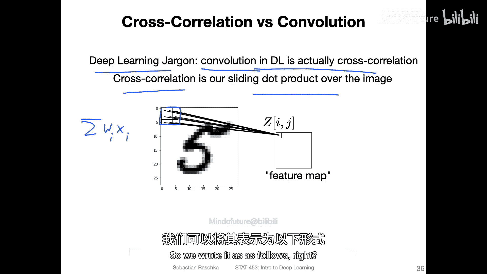

上一节我们介绍了卷积层通过滑动窗口和点积提取特征。本节中，我们来看看这个操作在数学上的两种形式化定义：互相关和卷积。

两者的核心区别在于**滤波器（或权重矩阵）与输入数据相乘的顺序**。

*   **互相关** 的操作方式与我们之前视频中演示的完全一致。它将滤波器滑过输入图像，在每一个位置计算滤波器与对应图像区域的**点积**。
*   **卷积** 在数学定义上，需要在计算点积之前，先将滤波器在水平和垂直方向上进行**翻转**。

以下是它们的公式化表示。假设我们有一个二维输入 `X` 和一个二维滤波器 `W`。

**互相关** 的计算公式为：
`(X ★ W)[i, j] = Σ_m Σ_n X[i+m, j+n] * W[m, n]`

**卷积** 的计算公式为：
`(X * W)[i, j] = Σ_m Σ_n X[i+m, j+n] * W[-m, -n]`

注意卷积公式中滤波器 `W` 的索引 `-m, -n`，这代表了翻转操作。

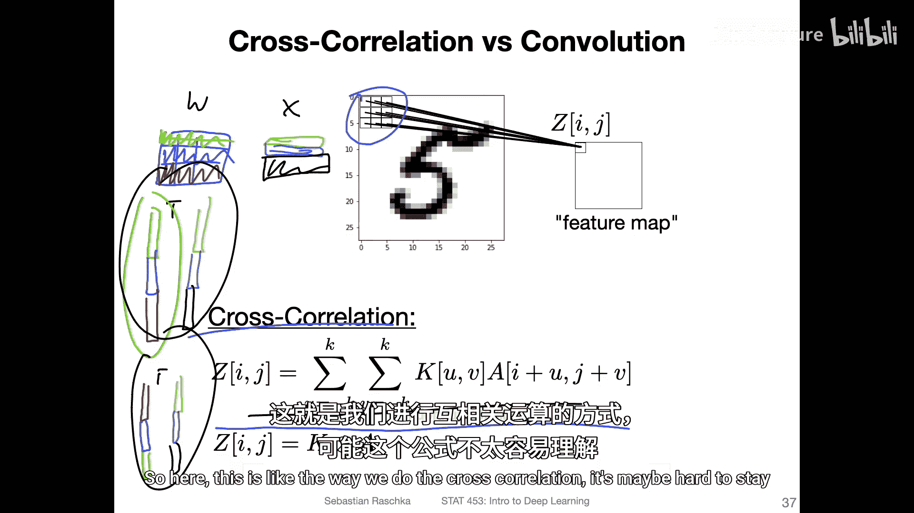

## 通过图示理解区别

仅看公式可能不够直观，让我们通过图示来明确这一区别。

以下展示了计算互相关时，滤波器 `W` 如何与输入 `X` 的一个区域对齐并相乘。我们以索引 `(0,0)` 作为滤波器的中心参考点。


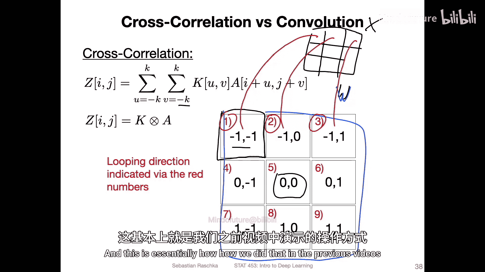

在互相关中，我们直接将滤波器覆盖在输入上对应位置进行逐元素相乘并求和。这与我们实现卷积层时的直觉完全相符。

然而，在严格的数学卷积中，操作顺序有所不同。下图展示了卷积的操作方式：滤波器首先被翻转，然后再与输入对齐相乘。


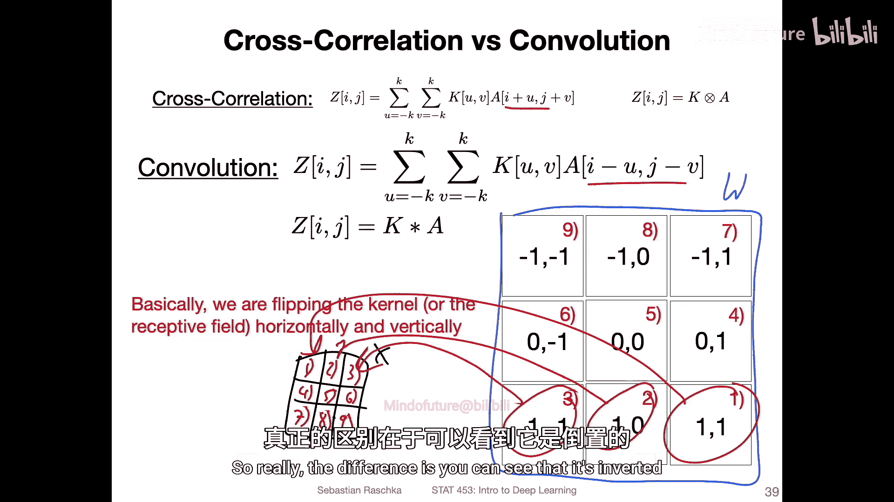

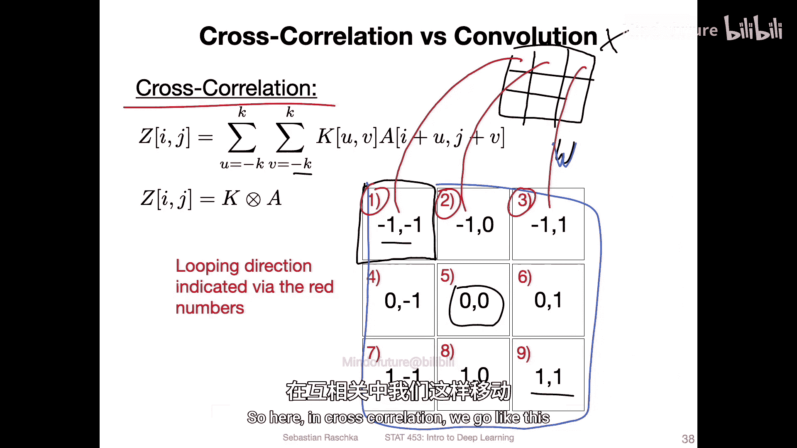


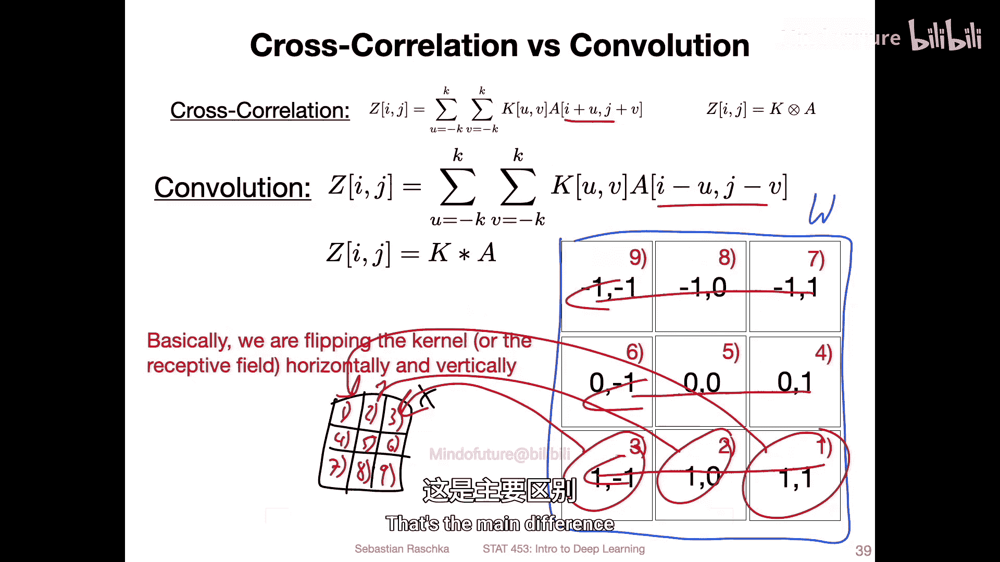

你可以看到，滤波器的角标顺序发生了颠倒。简而言之：
*   在**互相关**中，我们按 `(左上->右下)` 的顺序对齐相乘。
*   在**卷积**中，我们按 `(右下->左上)` 的顺序对齐相乘（即翻转后的效果）。


## 代码验证

如果你不相信，我们可以用代码来实际验证这一点。以下示例使用 PyTorch 和 SciPy 库进行演示。

首先，我们初始化一个张量和卷积层。

```python
import torch
import numpy as np
from scipy import signal

# 初始化输入
x_torch = torch.tensor([[[[1., 2., 3.],
                          [4., 5., 6.],
                          [7., 8., 9.]]]])
# 初始化卷积层，设置偏置为0以便观察
conv = torch.nn.Conv2d(1, 1, kernel_size=3, bias=False)
# 手动设置一个权重滤波器
conv.weight.data = torch.tensor([[[[0.1, 0.2, 0.3],
                                   [0.4, 0.5, 0.6],
                                   [0.7, 0.8, 0.9]]]])
```
现在，我们应用 PyTorch 的卷积并计算其结果。
```python
# PyTorch 卷积结果
result_pytorch = conv(x_torch)
print(f"PyTorch '卷积' 结果: {result_pytorch.item():.4f}")
# 输出例如: -1.1027
```
接下来，我们使用 SciPy 的互相关函数 `correlate2d` 进行计算。为了比较，我们需要将数据转换为 NumPy 数组。
```python
# 转换为 NumPy 并提取权重
x_np = x_torch.squeeze().numpy() # 形状 (3, 3)
w_np = conv.weight.data.squeeze().numpy() # 形状 (3, 3)

# SciPy 互相关结果
result_corr = signal.correlate2d(x_np, w_np, mode='valid')
print(f"SciPy 互相关 结果: {result_corr.item():.4f}")
# 输出应与 PyTorch 结果非常接近，例如: -1.1027
```
正如你所见，PyTorch 的 `Conv2d` 操作结果与 SciPy 的互相关操作结果相同。这证实了深度学习中的“卷积”实质是互相关。

那么，真正的数学卷积结果是什么？我们使用 SciPy 的卷积函数 `convolve2d` 来计算。
```python
# SciPy 数学卷积结果
result_conv = signal.convolve2d(x_np, w_np, mode='valid')
print(f"SciPy 数学卷积 结果: {result_conv.item():.4f}")
# 输出会是另一个值，例如: -0.26
```
为了在 PyTorch 中得到数学卷积的结果，我们需要手动翻转滤波器权重。
```python
# 翻转权重以模拟数学卷积
w_flipped = torch.flip(conv.weight.data, dims=[2, 3])
conv.weight.data = w_flipped
result_pytorch_flipped = conv(x_torch)
print(f"PyTorch (翻转权重后) 结果: {result_pytorch_flipped.item():.4f}")
# 输出应与 SciPy 数学卷积结果相同，例如: -0.26
```

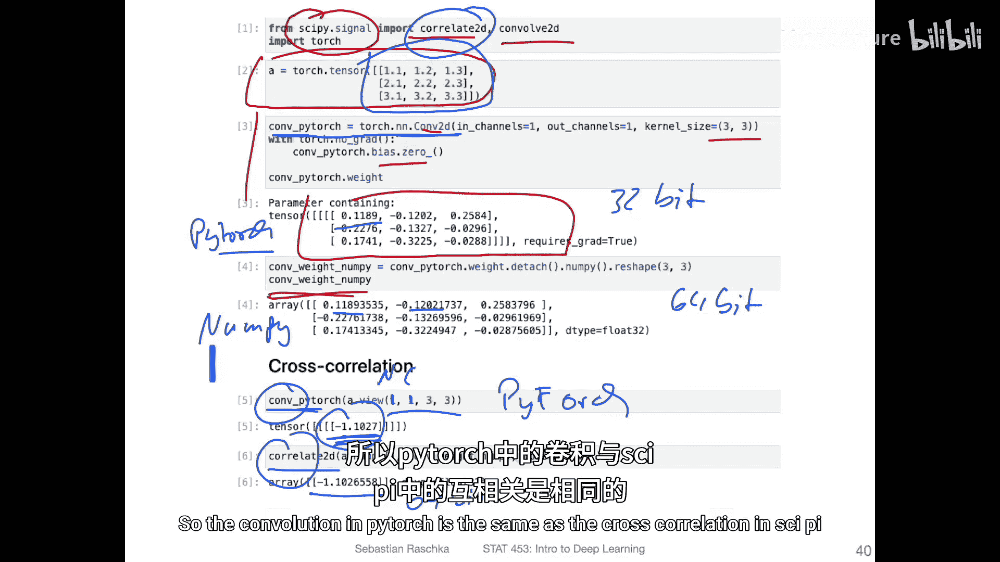

## 为何在深度学习中这并不重要

既然操作不同，为什么在深度学习领域我们仍然称之为“卷积”且这没有造成问题呢？

以下是几个关键原因：

*   **参数学习**：在CNN中，滤波器的权重是通过训练学习得到的，而不是预先设定的固定算子。无论我们称这个操作为“卷积”还是“互相关”，网络都会自动学习到适应这种操作顺序的最佳滤波器。如果严格使用数学卷积，网络最终学到的也只是一个翻转后的版本而已。
*   **无关联性需求**：在传统信号处理中，卷积的数学性质（如结合律）对于某些理论分析和操作很重要。然而，在深度学习的网络前向传播和反向传播中，我们并不依赖这些特定的数学性质。
*   **实现简便**：互相关的实现（无需翻转）更为直接，尤其是在计算反向传播梯度时更简单高效。深度学习框架（如PyTorch、TensorFlow）都采用这种方式。
*   **术语沿袭与便利**：“卷积神经网络”这个名称已经深入人心，听起来也比“互相关神经网络”更简洁、更通用。这主要是一个历史和惯例问题。


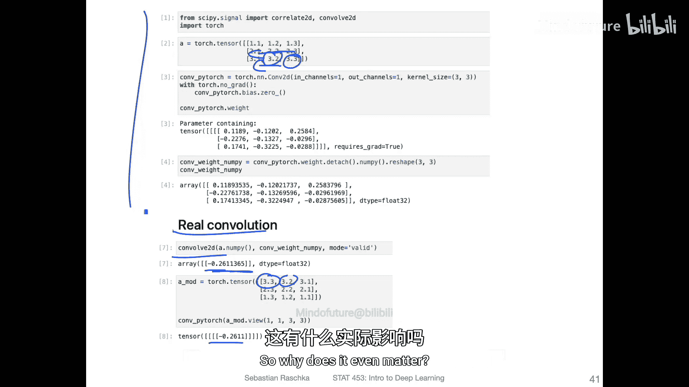


## 总结

本节课中我们一起学习了互相关与严格数学卷积之间的区别。我们明确了：

1.  **核心区别**：在于滤波器与输入数据相乘时是否先进行翻转。互相关直接计算点积，而卷积需要先翻转滤波器。
2.  **深度学习实践**：在卷积神经网络中，实际执行的是**互相关**操作。
3.  **术语使用**：由于历史习惯和实现的简便性，我们仍然沿用“卷积”这一术语。这对于模型的功能没有影响，因为网络权重会通过训练自适应。
4.  **重要性**：对于深度学习从业者，理解这一区别有助于厘清概念，但在实际构建和训练CNN模型时，无需特别担心或更改操作。

本节内容是一个概念上的澄清。在下一节中，我们将简要回顾CNN并介绍反向传播的基本概念，但不会深入复杂的数学细节。


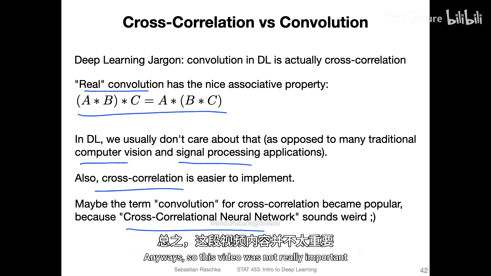

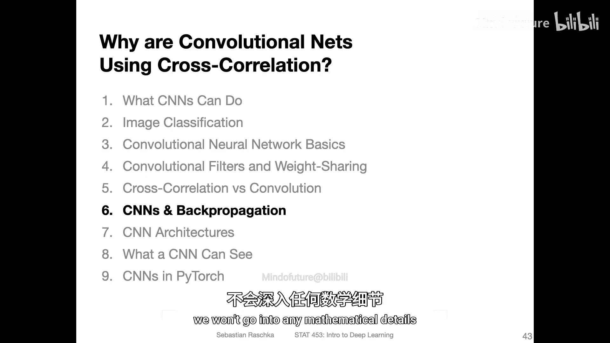

