# 104：深度学习新闻 #8

在本节课中，我们将回顾2021年3月20日发布的第8期深度学习新闻。内容涵盖数学数据集、数据增强技术、生成对抗网络的新研究、深度学习发展史以及新的PyTorch工具。

---

## 📊 数学数据集的新挑战

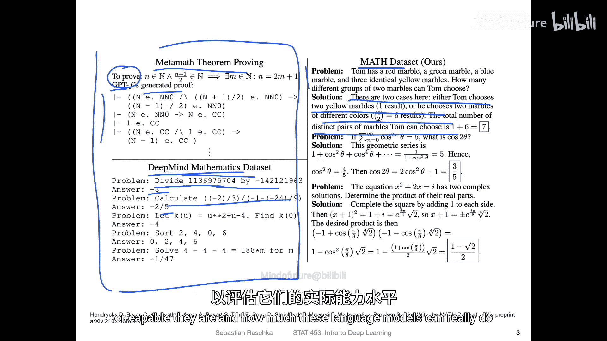

上一节我们介绍了本期新闻的概览，本节中我们来看看关于数学问题求解的新数据集。

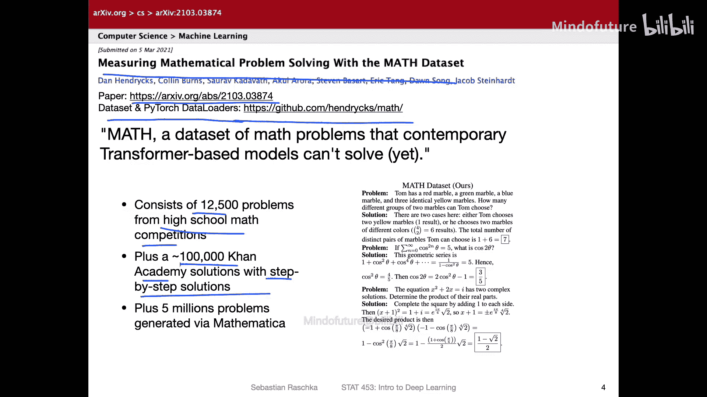

研究人员开发了一个名为“数学数据集”的新资源，旨在评估自然语言处理模型解决复杂数学问题的能力。该数据集包含来自高中数学竞赛的12,500个问题、100,000个带有分步解答的可汗学院问题，以及通过Mathematica生成的500万个问题。

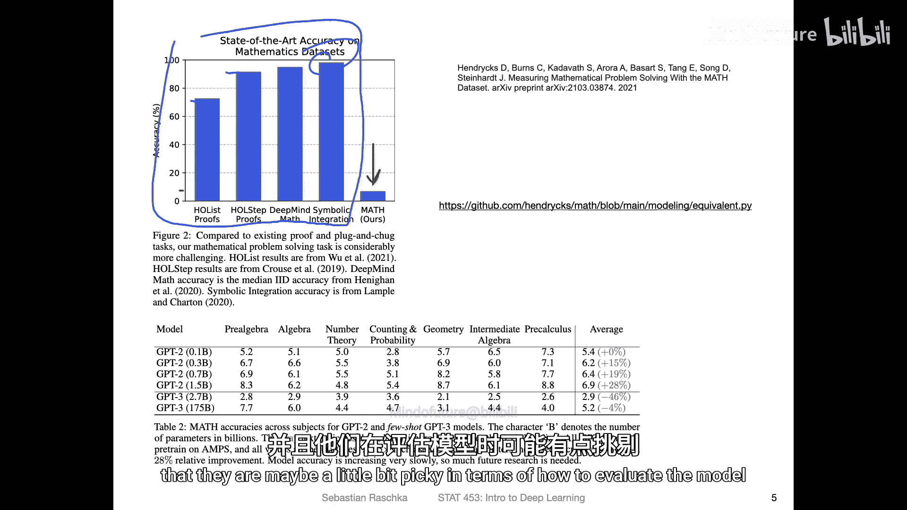

以下是该数据集的核心信息：
*   **来源**：高中数学竞赛与可汗学院。
*   **规模**：总计超过500万个问题。
*   **目标**：评估模型解决复杂文本数学问题的能力。

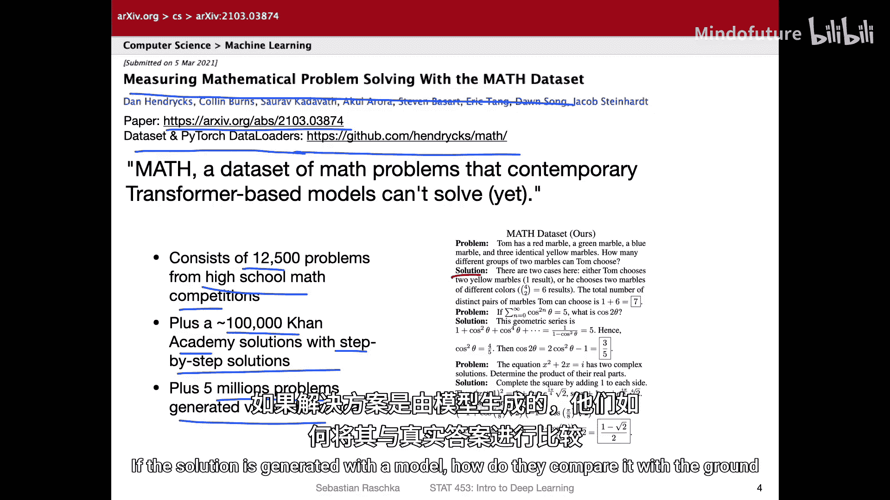

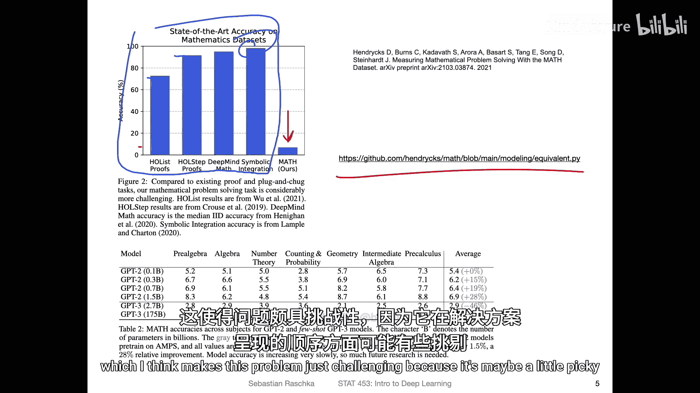

与早期简单的代数计算数据集相比，新数据集的挑战性大得多。早期模型在简单数据集上能达到70%至接近100%的准确率，而大型语言模型（如拥有数十亿参数的模型）在这个新数据集上的准确率仅为7%左右。

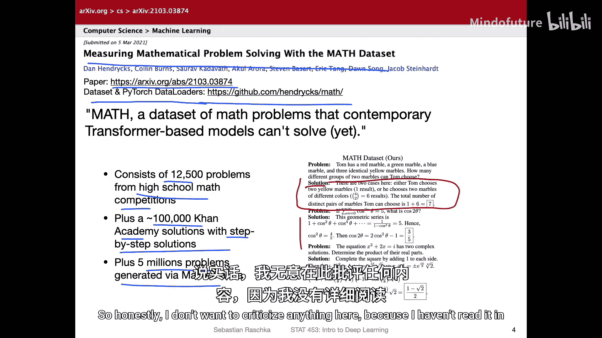

一个有趣的发现是，单纯增加模型参数规模（例如从1亿参数增加到15亿参数）对准确率的提升非常有限。这表明当前的语言模型在真正理解和解决复杂数学问题方面能力仍然不足。作为参考，一名不喜欢数学的计算机科学学生在该数据集上能达到40%的准确率，而金牌得主能达到90%。

---

## 🖼️ 简单的数据增强：缩略图混合

既然谈到了数据增强，这里有一篇相关论文提出了一种简单的方法，可能对提升模型性能有帮助。

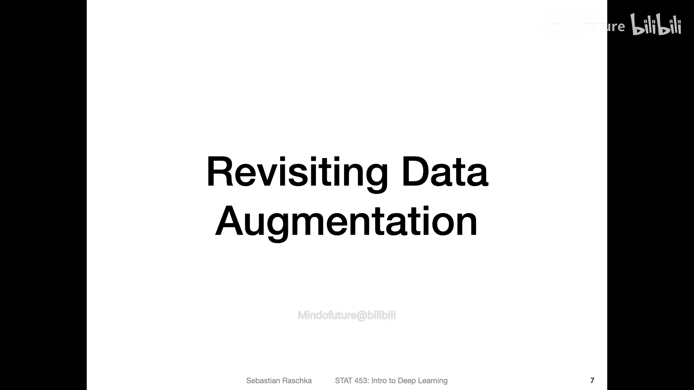

这篇名为《Thumbnail: 一种用于卷积神经网络的新型数据增强方法》的论文，探讨了通过创建图像的缩略图并将其粘贴回原图来增强数据的效果。这与之前的方法如**CutOut**（随机擦除区域）、**MixUp**（图像线性混合）和**CutMix**（粘贴其他图像区域）思路类似。

以下是论文中提到的几种数据增强策略：
*   **CutOut**: 公式表示为 `图像 * 掩码`，其中掩码为0的区域被移除。
*   **MixUp**: 公式表示为 `λ * 图像A + (1-λ) * 图像B`。
*   **CutMix**: 将图像B的一块区域粘贴到图像A上。
*   **Thumbnail**: 将图像自身的缩小版粘贴回图像中。

实验结果显示，这种简单的“缩略图”方法能在基线模型73.7%的准确率上带来小幅提升。虽然提升幅度不大，但在类别项目中尝试这种方法可能是一个简单有效的实验思路。

---

## 🎭 探索GAN的内部表征：语义部分分割

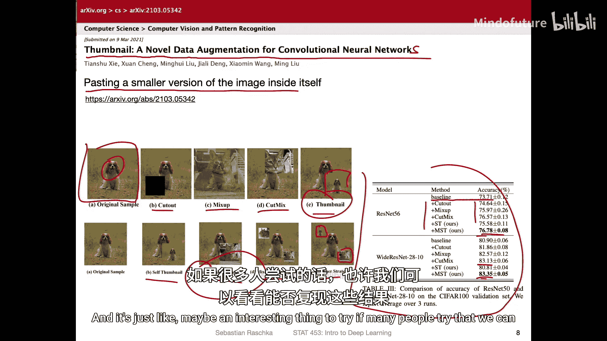

接下来，我们将目光转向生成对抗网络。一项新研究试图探究GAN在生成图像时，是否学习了物体有意义的组成部分。

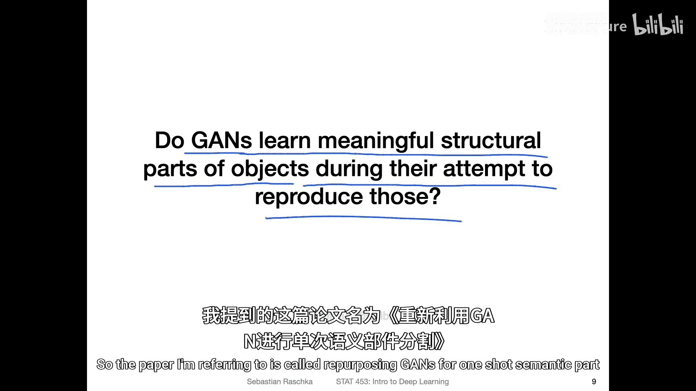

这项名为《Repurposing GANs for One-Shot Semantic Part Segmentation》的研究，其核心问题是：GAN是仅仅记忆了像素位置，还是真正理解了图像中物体的不同部分（如车的轮胎、窗户）？

研究人员的方法是利用预训练GAN生成器的中间层激活来创建分割掩码。具体流程如下：
1.  **表征提取**：将输入图像编码为潜在向量`z`，输入生成器。然后提取生成器中间卷积层的激活特征图，将它们上采样并组合，最终生成一个与输入图像尺寸相同的分割掩码。
2.  **训练**：使用少量标注数据（少样本学习）。他们用GAN生成不在训练集中的新图像，然后人工标注这些图像的分割掩码。利用提取的表征和少样本分割器进行训练，使模型输出的分割结果与人工标注的掩码相匹配。
3.  **推理**：对于新的输入图像，只需通过表征提取器和训练好的分割器，即可得到其语义部分分割图。

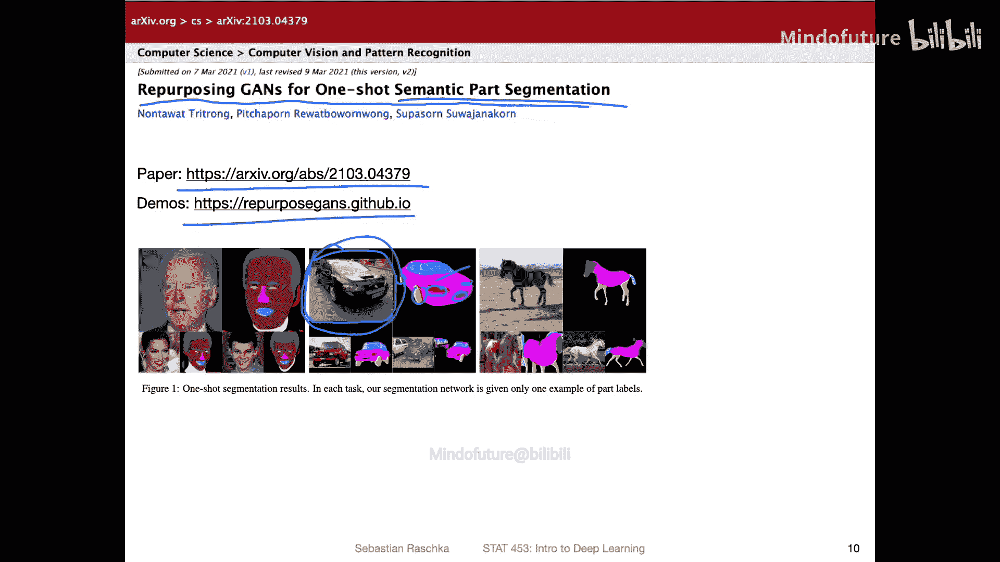

这项研究的惊人之处在于，有时仅使用一张标注图像，模型就能很好地学习分割，这表明GAN的生成器确实捕获了图像中物体的结构性信息。

---

## 📜 深度学习背后的故事：2012年的秘密拍卖

本节并非研究内容，而是一段历史回顾。一篇题为《The Secret Auction That Set Off the Race for AI Supremacy》的文章，回顾了2012年深度学习兴起之初的关键事件。

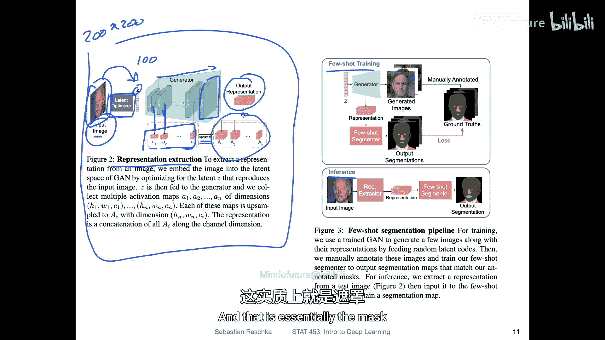

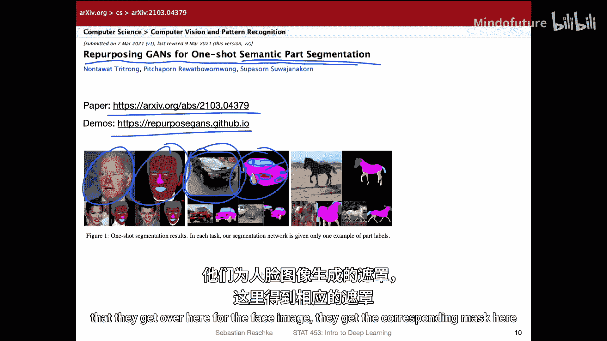

Geoffrey Hinton和他的两位学生当时拥有领先的深度学习技术，并成立了一家只有三人的初创公司。这家公司最终以4400万美元的价格被谷歌收购，这一事件标志着科技巨头开始全力争夺人工智能领域的主导权，也拉开了深度学习商业化竞争的序幕。

---

## 🛠️ 新工具：PyTorch的语音工具包

最后，我们来介绍一个面向开发者的新工具。专注于Transformer模型的公司Hugging Face，发布了一个用于PyTorch的语音工具包。

对于那些从事语音识别、语音合成等相关研究的人员，这个工具包提供了便利的开源实现，值得关注和尝试。

---

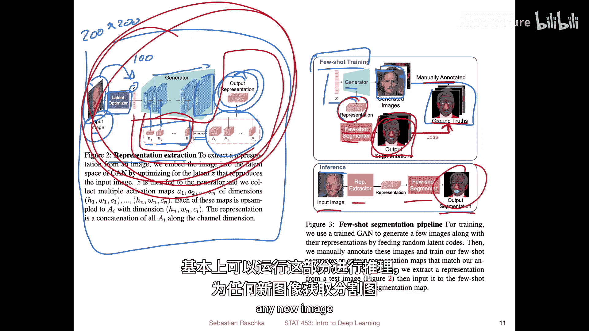

## ✅ 总结

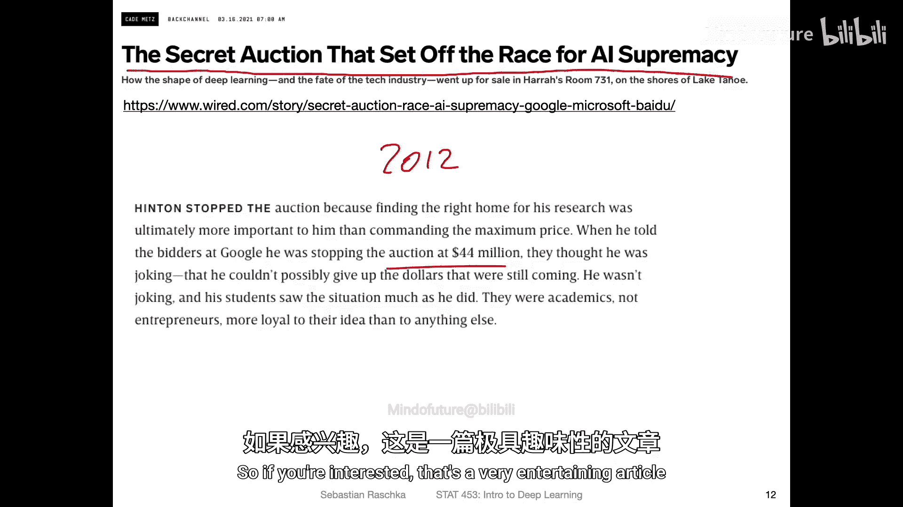

本节课中我们一起学习了第8期深度学习新闻的多个主题：
1.  新的**数学数据集**对现有语言模型提出了严峻挑战，表明模型在复杂推理上仍有局限。
2.  一种简单的**缩略图数据增强**方法可能为提升模型性能提供新思路。
3.  一项关于**GAN**的研究揭示，生成器内部可能学习了图像的语义部分信息，并可被用于少样本分割任务。
4.  回顾了深度学习发展史上一次关键的**公司收购事件**。
5.  介绍了Hugging Face新推出的**PyTorch语音工具包**。

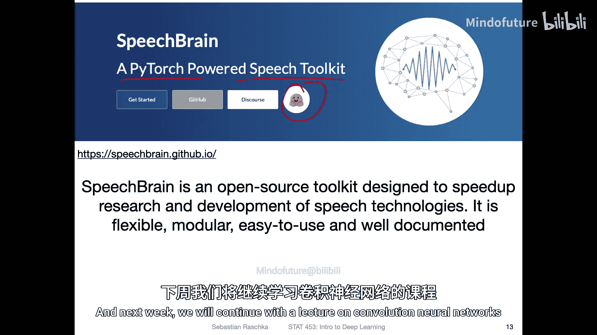

下周课程将继续讲解卷积神经网络。