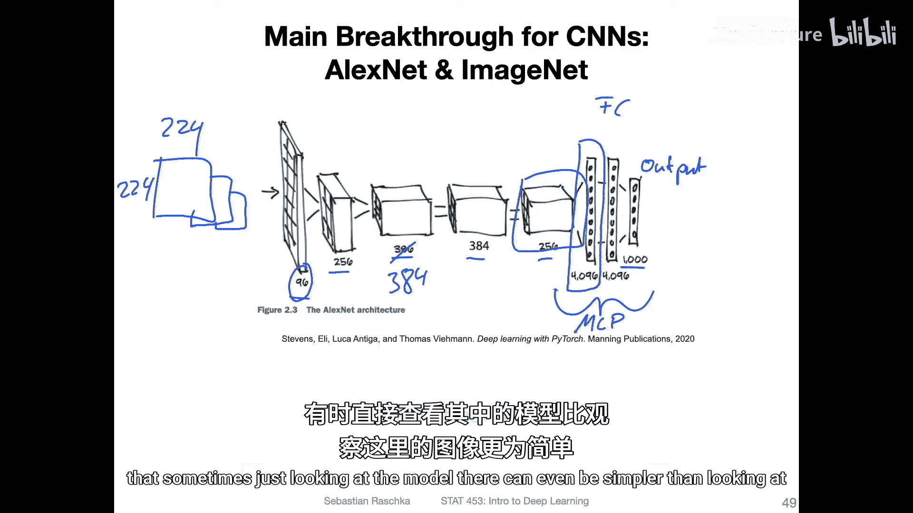
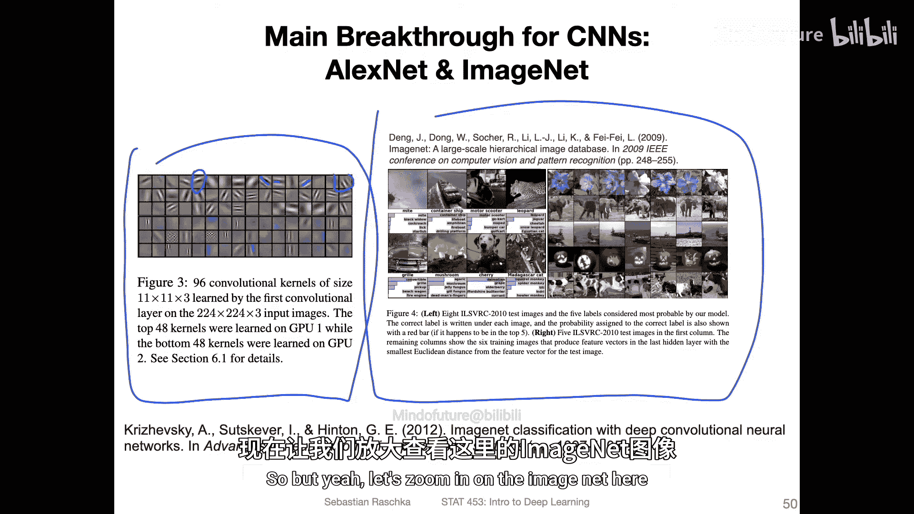
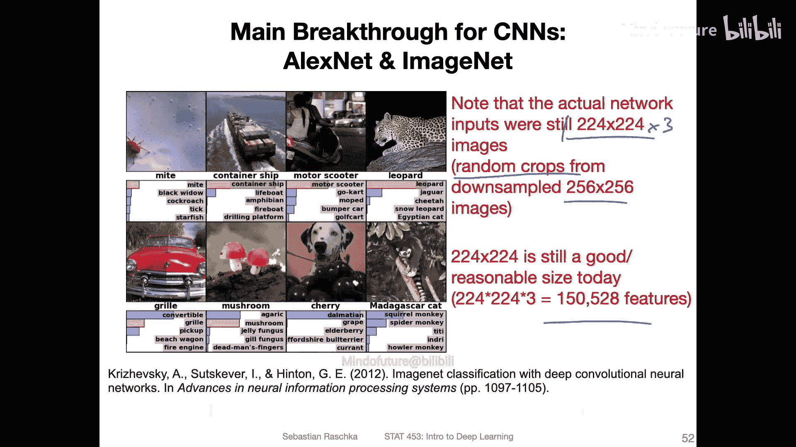
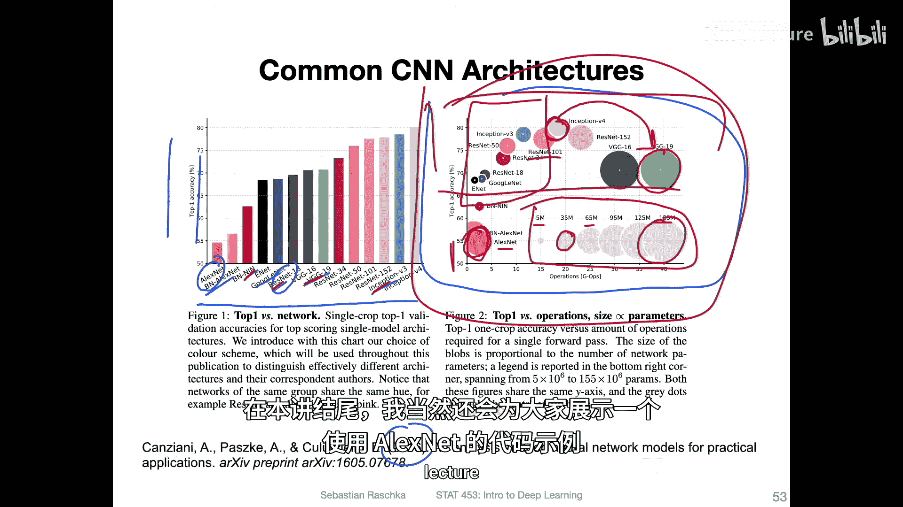
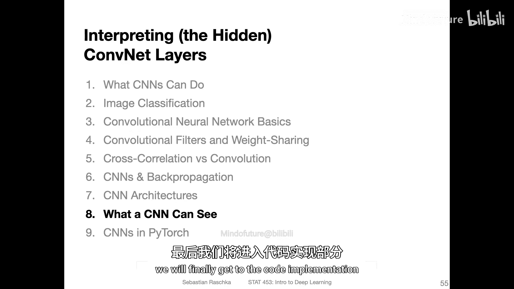

# 106：CNN架构与AlexNet 🧠

在本节课中，我们将学习卷积神经网络（CNN）的架构设计，并重点介绍具有里程碑意义的AlexNet模型。我们将了解架构选择的重要性，以及如何处理彩色图像输入。

---

## 概述

成功将卷积神经网络应用于计算机视觉问题的关键因素之一，除了拥有高质量数据集，就是选择合适的网络架构。本视频将简要概述一些最流行的架构，并解释如何处理多通道（如彩色）图像输入。

## 传统架构与突破

上一节我们介绍了LeNet-5等传统架构。接下来，我们来看看推动CNN发展的关键突破。

在2012年之前，传统的计算机视觉方法通常在速度和准确率上优于早期的卷积神经网络。ImageNet竞赛是一个重要的转折点。

*   **ImageNet竞赛**：这是一个非常流行的竞赛，参赛者尝试使用不同的计算机视觉方法对包含数百万张图像的大型数据集进行分类。
*   **AlexNet的突破**：在2012年，AlexNet架构首次大幅超越了所有其他类型的计算机视觉方法。
*   **性能对比**：AlexNet取得了15.4%的Top-5错误率，而当时第二好的方法错误率约为26.2%。这个巨大的优势使人们开始高度重视深度学习和卷积神经网络。

如今，使用更先进的架构，Top-5错误率甚至可以低至3%。

## AlexNet架构详解

AlexNet的成功不仅在于其深度，还在于一些创新的设计。

以下是AlexNet架构的核心特点：

*   **双GPU并行**：由于当时GPU内存有限，作者将网络分成两个部分，在两张GPU上并行处理，只在某些层进行通信，最后将结果拼接起来。
*   **架构简化视图**：在现代单GPU训练中，AlexNet可以简化为以下结构：
    *   输入：224x224x3的彩色图像。
    *   卷积层与池化层：依次产生96、256、384、384、256个特征图通道。
    *   展平层：将特征图重塑为一个包含4096个激活值的长向量。
    *   全连接层：包含一个具有4096个单元的隐藏层。
    *   输出层：一个具有1000个单元（对应ImageNet的1000个类别）的Softmax层。

在PyTorch等框架中查看代码实现，有时比看图表更易于理解。

## ImageNet数据集与评估方式

AlexNet是在ImageNet数据集上取得突破的。理解这个数据集和评估指标很重要。

ImageNet数据集包含120万张图像和1000个类别。其评估采用“Top-5准确率”。

*   **Top-5准确率**：如果模型预测概率最高的前五个类别中包含真实标签，则视为预测正确。
*   **评估示例**：对于一张“樱桃”图片，如果模型预测的前五名是“斑点狗”、“葡萄”、“接骨木果”等，而“樱桃”不在其中，则算错误。对于一张“敞篷车”图片，如果“敞篷车”在模型预测的前五名中，即使不是第一名，也算正确。

这种评估方式考虑到了数据集中图像可能包含多个物体而标签只有一个的复杂性。

## 卷积神经网络架构演进

AlexNet只是一个开始，后续出现了许多更优秀的架构。

下图展示了截至2016年的一些流行架构及其在ImageNet上的Top-1准确率和参数量：

*   **架构多样性**：包括VGG、GoogLeNet（Inception）、ResNet等。
*   **参数量与准确率**：更多参数并不总是意味着更高的准确率。例如，VGG参数量很大（约1.55亿），但后续的Inception或ResNet等架构可以用更少的参数获得更好的性能。
*   **关键创新**：ResNet的残差连接、Inception的辅助损失函数等设计对提升性能至关重要。

我们将在下一讲中更详细地探讨其中一些架构。

## 处理多通道输入（彩色图像）

之前我们使用LeNet处理的是单通道（黑白）图像。AlexNet等网络需要处理三通道（RGB）的彩色图像。以下是其工作原理。

处理多通道输入的核心是使用具有相应通道数的卷积核。

*   **单通道卷积回顾**：对于单通道输入，我们使用一个二维核矩阵进行卷积，生成一个特征图。
*   **多通道卷积**：对于三通道（RGB）输入，我们使用一个三维的卷积核（例如，5x5x3）。这个核的每个通道（如红色通道）只与输入图像的对应通道进行卷积操作。
*   **通道求和**：对三个通道的卷积结果进行逐元素求和，最终生成**一个**特征图上的一个像素值。
*   **生成多个特征图**：要生成多个特征图，我们只需使用多个这样的三维卷积核。每个核独立进行上述操作，产生一个独立的二维特征图。

在PyTorch中，输入张量的形状通常为 `(批大小, 通道数, 高度, 宽度)`。卷积核的通道数会自动与输入图像的通道数匹配。

## 总结

本节课我们一起学习了卷积神经网络架构的基础知识。我们回顾了AlexNet的历史性突破，了解了其并行处理和层级设计。我们还探讨了ImageNet数据集的评估方式，并概览了CNN架构的演进历程。最后，我们掌握了卷积层如何处理多通道彩色图像输入的关键机制，即使用与输入通道数匹配的三维卷积核，并对各通道结果求和以生成特征图。在接下来的课程中，我们将深入探讨更多现代CNN架构的细节。