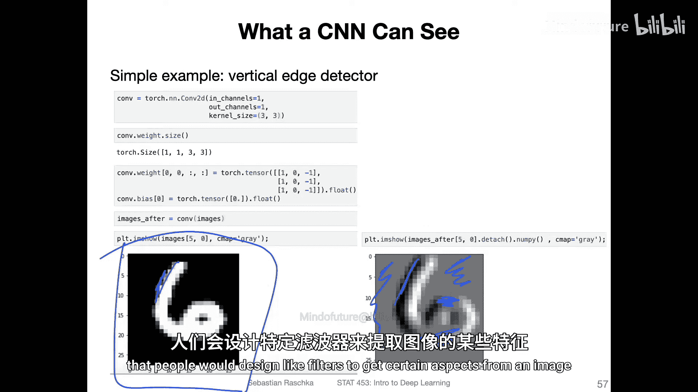
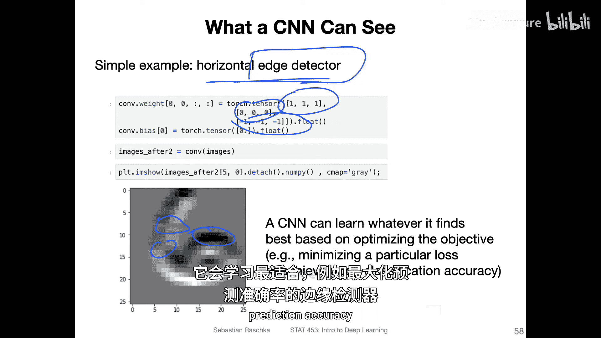
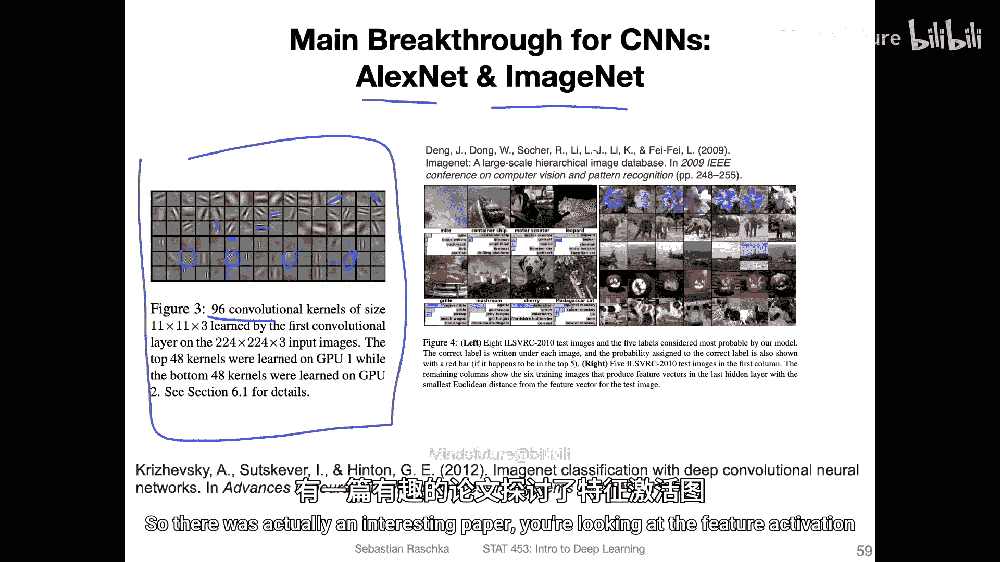
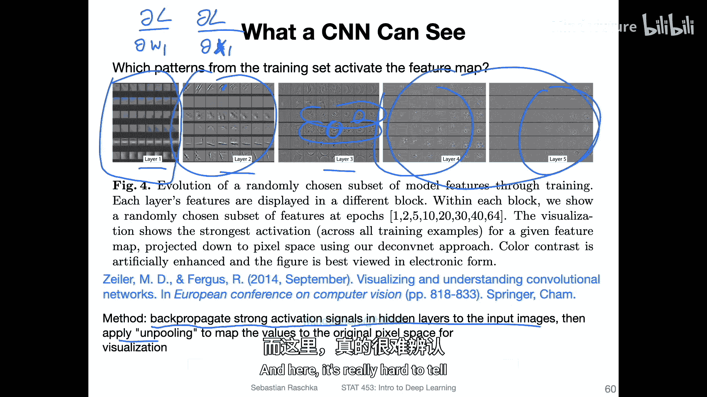
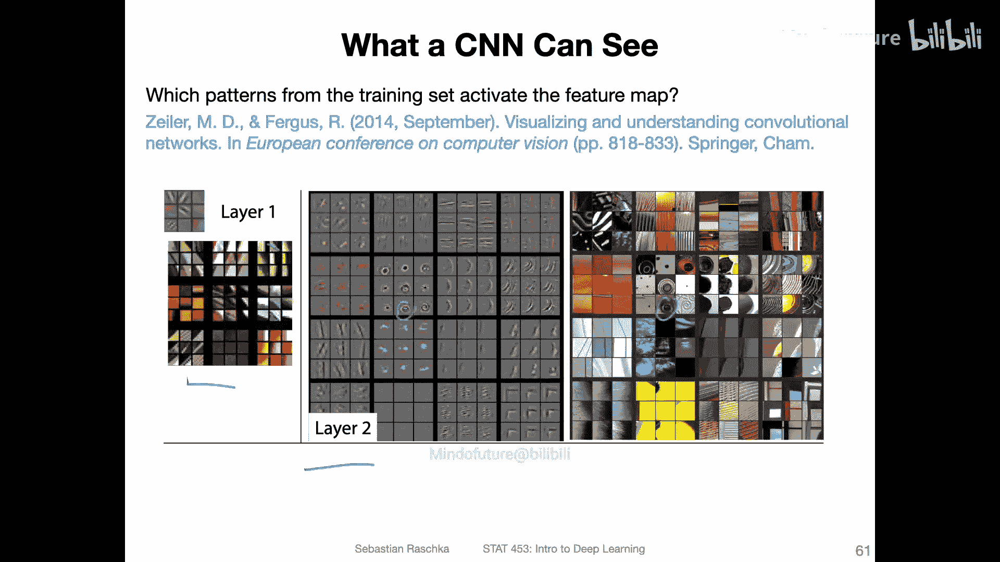
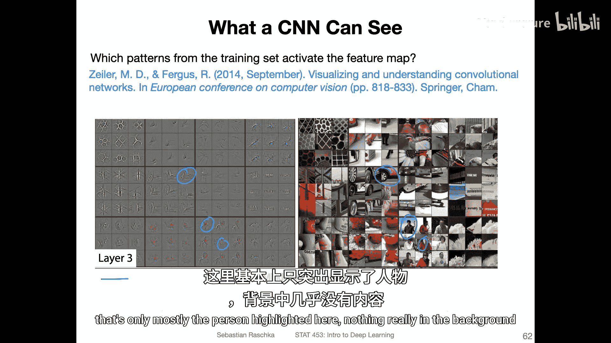
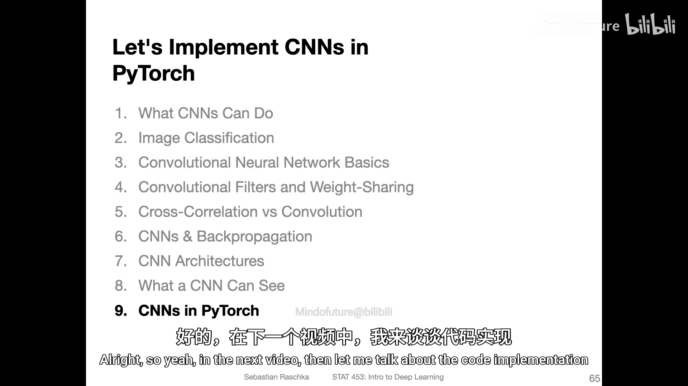

# 107：卷积神经网络能看到什么 👁️

在本节课中，我们将探讨卷积神经网络（CNN）内部究竟在学习什么。我们将从传统计算机视觉方法入手，理解手动设计的特征检测器（如边缘检测器），然后揭示CNN如何自动学习类似甚至更复杂的特征。最后，我们将介绍几种可视化CNN“注意力”的方法，帮助我们理解模型做出决策的依据。

## 从传统计算机视觉到深度学习

上一节我们讨论了卷积网络和卷积操作。本节中，我们来看看卷积神经网络究竟在学习什么。

在卷积网络发明之前，人们通过手动设计滤波器来从图像中提取特征。例如，人们会设计边缘检测器，如垂直边缘和水平边缘检测器。其工作原理是，有人会定义一个滤波器，思考它的作用，然后使用该滤波器从图像中提取特定特征。

以下是一个具体例子。这是一个垂直边缘检测器的矩阵，它由一列包含1、0和-1的元素组成。假设我有一张图像，一半是0，一半是1。我的目标是设计一个能检测此处边缘（即明暗过渡）的垂直边缘检测器。当我把这个边缘检测器应用到图像上时，输出结果显示了它确实检测到了这个边缘，即明暗之间的过渡。

在卷积网络出现之前，人们使用这些边缘检测器来检测图像中的过渡。例如，这里是将垂直边缘检测器应用于MNIST数据集中的一张图像。你可以看到它检测到的边缘。当然，由于图像是曲线形状，检测结果并非完美的水平或垂直，但你能看到大致的轮廓：在其他地方它没有检测到任何东西，而在有水平边缘的地方，这些部分被检测出来了。

同样，这里有一个水平边缘检测器，它由一行1、0和-1组成。你可以看到它现在检测的是这些水平边缘，而一些垂直边缘区域则缺失了。这只是传统计算机视觉中设计不同滤波器的一个宏观背景。当然，这些只是非常简单的边缘检测器，还有更复杂的版本。

## CNN：自动特征提取器

现在回到CNN，这与CNN有何关联？在本课程开始时，我谈到了传统方法和深度学习。深度学习与传统机器学习等方法的一个主要区别在于，深度学习具有自动特征提取的能力。从这个意义上讲，你也可以将CNN视为一个自动特征提取器，它可以学习类似边缘检测器的功能。当然，它学到的可能不是完全相同的边缘检测器，而是最适合最大化预测准确率的检测器。

我在上一个视频中已经展示过这张幻灯片，这是再次展示在ImageNet上训练的AlexNet。在之前的幻灯片中，我展示了这些手动设计的滤波器，如垂直和水平边缘检测器。如果你看图3，他们绘制了第一层后的96个卷积核，你会发现它们实际上非常相似。网络也学习到了类似的对角线滤波器、水平滤波器、垂直滤波器等。但同时，还有一些像棋盘格图案的滤波器，有些只关注颜色。因此，CNN确实在学习一套复杂的滤波器，它们共同帮助网络最大化预测准确率。

通常，网络的早期层学习非常简单的特征提取器，随着网络加深，这些特征在特征图中组合成更复杂的形状。早期层的特征图通常检测类似边缘的特征，而更深层的特征图则能检测更复杂的物体。

## 可视化网络所学：特征激活图

有一篇有趣的论文研究了特征激活图。作为一种通用方法，如果你想了解哪些输入像素能最大化损失函数，可以观察隐藏层激活甚至输入本身。之前我们讨论损失函数的偏导数时，我们观察了损失相对于权重或输入的偏导数，并用它来更新模型权重，以最小化损失。实际上，你也可以对激活做同样的事情，看看哪些激活对损失有高影响，即梯度在哪里。通过这种方式，你甚至可以研究输入像素，找出哪些像素对损失最敏感（即损失相对于输入的偏导数最大），从而发现损失对哪些像素最敏感。

在这篇论文中，研究人员将激活信号反向传播回去。他们观察了强激活，并将其反向传播回输入图像，然后应用了一种称为“反池化”的技术，将激活映射回原始输入维度。本质上，他们研究了每个特征图中哪些激活值较大，以及它们如何与输入图像对应。

例如，网络有不同的层。在第一层，主要是抽象特征。在第二层，你可以看到更复杂的形状，虽然很难说具体是什么，但确实更复杂了。到了第三层，更具体的事物开始浮现，比如一张脸。从这些简单的模式中，突然组合出了一张脸，或者可能是一只眼睛等。网络越深，这些形状就越复杂。因此，这些特征图主要是面部检测器、眼睛检测器等。网络越深，它能识别的形状就越复杂。

以下是同一篇论文的另一个例子。第一层主要检测颜色和简单边缘。第二层则检测这些更抽象的、不同的形状。在右侧，你可以看到原始物体，这里有一只眼睛，网络检测到了它。

再看第三层。例如，如果我们关注这里，这是一辆车，网络可以检测到这个轮子。有趣的是，网络确实学会了关注图像中的重要部分，同时忽略背景。当然，这取决于具体的分类任务。如果分类任务是预测物体是什么（例如预测这是一个人），你可以看到它关注的是人，而不是背景。在这里，基本上只有人被高亮显示，背景几乎没有。

## 解释网络注意力的方法

这里有一篇文章，很好地总结了用于解释网络在输入中关注哪些部分的不同方法。在之前的幻灯片中，我展示的实质上是特征图激活。而这里是一组方法，用于查看输入中哪些像素对做出特定预测最重要。

例如，你可以提出这样的问题：如果我有一个猫狗分类器，图像中哪个部分对分类猫和狗最重要？你可能希望看到它关注的是解剖结构（如腿）或动物的形状，而不是背景。使用这些方法实际上是一个很好的完整性检查，可以确保网络关注图像中的显著部分。

最传统的方法在左侧，已经使用了很长时间。这里也有一些更新的方法。实际上，梯度类方法仍然是最流行的之一，但也有一些更现代的方法，我认为能产生更好的结果。

看这里的“原始梯度上升”方法。你也可以更容易地将其视为梯度下降。这就是我在本视频开头提到的：我们不计算损失相对于某个输入权重的偏导数，而是计算损失相对于输入图像中像素的偏导数。这真正告诉我们，对于一个分类网络，一个像素对损失有多重要。

观察这里，我们可以看到网络在进行分类时（我实际上不知道具体是什么分类任务），它关注的是狗而不是背景，这很好。再看“导向反向传播”，它是原始梯度下降的一种变体，但这里进行了阈值处理。无论如何，你可以看到它更好地高亮了网络关注的狗的吻部甚至整个头部区域。我推测，这可能是一个训练来预测或区分不同犬种的网络。因此，网络可能必须特别关注头部区域，因为不同品种的狗在身体上可能非常相似，所以需要特别关注吻部等区域。

还有其他方法，例如平滑梯度方法和模糊积分梯度。你可以看到它们都有些相似，但都是用于观察网络关注图像哪些部分的好方法。在实践中，如果你从事一个较大的项目（比如分类项目），我建议使用其中一种方法，至少对少量图像查看你的网络最关注什么，这有时有助于确保网络在做一些合理的事情。

## 总结

本节课中，我们一起学习了卷积神经网络内部的学习机制。我们从传统手动设计的边缘检测器出发，理解了CNN作为自动特征提取器的核心思想。我们看到，网络的浅层学习简单特征（如边缘和颜色），而深层则组合这些特征来识别复杂物体（如面部、车轮）。最后，我们介绍了几种可视化网络“注意力”的方法（如梯度类方法），这些工具能帮助我们解释模型的决策，并验证其是否关注了图像中合理的部分。理解CNN“看到”什么，是构建可靠、可解释深度学习模型的重要一步。