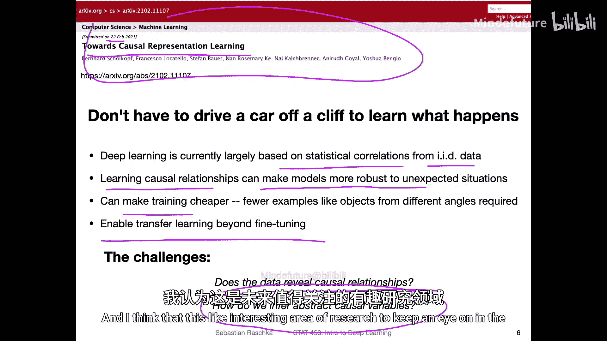
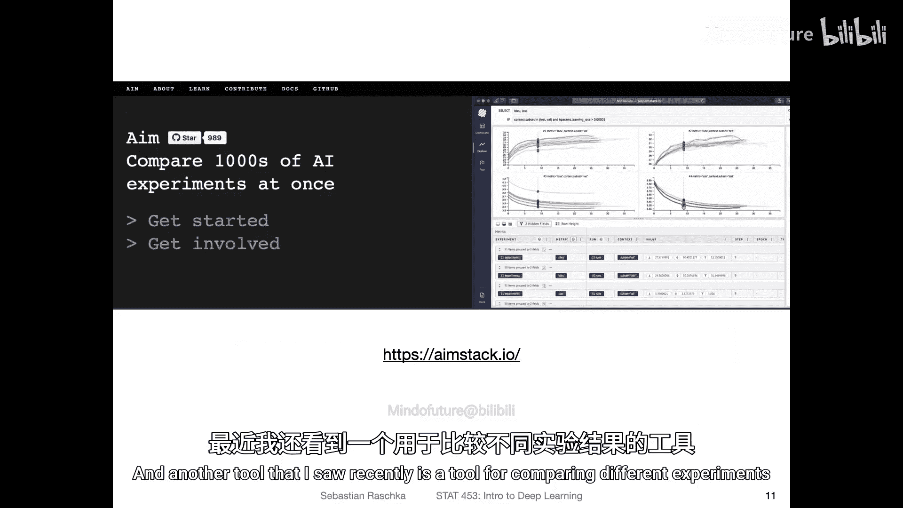
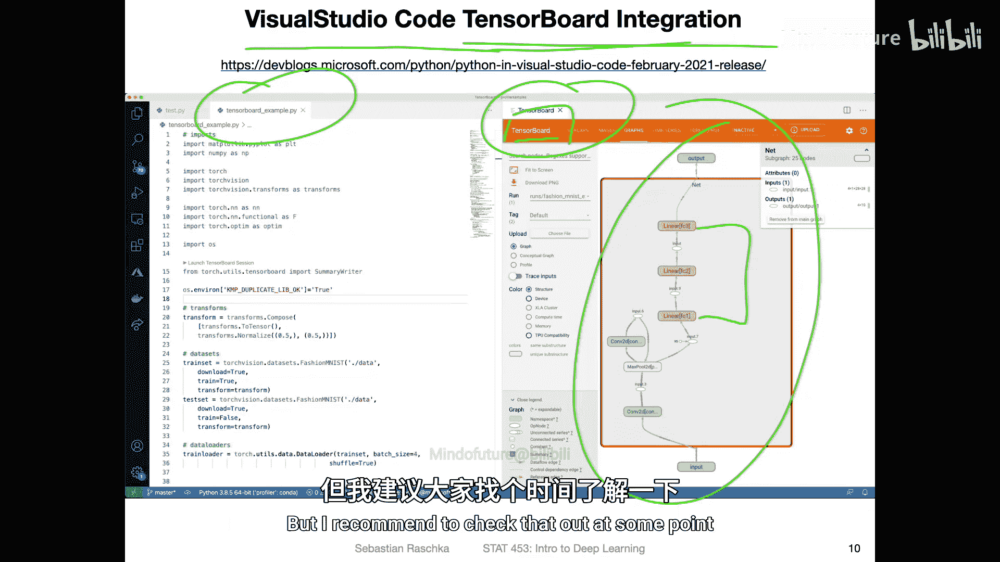
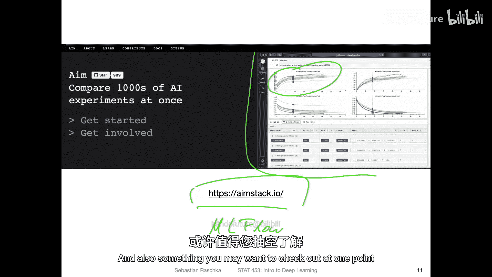

# 111：深度学习新闻 #9 📰

## 概述
在本节课中，我们将回顾2021年3月27日分享的深度学习领域最新动态。内容涵盖一个有趣的播客、一种新的自监督学习方法、一个关于识别网络有害内容的竞赛、深度学习中的因果推理挑战，以及几款实用的工具。请注意，本节内容不涉及考试范围。

---

## 播客分享：行业洞见 🎧
上一节我们介绍了课程安排，本节中我们来看看一个近期发现的优质播客。

本周我发现了一个关于机器学习的播客，由知名深度学习研究员Peter Abiil主持。第一期节目采访了特斯拉的AI总监Andrej Karpathy。

他们主要讨论了机器学习和深度学习，以及在特斯拉工作的体验。特斯拉在其自动驾驶功能中广泛应用深度学习，主要依靠车载摄像头和卷积神经网络。

访谈中的一个关键收获是，在工业实践中，**专注于收集更多、更高质量的数据**，通常比单纯地微调模型或尝试不同模型架构更能提升性能。这与学术界主要围绕固定基准数据集优化模型的做法形成对比。

---

## 自监督学习新方法：Barlow Twins 🔬
上一节我们了解了行业对数据的重视，本节中我们来看看一种新的自监督学习方法。

本周我发现了一种名为 **Barlow Twins** 的自监督学习方法，其核心思想是通过减少冗余来学习特征表示。

该方法的工作原理是，将同一神经网络运行两次，分别处理原始图像和经过轻微扰动（如亮度变化、颜色扰动、轻微旋转）的图像。这两个网络是相同的，这种结构也称为孪生网络。

目标是学习能够忽略图像微小修改的特征表示。具体做法是计算两个特征向量之间的互相关矩阵，并使其接近单位矩阵。这迫使相似图像的特征表示彼此相似。

以下是该方法的核心伪代码：

```python
# 假设 x1 和 x2 是同一图像的两个增强版本
z1 = normalize(network(x1)) # 特征向量1
z2 = normalize(network(x2)) # 特征向量2

# 计算互相关矩阵 C
C = torch.mm(z1.T, z2) / batch_size

# 计算损失：使 C 接近单位矩阵 I
loss = torch.sum((C - I)**2) # 忽略对角线缩放因子等细节
```

训练完成后，使用这些学到的特征向量作为输入，训练一个简单的线性分类器（如逻辑回归）在ImageNet等数据集上进行评估。这种方法取得了有竞争力的性能（Top-1准确率73.2%），其优势在于方法简单有效。

---

## 多标签分类挑战：识别有害网络内容 ⚠️
上一节我们探讨了自监督学习，本节中我们来看看一个实际应用中的多标签分类问题。

网络交流的便利也带来了网络欺凌等问题。目前有一个专注于识别仇恨言论的竞赛，例如识别有害表情包。

这个任务的一个新特点是它是一个**多标签分类问题**。与我们课程中常见的互斥多分类问题不同，一个表情包可能同时涉及多个受保护类别（如种族、宗教、性别）。

以下是多标签分类与经典单标签分类在输出层的区别：

*   **经典单标签（使用Softmax）**：输出概率之和为1。例如，数字“7”的概率为90%，则其他数字的概率共享剩余的10%。
*   **多标签分类（使用Sigmoid）**：每个输出节点独立使用Sigmoid函数，输出该标签存在的概率。一个样本可以同时以高概率拥有多个标签。

实现上，只需将输出层的Softmax激活函数替换为Sigmoid函数即可。这对于应用卷积神经网络解决此类社会问题是一个有趣的方向。



---


## 深度学习挑战：因果表示学习 🧠
上一节我们讨论了具体的分类任务，本节中我们来看看深度学习面临的一个更根本的挑战。

当前深度学习模型主要依赖于独立同分布的数据，并学习输入与输出之间的统计相关性，而非因果关系。

学习因果关系能使模型更鲁棒。例如，在自动驾驶中，如果模型能因果性地理解交通标志，而不仅仅是关联像素模式，可能更能抵御对抗性攻击。此外，因果理解还能提升数据效率（例如，人类无需从各个角度观察椅子就能识别它）和模型的可迁移性。

然而，实现因果表示学习面临巨大挑战：数据本身是否揭示因果关系？如何从数据中推断出抽象的因果变量？这仍是一个活跃的研究领域，尚无成熟解决方案。

---

## 实用工具推荐 🛠️
上一节我们探讨了前沿挑战，本节我们来介绍一些能提升当前工作效率的实用工具。




以下是本周发现的几款有用工具：



*   **CVAT**：一个开源的图像和视频标注工具，特别方便进行目标检测任务的标注。
*   **PyTorch Profiler**：一个用于分析PyTorch代码性能、识别训练瓶颈的新工具。它可以与TensorBoard集成进行可视化。
*   **TensorBoard in VS Code**：Visual Studio Code编辑器现已集成TensorBoard，允许在编码环境中直接可视化训练曲线、模型计算图等，便于调试。
*   **实验比较工具**：有一款工具只需添加几行代码，就能方便地记录实验配置和结果，并可视化比较不同超参数设置下的模型性能。类似的工具还有Weights & Biases, MLflow等。



---

## 总结
本节课我们一起回顾了深度学习领域的一些最新动态。我们了解了一个强调数据重要性的行业播客，学习了一种简单有效的自监督学习方法Barlow Twins，认识了一个涉及多标签分类的社会问题竞赛，探讨了因果表示学习这一前沿挑战对提升模型鲁棒性和效率的意义，最后介绍了几款能帮助大家更高效地进行模型开发、训练和实验管理的实用工具。希望这些信息对你有所启发。