# 113：卷积与填充 🧩

在本节课中，我们将学习卷积神经网络中的一个重要概念——填充。填充是一种机制，它允许我们控制卷积操作的输出尺寸，与步长选择一起，共同决定了特征图的大小。

上一节我们介绍了步长的基本概念，本节中我们来看看填充如何影响卷积层的输出。

## 填充的基本概念

填充是一种与步长相反的操作。步长通常会使输出尺寸缩小，而填充则允许我们使输出尺寸变大。

其基本做法是在输入图像的边缘添加额外的像素行或列。这些添加的像素值通常设置为零，因此它们不会对卷积计算产生实质贡献，但能改变卷积核滑动的起始和结束位置，从而影响输出尺寸。

例如，对于一个输入图像，如果我们设置填充为1，意味着在图像的**顶部、底部、左侧、右侧**各添加一行（或一列）像素。这使得卷积核可以从图像边界之外开始滑动，从而产生更大的输出特征图。

## 输出尺寸计算公式

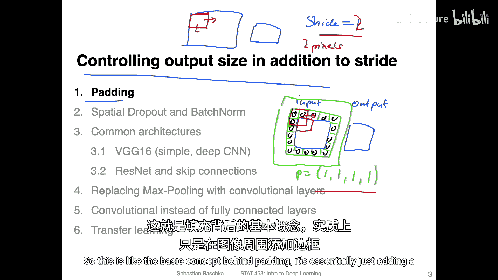

计算卷积层输出尺寸的通用公式如下：

**公式：**
`O = floor((W_in + 2P - K) / S) + 1`

其中：
*   `O` 是输出宽度（或高度）。
*   `W_in` 是输入宽度（或高度）。
*   `P` 是填充量。
*   `K` 是卷积核大小。
*   `S` 是步长。
*   `floor()` 表示向下取整。

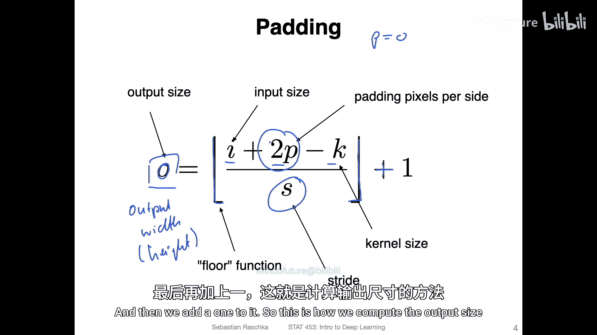

这个公式适用于计算输出的宽度和高度。当填充 `P` 为0时，公式简化为我们之前讨论的无填充情况。

## 填充示例分析

以下是几种不同填充和步长设置的卷积操作示例，可以帮助我们直观理解其效果。

*   **左上角（无填充，步长=1）**：输入为4x4，使用3x3卷积核，无填充，步长为1。根据公式，输出为2x2。可以看到，由于卷积核不超出边界，输出在每个维度上都比输入小2。
*   **右上角（填充=2，步长=1）**：输入为5x5，使用4x4卷积核，填充为2，步长为1。输出尺寸为6x6，甚至大于输入。这是一个特例，展示了大量填充的效果。
*   **左下角（无填充，步长=2）**：输入为5x5，使用3x3卷积核，无填充，步长为2。输出为2x2。步长为2使得卷积核每次移动两个像素，从而显著缩小了输出尺寸。

## 两种特殊的卷积类型

在传统计算机视觉和早期深度学习框架中，常提到两种特定类型的卷积操作。

### 有效卷积

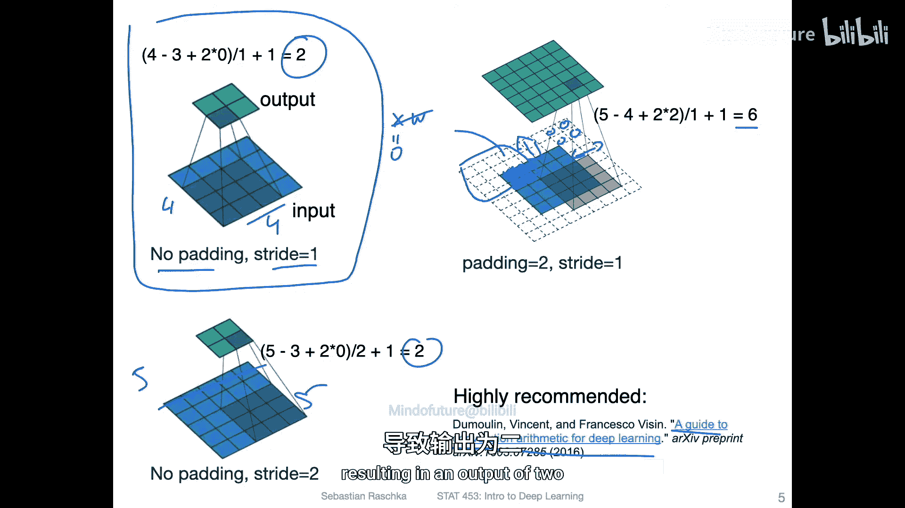

有效卷积指的是**不进行任何填充**的卷积操作。其结果是输出特征图的尺寸会小于输入。

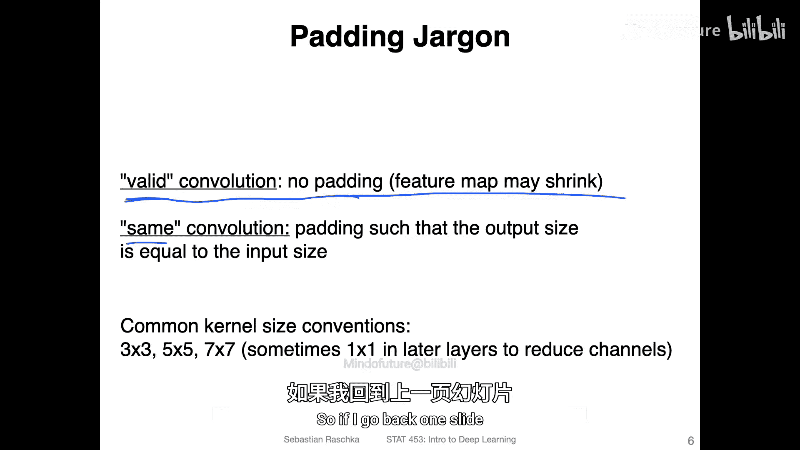

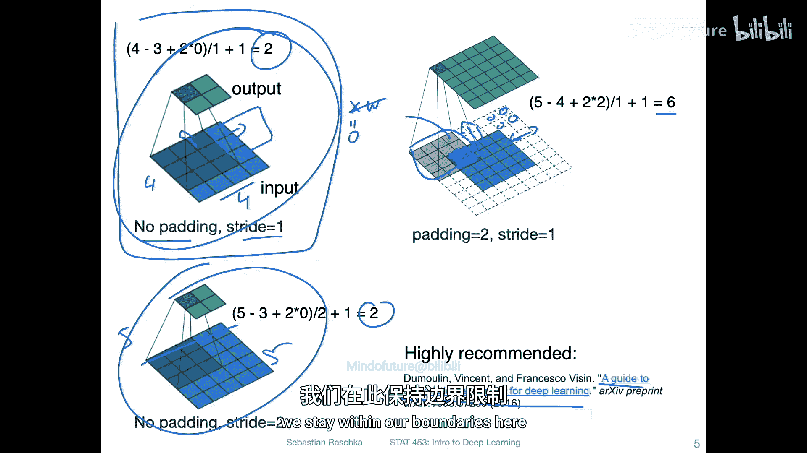

如上图左上角和左下角的示例，卷积核始终在输入图像的有效边界内滑动，因此被称为“有效”卷积。

### 相同卷积

相同卷积的目标是通过选择合适的填充量，使得**输出特征图的尺寸与输入完全相同**。

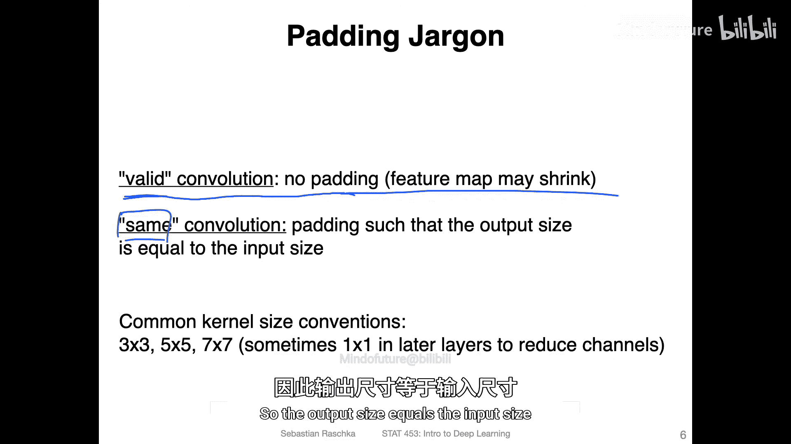

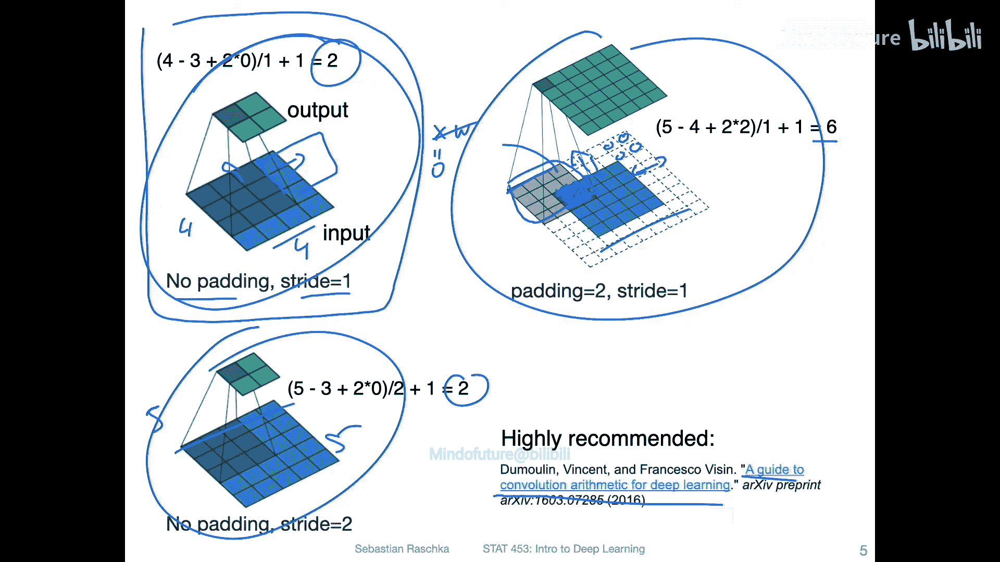

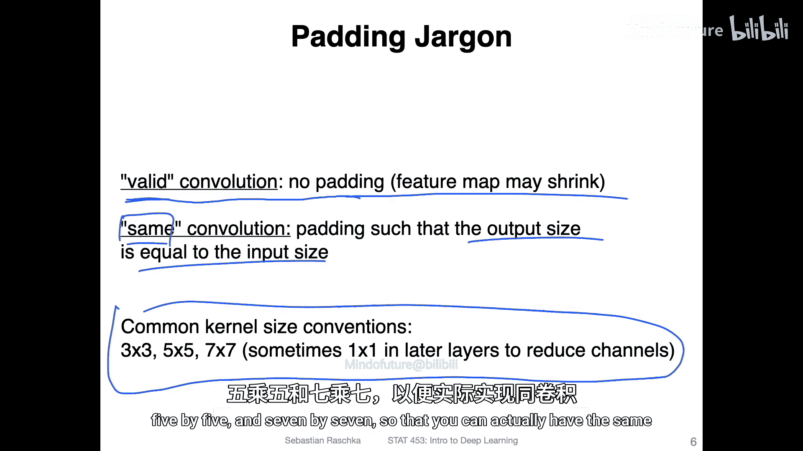

为了实现相同卷积，我们需要设置填充 `P`，使得输出 `O` 等于输入 `W_in`。假设步长 `S` 为1，我们可以从公式推导出所需填充量：

**公式推导：**
`W_in = floor((W_in + 2P - K) / 1) + 1`
忽略向下取整，简化后可得：
`P = (K - 1) / 2`

因此，要方便地实现相同卷积，卷积核的大小 `K` 通常选择为**奇数**（如3、5、7）。这样计算出的 `P` 是一个整数，可以实现对称填充。

例如：
*   对于3x3卷积核：`P = (3-1)/2 = 1`
*   对于5x5卷积核：`P = (5-1)/2 = 2`

使用这些奇数尺寸的卷积核并配合相应的填充，可以轻松保持特征图的空间尺寸不变，这在构建深层网络时非常有用。

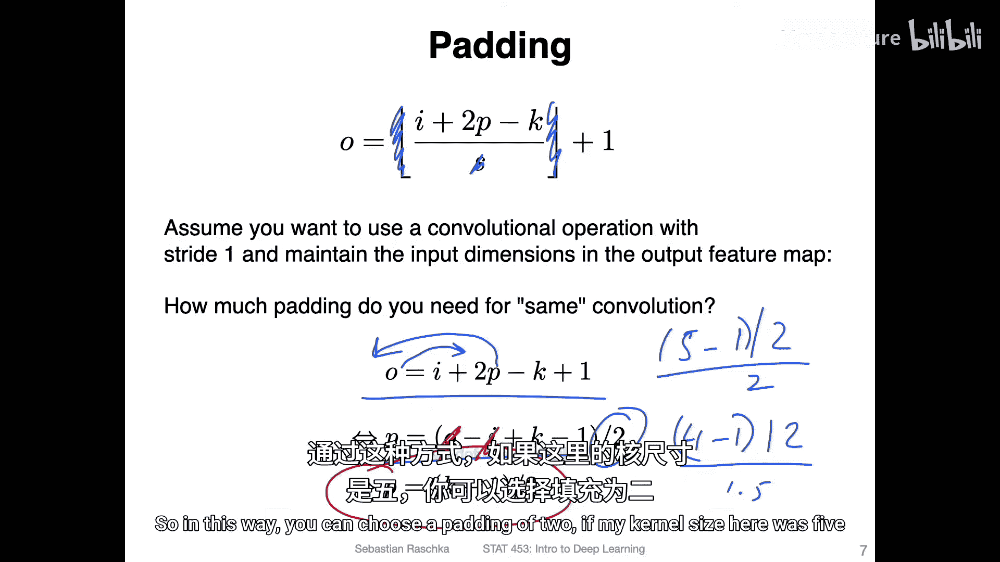

---

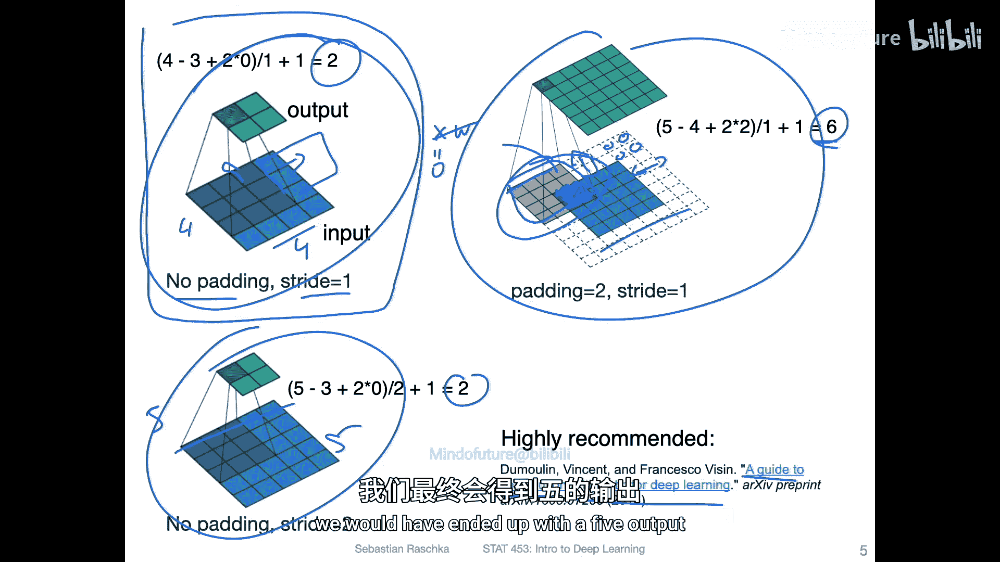

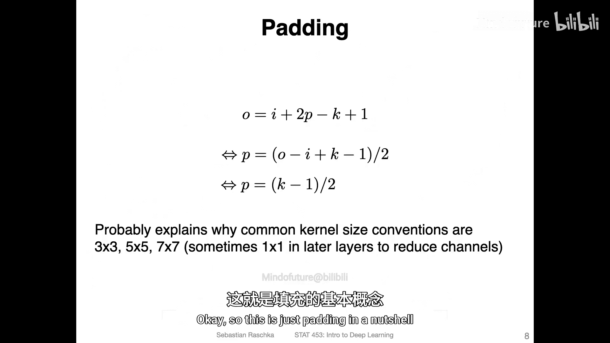

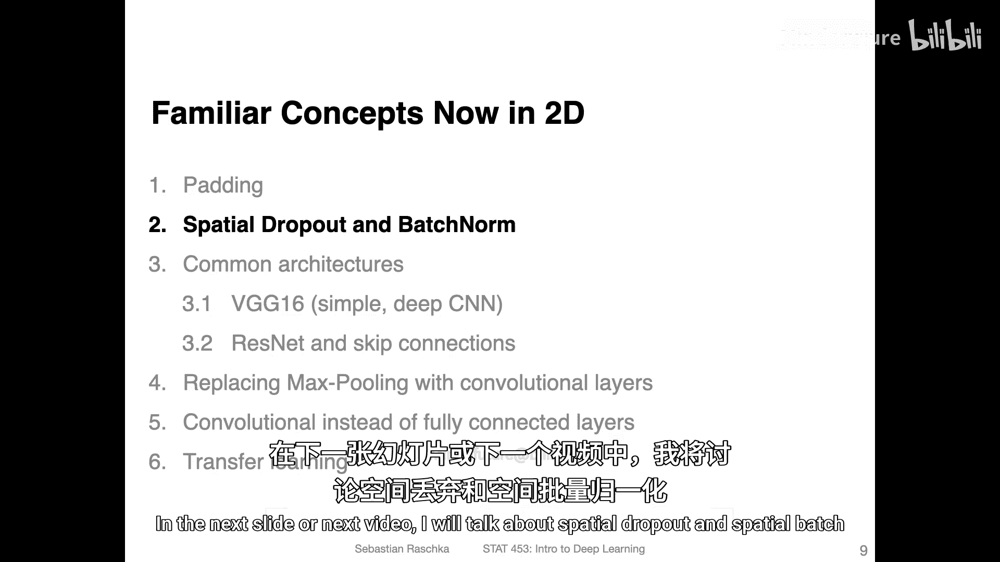

本节课中我们一起学习了卷积神经网络中的填充技术。我们了解了填充的基本概念及其对输出尺寸的影响，掌握了计算输出尺寸的通用公式，并通过示例分析了不同参数下的效果。最后，我们介绍了“有效卷积”和“相同卷积”两种特殊类型，并知道了为实现“相同卷积”，通常选择奇数尺寸的卷积核。理解填充是设计和理解CNN架构的重要基础。