# 114：空间Dropout与BatchNorm 🧠

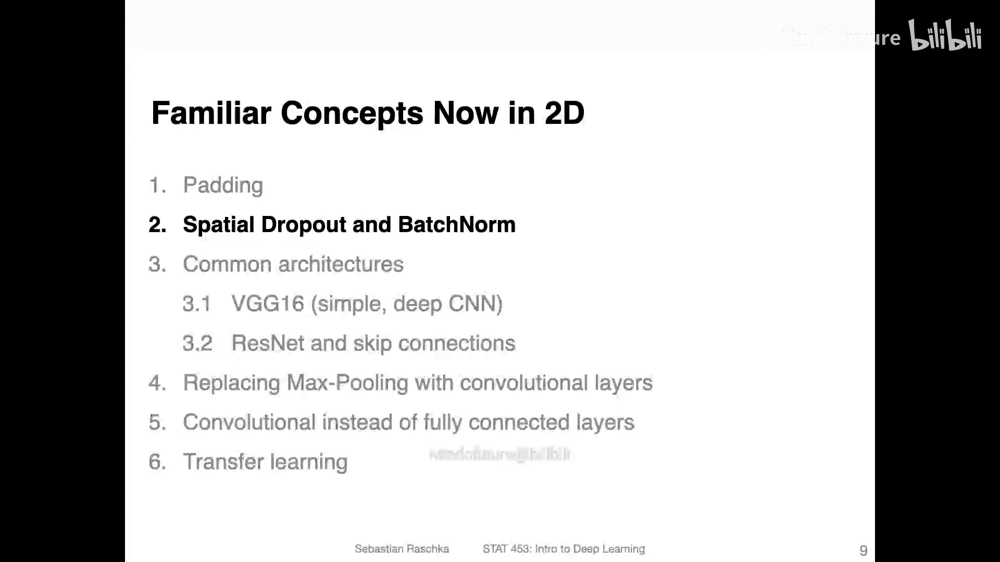

在本节课中，我们将学习如何将熟悉的概念，如Dropout和BatchNorm，应用到卷积神经网络（CNN）的二维图像处理场景中。这些概念在卷积设置下被称为空间Dropout（Spatial Dropout）和BatchNorm 2D。虽然听起来很高级，但你会发现它们的实现非常直接，并不需要太多额外的工作。

## 为什么需要空间Dropout？🤔

上一节我们介绍了Dropout在多层感知机（MLP）中的应用。那么，为什么现在需要为卷积网络“发明”一个新版本呢？我们首先需要修改它的原因是什么？

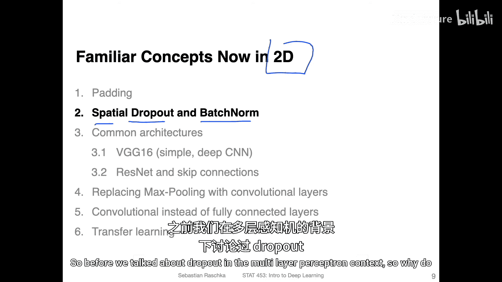

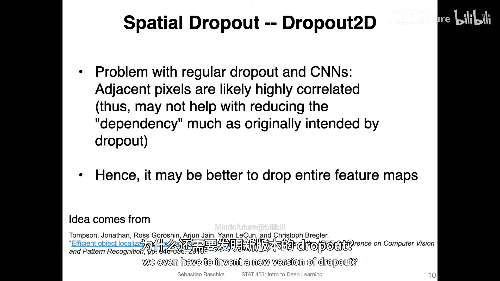

当然，你可以直接使用之前学过的常规Dropout。但根据下面链接的论文（Thompson等人）的观点，常规Dropout在CNN中存在一个问题。在CNN中，当你将卷积核滑过图像时，相邻的像素之间通常高度相关。

例如，如果在某个感受野内随机丢弃一半的像素，除了可能带来一些缩放差异外，并不会对输出结果产生太大改变。你可以这样理解：假设有一张人脸图像，眼睛区域由许多像素组成。如果我们将其中一半的像素屏蔽掉，这些像素共同代表的“眼睛”这个概念本身并没有发生根本变化。

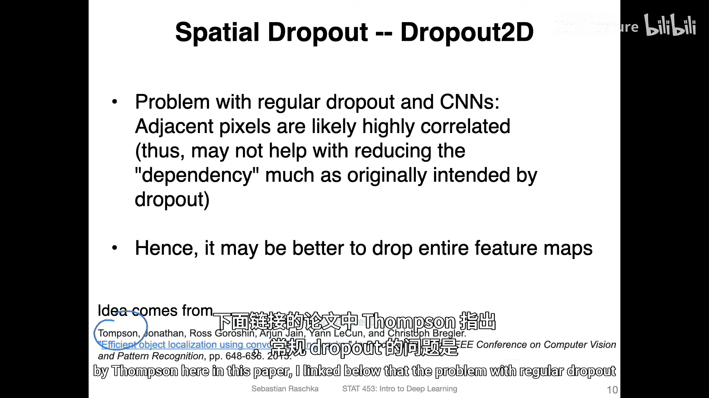

因此，论文提出的观点是：与其在特征图中随机丢弃单个像素位置，不如丢弃整个通道。在网络的后几层，这些通道通常代表着更高级、更宏观的概念，正如我们在上一节讨论的，一个通道可能代表检测到的眼睛，另一个代表嘴巴，再一个代表鼻子等等。空间Dropout的核心思想就是通过丢弃这些高级特征，即丢弃整个特征图，而不是单个像素。

**核心概念**：空间Dropout本质上是将Dropout应用于通道维度，而非像素维度。

## 空间Dropout如何工作？🛠️

在PyTorch中实现空间Dropout非常简单。你不需要使用`Dropout1D`，而是使用`Dropout2D`。

以下是一个示例，展示了它的工作原理。图中每个方块代表一个通道。假设我们有一个具有三个通道的随机输入张量。在应用空间Dropout后，你可以看到其中两个通道被完全置零。这就是空间Dropout的工作方式，它并不复杂。

```python
# PyTorch 示例
import torch.nn as nn

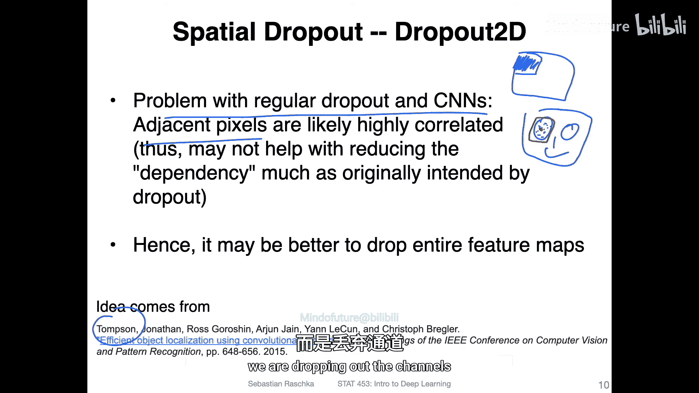

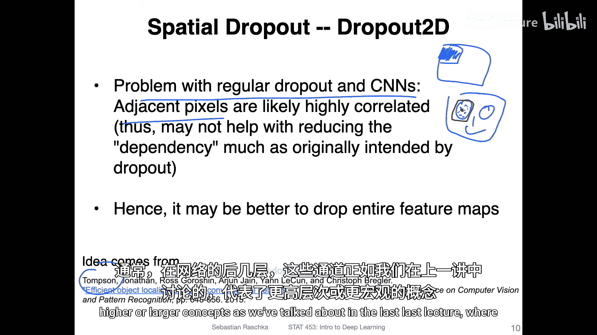

# 定义一个空间Dropout层，丢弃概率为0.5
spatial_dropout = nn.Dropout2d(p=0.5)
```

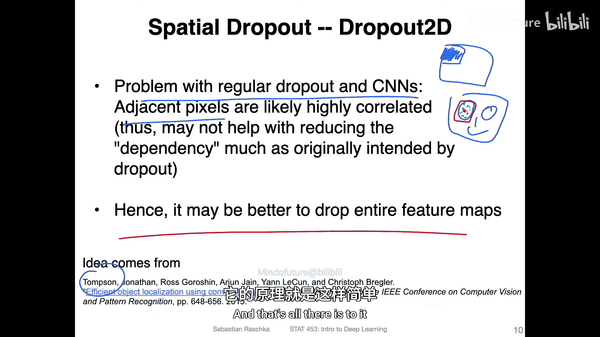

## BatchNorm的扩展：BatchNorm 2D 📈

与Dropout类似，BatchNorm也需要为卷积层进行调整。我们之前在全连接层（多层感知机）中使用的是`BatchNorm1d`，而对于卷积层，我们使用`BatchNorm2d`。

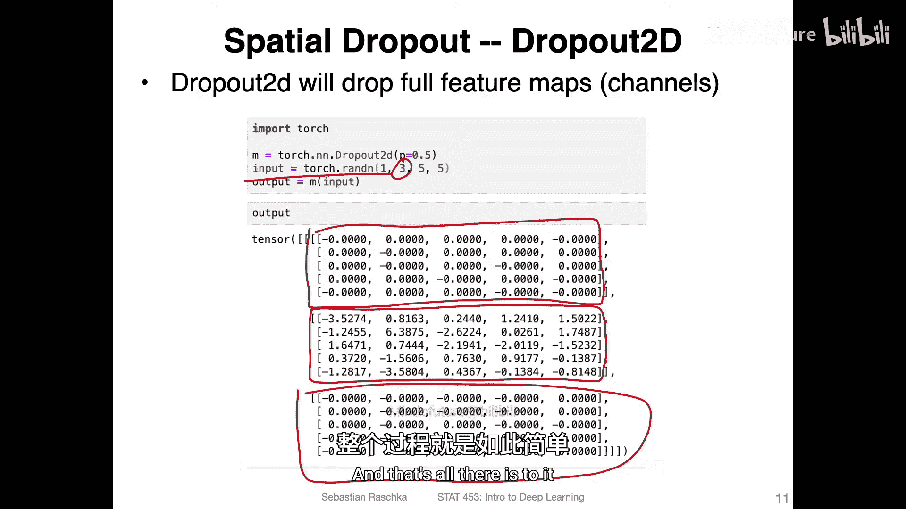

让我们简要回顾一下。在常规的1D BatchNorm中，我们为每个特征计算其在小批量（batch）维度上的均值和方差（gamma和beta）。假设输入维度是 `n x m`，其中 `n` 是批量大小，`m` 是特征数量。对于三个特征（F1, F2, F3），我们会有三组不同的gamma和beta参数。

现在，我们将这个概念扩展到二维情况。卷积层的输入通常是四维张量：`[批量大小, 通道数, 高度, 宽度]`。BatchNorm 2D 的计算方式是：**跨批量、高度和宽度这三个维度**计算每个通道的均值和方差。

**核心公式**：对于具有 `C` 个通道的输入，BatchNorm 2D 会学习 `C` 个gamma参数和 `C` 个beta参数。它是在 `(N, H, W)` 维度上对每个通道进行归一化，其中N是批量大小，H是高度，W是宽度。

## 在PyTorch中实现BatchNorm 2D 💻

以下是如何在PyTorch中为一个卷积层添加BatchNorm 2D的示例：

```python
import torch.nn as nn

# 定义一个卷积层，输入通道为3，输出通道为192
conv_layer = nn.Conv2d(in_channels=3, out_channels=192, kernel_size=3)

# 定义一个BatchNorm 2D层，参数数量需与卷积层的输出通道数匹配（192）
batch_norm = nn.BatchNorm2d(num_features=192)

# 在网络中，数据会先经过卷积层，再经过BatchNorm层
# output = batch_norm(conv_layer(input))
```


注意：`BatchNorm2d` 中的 `num_features` 参数必须设置为前一卷积层的输出通道数（本例中为192）。这意味着该BatchNorm层将学习192个gamma和192个beta参数。

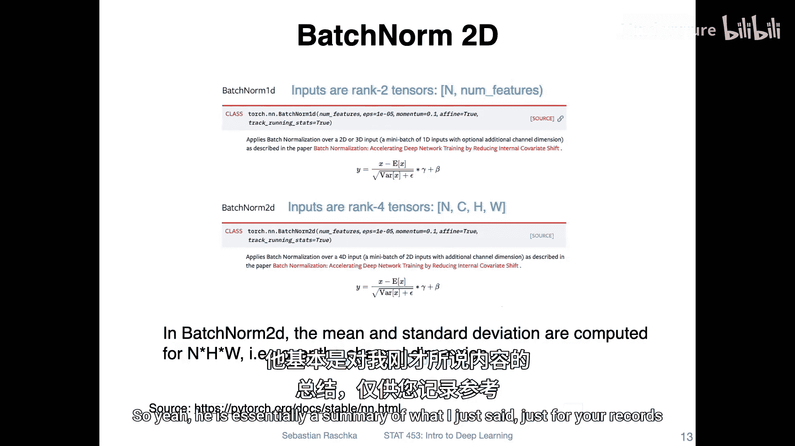

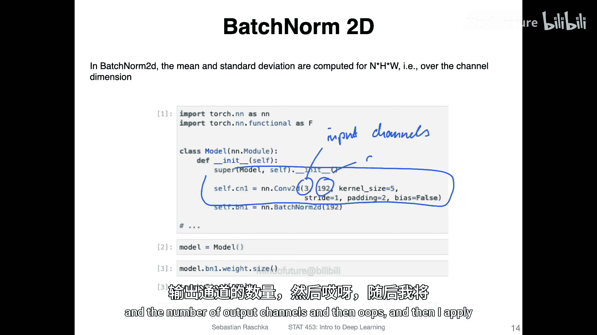

## 总结 📝

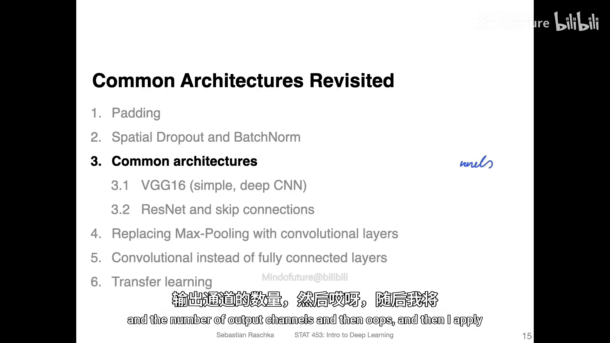

本节课我们一起学习了如何将正则化技术适配到卷积神经网络：

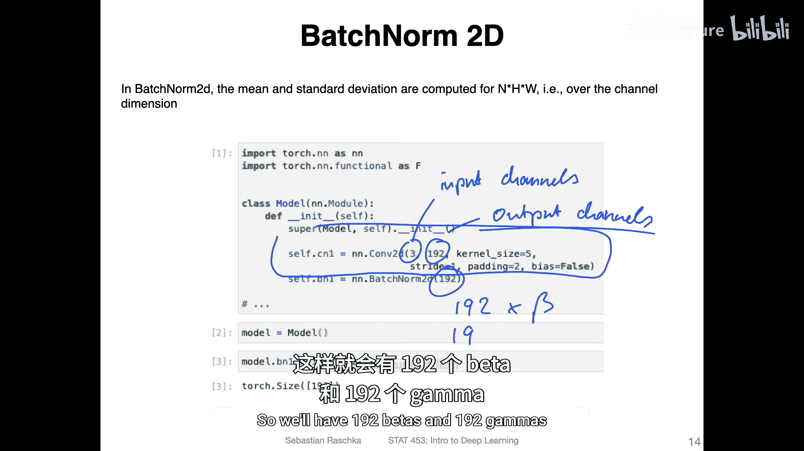

*   **空间Dropout**：为了解决卷积层中相邻像素高度相关的问题，我们不再随机丢弃单个激活值，而是随机丢弃**整个特征通道**。在PyTorch中，这通过 `nn.Dropout2d` 实现。
*   **BatchNorm 2D**：为了对卷积层的四维输出进行归一化，我们使用 `nn.BatchNorm2d`。它跨批量、高度和宽度维度计算每个通道的统计量，并为每个通道学习一组缩放（gamma）和偏移（beta）参数。

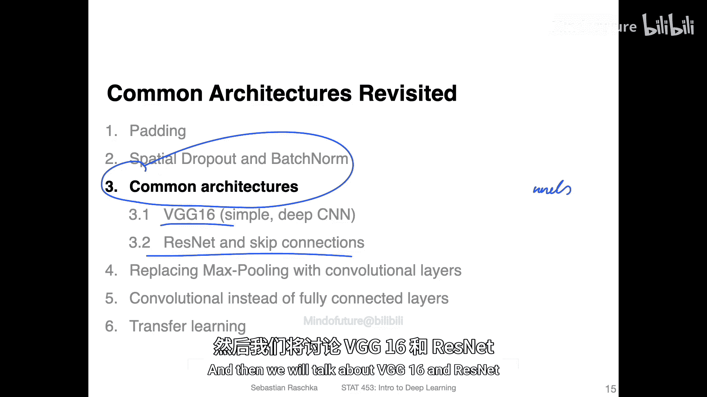

这些调整使得Dropout和BatchNorm能更有效地在卷积网络中工作，帮助稳定训练并提升模型性能。在下一个视频中，我们将简要回顾不同的CNN架构，并深入探讨VGG16和ResNet这两个经典模型。