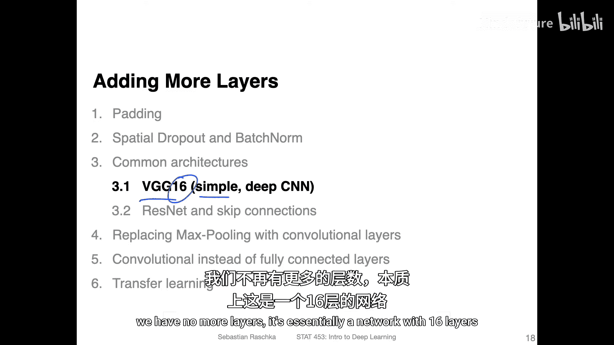
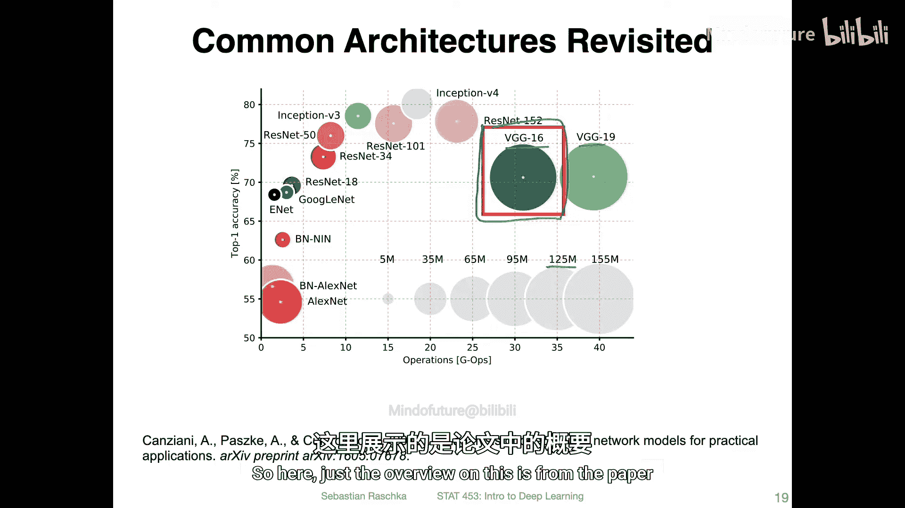
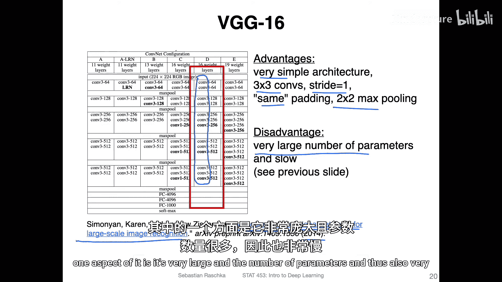
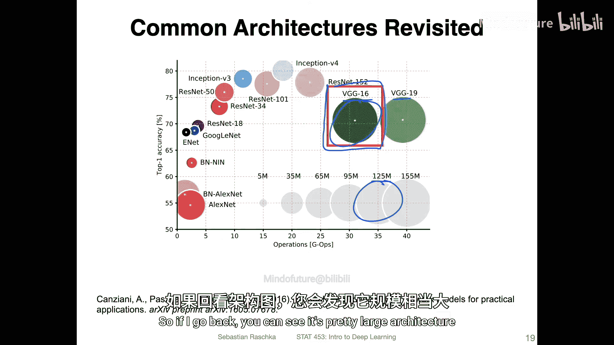
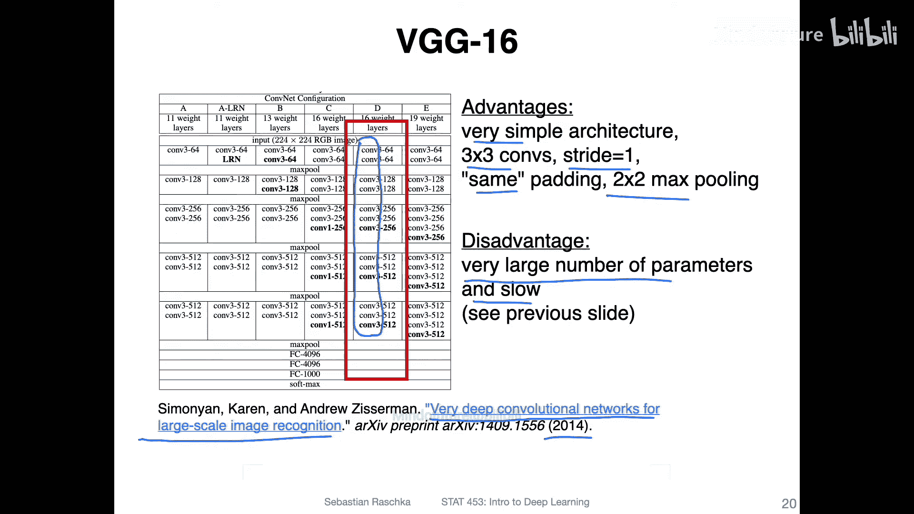
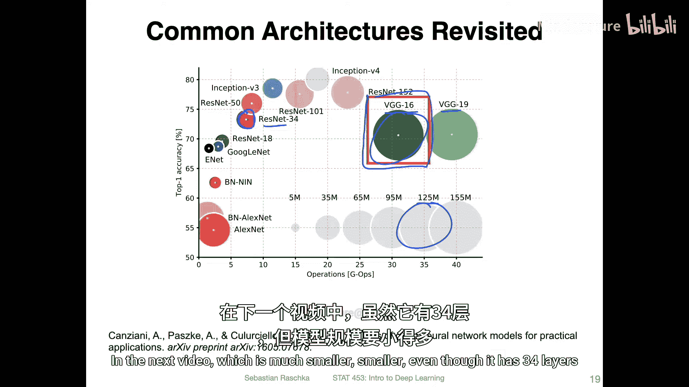
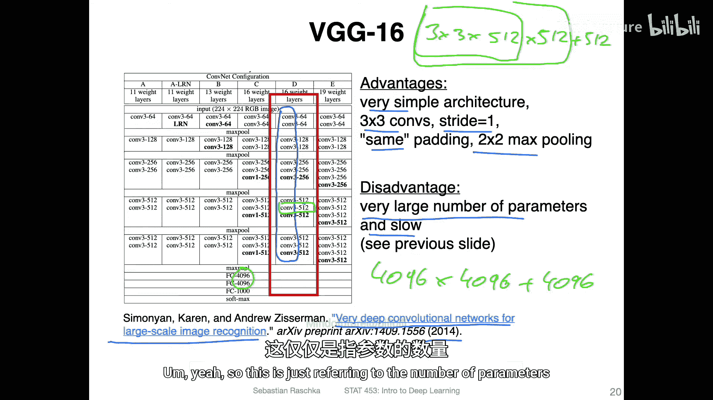
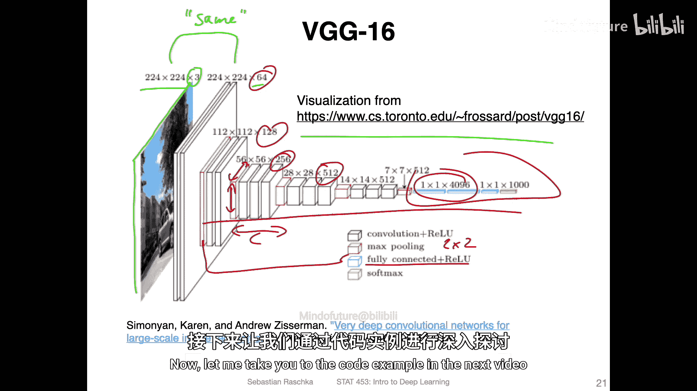

# 116：VGG16概述 🏛️

在本节课中，我们将具体探讨VGG16架构。这是一个非常简洁、直观的网络结构。

## 概述

VGG16是一种经典的卷积神经网络架构。你可以将其视为与上一讲讨论的AlexNet类似，但层数更多。它本质上是一个包含16层的网络。

作为参考，根据上一视频展示的图表，VGG16位于此处。你可以看到它相对较大，实际上是该图表中第二大的网络。它大约有1.25亿个参数。图中更大的网络是VGG19，它是VGG16的一个拥有19层的变体。但增加这三层并没有显著改变性能，因此我们在此专注于16层的版本。

本视频主要展示该架构的外观，在下一个视频中，我将制作一个新视频来展示其代码实现。这里的概述源自2014年发表的论文《Very Deep Convolutional Networks for Large-Scale Image Recognition》。虽然已有七年历史，但它结构简单，易于实现和实验，因此仍然值得学习。

## 架构特点

正如之前所说，VGG16的一个优点是结构相对直观，这使得编码非常简单，你将在下一个视频中看到。

本质上，它主要基于使用3x3的卷积核。你可以看到这里所有的卷积核都是3x3的。这种方式使其非常简洁。卷积的步长为1，并且它们使用“相同”卷积。这意味着我们使用填充，使得每次卷积后输入尺寸与输出尺寸相匹配。

然后，它们使用2x2的最大池化来减小尺寸。这一点在此图中未显示，我将在下一张幻灯片中展示下一个构建块。不过，需要注意的一个方面是，它的参数量非常大，因此运行速度也相对较慢。

## 参数量分析

回顾一下，可以看到它是一个相当大的架构。既然它只有16层，为什么还这么大？在下一个视频中，我们将看到名为ResNet34的架构，它虽然拥有34层，但参数量却小得多。那么是什么让VGG16的参数量如此庞大呢？

本质上，如果你仔细观察，原因在于通道数量。

让我们以其中一个卷积块为例。它有512个输入通道和512个输出通道。对于一个3x3的卷积核，如果输入通道是512，输出通道也是512，那么每个卷积核的参数数量是 `3 * 3 * 512`。由于我们有512个这样的卷积核，所以该卷积层的权重参数总数是 `3 * 3 * 512 * 512`。此外，每个输出通道还有一个偏置参数，因此偏置参数总数是512。这只是一个卷积层的参数量，而这样的层在VGG16中出现了多次。

全连接层同样参数量巨大。例如，一个4096x4096的全连接层，其权重参数数量为 `4096 * 4096`，再加上4096个偏置参数。多个这样的层累加起来，总参数量就非常可观了。

## 架构可视化

以下是来自一个网站的、更直观的架构可视化图。

你可以直观地看到它的样子。卷积网络背后的基本概念通常是“挤压”出特征信息。之前在Piazza上有人问过关于卷积层设计的一般趋势或准则，这里的结构正是答案。

以下是其工作流程：
*   我们从一个较大的高度和宽度开始。
*   然后通过卷积和池化，使高度和宽度变小，但同时增加通道数。
*   我们希望每个通道能学习到不同类型的特征信息，因为每个通道本质上是由不同的卷积核生成的。

具体来看：
*   输入图像尺寸为224x224，具有3个颜色通道（RGB）。
*   经过第一次卷积后，我们得到64个通道。这里使用了“相同”卷积以保持空间尺寸。
*   图中红色部分表示2x2的最大池化层，这将使尺寸减半。
*   然后，我们进行另一轮类似的“挤压”过程。
*   可以看到，通道数（宽度）在增加，而特征图的高度和宽度在减小。你可以将其视为在此过程中“挤压”出信息。
*   最后，是全连接部分。实际上，这部分也可以用卷积来实现，我将在后面的视频中展示。这就是为什么它有时也被画成这样。无论我们将其实现为全连接层还是卷积层，在功能上是等价的。

## 总结

本节课我们一起学习了VGG16架构的概述。我们了解到VGG16是一个结构清晰但参数量庞大的16层卷积神经网络。它的核心是堆叠使用小尺寸（3x3）的卷积核和“相同”填充，并配合2x2的最大池化层来逐步提取特征并降低空间维度。同时，网络在深度增加的过程中，通道数也随之增加，旨在学习更丰富、更抽象的特征表示。尽管其参数量大、计算成本高，但因其设计的简洁性，它仍然是理解深度卷积网络的一个优秀范例。在下一节中，我们将通过代码实现来进一步巩固对VGG16的理解。