# 117：PyTorch中的VGG16代码示例 🧠

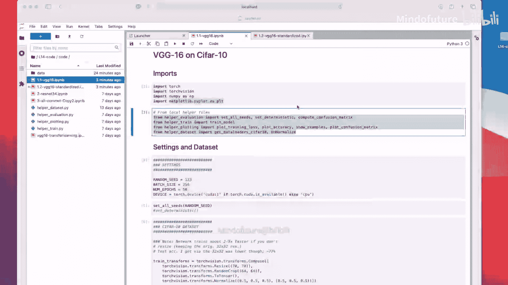

在本节中，我们将一起学习如何在PyTorch中实现和训练VGG16网络。VGG16是一个经典的深度卷积神经网络，以其简单而统一的架构闻名。我们将通过一个具体的代码示例，了解其结构定义、数据预处理、训练过程以及结果分析。

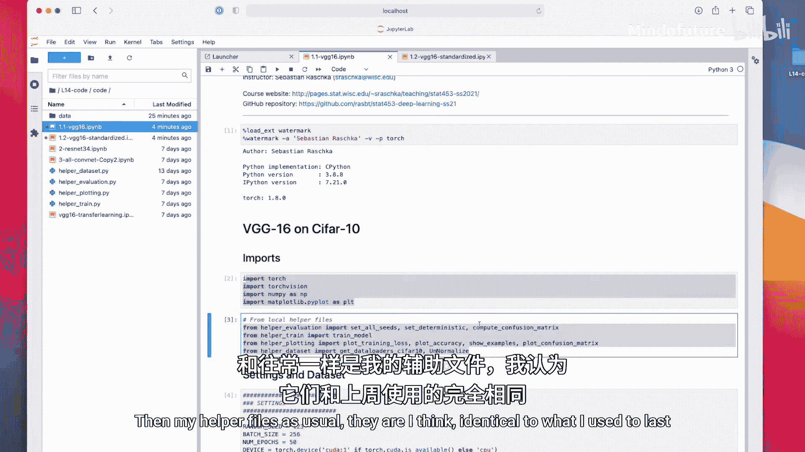

---

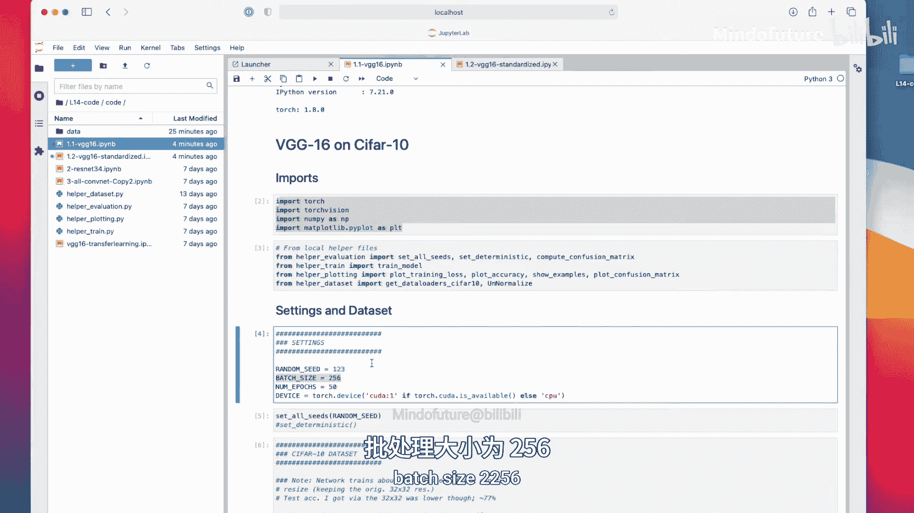

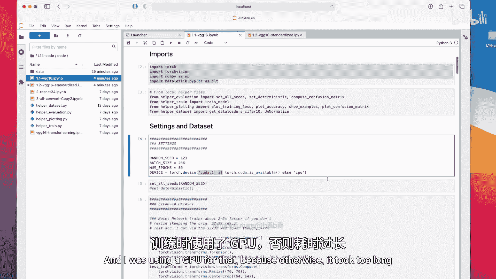

## 导入与设置

首先，我们需要导入必要的库并设置基本参数。以下是代码的初始部分：

```python
import watermark
import torch
import torchvision
from helper_files import *  # 假设这是自定义的辅助函数文件
```

接下来，我们定义超参数。请注意，随机种子虽然通常不被视为超参数，但为了结果的可复现性，我们将其设置为一个固定值。

```python
RANDOM_SEED = 103
BATCH_SIZE = 256
NUM_EPOCHS = 50
DEVICE = 'cuda'  # 使用GPU进行训练以加速
```

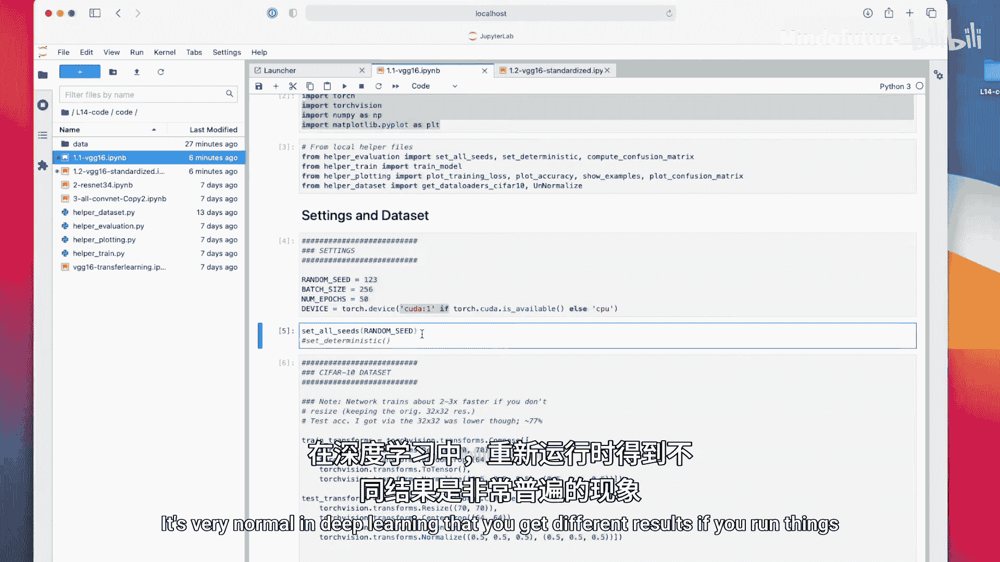

设置随机种子有助于确保每次运行代码时，随机初始化过程保持一致。然而，在GPU上运行时，由于底层卷积算法（如基于快速傅里叶变换的优化算法）的自动选择和微小数值差异，结果可能会有轻微变化。这是深度学习中常见的现象，通常不影响整体结论。

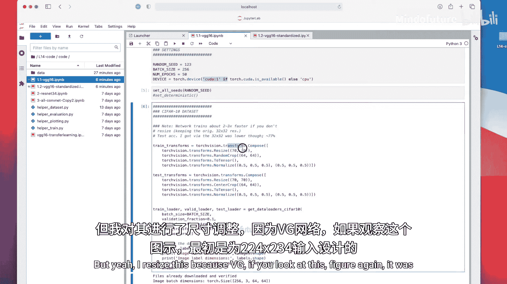

---

## 数据准备与预处理

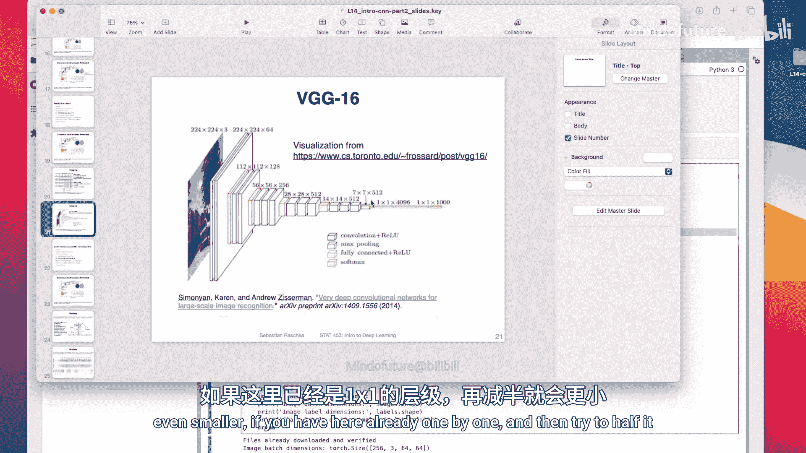

上一节我们介绍了超参数设置，本节中我们来看看如何处理数据。我们使用CIFAR-10数据集，但其原始图像尺寸为32x32，对于VGG16来说太小。VGG16最初是为224x224的输入设计的，层数较多，如果输入尺寸过小，经过多次下采样后特征图尺寸会变得极小，甚至为1x1，这不利于网络学习。

因此，我们需要对图像进行上采样。以下是数据转换流程：

1.  将图像从32x32上采样到70x70。
2.  进行随机裁剪，这有助于减少过拟合，使模型对物体的精确位置不那么敏感。
3.  将图像转换为张量。
4.  进行标准化，使各通道的像素值均值为0，标准差为1。

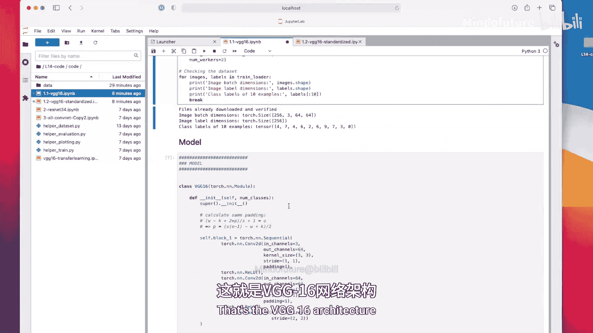

对于测试集，我们不进行随机裁剪，而是进行中心裁剪，以确保评估的一致性。

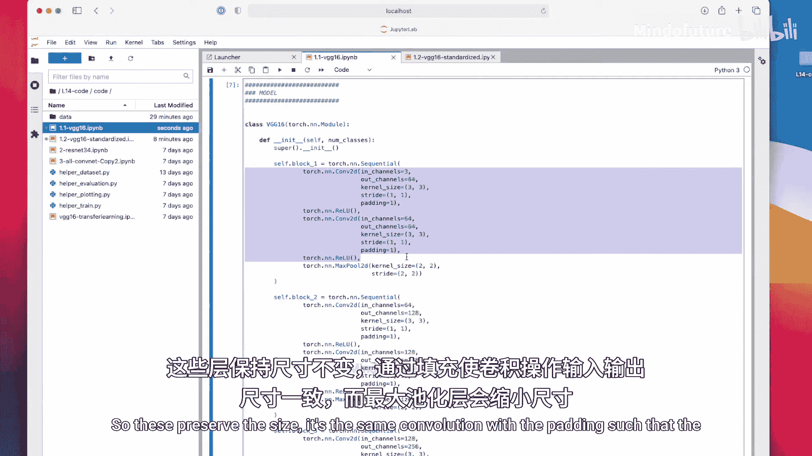

```python
# 训练集转换
train_transform = transforms.Compose([
    transforms.Resize((70, 70)),
    transforms.RandomCrop((64, 64)),
    transforms.ToTensor(),
    transforms.Normalize(mean=[0.5, 0.5, 0.5], std=[0.5, 0.5, 0.5])
])

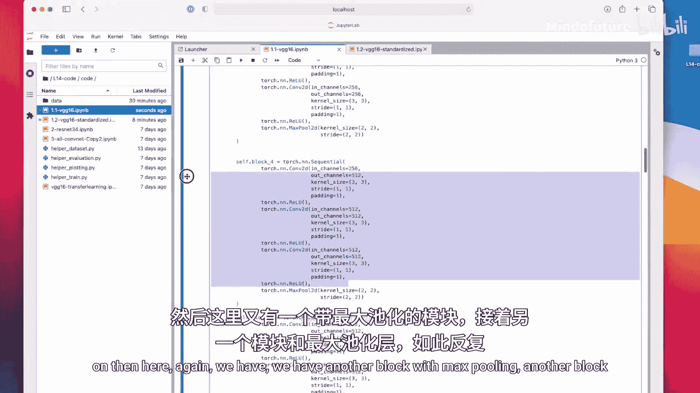

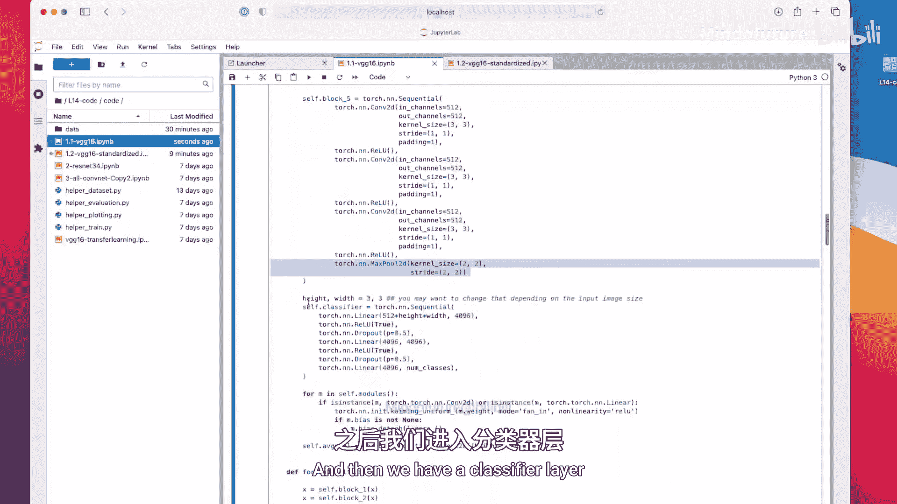

# 测试集转换
test_transform = transforms.Compose([
    transforms.Resize((70, 70)),
    transforms.CenterCrop((64, 64)),
    transforms.ToTensor(),
    transforms.Normalize(mean=[0.5, 0.5, 0.5], std=[0.5, 0.5, 0.5])
])
```

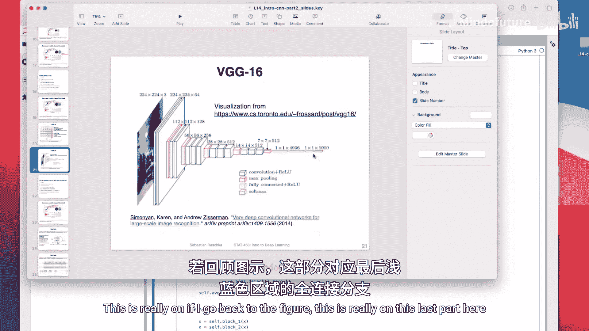

---

## 定义VGG16架构 🏗️

现在，我们来构建VGG16模型的核心部分。VGG16的架构由多个卷积块组成，每个块末尾是一个最大池化层，用于将特征图尺寸减半。

以下是定义模型结构的关键步骤：

1.  **卷积块**：每个块包含若干层卷积层（使用`same`填充以保持特征图尺寸），最后接一个最大池化层（将尺寸减半）。
2.  **分类器**：在卷积特征提取部分之后，是几个全连接层（在图中显示为浅蓝色部分），用于最终的分类。

在实现中，一个挑战是确定最后一个卷积块输出特征图的空间尺寸（高度和宽度），以便正确设置第一个全连接层的输入维度。这里我们使用了一种简便的方法：**自适应平均池化**。

自适应平均池化允许我们指定期望的输出尺寸（例如3x3）。无论输入尺寸如何，该操作都会通过自动调整步长或填充来生成指定尺寸的输出。之后，我们将3D特征图展平为1D向量，即可输入全连接层。

```python
import torch.nn as nn

class VGG16(nn.Module):
    def __init__(self, num_classes=10):
        super(VGG16, self).__init__()

        # 特征提取部分 (卷积块)
        self.features = nn.Sequential(
            # 块 1
            nn.Conv2d(3, 64, kernel_size=3, padding=1),
            nn.ReLU(inplace=True),
            nn.Conv2d(64, 64, kernel_size=3, padding=1),
            nn.ReLU(inplace=True),
            nn.MaxPool2d(kernel_size=2, stride=2),

            # 块 2
            nn.Conv2d(64, 128, kernel_size=3, padding=1),
            nn.ReLU(inplace=True),
            nn.Conv2d(128, 128, kernel_size=3, padding=1),
            nn.ReLU(inplace=True),
            nn.MaxPool2d(kernel_size=2, stride=2),

            # 块 3
            nn.Conv2d(128, 256, kernel_size=3, padding=1),
            nn.ReLU(inplace=True),
            nn.Conv2d(256, 256, kernel_size=3, padding=1),
            nn.ReLU(inplace=True),
            nn.Conv2d(256, 256, kernel_size=3, padding=1),
            nn.ReLU(inplace=True),
            nn.MaxPool2d(kernel_size=2, stride=2),

            # 块 4 和 5 结构类似，此处省略...
        )

        # 自适应池化层，将特征图尺寸固定为 3x3
        self.avgpool = nn.AdaptiveAvgPool2d((3, 3))

        # 分类器部分 (全连接层)
        self.classifier = nn.Sequential(
            nn.Linear(256 * 3 * 3, 4096), # 输入维度需根据上一层的输出计算
            nn.ReLU(inplace=True),
            nn.Dropout(),
            nn.Linear(4096, 4096),
            nn.ReLU(inplace=True),
            nn.Dropout(),
            nn.Linear(4096, num_classes),
        )

    def forward(self, x):
        x = self.features(x)
        x = self.avgpool(x)
        x = torch.flatten(x, 1) # 展平操作
        x = self.classifier(x)
        return x
```

**注意**：在实际编码中，确定全连接层输入维度的一个“笨办法”是在网络中临时添加`print(x.shape)`语句，运行一次前向传播，查看特征图在池化前的尺寸，然后据此计算并修改代码。这是一种在实践中常用且高效的方法。

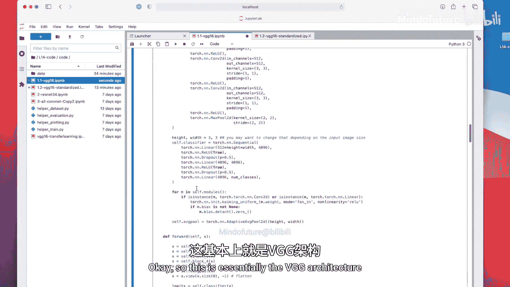

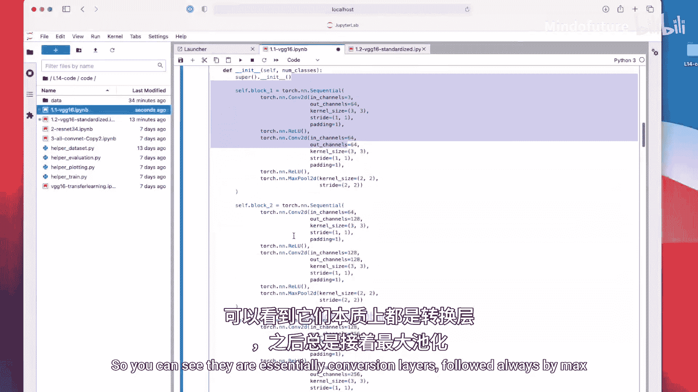

另外，对于卷积网络，使用`nn.Dropout2d`（空间丢弃）通常比标准的`nn.Dropout`（随机丢弃神经元）更能有效减少过拟合。

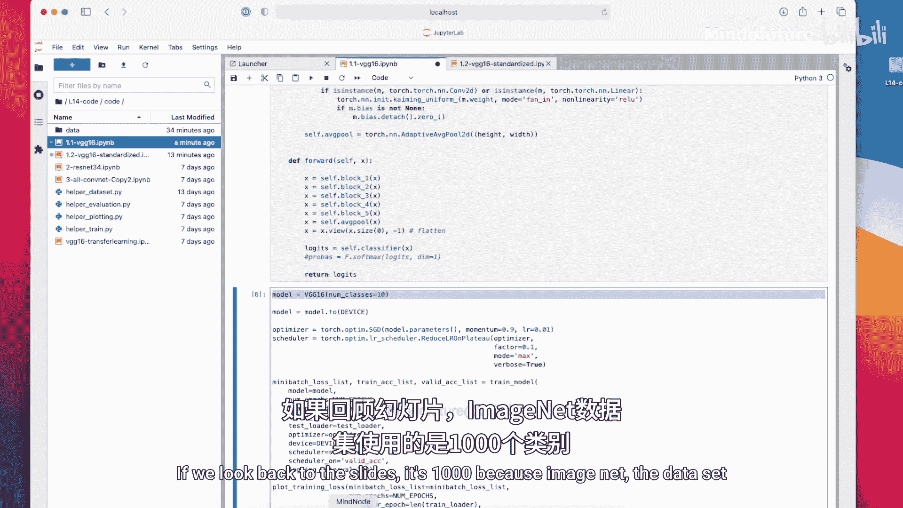

---

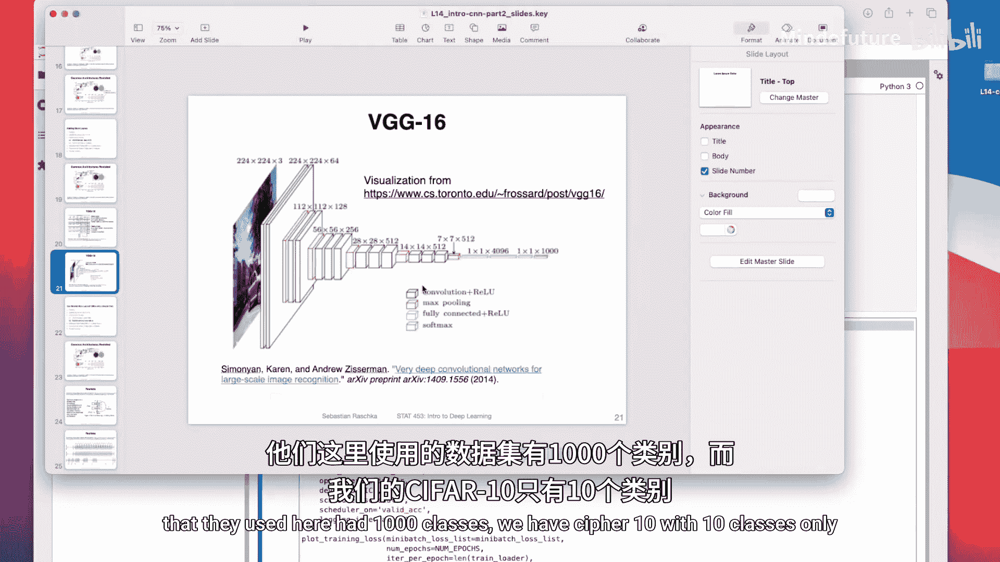

## 模型训练与监控

定义好模型后，我们开始训练过程。我们使用带动量的随机梯度下降（SGD）作为优化器，并配置了一个学习率调度器，当验证集准确率不再提升时，将学习率降低为原来的十分之一。

```python
model = VGG16(num_classes=10).to(DEVICE)
optimizer = torch.optim.SGD(model.parameters(), lr=0.01, momentum=0.9)
scheduler = torch.optim.lr_scheduler.ReduceLROnPlateau(optimizer, factor=0.1, patience=5)
criterion = nn.CrossEntropyLoss()
```

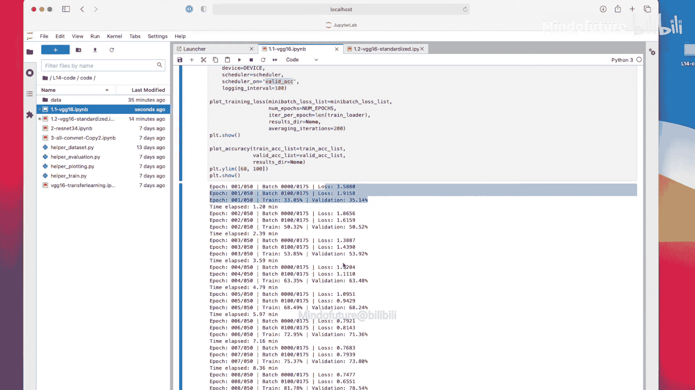

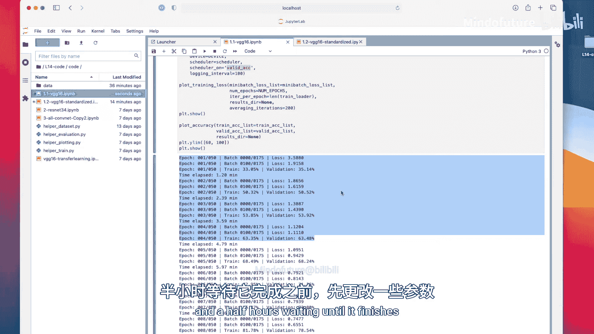

在训练大型网络如VGG16时（本例中训练耗时约1.5小时），在初期监控训练进程非常重要。如果在前几个周期发现损失没有下降或准确率没有提升，应及时停止并调整参数，以避免浪费计算资源。本示例在训练循环中打印了周期性的损失和准确率。

> 更高级的可视化工具如 **TensorBoard** 可以实时创建训练图表，但为了保持教程简洁，我们在此使用基本的打印输出和训练后的绘图。

---

## 结果分析与可视化

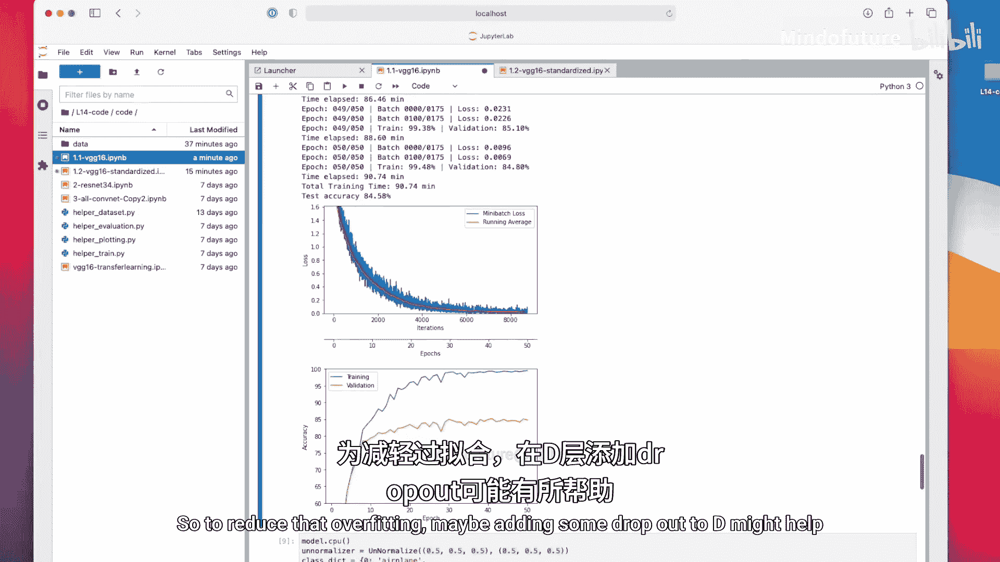

训练完成后，我们对结果进行分析。

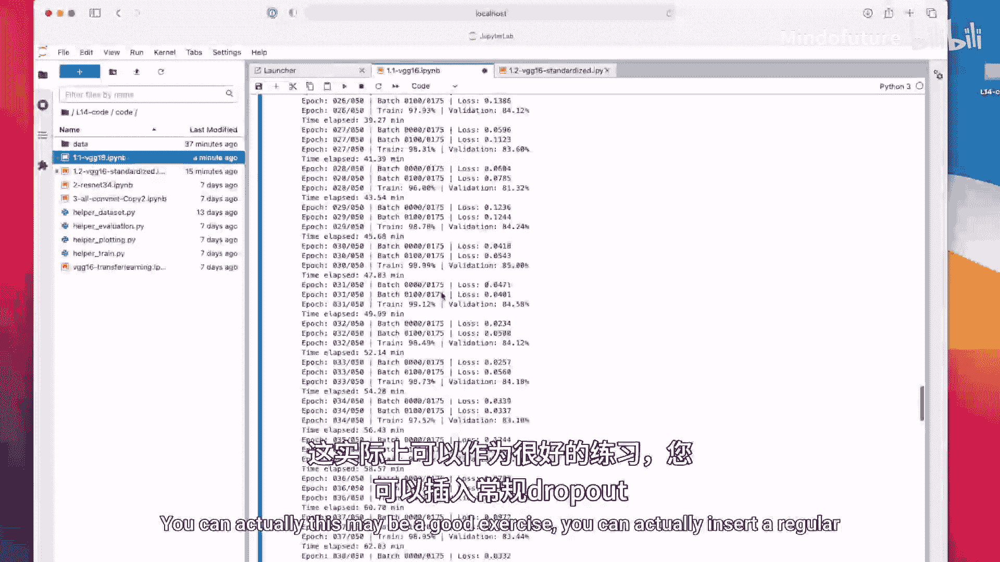

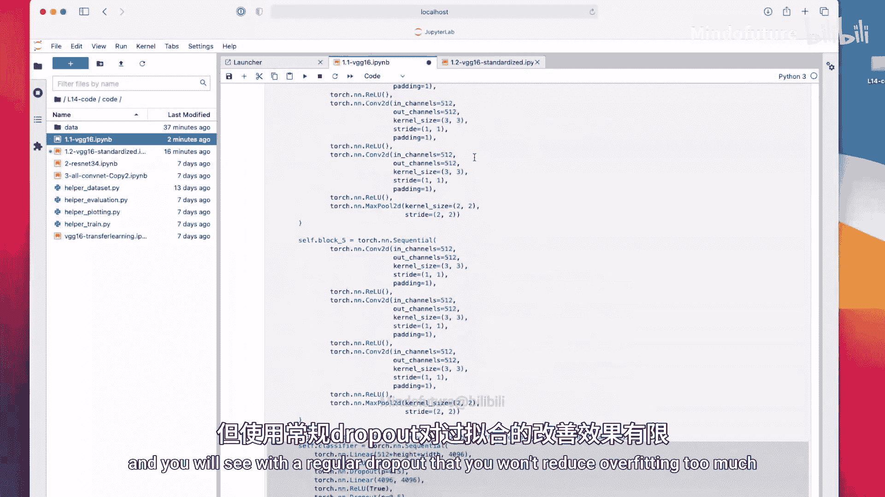

*   **损失与准确率曲线**：训练损失顺利下降并逐渐收敛。验证准确率在后期提升缓慢，且训练准确率远高于验证准确率，这表明存在明显的过拟合。为了缓解过拟合，可以考虑在卷积层中添加`Dropout2d`。
*   **预测示例**：可视化部分测试样本及其预测结果，大多数预测是正确的。由于CIFAR-10图像分辨率较低，有时连人类也难以分辨。
*   **混淆矩阵**：混淆矩阵显示了一个有趣的现象：模型容易在语义相似的类别间混淆，例如“猫”和“狗”经常被相互误分类，而“狗”和“飞机”则很少混淆。这符合直觉，说明模型学到了一些有意义的特征。

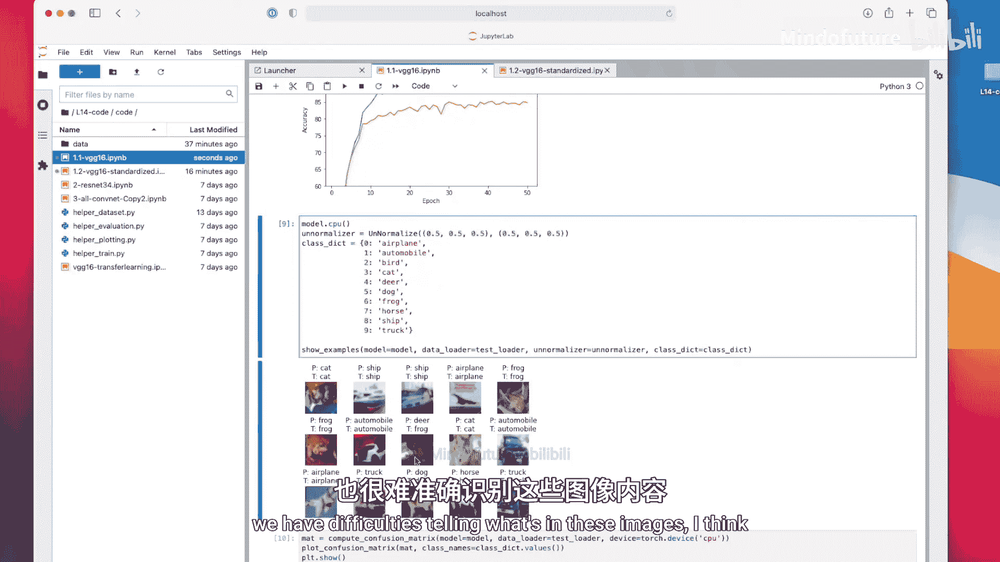

---

## 关于标准化的补充说明

在数据预处理中，我们使用了均值`[0.5, 0.5, 0.5]`和标准差`[0.5, 0.5, 0.5]`进行标准化，这会将像素值缩放至`[-1, 1]`区间。

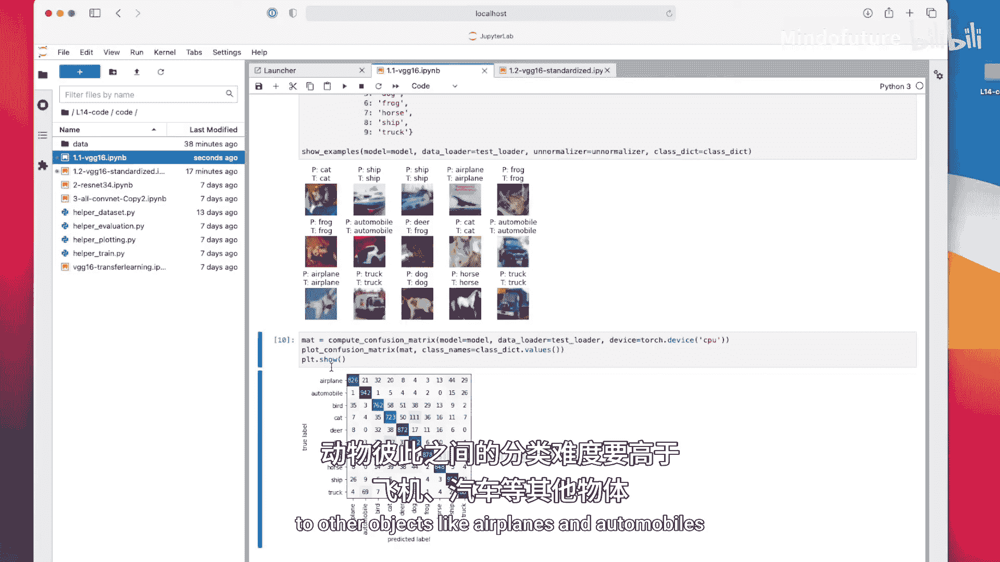

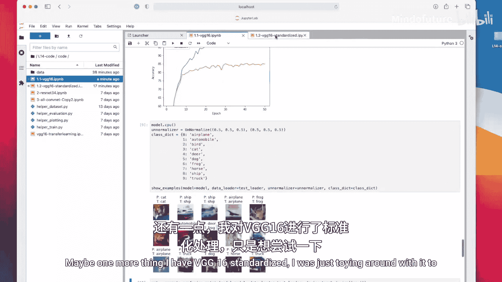

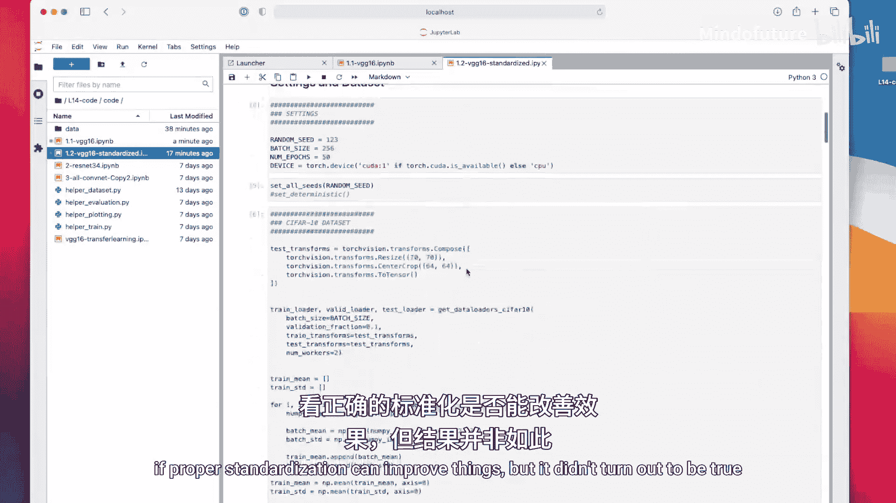

另一种“更精确”的做法是计算数据集中每个通道的实际均值和标准差，并用它们进行标准化。通过一个辅助函数可以近似计算出CIFAR-10各通道的均值约为`0.5`，标准差约为`0.25`。然而，实验表明，使用这个更精确的统计量并未带来明显的性能提升，有时甚至因随机性导致结果略有不同。因此，使用`0.5`作为通用值通常是简单有效的。

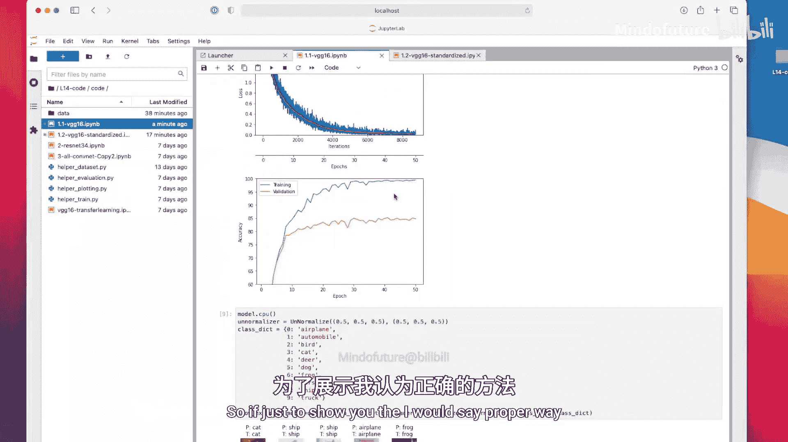

---

## 总结

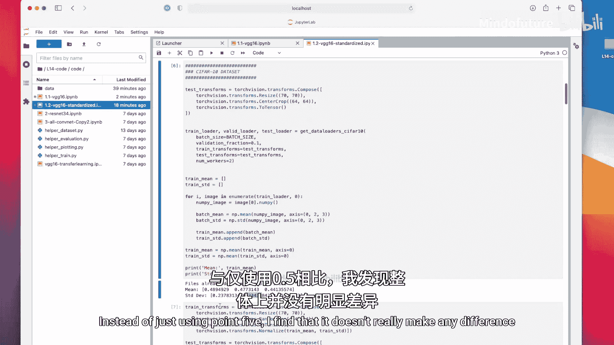

本节课中我们一起学习了VGG16在PyTorch中的完整实现流程：

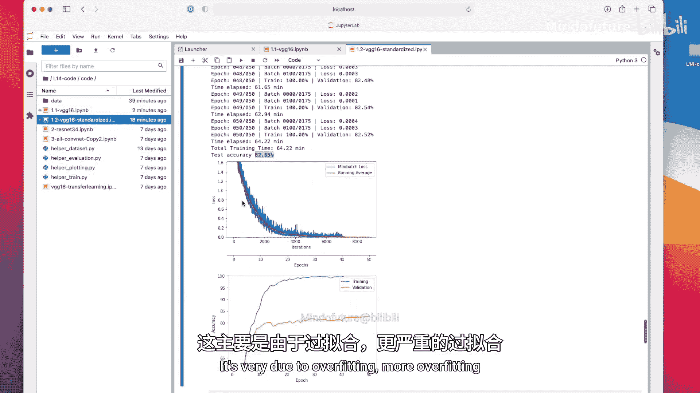

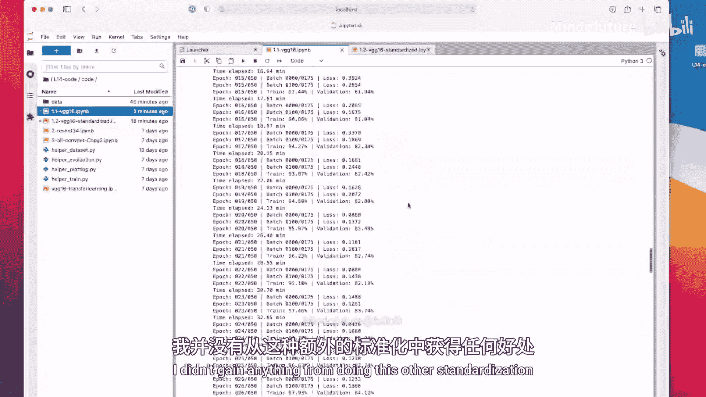

1.  **环境设置**：导入库并定义超参数，了解了GPU训练可能带来的微小非确定性。
2.  **数据预处理**：针对小尺寸输入数据集（CIFAR-10）进行了上采样和增强，以适应VGG16的架构。
3.  **模型构建**：实现了VGG16的模块化架构，包括多个卷积-池化块和全连接分类器，并学会了使用自适应平均池化来解决全连接层输入维度不确定的问题。
4.  **训练与监控**：使用SGD优化器和学习率调度器训练模型，并强调了在训练初期进行监控的重要性。
5.  **结果分析**：通过损失曲线、准确率、样本预测和混淆矩阵评估了模型性能，观察到了过拟合现象以及模型在语义相似类别间的混淆模式。

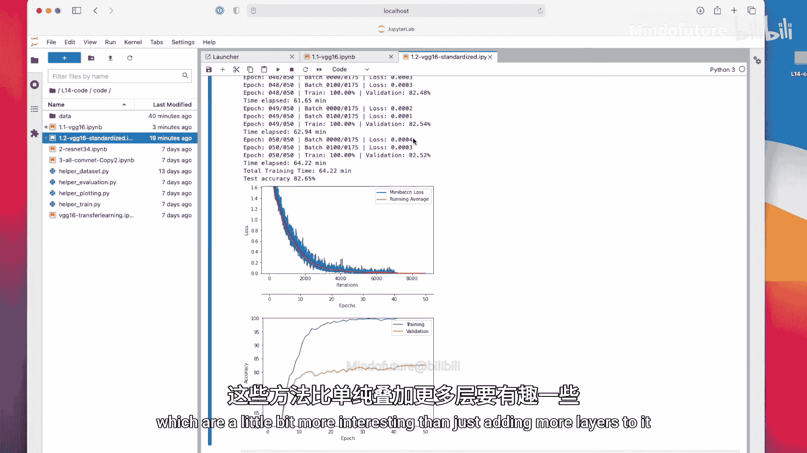

VGG16通过堆叠更多的卷积层提升了性能，但也带来了计算成本增加和过拟合风险。在下一节中，我们将探讨更具创新性的**残差网络**，它通过引入捷径连接，使得训练极深的网络成为可能，性能也更为强大。