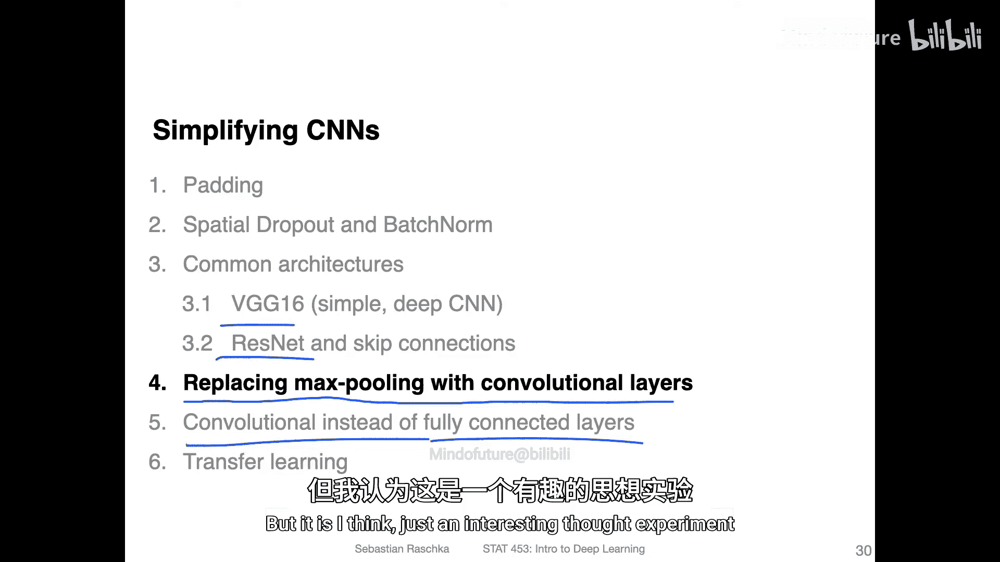
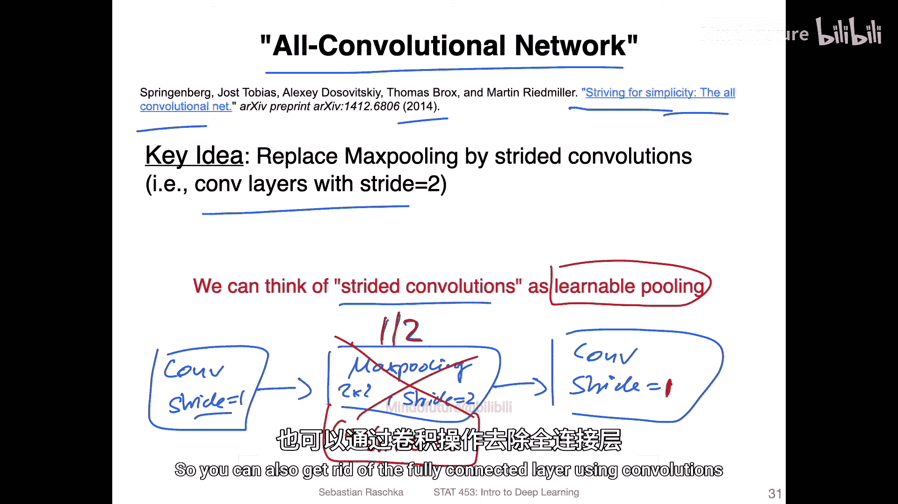
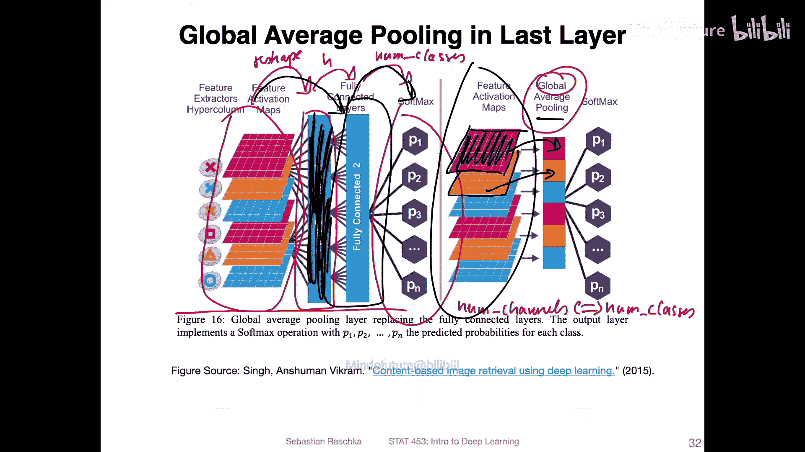
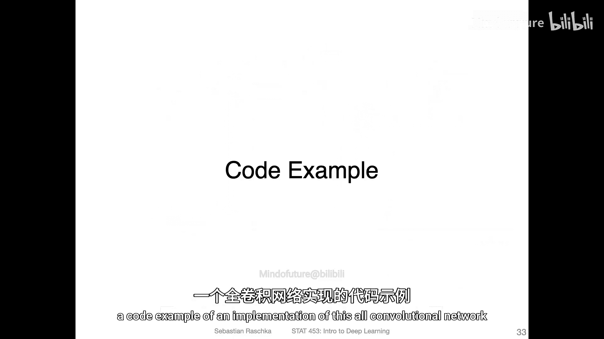
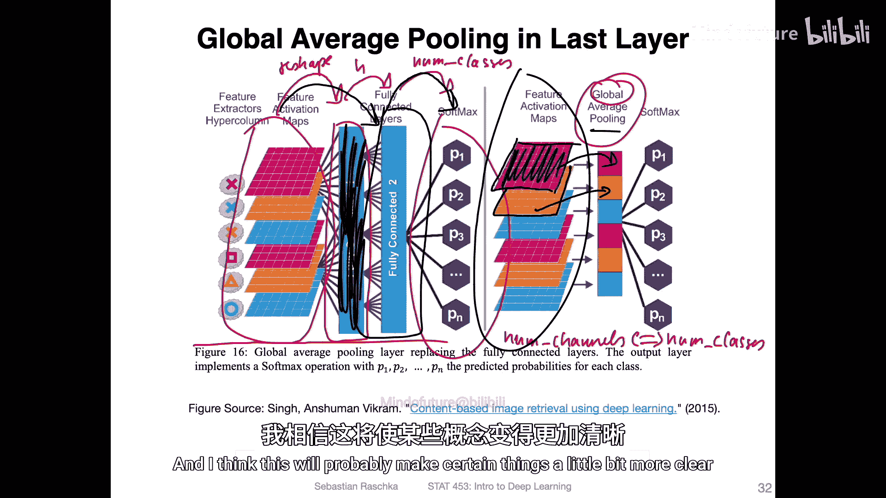

# 121：用卷积层替换最大池化

在本节课中，我们将探讨如何简化卷积神经网络架构。具体来说，我们将学习如何用卷积层替换传统的最大池化层，并理解这种替换背后的原理与效果。

在之前的视频中，我们讨论了VGG16架构和残差网络。现在，我们将讨论一个与卷积神经网络架构相关的主题。虽然这个主题对于实现性能更优的卷积网络并非至关重要，但它能帮助我们巩固对卷积工作原理的理解。本节我们将聚焦于用卷积层替换最大池化层。

## 传统架构与“全卷积网络”

传统的卷积神经网络通常包含卷积层和最大池化层的交替堆叠。卷积层通常使用步长为1，以保持特征图尺寸；而最大池化层（通常是2x2，步长为2）则用于将特征图尺寸减半，并引入一定的平移不变性。

然而，一篇题为《Striving for Simplicity: The All Convolutional Net》的论文提出了一种“全卷积网络”架构。该架构的核心思想是移除最大池化层，并用一个步长为2的卷积层来替代它，这种操作有时也被称为“步长卷积”。

以下是传统结构与替换思路的对比：

*   **传统结构**：`Conv(stride=1)` -> `MaxPool(kernel=2, stride=2)` -> `Conv(stride=1)` -> ...
*   **替换结构**：`Conv(stride=1)` -> `Conv(stride=2)` -> `Conv(stride=1)` -> ...

通过将步长设为2，卷积层同样可以实现将特征图尺寸减半的效果。论文作者认为，这种带参数的卷积层可以看作一种“可学习的池化”操作。

## 替换的动机与考量

用卷积层替换最大池化主要有以下几点考虑：

1.  **简化架构**：使网络仅由卷积层（和激活函数）构成，结构上更加统一和简洁。
2.  **引入可学习参数**：卷积层拥有可训练的权重参数，而最大池化是一种固定的、无参数的操作。理论上，“可学习的池化”可能更具灵活性。
3.  **性能表现**：根据论文中的实验结果，直接移除最大池化可能导致性能轻微下降。但用卷积层替换后，有时甚至能获得比原始架构更好的性能。当然，这会略微增加模型的参数量。

需要强调的是，这更多是一个有趣的思维实验。最大池化在实践中效果很好，并非必须被替换。著名学者Geoffrey Hinton曾表示最大池化是计算机视觉领域的一个“大错误”，但这更多是学术观点上的探讨。对于初学者而言，理解这种替换的可能性比急于应用它更为重要。

## 总结

本节课我们一起学习了如何用步长为2的卷积层替换卷积神经网络中的最大池化层。我们了解了“全卷积网络”的概念，并探讨了这种替换在简化架构和引入可学习参数方面的潜在优势与权衡。记住，这是一种架构设计的可能性，而非性能提升的绝对法则。在下一节中，我们将继续探讨如何用卷积操作替换全连接层，以进一步简化网络结构。