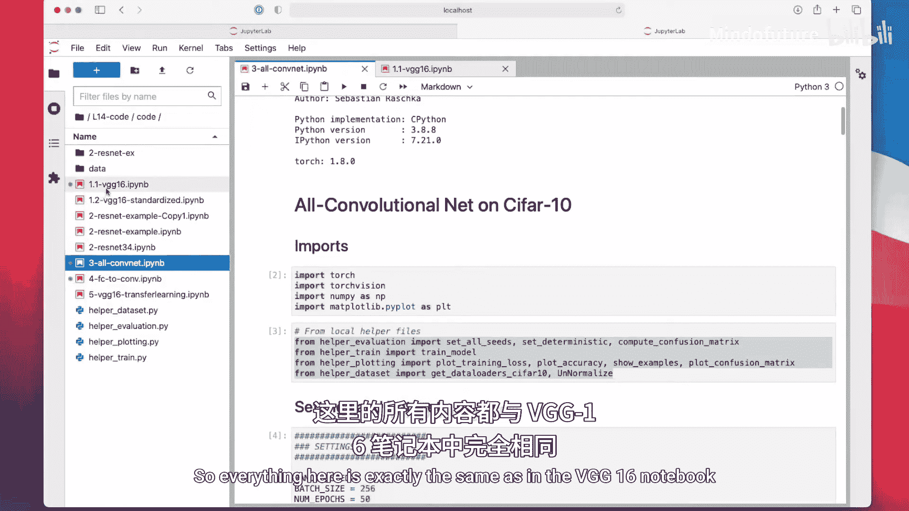
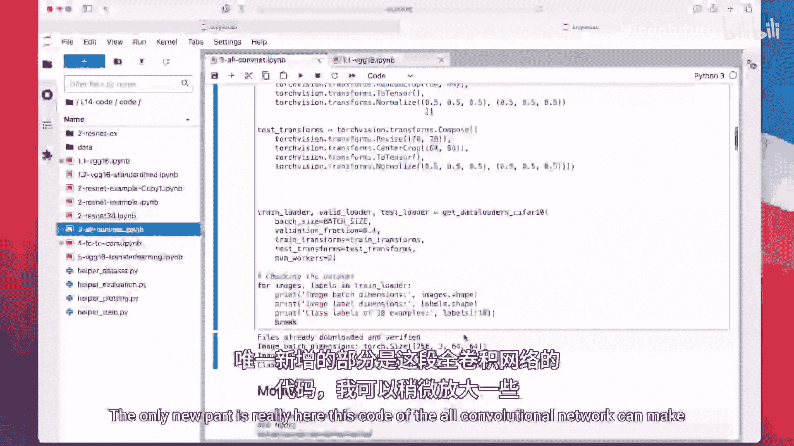
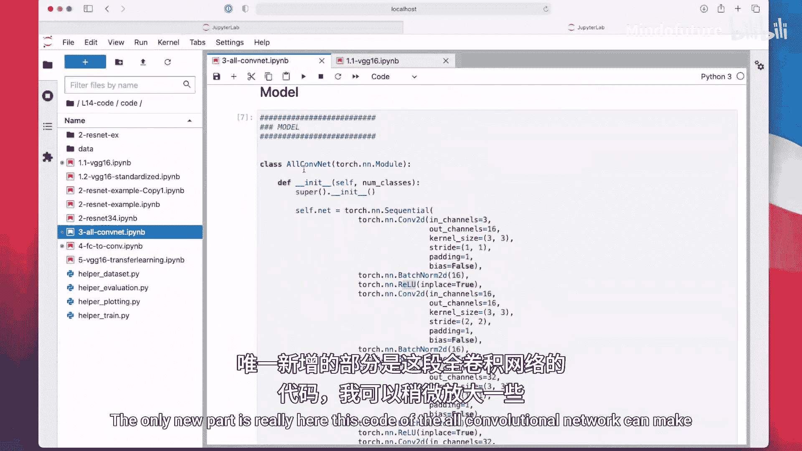
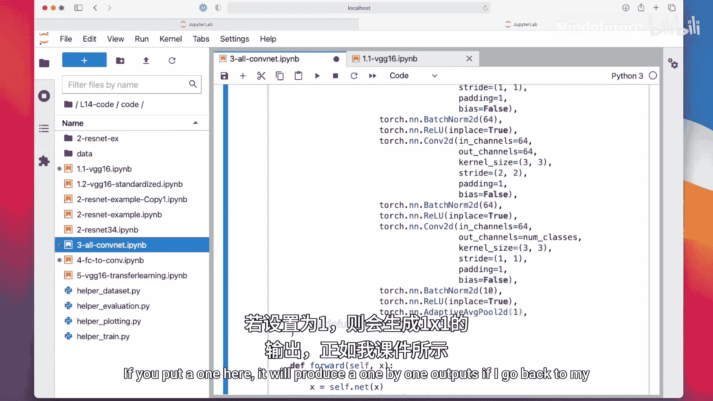
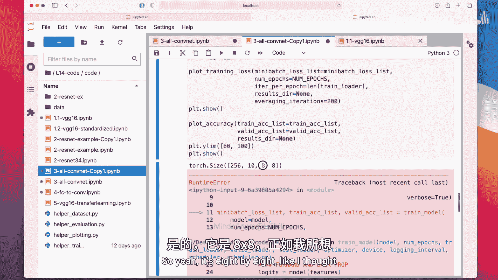
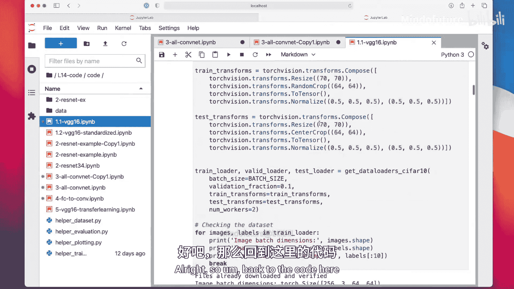
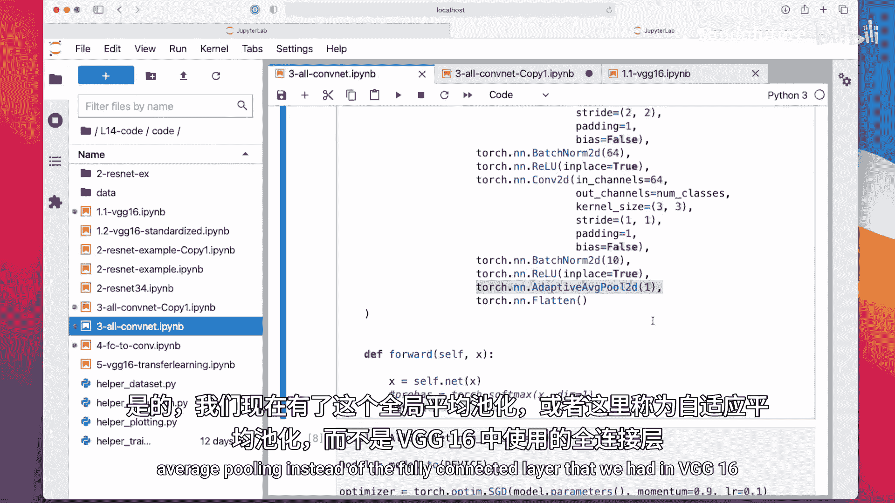
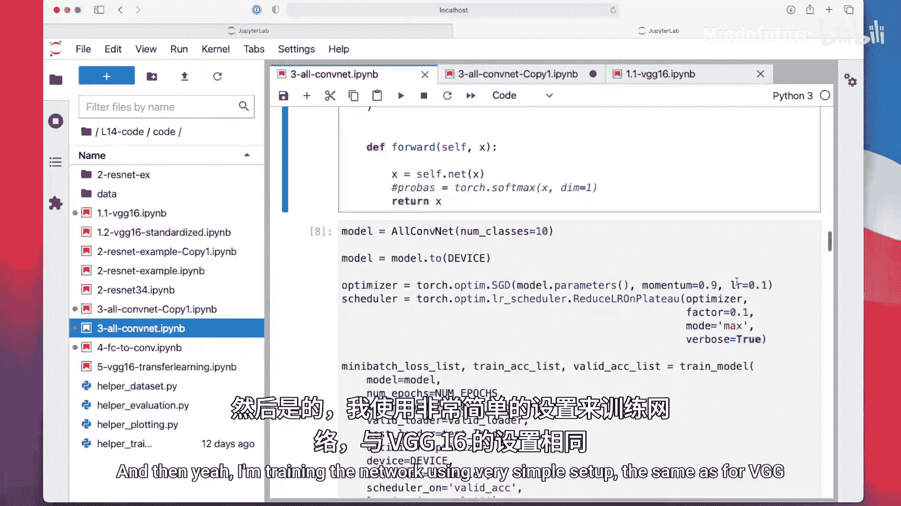
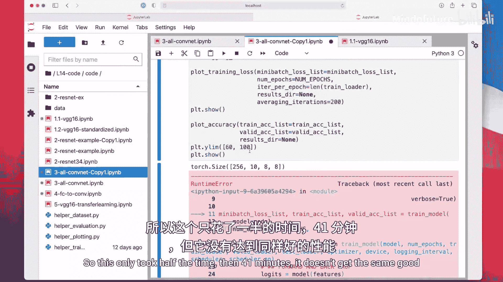
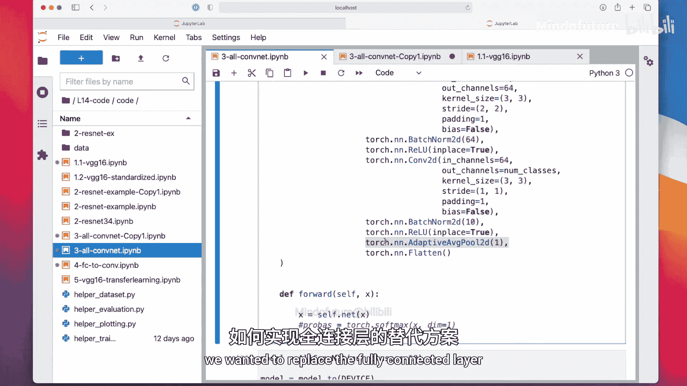

# 122：PyTorch中的全卷积网络代码示例 🧠


在本节课中，我们将学习如何在PyTorch中实现一个“全卷积网络”。这个网络架构移除了传统的最大池化层和全连接层，仅使用卷积层、ReLU激活函数和批归一化层来构建。我们将通过一个具体的代码示例来理解其实现细节。

上一节我们讨论了全卷积网络的理论概念，本节中我们来看看如何用代码实现它。

## 概述







全卷积网络的核心思想是简化网络结构。它使用步长为2的卷积层来替代最大池化层进行下采样，并使用全局平均池化层来替代最后的全连接层进行分类。这种设计减少了参数数量，并可能提高计算效率。

## 网络架构实现

以下是构建全卷积网络模型的关键代码部分。该模型专为CIFAR-10数据集设计，包含10个输出类别。

```python
import torch.nn as nn

class AllConvNet(nn.Module):
    def __init__(self, num_classes=10):
        super(AllConvNet, self).__init__()
        self.features = nn.Sequential(
            # 第一组：增加通道数，保持空间尺寸
            nn.Conv2d(3, 96, kernel_size=3, padding=1),
            nn.BatchNorm2d(96),
            nn.ReLU(inplace=True),
            nn.Conv2d(96, 96, kernel_size=3, padding=1),
            nn.BatchNorm2d(96),
            nn.ReLU(inplace=True),
            # 使用步长为2的卷积进行下采样（替代池化）
            nn.Conv2d(96, 96, kernel_size=3, stride=2, padding=1),
            nn.BatchNorm2d(96),
            nn.ReLU(inplace=True),

            # 后续层组遵循相同模式：增加通道 -> 保持 -> 下采样
            nn.Conv2d(96, 192, kernel_size=3, padding=1),
            nn.BatchNorm2d(192),
            nn.ReLU(inplace=True),
            nn.Conv2d(192, 192, kernel_size=3, padding=1),
            nn.BatchNorm2d(192),
            nn.ReLU(inplace=True),
            nn.Conv2d(192, 192, kernel_size=3, stride=2, padding=1),
            nn.BatchNorm2d(192),
            nn.ReLU(inplace=True),

            # ... 可以继续添加更多层组
            # 最后一层卷积：输出通道数等于类别数
            nn.Conv2d(192, num_classes, kernel_size=3, padding=1),
            nn.BatchNorm2d(num_classes),
            nn.ReLU(inplace=True),
        )
        # 全局平均池化层替代全连接层
        self.global_avg_pool = nn.AdaptiveAvgPool2d((1, 1))

    def forward(self, x):
        x = self.features(x)
        x = self.global_avg_pool(x)
        # 将四维张量 [batch, channels, 1, 1] 展平为二维 [batch, channels]
        x = x.view(x.size(0), -1)
        return x
```

## 关键组件解析

以下是模型中几个核心组件的详细说明。

### 1. 使用卷积进行下采样
在传统网络中，最大池化层（如 `nn.MaxPool2d(2,2)`）常用于减少特征图的高度和宽度。在全卷积网络中，我们使用**步长为2的卷积层**来实现相同的效果。
**公式/代码表示**：`nn.Conv2d(in_channels, out_channels, kernel_size=3, stride=2, padding=1)`
当 `stride=2` 时，输出特征图的空间尺寸（高和宽）将减半。



### 2. 保持尺寸的卷积
为了在增加通道数的同时保持特征图尺寸不变，我们使用**填充为1的3x3卷积**。
**公式/代码表示**：`nn.Conv2d(in_channels, out_channels, kernel_size=3, padding=1)`
`padding=1` 确保了输入和输出的高度与宽度相等。


### 3. 全局平均池化替代全连接层
网络末端不再使用全连接层，而是使用**全局平均池化**。它对每个通道的整个特征图取平均值，得到一个 `[channels]` 维的向量，直接用于分类。
在PyTorch中，可以使用 `nn.AdaptiveAvgPool2d((1,1))` 实现，其效果等同于全局平均池化。

## 训练与性能

该模型的训练设置与VGG16等网络类似。由于结构更简单、参数更少，其训练时间通常更短。
*   **训练时间**：在本例的CIFAR-10数据集上，全卷积网络训练耗时约41分钟，而类似的VGG16网络需要约90分钟。
*   **模型性能**：全卷积网络的测试准确率约为80%，略低于VGG16的84-85%。这体现了在效率与精度之间的权衡。











## 总结

本节课中我们一起学习了全卷积网络的PyTorch实现。我们了解到：
1.  全卷积网络通过**步长为2的卷积层**替代最大池化层进行下采样。
2.  它使用**全局平均池化层**（`nn.AdaptiveAvgPool2d(1)`）替代末端的全连接层进行分类。
3.  这种设计简化了网络结构，减少了参数量，从而**提升了训练和推理的计算效率**，尽管有时会以轻微的性能下降为代价。
4.  批归一化层（`nn.BatchNorm2d`）的加入有助于稳定训练并提升效果。



这种“全卷积”的设计思想在现代网络架构中非常流行，为构建更高效、更灵活的模型提供了基础。在下一节，我们将探讨如何用带参数的卷积层来等价地替换全连接层。