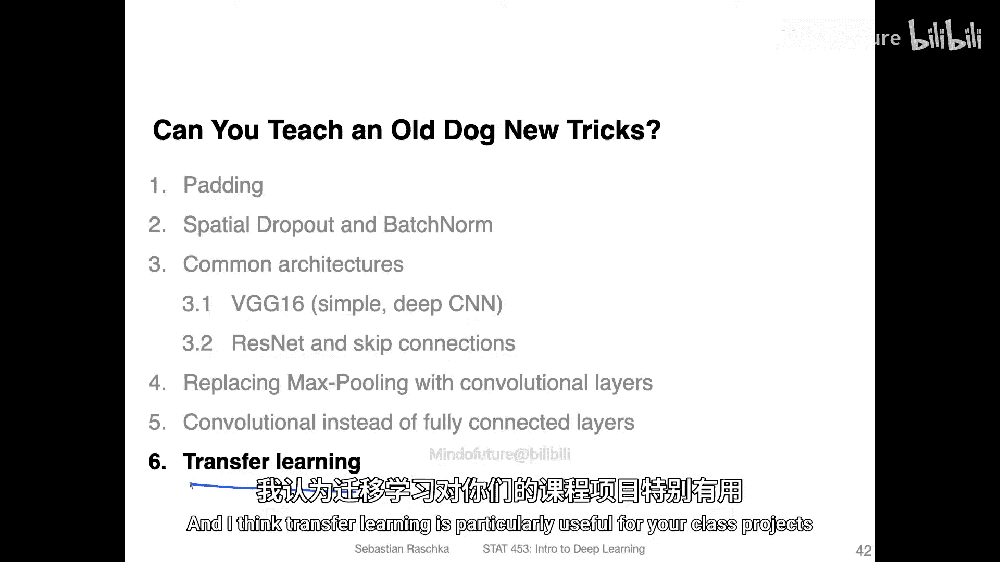
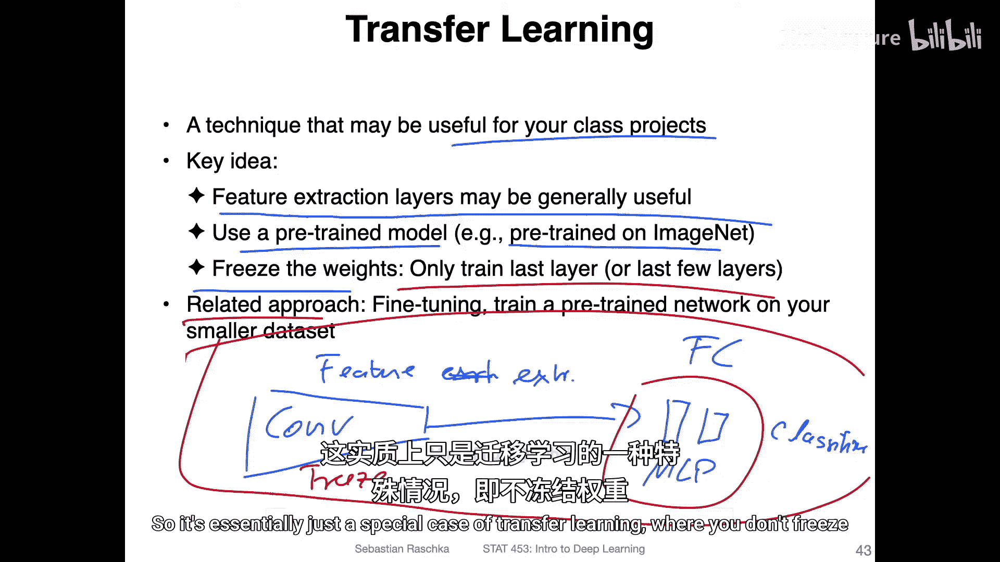
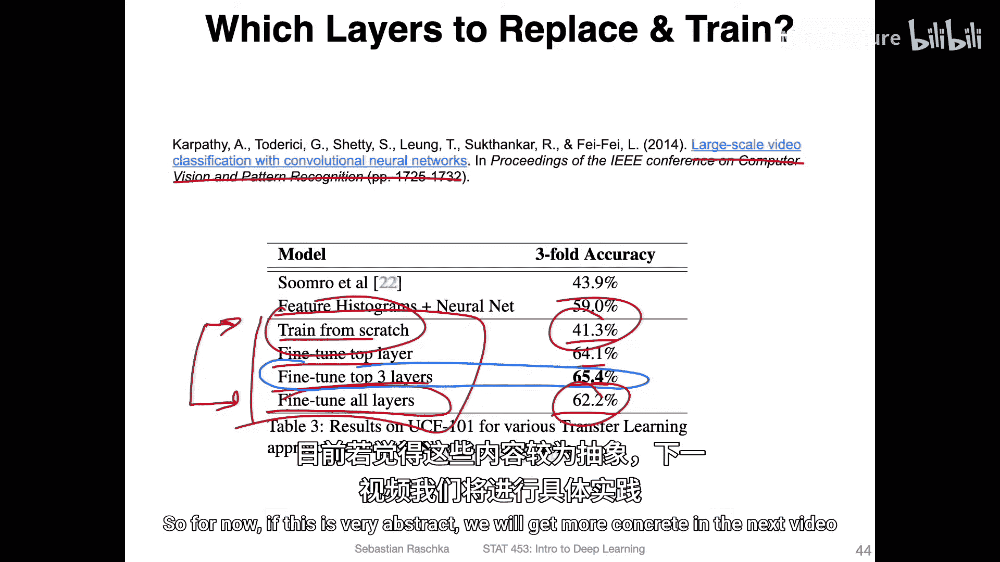
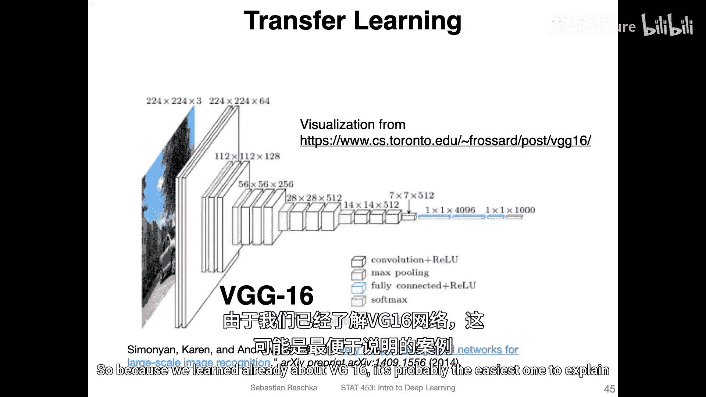
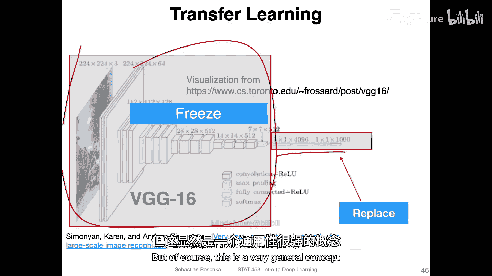
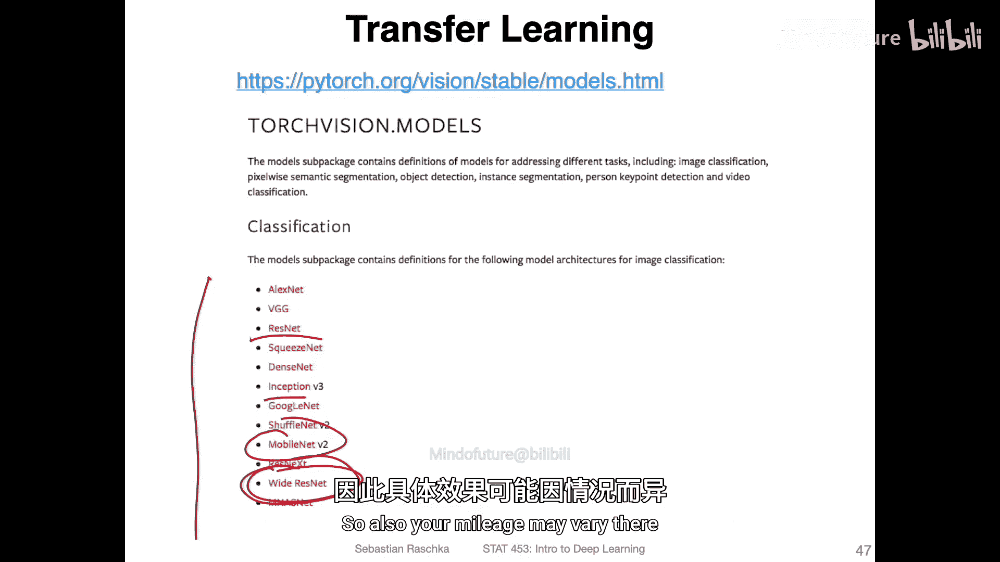
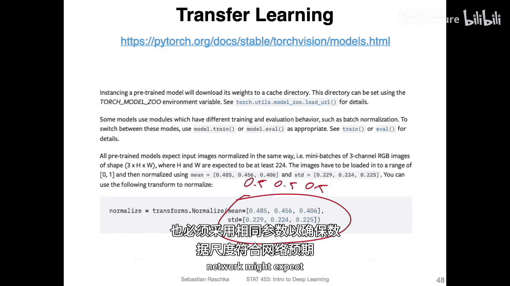
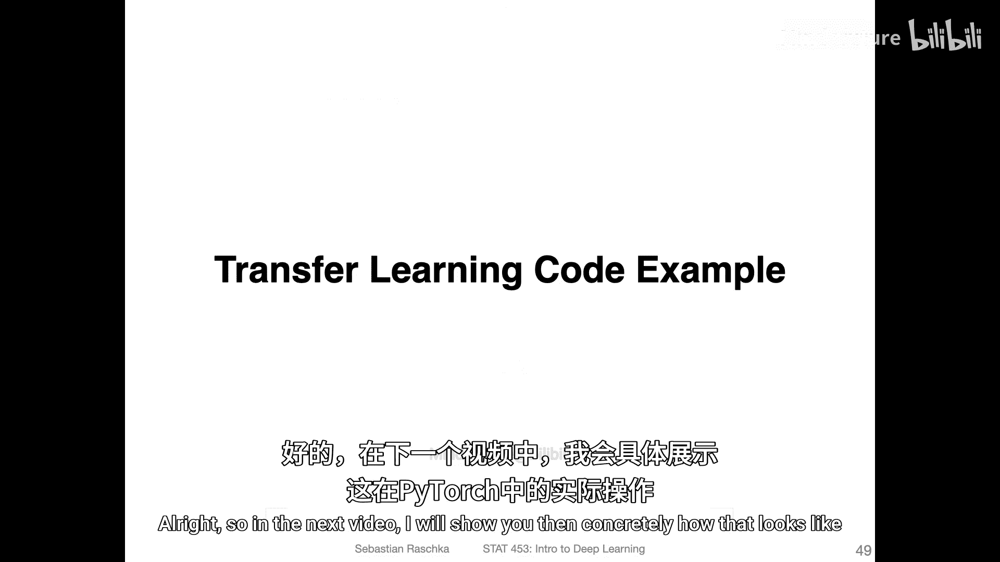

# 124：迁移学习 🚀

在本节课中，我们将要学习迁移学习的概念、原理及其在卷积神经网络中的应用。迁移学习是一种强大的技术，它允许我们利用在大型数据集上预训练的模型来解决我们自己的、数据量可能较小的特定任务。



## 概述

所有优秀的课程和讲座都有结束的时候。这是关于卷积神经网络架构系列的最后一个主题。虽然迁移学习并非卷积网络特有的主题，但现在讨论它正合时宜，因为目前有许多优秀的预训练计算机视觉模型可供使用。迁移学习对于课程项目尤其有用。

## 核心概念

迁移学习的关键思想在于，卷积神经网络通常由两部分组成：

1.  **特征提取部分**：由卷积层构成，用于自动学习输入数据的特征。
2.  **分类器部分**：通常由全连接层（或称线性层、多层感知机）构成，用于最终的分类或回归任务。

迁移学习的核心假设是：在大型数据集（如ImageNet）上训练得到的特征提取器，其学到的通用特征可能对其他相关任务也有用。因此，我们可以冻结预训练模型的卷积层权重，只针对自己的小数据集训练和调整最后的全连接层。



**公式/代码示意**：
```
模型 = 预训练的特征提取器（冻结权重） + 自定义的分类器（可训练权重）
```

## 迁移学习的策略

上一节我们介绍了迁移学习的基本思想，本节中我们来看看具体的实施策略。研究人员在实践中探索了多种方法，以下是一些常见的策略及其效果对比：

*   **从头开始训练**：不使用预训练模型，完全在自己的数据集上训练网络。在一项实验中，这种方法取得了41%的准确率。
*   **仅微调最后一层**：使用在大型数据集上预训练的模型，但只训练（微调）网络的最后一层（输出层）。实验显示准确率提升至64%。
*   **微调最后三层**：微调网络最后的三个层。在上述实验中，这种方法取得了最佳效果，准确率达到65%。
*   **微调所有层**：解冻并训练整个网络的所有层。实验准确率为62%。



需要注意的是，微调多少层能达到最佳效果并非固定不变，它取决于网络架构、数据集等多种因素。因此，**“微调多少层”本身也是一个需要调整的超参数**。但一个普遍结论是：使用预训练模型并进行微调，其性能通常远优于完全从头开始训练。



## 实践示例：使用VGG16

如果上述内容听起来有些抽象，不用担心。在下一个视频中，我们将通过具体代码使其变得清晰。我们将以VGG16模型为例进行演示，因为它结构清晰，易于解释。

我们将执行以下步骤：
1.  加载在ImageNet上预训练的VGG16模型。
2.  **冻结其所有卷积层**的权重，使其在后续训练中保持不变。
3.  **替换掉模型原有的全连接输出层**，以适应我们新数据集的类别数（例如CIFAR-10的10个类别）。
4.  在新数据集（为简化代码，我们使用内置的CIFAR-10数据集）上，仅训练我们新添加的分类器层。



这是一个通用概念，你可以将其应用于任何自定义数据集。

## 其他可用模型与注意事项



除了VGG16，PyTorch等框架还提供了许多其他预训练模型。VGG16性能并非最优，且计算成本较高。对于课程项目，你可以考虑以下模型：
*   **Wide ResNet** 和 **Inception v3**：通常能提供更好的性能，但运行速度较慢。
*   **MobileNet**：在保持良好性能的同时，速度较快。
*   **ResNet**：一个非常流行且强大的基准模型。

**重要警告**：当你使用他人提供的预训练模型时，必须确保你的数据预处理方式与模型训练时保持一致。例如，许多在ImageNet上预训练的模型要求输入数据使用特定的均值和标准差进行归一化。在PyTorch中，常见的ImageNet归一化参数是：
```
mean = [0.485, 0.456, 0.406]
std = [0.229, 0.224, 0.225]
```
使用错误的归一化参数会导致模型性能下降，因为输入数据的尺度与网络预期不符。

## 总结





本节课中我们一起学习了迁移学习。我们了解到，迁移学习通过利用在大规模数据集上预训练模型的特征提取能力，可以显著提升我们在小数据集上的任务性能。关键步骤包括：选择合适的预训练模型、冻结特征提取层、替换并训练新的分类器层，并确保数据预处理的一致性。在接下来的实践中，我们将具体实现这一流程。