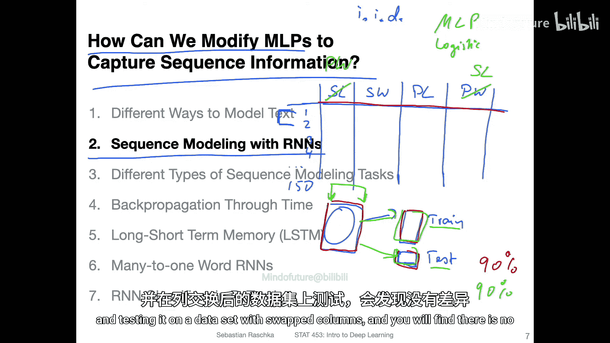
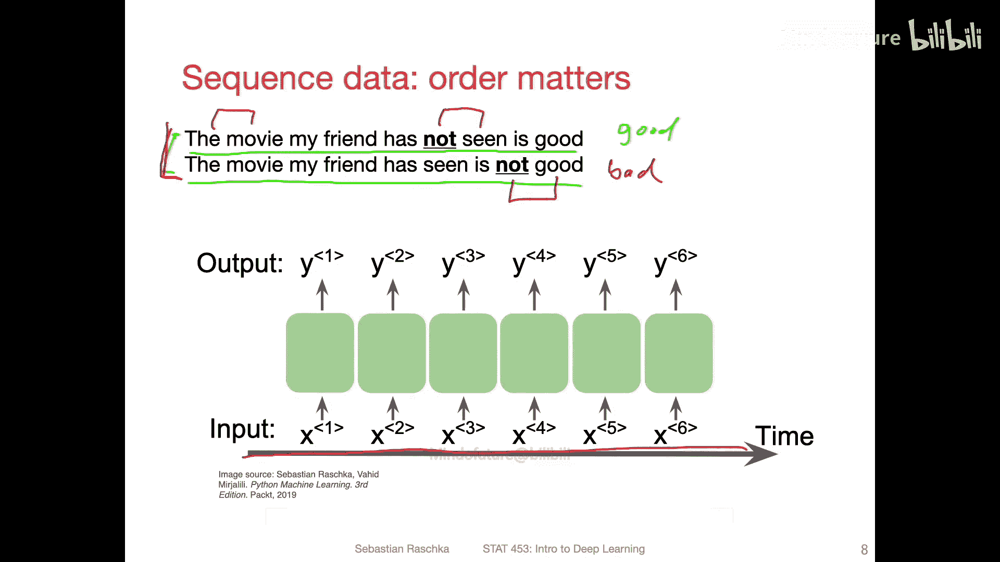
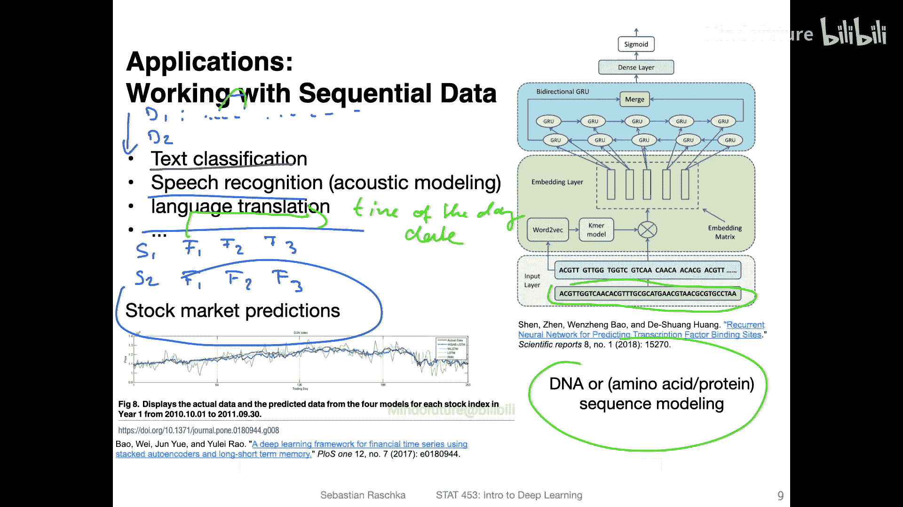
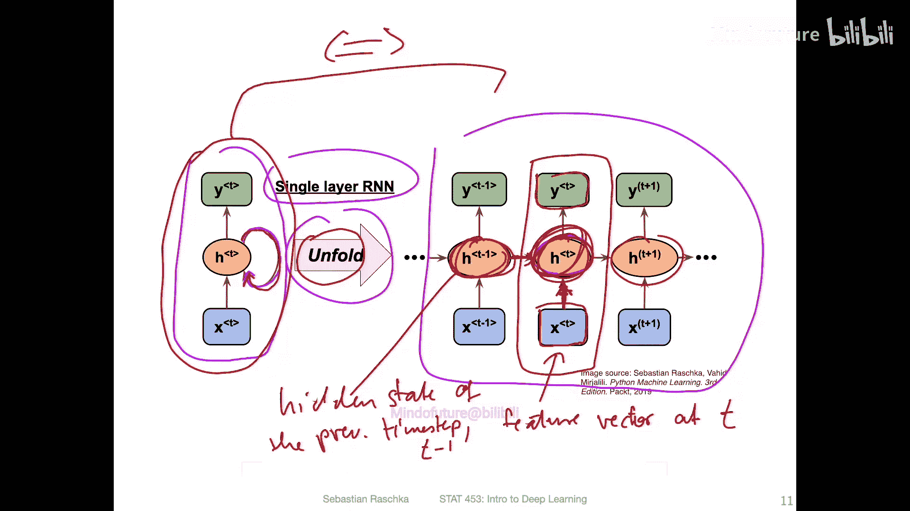
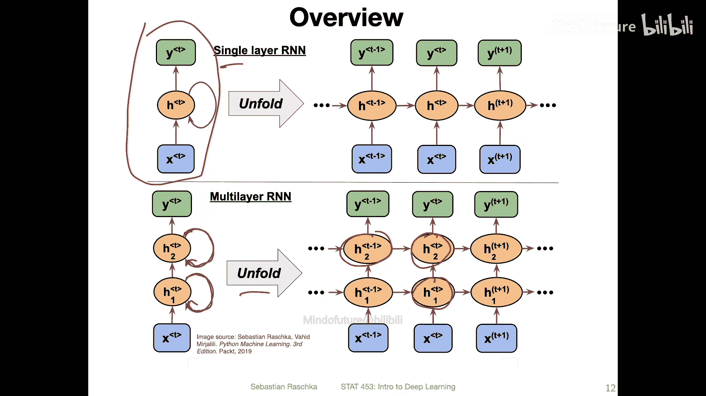
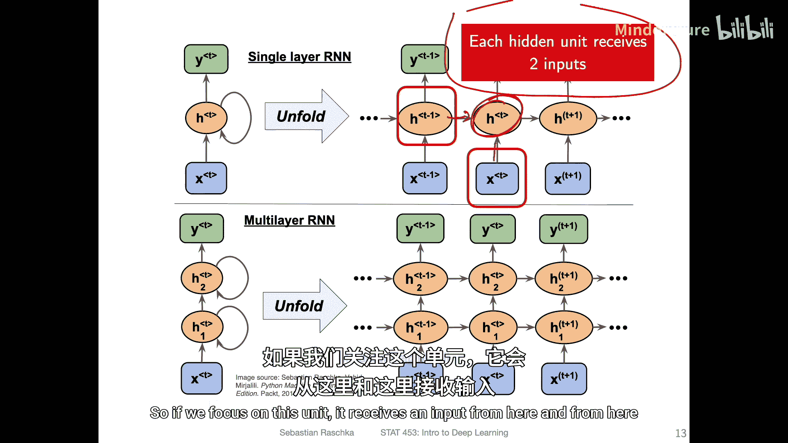
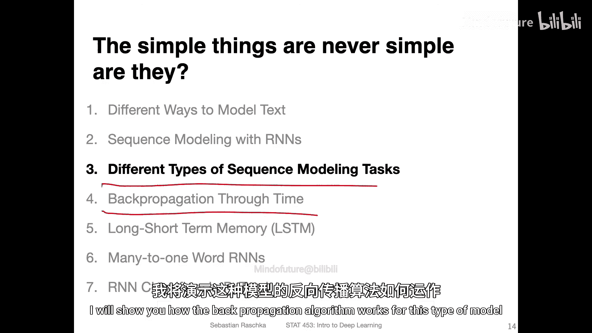

# 128：使用RNN进行序列建模 🧠

在本节课中，我们将学习如何修改多层感知机（MLP）以捕获序列信息。具体来说，我们将探讨如何使用循环神经网络（RNN）进行序列建模。

## 模型是否使用了序列信息？

在深入RNN之前，我们先思考一个问题：如何判断一个模型是否已经使用了序列信息？例如，逻辑回归或多层感知机这类模型，它们真的利用了序列信息吗？

答案是否定的。有两种类型的序列信息可能编码在我们的训练集中：一种是跨训练样本轴，另一种是跨特征轴。为了说明这一点，让我们回顾一下经典的Iris数据集。

在Iris数据集中，我们有四个特征：花萼长度、花萼宽度、花瓣长度和花瓣宽度。这是一个表格数据集，包含150个样本。

### 跨训练样本轴的序列信息

假设你将数据集分割为训练集和测试集。在评估模型时，你可以打乱测试集中的所有记录顺序。如果你使用的是多层感知机或逻辑回归模型，无论测试集是否被打乱，模型的性能应该完全相同。这是因为这类模型将数据视为**独立同分布**（IID）的。每个训练记录都是独立采样的，并且来自相同的分布（例如，鸢尾花的分布）。因此，它们不利用样本之间的顺序信息。

### 跨特征轴的序列信息

另一种序列信息可能编码在特征本身的顺序中。例如，在原始Iris数据集中，特征的顺序是固定的。如果你训练一个模型并得到90%的准确率，然后交换其中两列（例如，将花萼长度和花瓣宽度互换），使用相同的数据分割方式重新训练和测试模型，你应该得到完全相同的90%准确率。这是因为多层感知机和逻辑回归模型将特征视为独立的，它们不关心特征出现的特定顺序。你可以通过交换列并重新训练模型来验证这一点，结果不会有差异。

## 词袋模型的局限性

然而，忽略序列信息在某些情况下会带来问题。回想一下词袋模型。词袋模型有一个词汇表，但它本质上丢弃了每个训练样本（即特征向量）中单词的顺序信息。

考虑以下两个句子：
1.  “The movie my friend has not seen is good.” （我朋友没看过的那部电影很好。）
2.  “The movie my friend has seen is not good.” （我朋友看过的那部电影不好。）

这两个句子含义截然不同。第一个句子表示朋友没看过一部好电影，第二个句子表示朋友看过一部不好的电影。但是，如果我们使用基于词频的词袋模型，这两个句子会产生完全相同的特征向量，因为单词“not”和“good”的出现次数相同，但顺序不同。在这里，单词的**顺序信息**至关重要，而词袋模型丢失了这一点。

循环神经网络可以帮助我们捕获这种顺序信息。

## 序列数据的例子

以下是几个序列数据的例子：

*   **文本分类**：这是我们本节课后半部分将重点关注的例子，届时会展示一个PyTorch实例。在文本数据集中，时间维度是单词的顺序。每个文档（例如D1， D2）是一个训练样本，而每个文档本身是一系列单词。
*   **语音识别**：处理一系列声音信号。
*   **机器翻译**：将一个语言序列翻译成另一个语言序列。
*   **股票市场预测**：一个常见且热门的问题。在这里，每只股票可以看作一个数据点（训练样本）。时间维度是实际的时间（如日期）。每个时间步的特征向量可能包含价格、市场情绪或新闻信息等。
*   **DNA序列建模**：与文本类似，但序列由字符（核苷酸）组成。

## 循环神经网络（RNN）的结构

前面我们讨论的都是**前馈神经网络**，例如多层感知机、卷积网络和逻辑回归。它们通常有一个输入特征向量x，经过一些隐藏层，然后产生输出。

现在，在循环神经网络的设置中，关键新增了一个**循环边**。

在新的结构中，我们有一个时间步T。在时间步T，我们得到一个特征向量，将其输入到隐藏状态，然后产生一个输出。此外，这个隐藏层不仅接收当前时间步的输入，还接收来自**前一个时间步**（例如T-1）的信息。这使得网络能够感知序列的顺序。

更清晰的展示方式是将其**展开**，这也是通常的实现方式。下图展示了一个单层RNN的展开状态，它等价于左侧带有循环边的紧凑表示。

让我们聚焦于中心的时间步T。它接收两个输入：
1.  当前时间步的特征向量 `x_t`。
2.  前一个时间步的隐藏状态 `h_{t-1}`。

它结合这两个输入，产生当前时间步的隐藏状态 `h_t`，进而产生输出 `o_t`。然后，`h_t` 会被传递到下一个时间步T+1，如此循环。这种结构允许网络记住过去的信息，从而理解序列的顺序。

## 多层循环神经网络

上一节我们介绍了单层循环神经网络，当然我们也可以将这个概念扩展到多层循环神经网络。下图展示了一个两层RNN的展开结构。

同样的原理适用：对于每个隐藏层，都有一个循环边。当展开时，你可以看到，第二层的隐藏单元在时间步T接收两个输入：
1.  同一时间步中，来自前一层（第一层）的隐藏状态。
2.  同一层（第二层）中，来自前一个时间步（T-1）的隐藏状态。

为了再次强调，下图突出显示了一个特定的隐藏单元，它接收来自两个方向的输入。

## 总结与预告

本节课我们一起学习了循环神经网络的基本结构。我们了解到，RNN通过引入循环连接和隐藏状态，能够处理并记忆序列中的顺序信息，从而解决了像词袋模型那样忽略词序的问题。

在接下来的视频中，我将展示如何使用这种架构处理不同类型的序列建模任务。在那之后，我会详细讲解适用于这类模型的**反向传播算法**是如何工作的。

