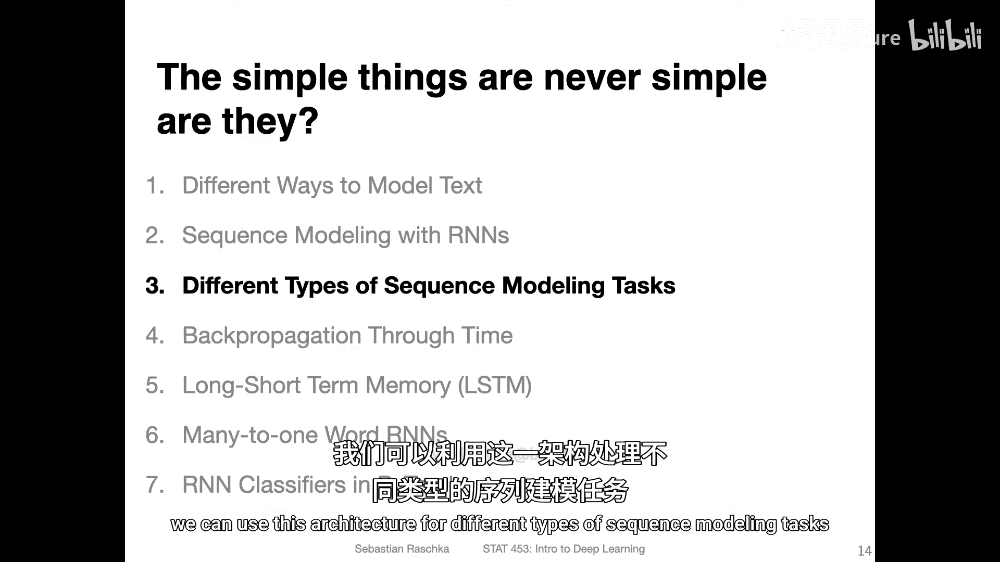
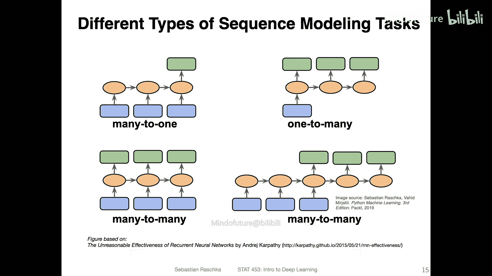
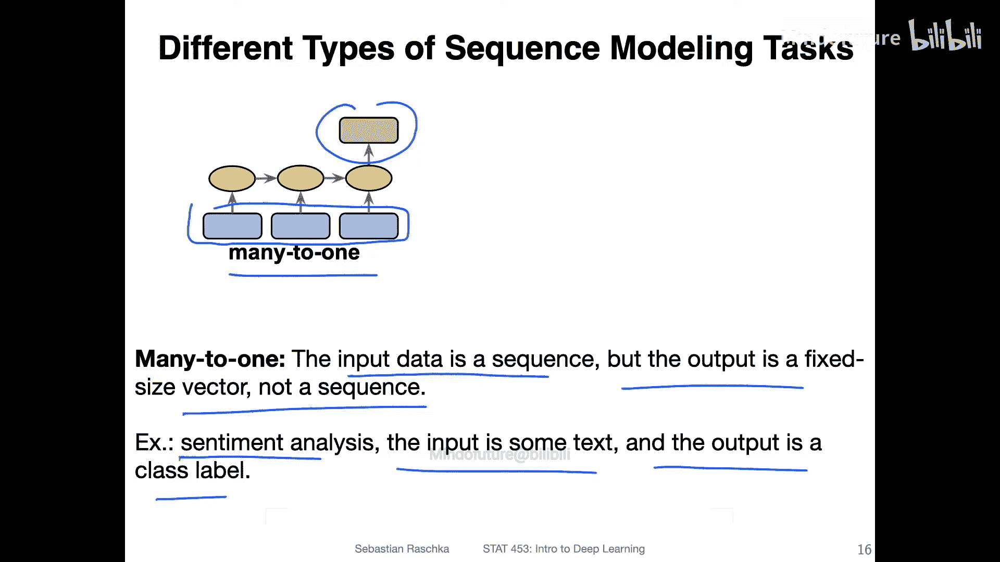
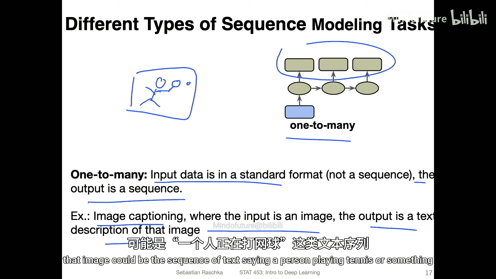
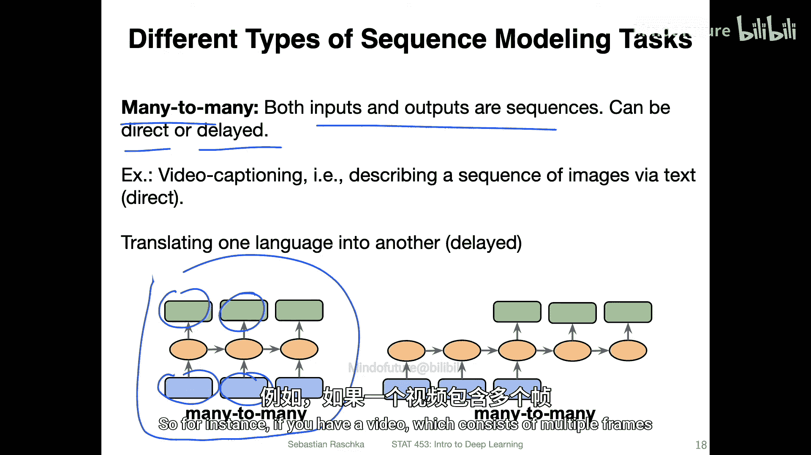
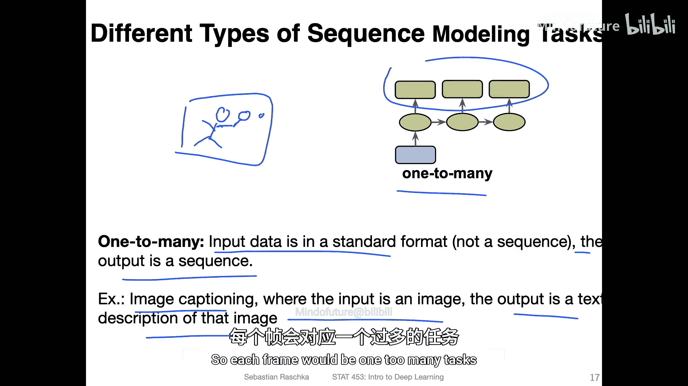
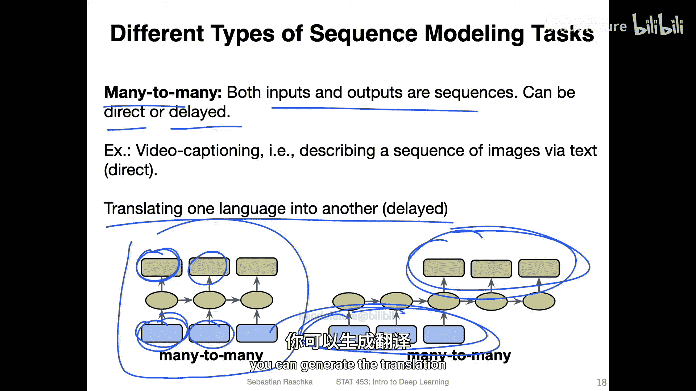
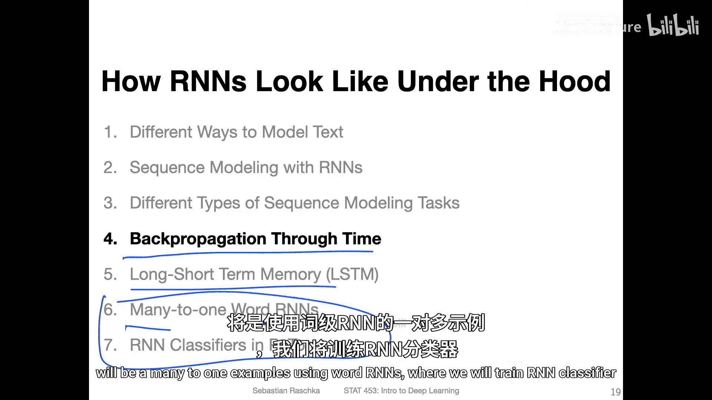
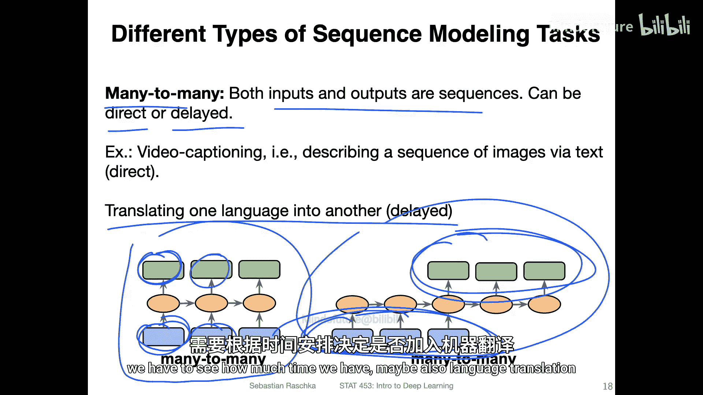
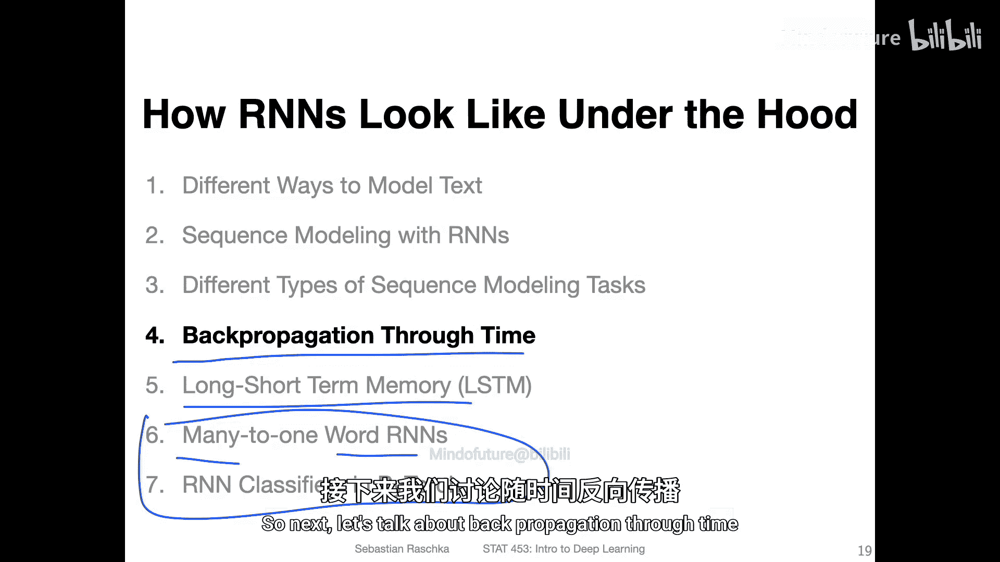

# 129：不同类型的序列建模任务 🧠

在本节课中，我们将学习循环神经网络可以处理的不同类型的序列建模任务。我们将逐一探讨四种常见的任务模式，并理解它们各自的输入输出结构。

上一节我们介绍了循环神经网络的基本架构概览。本节中，我们来看看如何将这种架构应用于不同类型的序列建模任务。

以下是四种常见的序列建模任务概述，我们将在接下来的内容中逐步讲解。

## 多对一任务

多对一任务是指输入数据是一个序列，但输出是一个固定大小的向量或值，而非序列。

一个典型的例子是**情感分析**。输入可以是一段文本，输出则是一个类别标签，用于判断文本的情感是积极的还是消极的。例如，回想之前提到的电影评论例子，每条输入可以是一篇书面影评，而输出则是判断该影评对电影的评价是正面还是负面。

## 一对多任务

一对多任务是另一种序列建模任务，它有时会超越标准RNN的范畴，常与卷积神经网络结合使用。当然，将两种网络结合起来也是完全可行的。

在这种任务中，输入数据是标准输入（例如一张图片），而输出则是一个序列。一个典型的例子是**图像描述**。输入是一张图片，输出则是描述该图片的文本序列。例如，一张有人打网球的图片，其描述可能是“一个人正在打网球”这样的文本序列。

## 多对多任务

多对多任务中，输入和输出都是序列。这种任务实际上有两种形式。

第一种是**直接对应**的多对多任务。在这种设置中，序列中的每个输入元素都直接对应一个输出元素。例如，**视频描述**任务：一个视频由多帧图像组成，每一帧图像（输入）都生成一个对应的描述（输出）。如果将视频视为一个整体，那么为每一帧生成描述就构成了一个多对多任务。

第二种是**延迟对应**的多对多任务。一个典型的例子是**机器翻译**，例如将英语句子翻译成德语。这种任务不适合直接对应的设置，因为我们不希望逐词翻译。如果只是简单地使用词典逐词翻译，通常无法得到通顺的结果，因为不同语言有不同的语法规则。因此，模型需要先读取整个输入句子，理解其含义后，再生成完整的翻译输出。

---

以上是对不同序列建模任务的快速概述。在下一节视频中，我们将学习**随时间反向传播**，这是循环神经网络中学习参数的方法。之后，我们将探讨对标准循环神经网络设置的改进，并查看一些具体例子。这些例子将主要是使用词级RNN的多对一任务，例如训练一个RNN分类器。在本课程后期，我们计划涉及文本生成，或许还有机器翻译，具体取决于课程进度安排。

那么，接下来让我们开始讨论随时间反向传播。

---

**本节课总结**：本节课我们一起学习了循环神经网络能够处理的四种主要序列建模任务：**多对一**（如情感分析）、**一对多**（如图像描述）、**直接对应的多对多**（如视频描述）以及**延迟对应的多对多**（如机器翻译）。理解这些任务模式是应用RNN解决实际问题的基础。