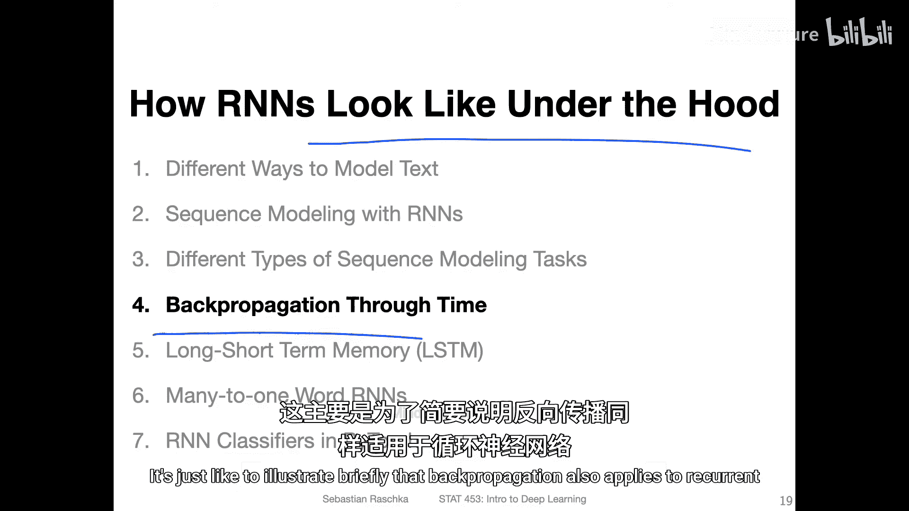
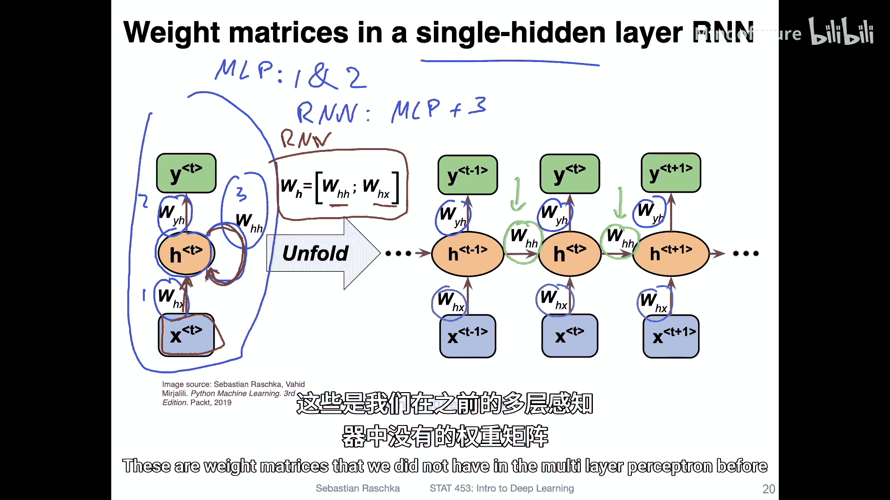
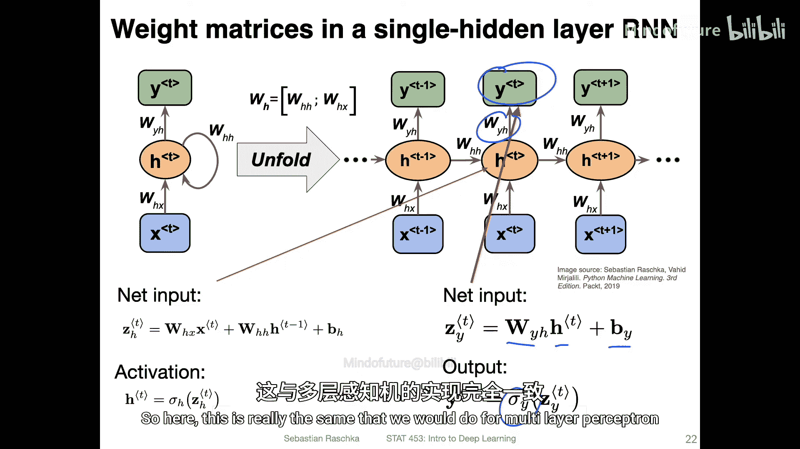
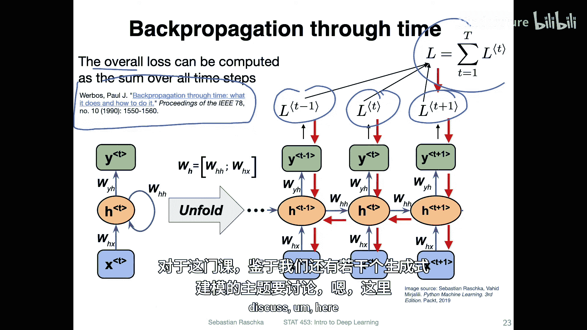
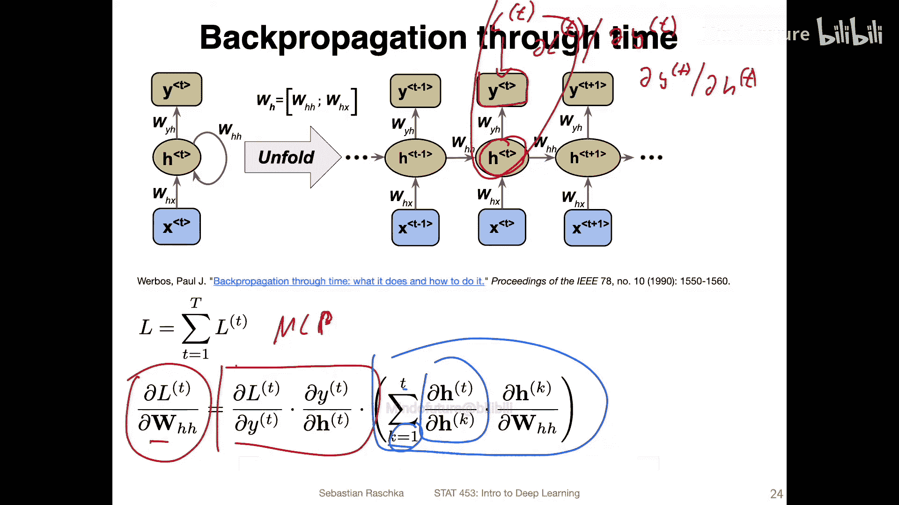
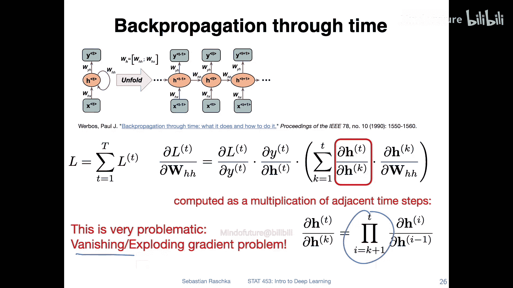

# 130：随时间反向传播概述 🔄

在本节课中，我们将深入探讨循环神经网络的核心训练算法——随时间反向传播。我们将了解其基本工作原理，并认识它与标准反向传播的主要区别。

## 网络结构与权重矩阵

上一节我们介绍了循环神经网络的基本概念，本节中我们来看看其内部的具体计算结构。

下图展示了一个单隐藏层的循环神经网络。左侧是紧凑表示法，右侧是沿时间轴展开的版本。与之前的多层感知机相比，循环神经网络引入了新的权重连接。

以下是网络中涉及的三个主要权重矩阵：

*   **权重矩阵 1 (W_xh)**：连接输入层到当前隐藏层。
*   **权重矩阵 2 (W_hy)**：连接当前隐藏层到输出层。
*   **权重矩阵 3 (W_hh)**：连接前一个时间步的隐藏层到当前时间步的隐藏层。这是循环神经网络特有的部分。

在展开的视图中，关键点在于**所有时间步共享相同的权重矩阵**。这意味着 `W_xh`、`W_hy` 和 `W_hh` 在每个时间步都被重复使用。

## 前向传播计算

了解了网络结构后，我们来看看信息是如何在网络中前向流动的。

### 隐藏状态的计算

在时间步 `t`，隐藏状态 `h_t` 的净输入由两部分组成：当前输入 `x_t` 和前一时刻的隐藏状态 `h_{t-1}`。

其计算公式如下：
`net_h_t = W_xh * x_t + W_hh * h_{t-1} + b_h`

其中：
*   `W_xh * x_t` 是当前输入对隐藏状态的贡献。
*   `W_hh * h_{t-1}` 是历史信息（前一隐藏状态）对当前状态的贡献。
*   `b_h` 是隐藏层的偏置项。

得到净输入后，我们通过一个激活函数（如 `tanh`、`sigmoid` 或 `ReLU`）来获得最终的激活值：
`h_t = activation_function(net_h_t)`

### 输出层的计算

输出层 `y_t` 的计算方式与标准多层感知机完全相同：
`y_t = activation_output(W_hy * h_t + b_y)`

根据任务类型（分类、回归等），输出层的激活函数可以是 `softmax`、`sigmoid` 或线性函数。

## 损失函数

损失函数的定义取决于具体的序列建模任务。

*   **“多对一”任务**（如文本分类）：通常只使用最后一个时间步的输出来计算一个总损失。
*   **“多对多”任务**（如序列标注、语言建模）：通常在每个时间步都会产生一个输出，因此每个时间步都可以计算一个损失 `L_t`。

在“多对多”的通用情况下，总损失是各个时间步损失之和：
`L_total = sum(L_t for t in 1 to T)`
保留中间损失有助于更好地训练网络早期的层。

## 随时间反向传播与梯度问题

现在，我们进入核心部分，看看误差是如何沿着时间反向传播的。

随时间反向传播本质上是标准反向传播算法在时间维度上的扩展。其核心思想是：将循环网络按时间展开后，视为一个非常深的前馈网络，然后应用标准反向传播。

计算损失 `L_t` 对循环权重 `W_hh` 的梯度时，情况变得复杂。因为 `h_t` 依赖于 `h_{t-1}`，而 `h_{t-1}` 又依赖于 `h_{t-2}`，如此递归。因此，梯度计算涉及一个沿时间回溯的链式法则：

`∂L_t / ∂W_hh = sum( ∂L_t/∂h_t * ∂h_t/∂h_k * ∂h_k/∂W_hh )`，其中 `k` 从 1 到 `t`。

问题就出在 `∂h_t/∂h_k` 这一项上，它本身是多个雅可比矩阵的连乘积：
`∂h_t/∂h_k = ∏ (∂h_i/∂h_{i-1})`，`i` 从 `k+1` 到 `t`。

当时间步 `t` 很大（序列很长）时，这个连乘会导致严重问题：
*   如果乘积中的因子持续小于1，梯度会指数级缩小到近乎为零，导致**梯度消失**，网络早期层无法更新。
*   如果乘积中的因子持续大于1，梯度会指数级增长到巨大数值，导致**梯度爆炸**，参数更新不稳定，网络无法收敛。

## 总结与展望

本节课中我们一起学习了随时间反向传播的基本原理。我们了解到：
1.  BPTT是标准反向传播在循环网络时间维度上的应用。
2.  循环网络通过共享的权重矩阵 `W_hh` 在时间步之间传递信息。
3.  在计算梯度时，需要通过链式法则沿时间回溯，这导致了梯度的连乘。
4.  长序列上的连乘是造成**梯度消失**和**梯度爆炸**问题的根本原因，这使得训练基本的循环神经网络处理长程依赖关系非常困难。

正因为存在这些问题，研究者们提出了更复杂的循环单元结构，如下一节将要介绍的**长短期记忆网络**，它通过引入门控机制，专门设计用来缓解梯度消失和爆炸问题，从而更好地学习长序列中的依赖关系。

