# 131：长短期记忆网络 (LSTM) 🧠

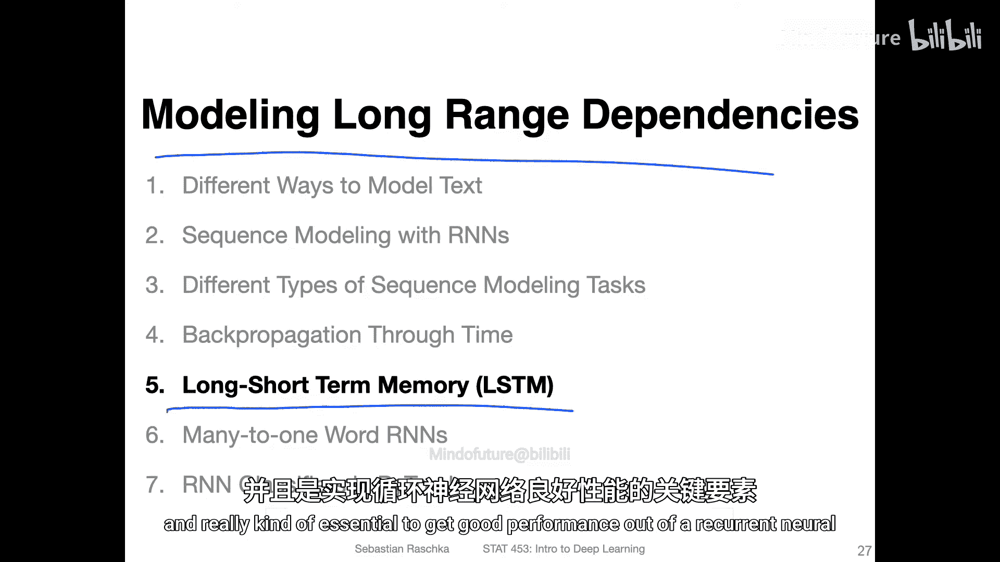

在本节课中，我们将要学习一种称为**长短期记忆网络 (LSTM)** 的模型。它是循环神经网络 (RNN) 的一种改进版本，专门用于建模序列数据中的**长程依赖关系**。对于处理较长的序列数据，LSTM 至关重要，能显著提升循环神经网络的性能。

## 应对梯度问题的技术回顾

上一节我们介绍了循环神经网络的基本结构及其面临的梯度消失/爆炸问题。本节中，我们来看看专门为解决这些问题而设计的 LSTM 单元。在此之前，我们先回顾一下深度学习中应对梯度问题的常见技术。

在多层感知机 (MLP) 中，我们曾讨论过使用 ReLU 激活函数替代 Sigmoid 或 Tanh 函数，以缓解梯度消失问题。然而，即使使用 ReLU，构建超过一两层的深层 MLP 在实践中仍然困难。例如，在作业中尝试构建四五层的 MLP，其效果可能依然不佳，这通常还是因为梯度消失问题。

另一种略有帮助的技术是**批量归一化 (Batch Normalization)**。有了批量归一化，你或许可以构建三层甚至四层的 MLP，但效果仍不理想。

在更简单的卷积神经网络 (CNN) 中，我们发现增加层数是可行的，例如 16 层的 VGG16 网络。但当层数超过 16 层时，即使有批量归一化，效果也会下降。这时，我们需要引入另一种技巧——**跳跃连接 (Skip Connections)**。在残差网络 (ResNet) 中，跳跃连接帮助我们成功构建了超过 30、50 甚至 100 层的网络。

以上这些技巧主要解决的是网络**深度**（层数）带来的梯度问题。而在循环神经网络的设置中，我们还需要考虑**时间步**的维度。正如上一节视频所示，在计算梯度时会涉及连乘运算，这可能在时间维度上引发另一层面的梯度消失或爆炸问题。

以下是三种处理循环神经网络中梯度问题的技术：

*   **梯度裁剪 (Gradient Clipping)**：这是一种简单且广泛使用的技术。它本质上为梯度设置一个最大或最小截断值。例如，我们可以规定梯度绝对值不能超过 2。这样就能手动裁剪梯度，避免极端的参数更新。
*   **沿时间截断的反向传播 (Truncated Backpropagation Through Time, TBPTT)**：这是一种限制反向传播时时间步数量的简单技术。对于长序列，在前向传播时可以使用整个序列。但在反向传播更新隐藏层参数时，可能只回溯最后 20 个时间步，而不是整个序列。这种方法可能效果不错。
*   **长短期记忆网络 (Long Short-Term Memory, LSTM)**：这是一种更好的处理长序列的方法。它使用一个**记忆单元 (Memory Cell)** 来建模长程依赖，从而避免梯度消失问题。这个概念源于 1997 年一篇非常有影响力的论文。

此外，还有一种称为**门控循环单元 (Gated Recurrent Unit, GRU)** 的变体，它是 LSTM 的一种简化版本。LSTM 和 GRU 的性能大致相当，在不同问题上各有优劣，没有哪一种绝对更好。选择使用 LSTM 还是 GRU 可以被视为一个需要研究的超参数。目前，LSTM 单元仍然比 GRU 更流行、使用更广泛。本节课我们将重点讨论 LSTM 单元，并在后续使用 PyTorch 实现它。

接下来的内容可能看起来非常复杂。如果你不能完全理解，请不要过于担心。本课程旨在提供一个大致的概览，这仍然是一门入门课程。大多数人都觉得 LSTM 单元很复杂。如果你想深入学习，可能需要花费数周或数月的时间阅读论文并尝试从头实现。所以，看到接下来的几张幻灯片时，请不要感到恐慌。它看起来比实际更复杂，如果你没有完全理解，也完全不是你的问题，因为这本身就是一个复杂的主题。

## LSTM 单元结构详解

下图展示了 LSTM 单元的结构。其中发生了很多运算，在接下来的几张幻灯片中，我们将逐步解析。

在解释所有字母和符号之前，我们先明确 LSTM 单元的位置。实际上，你会将这个 LSTM 单元放在循环神经网络隐藏层的中心。例如，如果我们聚焦于某个特定时间步，你会将 LSTM 单元置于该时间步的隐藏层位置，取代常规的隐藏状态计算。如果你有一个多层 RNN，你也可以堆叠多个 LSTM 单元。

现在，让我们看看它如何连接。图中蓝色的 `h_{t-1}` 代表来自**上一个时间步的隐藏状态**。这是 LSTM 的输入之一，类似于普通 RNN。

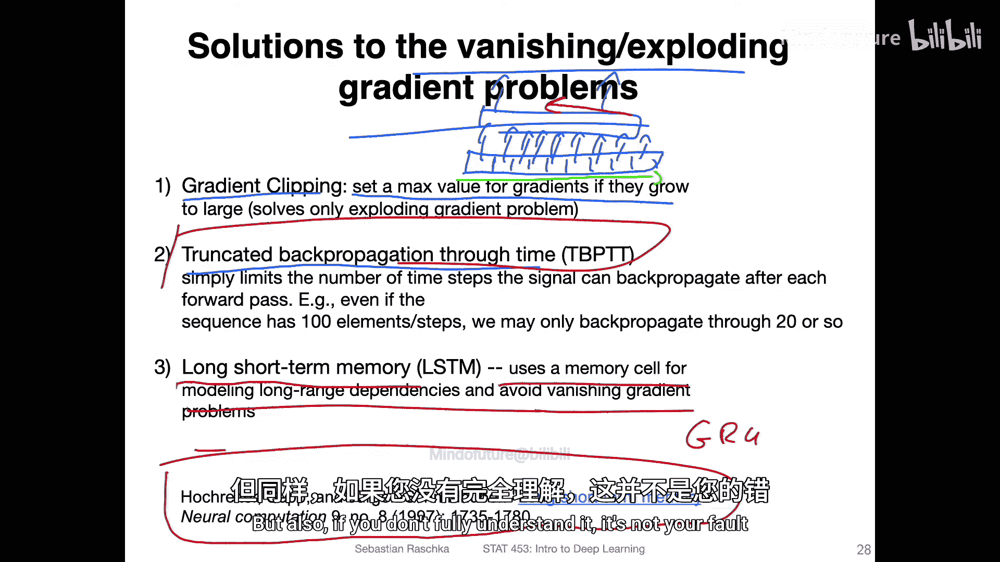

图中还引入了一个新概念：**细胞状态 (Cell State)**，用 `C_{t-1}` 表示。我们将在后续详细解释。

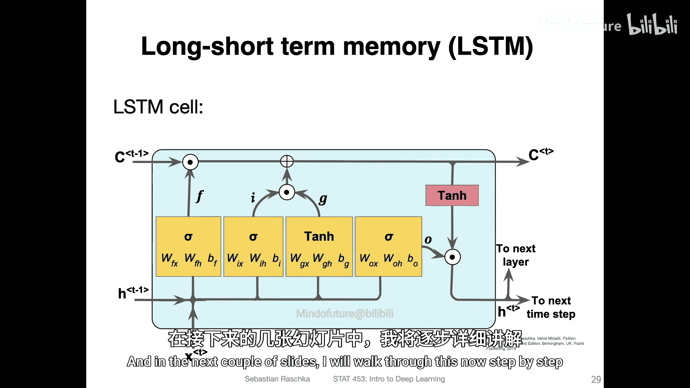

绿色的 `h_t` 将是**传递给下一个时间步的输出**（隐藏状态）。

而粉紫色（或紫色）的 `h_t` 将是**传递给下一层神经网络（如果有多层的话）的输出**。

你可以看到，这个红色的 LSTM 单元完美地嵌入到了 RNN 的结构中。我们正是用这个 LSTM 记忆单元替代了常规的隐藏层。

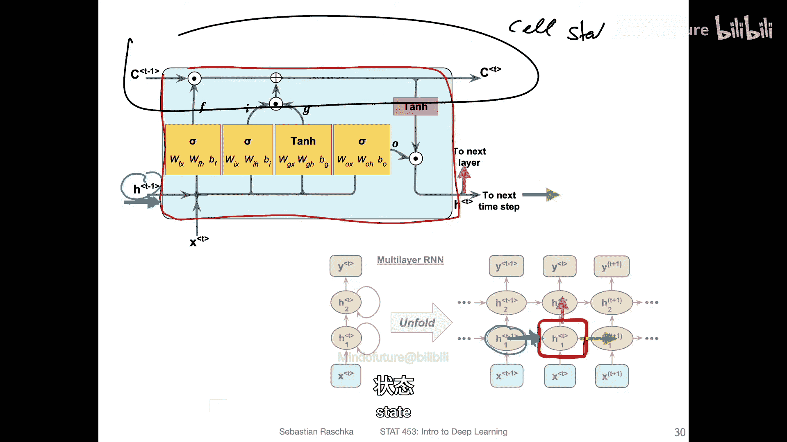

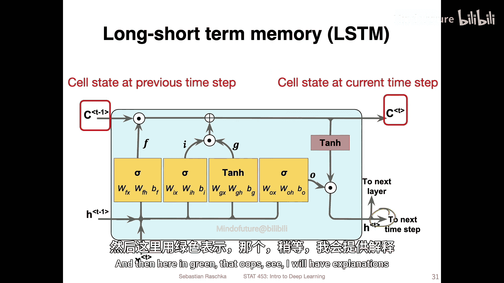

现在，让我们逐步解析其内部运作。我们有一个来自上一时间步的细胞状态 `C_{t-1}`，通过一系列计算后，我们更新它并将其传递给下一个时间步 `C_t`。这个细胞状态是 LSTM 的**记忆核心**。

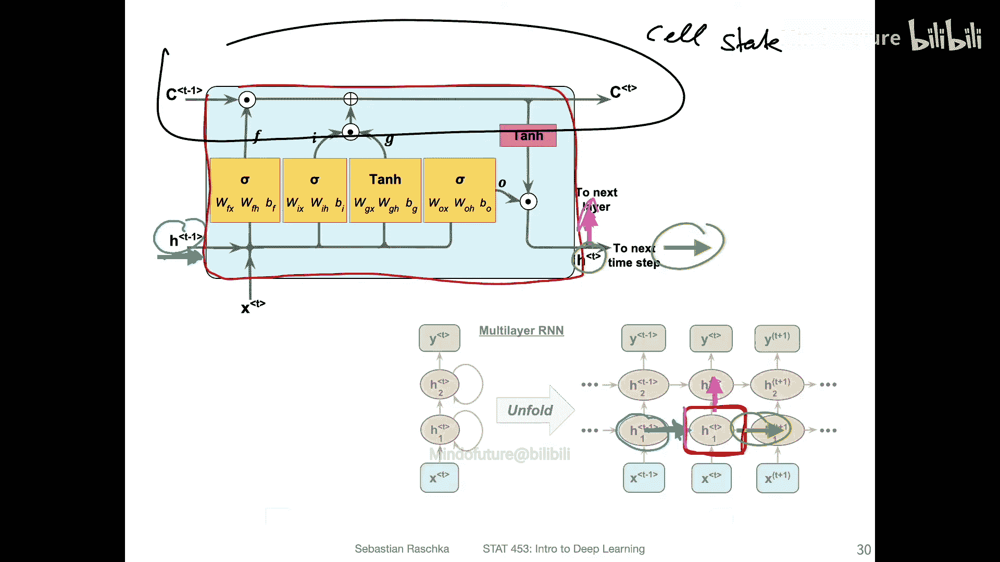

另一个输入是之前提到的上一时间步的隐藏状态 `h_{t-1}`。我们也会将从这个记忆单元计算出的新激活值（隐藏状态 `h_t`）传递给下一个时间步。

对于细胞状态的更新，主要有两种操作：**逐元素乘法 (⊙)** 和**加法 (+)**。图中的 σ 符号代表 **Logistic Sigmoid 激活函数**。

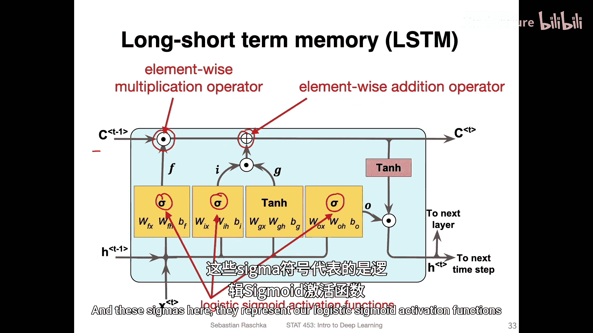

## LSTM 中的三个门控机制

LSTM 的核心是三个**门控 (Gate)**，它们控制着信息的流动。

**1. 遗忘门 (Forget Gate)**

遗忘门控制哪些信息被记住，哪些被遗忘，它可以重置细胞状态。
*   输入：当前时间步的输入 `x_t` 和上一时间步的隐藏状态 `h_{t-1}`。
*   计算：`f_t = σ(W_f * [h_{t-1}, x_t] + b_f)`。这里 `W_f` 是权重矩阵，`b_f` 是偏置项，`[h_{t-1}, x_t]` 表示向量拼接。
*   作用：Sigmoid 的输出在 0 到 1 之间。如果输出为 0，通过与上一细胞状态 `C_{t-1}` 逐元素相乘，可以“擦除”相应位置的旧信息。如果输出为 1，则完全保留。因此，网络在每个时间步都有选择性地遗忘或保留过去信息的能力。

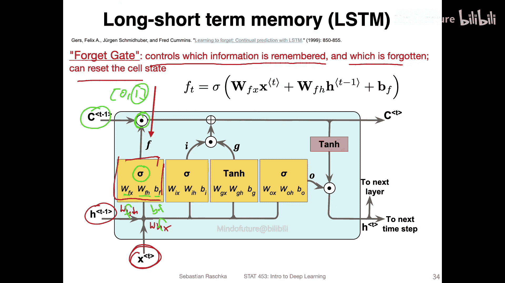

**2. 输入门 (Input Gate) 与候选细胞状态**

输入门负责将新信息添加到细胞状态中。这里实际上有两部分：
*   **输入门 (Input Gate)**：`i_t = σ(W_i * [h_{t-1}, x_t] + b_i)`，决定哪些新值需要更新。
*   **候选细胞状态 (Candidate Cell State)**：`\tilde{C}_t = tanh(W_C * [h_{t-1}, x_t] + b_C)`，这是一个新的候选值向量，范围在 -1 到 1 之间。
*   作用：将输入门 `i_t` 与候选细胞状态 `\tilde{C}_t` 逐元素相乘，得到需要添加的信息。然后，将这个结果加到被遗忘门处理过的旧细胞状态上，从而形成新的细胞状态 `C_t`。

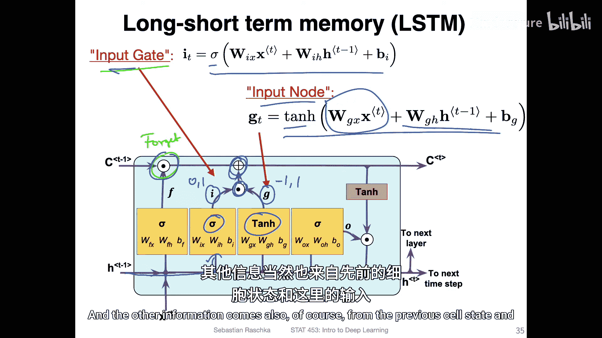

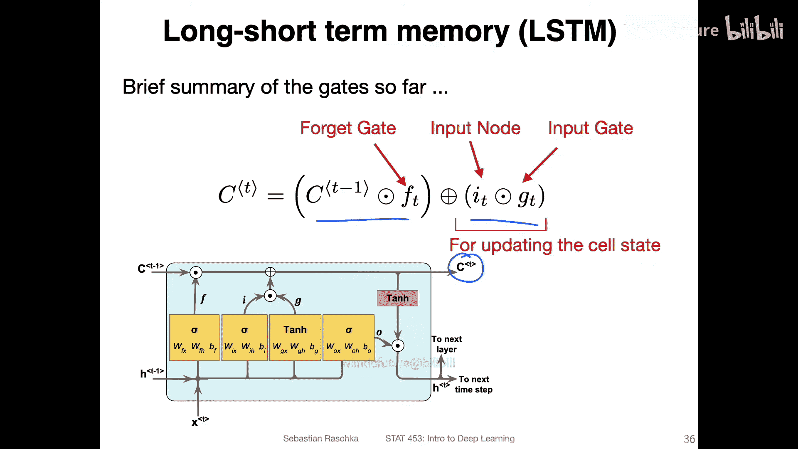

**更新细胞状态**

综合以上两步，更新细胞状态的公式可以总结为：
`C_t = f_t ⊙ C_{t-1} + i_t ⊙ \tilde{C}_t`
这个公式清晰地表明：新的细胞状态由“被遗忘的旧记忆”和“被筛选的新记忆”两部分相加构成。

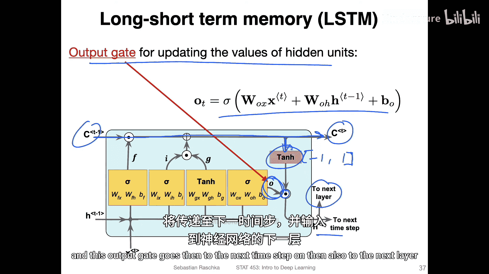

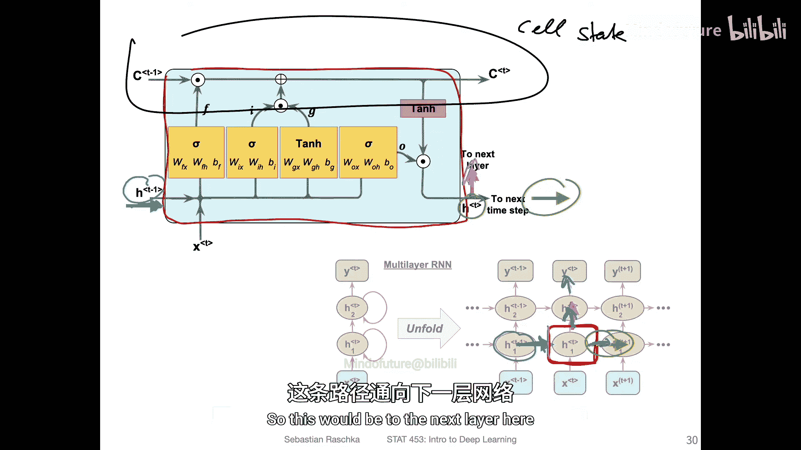

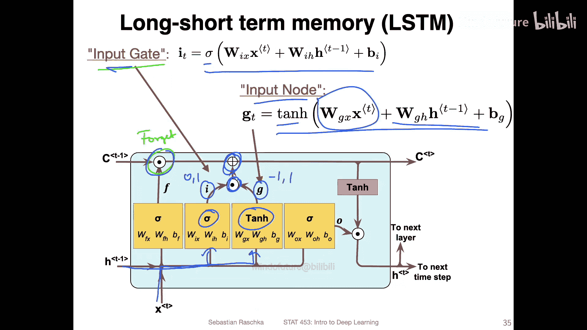

**3. 输出门 (Output Gate)**

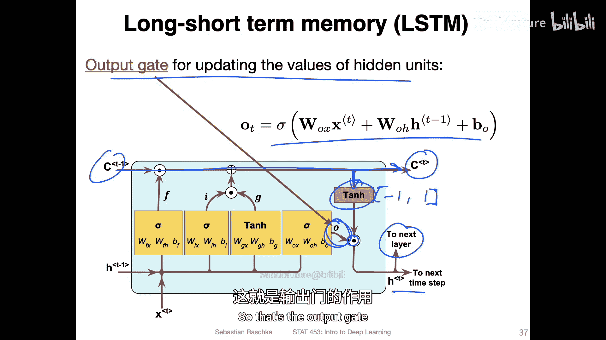

输出门用于更新隐藏单元的值（即输出给外部的隐藏状态）。
*   计算：`o_t = σ(W_o * [h_{t-1}, x_t] + b_o)`。
*   作用：首先，将新的细胞状态 `C_t` 通过 `tanh` 函数处理（将其值规范到 -1 到 1 之间），得到 `tanh(C_t)`。然后，将输出门 `o_t` 与 `tanh(C_t)` 逐元素相乘，最终得到当前时间步的隐藏状态输出 `h_t`。
    `h_t = o_t ⊙ tanh(C_t)`
    这个 `h_t` 会同时传递给下一个时间步和神经网络的下一层（如果存在）。

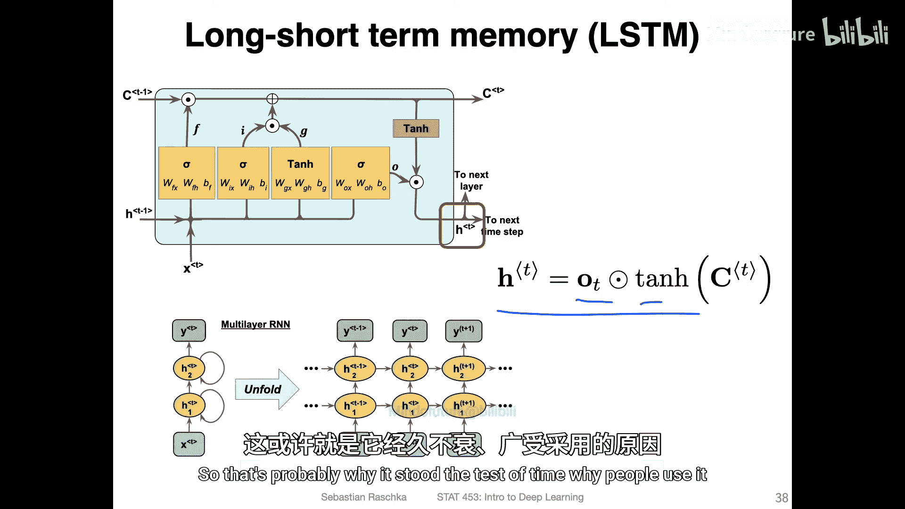

## 总结与扩展

本节课中我们一起学习了长短期记忆网络 (LSTM)。LSTM 通过引入**细胞状态**和三个**门控机制**（遗忘门、输入门、输出门），有效地解决了传统循环神经网络中的**长程依赖建模**和**梯度消失**问题。虽然其结构看起来复杂，但它在实践中被证明非常有效，因此经受住了时间的考验并被广泛使用。

此外，还存在一个 LSTM 的简化变体——**门控循环单元 (GRU)**。它合并了部分门控结构，参数更少，但在许多任务上与 LSTM 性能相近。由于时间关系，本课程不深入讲解 GRU。如果你有兴趣，可以在课程资料中找到更多关于比较 LSTM 和 GRU 的阅读资源。

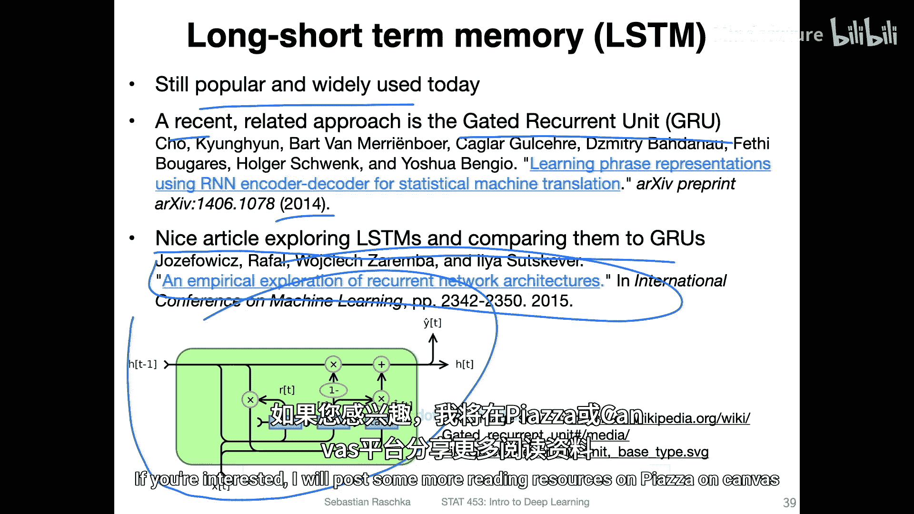

本讲座旨在让大家对循环网络的工作原理有一个宏观的了解。在接下来的视频中，我们将讨论“多对一”架构，并实现一个用于分类的 RNN 示例。大约两周后，我们还将重温循环神经网络，将其用于“多对多”任务，例如生成新文本。

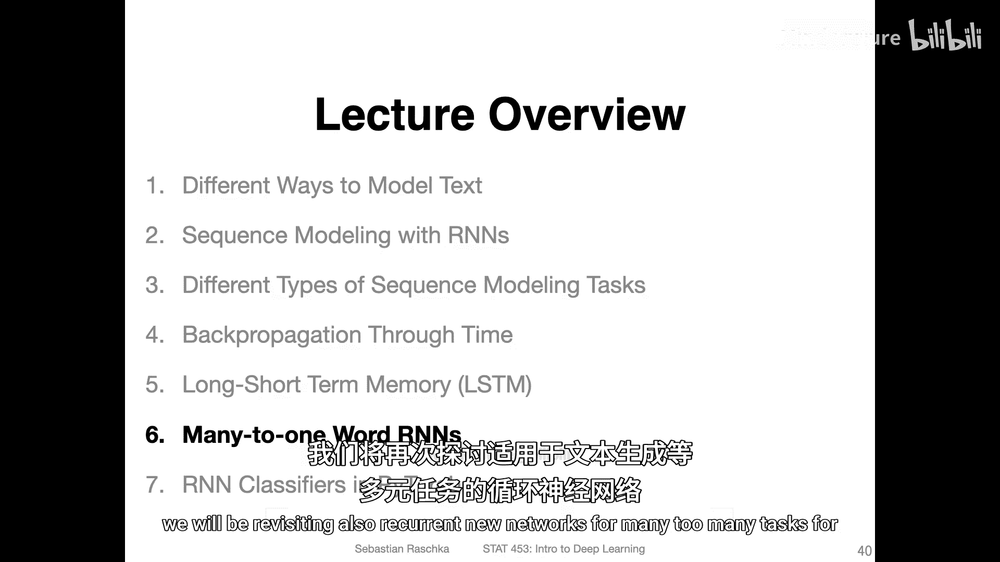

