# 132：用于分类的RNN - 多对一RNN 🧠

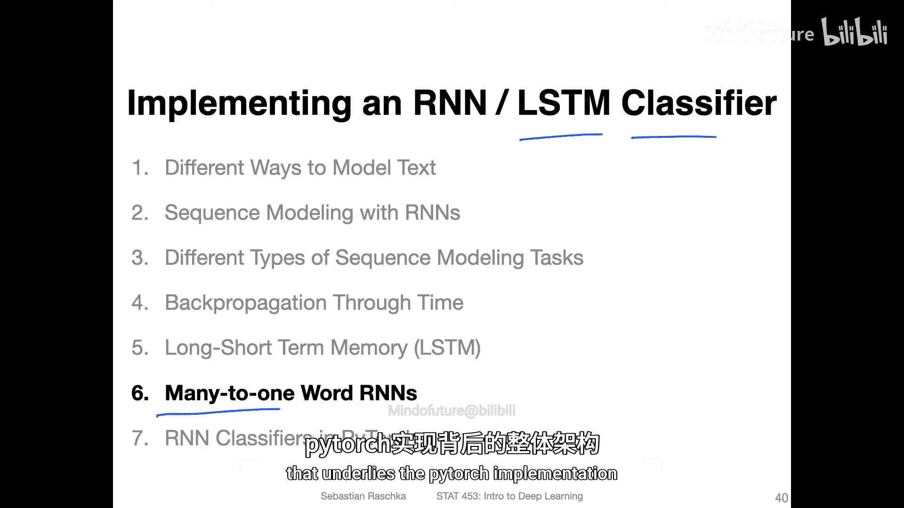

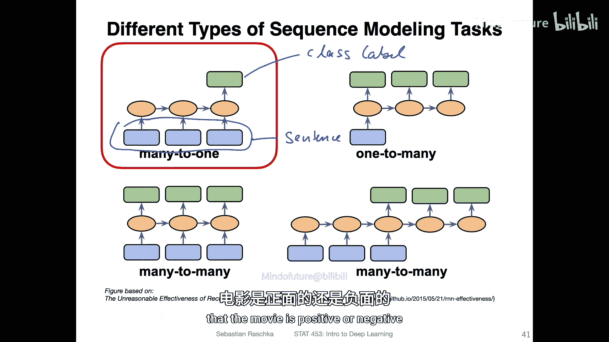

在本节课中，我们将学习如何实现一个使用LSTM作为分类器的循环神经网络（RNN），用于对文本进行分类。这是一个“多对一”的RNN，因为我们会读入整个文本序列（多个输入），最终输出一个类别标签（一个输出）。

## 概述

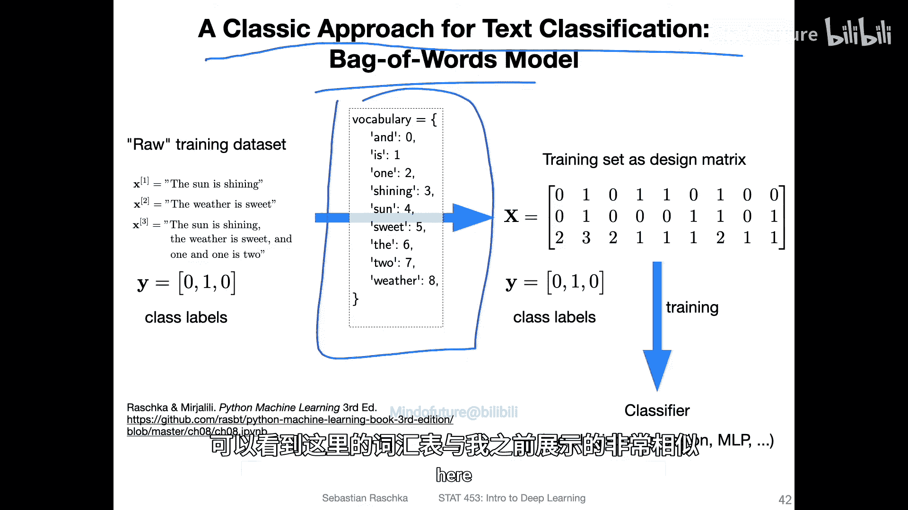

我们将以IMDB电影评论数据集为例，目标是预测评论的情感是积极还是消极。整个过程可以分解为几个关键步骤，从构建词汇表到将文本转换为神经网络可以处理的数值表示。本节将概述这些步骤，下一节我们将用PyTorch代码具体实现。

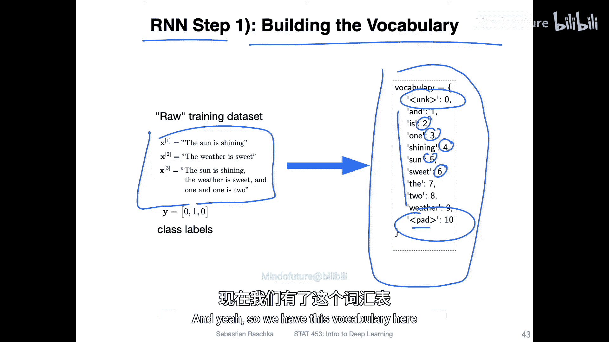

## 步骤详解

上一节我们介绍了RNN用于文本分类的基本概念，本节中我们来看看实现它的具体步骤。

### 步骤1：构建词汇表 📚

与传统的词袋模型类似，RNN也需要一个词汇表。词汇表是训练集中所有唯一单词的集合，它将每个单词映射到一个唯一的整数索引。此外，我们通常还会添加两个特殊的标记：
*   `<unk>`：用于表示未知单词（未在词汇表中出现的词）。
*   `<pad>`：用于填充序列，使所有输入序列长度一致，便于批量处理。

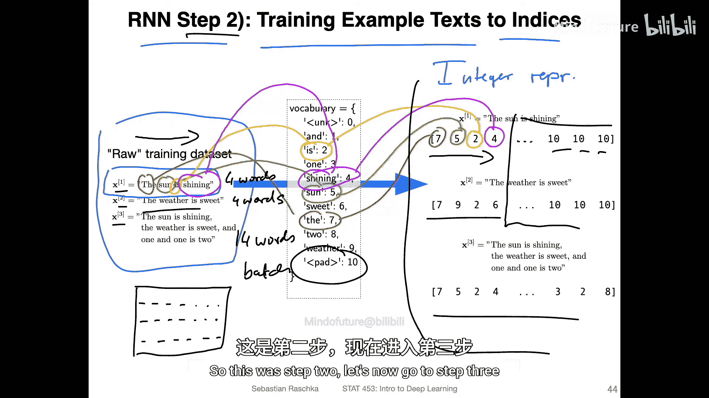

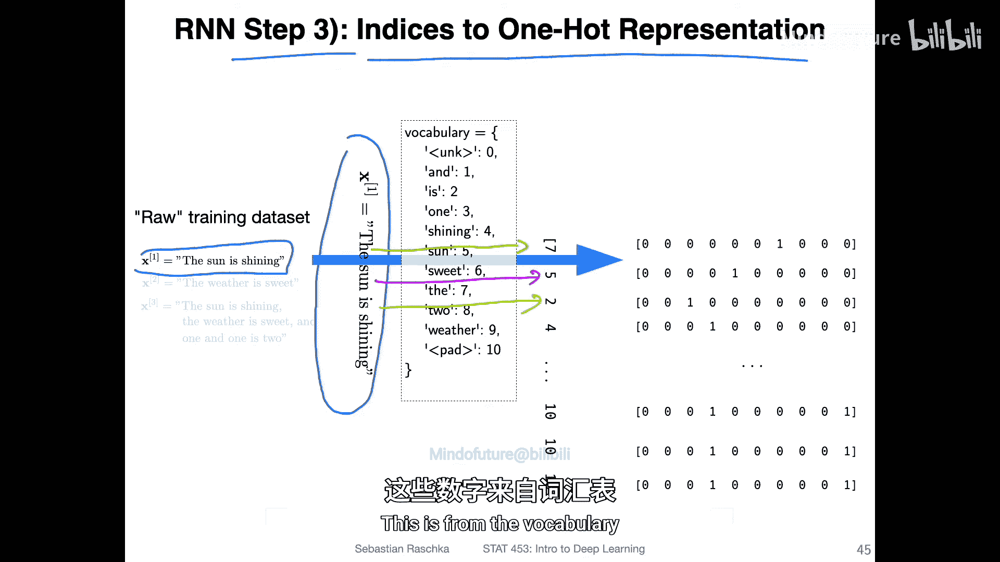

词汇表本质上就是一个映射字典，其顺序（按字母顺序或出现频率）并不重要。

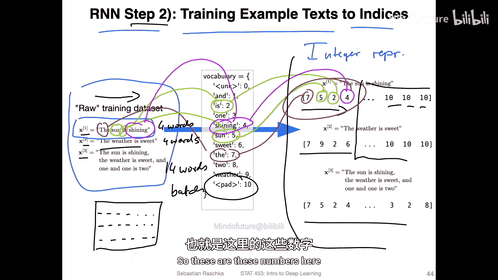

### 步骤2：将文本转换为整数索引 🔢

有了词汇表后，我们需要将每个训练样本中的文本句子转换成对应的整数索引序列。这是因为机器学习算法（如矩阵乘法）需要处理数值数据，而非原始单词。

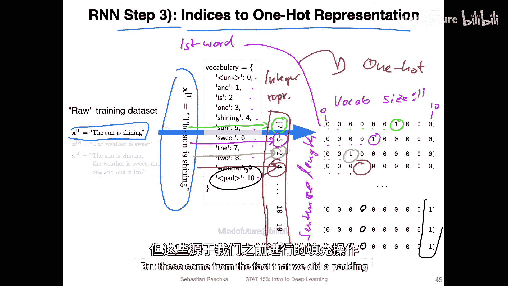

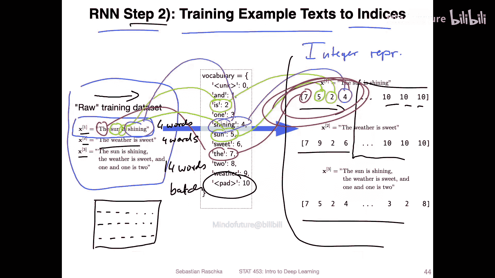

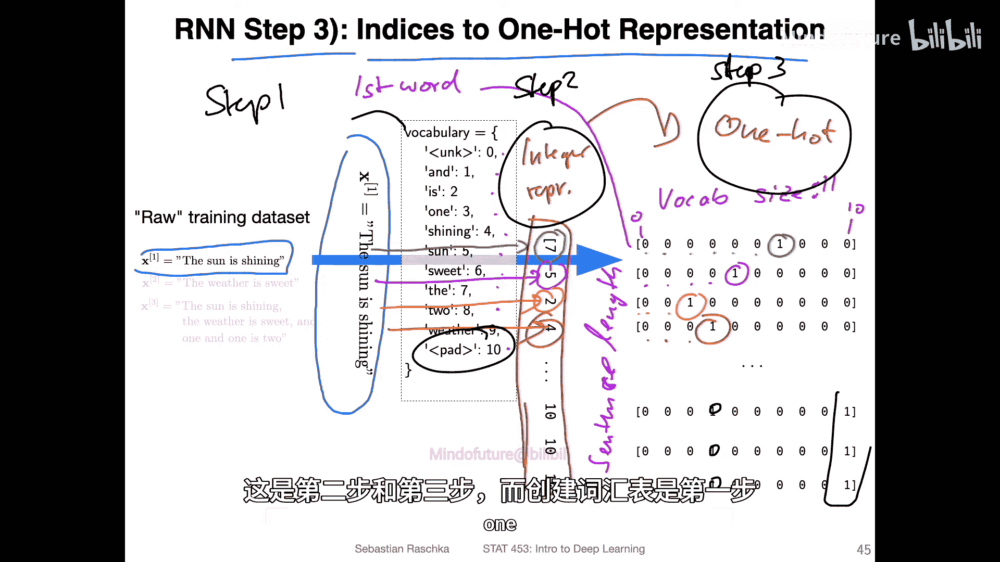

例如，句子 “the sun is shining” 根据词汇表可能被转换为 `[7, 5, 2, 4]`。**与词袋模型不同，RNN会保留单词的原始顺序**，因为序列的顺序信息对理解文本至关重要。

由于不同句子的长度不同，为了能进行高效的批量矩阵运算，我们需要将所有序列填充到相同的长度。较短的序列会在末尾用 `<pad>` 对应的索引进行填充。

### 步骤3与4：从索引到词嵌入向量（概念理解） 🧩

理论上，接下来的步骤是：
1.  **步骤3**：将整数索引转换为**独热编码**向量。每个单词表示为一个长度等于词汇表大小的向量，其中只有对应索引位置为1，其余为0。
2.  **步骤4**：通过一个可学习的**嵌入矩阵**（权重矩阵）与独热向量进行矩阵乘法，得到一个稠密的、包含实数的**词嵌入向量**。这个向量才是RNN的真正输入。

**公式表示**：假设词汇表大小为 `V`，嵌入维度为 `D`，嵌入矩阵 `E` 的形状为 `(V, D)`。对于一个词的独热向量 `x`（形状 `(1, V)`），其嵌入向量 `e` 计算为：
`e = x · E` （形状为 `(1, D)`）

然而，直接进行矩阵乘法效率很低，因为独热向量中只有一个1，却要进行 `V` 次乘法运算。

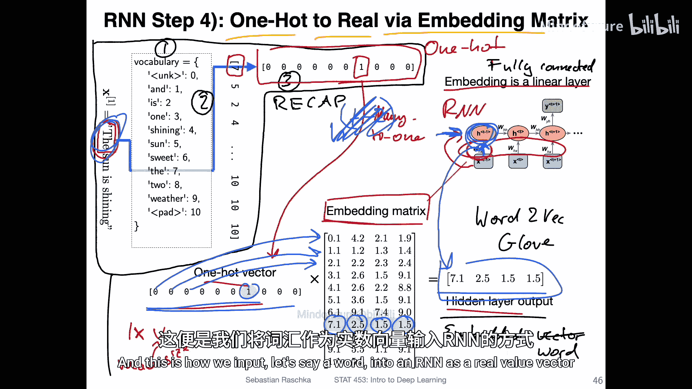

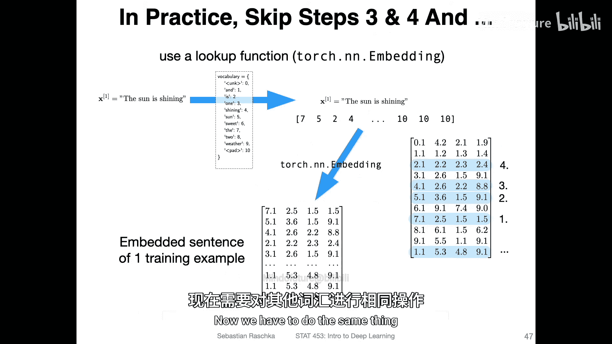

### 高效实现：嵌入查找层 🔍

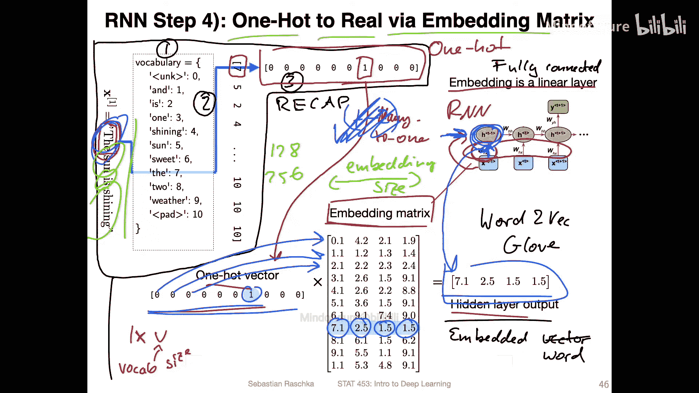

在实践中，PyTorch等框架并不真正进行步骤3和4。相反，它们使用一个更高效的方法：**嵌入查找层**（`torch.nn.Embedding`）。

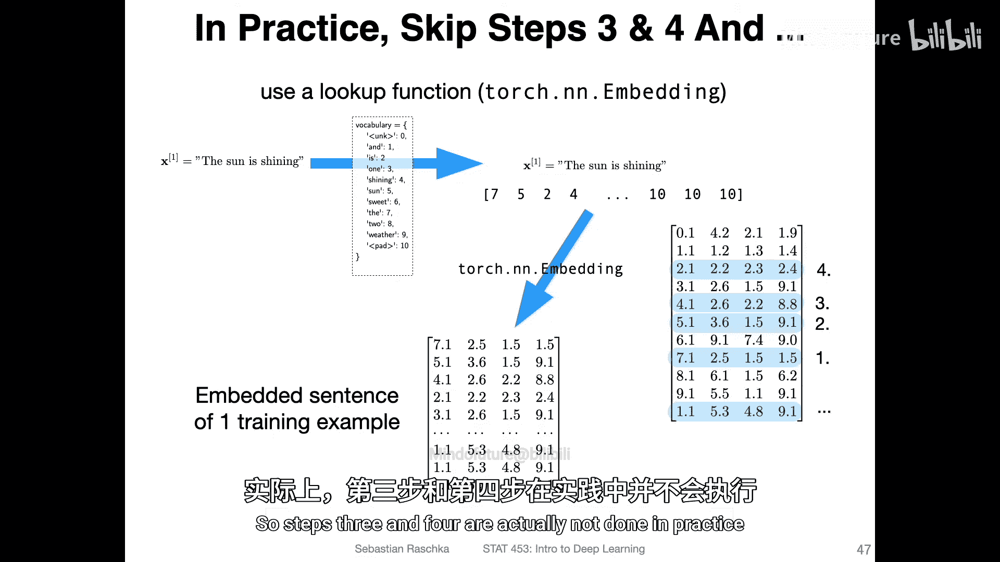

它直接将步骤2得到的整数索引作为输入，在嵌入矩阵中进行**查找**，直接取出对应的行（即该词的嵌入向量）。这避免了庞大的独热向量与嵌入矩阵的乘法运算，效率极高。

**代码描述**：
```python
# vocab_size: 词汇表大小， embedding_dim: 嵌入维度
embedding_layer = torch.nn.Embedding(vocab_size, embedding_dim)
# input_indices: 形状为 (batch_size, sequence_length) 的整数索引张量
embedded_vectors = embedding_layer(input_indices) # 输出形状: (batch_size, sequence_length, embedding_dim)
```

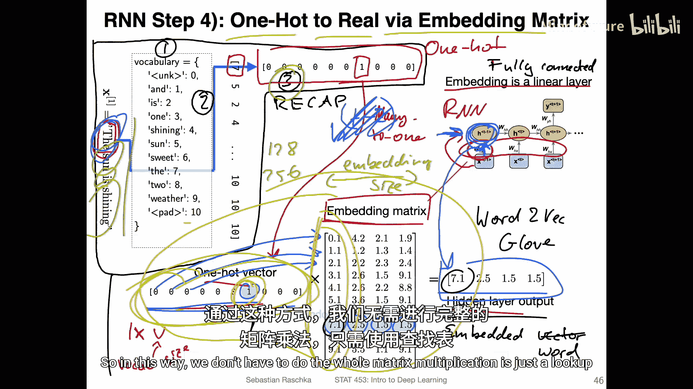

因此，对于整个句子，我们最终得到一个形状为 `(句子长度, 嵌入维度)` 的矩阵（对于批量数据，则是 `(批量大小, 句子长度, 嵌入维度)`），这个矩阵将作为RNN的输入。

## 示例数据集：IMDB电影评论 🎬

我们将使用的IMDB数据集是一个经典的二分类情感分析数据集。它包含：
*   **50，000条**电影评论（25，000条训练，25，000条测试）。
*   标签为 **0（负面）** 和 **1（正面）**。研究者只采用了高度极化的评论（评分1-4为负面，7-10为正面），以避免模糊的中性评价。
*   每条数据包含评论文本和对应的情感标签。

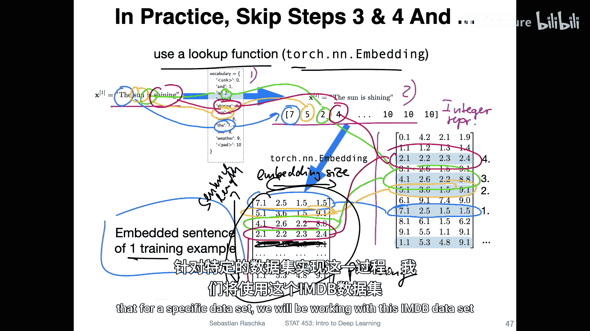

## 工具与资源 🛠️

处理文本数据时，可以使用PyTorch的配套库 **TorchText**（类似于处理图像的TorchVision）。需要注意的是，TorchText在近期版本（如0.9）有重大更新，旧代码可能被标记为“遗留代码”。如果你对更多RNN分类技巧和实现感兴趣，网上有许多优秀的教程和代码仓库可供参考。

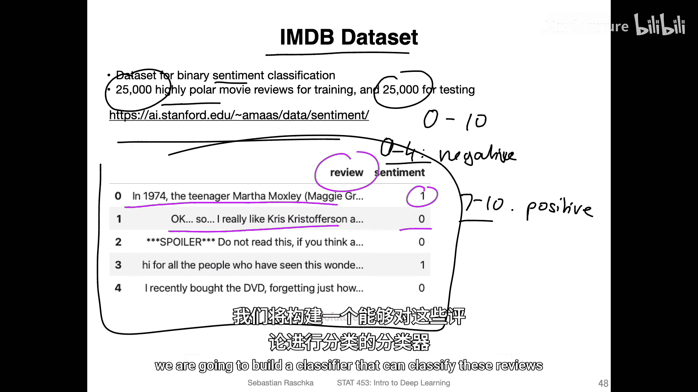

## 总结

本节课我们一起学习了构建用于文本分类的“多对一”RNN的核心流程：
1.  **构建词汇表**，建立单词到索引的映射。
2.  **文本转索引**，并将序列填充至等长。
3.  **理解概念路径**：索引 -> 独热编码 -> 通过嵌入矩阵得到词向量。
4.  **掌握高效实践**：使用`torch.nn.Embedding`层直接通过索引查找词嵌入向量。
5.  **认识示例数据**：IMDB情感分类数据集。

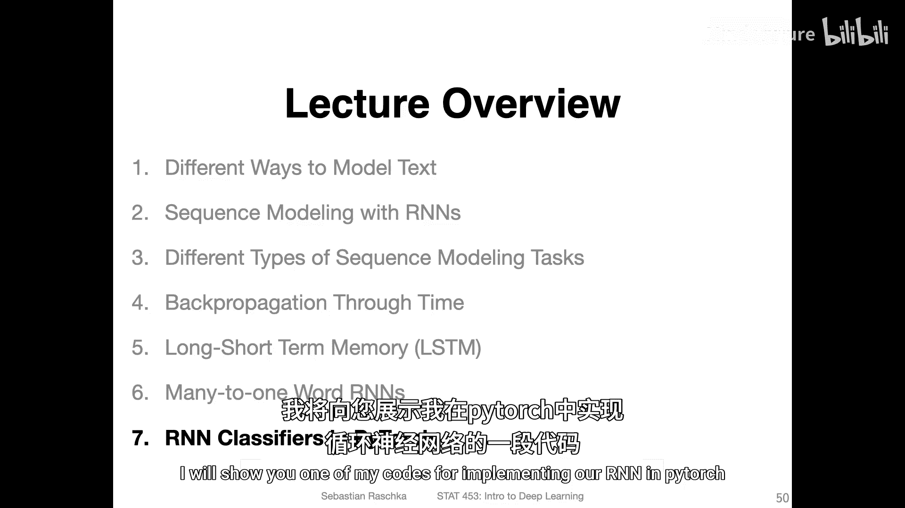

下一节，我们将进入PyTorch代码实战，一步步实现这个文本分类RNN模型。