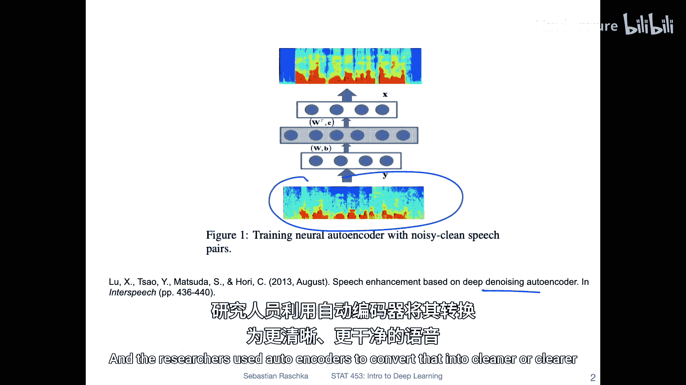
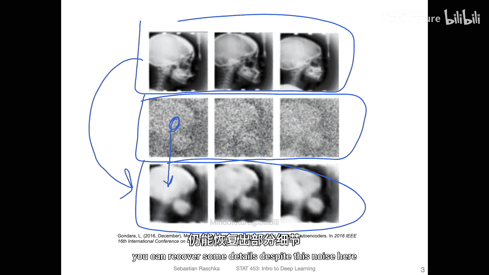
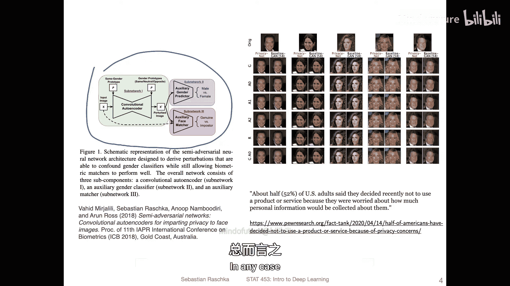
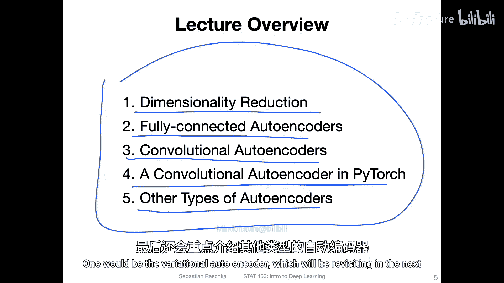

# 134：自编码器入门

在本节课中，我们将要学习生成式模型的入门知识，从自编码器开始。自编码器是一种能够将数据编码为更小表示，并尝试重建回原始空间的架构。虽然它本身可能不是最强大的工具，但它是理解后续更复杂生成模型（如变分自编码器和生成对抗网络）的重要基础。我们还将接触到反卷积等概念，这些在后续学习中也会用到。

## 自编码器的应用动机

上一节我们介绍了本课程的整体安排，本节中我们来看看为什么自编码器值得学习。在生成式模型的宏大图景中，自编码器是我们的起点。同时，自编码器本身也能用于许多有趣的实际应用。

以下是几个自编码器的应用示例：

*   **语音去噪**：一种称为去噪自编码器的模型可以用于清理语音。虽然语音是音频而非视觉数据，难以在幻灯片上展示，但研究人员使用自编码器将含噪语音的频谱图转换为更清晰、干净的语音。
  
  

*   **图像增强**：去噪自编码器的另一个有趣应用是图像增强。例如，在处理这些含噪的医学图像时，研究人员使用自编码器从噪声中恢复图像。作为参考，原始图像显示在顶部。虽然从噪声图像恢复到清晰图像会丢失大量细节，但能在如此噪声下恢复出一些细节仍然令人印象深刻。
  
  

*   **隐私增强**：这里展示的是一个我几年前参与研究的自编码器应用。我们实现了一个卷积自编码器用于隐私增强。我们的目标是，在保留人脸匹配精度的同时，移除性别信息。人脸匹配常用于护照扫描仪等安全目的。如今，安全摄像头无处不在，收集着大量数据。这个想法旨在探索如何最小化数据收集。例如，你仍然希望图像能用于验证目的（比如与犯罪数据库比对），但不应收集个人未同意收集的信息（比如性别信息）。
  
  

以上只是自编码器的一些应用。在本讲座中，我们将涵盖以下五个主题。希望这不会是一节很长的讲座，因为自编码器本身非常有趣，但我们将在下一讲讨论变分自编码器时更深入地探讨它们。因此，本节是一个概览性介绍。

## 本讲内容概览

以下是本节课将要讨论的五个核心主题：

1.  **降维简介**：首先，我们将简要讨论降维的概念，这是理解自编码器压缩思想的基础。
2.  **全连接自编码器**：接着，我将介绍全连接自编码器。这类自编码器本质上类似于多层感知机，使用全连接层。
3.  **卷积自编码器**：然后，我们将把这个概念扩展到卷积自编码器，这类自编码器在处理图像数据时表现更好。
4.  **PyTorch实现**：之后，我将展示如何在PyTorch中实现一个卷积自编码器。
5.  **其他自编码器类型**：最后，我也会提及其他类型的自编码器，其中一种是变分自编码器，我们将在下一讲中详细讨论它。

本节课中，我们一起学习了自编码器的基本概念、其多样的应用场景（如去噪、图像增强和隐私保护），以及本讲将要深入探讨的五个核心主题。从下一节开始，我们将正式进入第一个主题：降维。