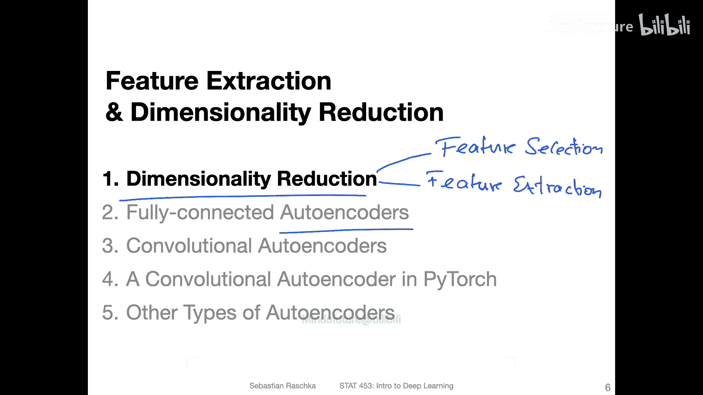
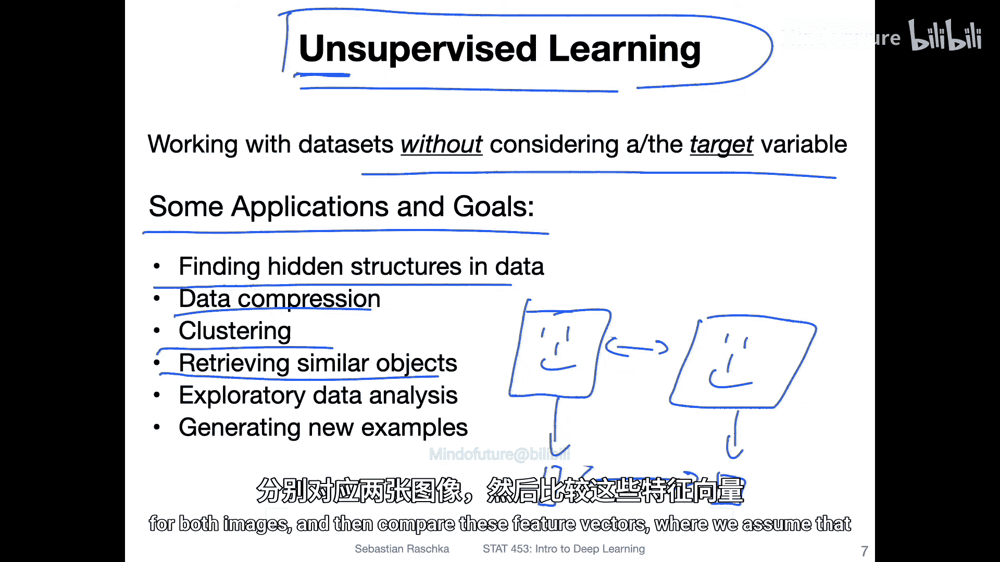
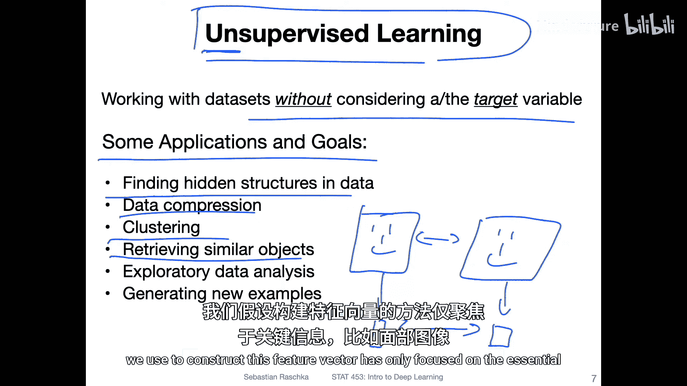
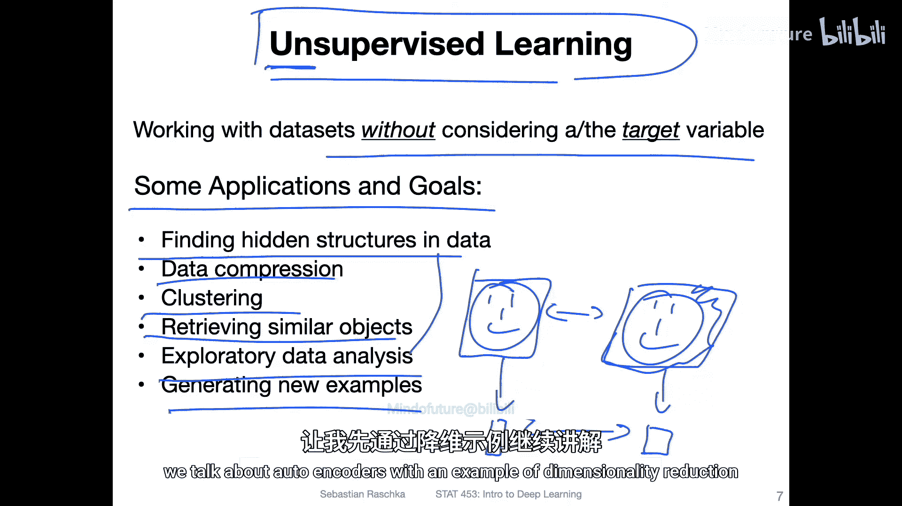
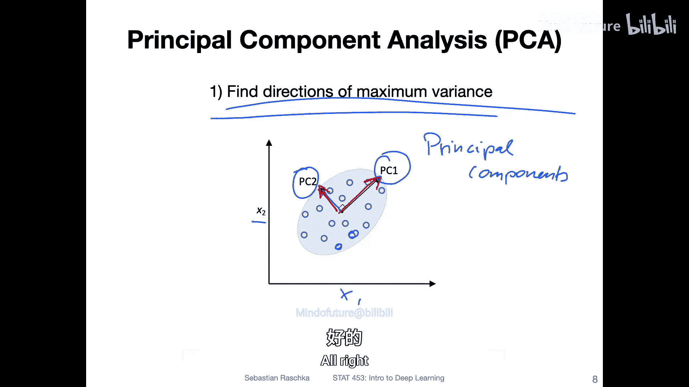
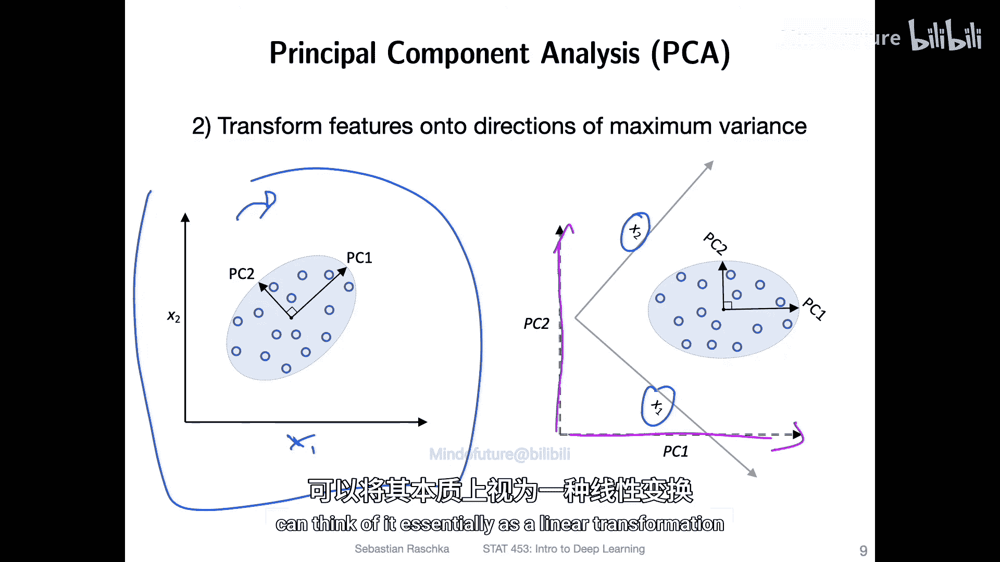
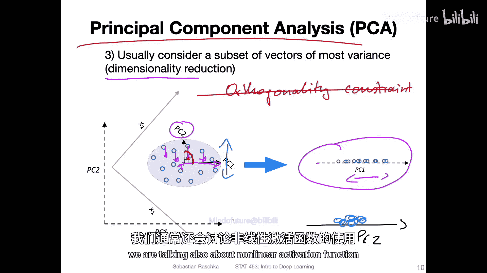
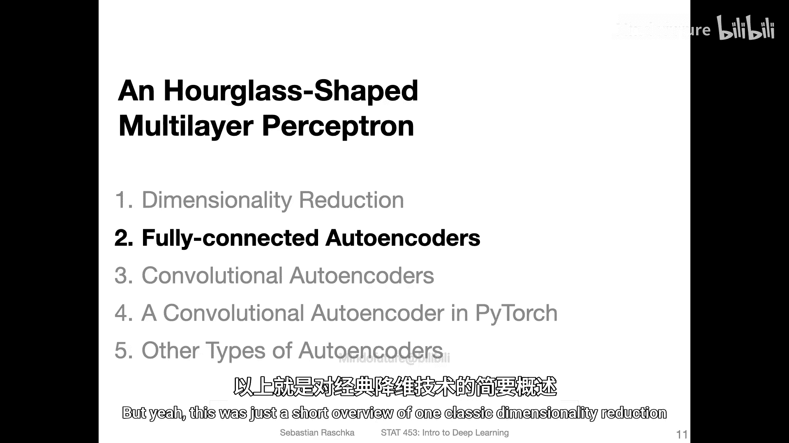

# 135：降维 📉

在本节课中，我们将要学习降维的基本概念，并了解其在机器学习和深度学习中的重要性。降维是处理高维数据的关键技术，能够帮助我们简化数据、提高模型性能，并为后续学习自编码器打下基础。

## 概述

降维是一个广泛术语，用于描述减少数据集中特征数量的过程。降维主要分为两个子领域：特征选择和特征提取。特征选择是从原始特征中挑选一个子集，而特征提取则是通过线性或非线性变换将原始特征组合成新的特征。自编码器本质上就是一种特征提取算法。

## 降维与无监督学习

上一节我们介绍了降维的基本概念，本节中我们来看看它与无监督学习的关系。自编码器，至少常规的自编码器，属于无监督学习的范畴。无监督学习，顾名思义，是在没有标签的情况下进行学习。我们只使用特征，而忽略目标变量。

无监督学习有多种应用和目标，以下是其主要目标：

*   **发现数据中的隐藏结构**
*   **压缩数据**（例如，出于存储需求）
*   **改善模型性能**（许多机器学习算法容易受到“维度诅咒”的影响，减少特征数量可以提升性能）
*   **聚类与检索相似对象**（通过提取低维特征向量来比较对象，例如，比较两张人脸图片时，可以忽略背景，只关注面部特征）
*   **探索性数据分析**（将高维数据降至2维或3维以便可视化）
*   **生成新样本**（学习数据集的分布，并从中采样以生成新数据。这将是下一讲讨论变分自编码器时的重点）

## 经典降维技术：主成分分析 (PCA)

在深入探讨自编码器之前，让我们通过一个经典例子来理解降维。主成分分析是一种广泛使用的降维技术。

PCA的核心思想是找到数据中方差最大的方向。假设我们有一个包含特征 `x1` 和 `x2` 的二维数据集，PCA会计算出两个主成分：`PC1` 和 `PC2`。从数学上讲，这些主成分是数据协方差矩阵的特征向量。`PC1` 是与最大特征值关联的特征向量，代表了数据方差最大的方向；`PC2` 则与第二大的特征值关联。

**公式表示**：若原始数据矩阵为 `X`，经过中心化后，其协方差矩阵为 `C = (X^T X) / (n-1)`。PCA求解 `C` 的特征值和特征向量。数据在新空间（主成分空间）的投影可以通过线性变换实现：`Z = X W`，其中 `W` 的列是 `C` 的特征向量。

一旦找到了这些主成分，我们就可以对数据进行旋转，将其对齐到新的特征轴（`PC1`, `PC2`）上。这本质上是一个线性变换。

如果需要进行降维，我们可以只保留方差最大的方向（例如 `PC1`），而忽略其他方向（例如 `PC2`）。这样，我们就把数据从二维压缩到了一维。这个过程可以想象为将数据点“挤压”到一条线上。

在实际应用中，我们通常有数百甚至数千个特征，需要将其降至更低维的空间。决定保留多少个主成分，通常通过观察主成分所捕获的**累积方差**比例来实现。

PCA有一个重要的约束：主成分之间是**正交**的。自编码器也能实现类似的功能，产生类似主成分的表示。但不同的是，自编码器（至少基本形式）没有显式的正交性约束。不过，如果一个自编码器使用线性激活函数，它的行为将非常类似于PCA。在深度学习的背景下，我们通常使用非线性激活函数，这使得自编码器能够学习比PCA更复杂、更强大的数据表示。

## 总结

本节课中我们一起学习了降维的核心概念。我们了解到降维分为特征选择和特征提取，并且是无监督学习的一个重要领域。我们通过主成分分析这一经典技术，具体了解了如何通过寻找最大方差方向来减少数据维度，并将数据投影到新的特征空间。这为我们理解下一讲即将介绍的自编码器——一种更强大、非线性的特征提取与降维神经网络模型——奠定了坚实的基础。