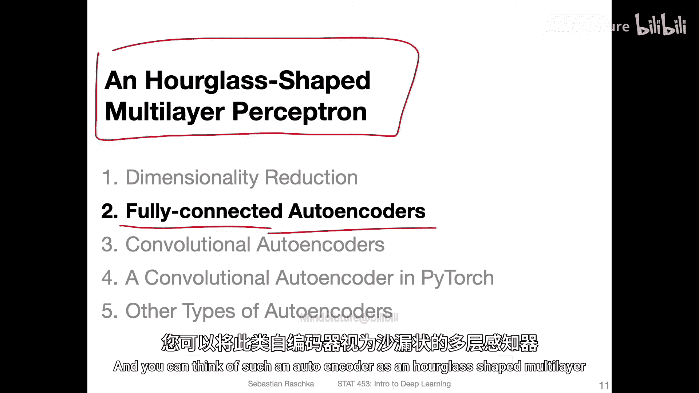
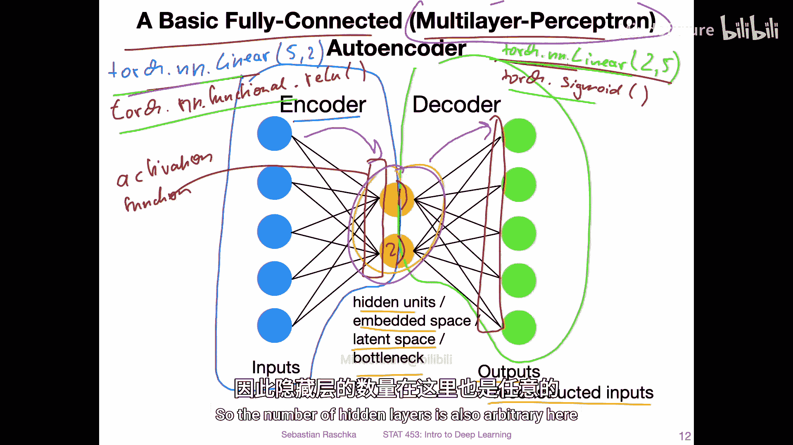
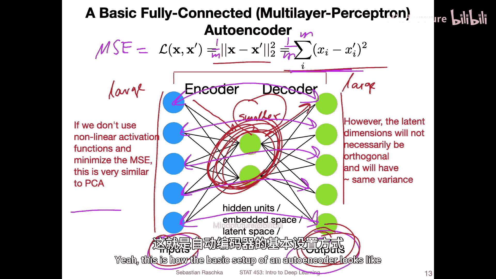
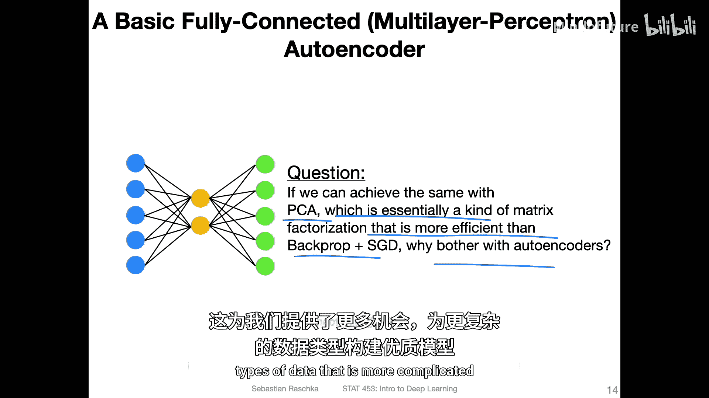
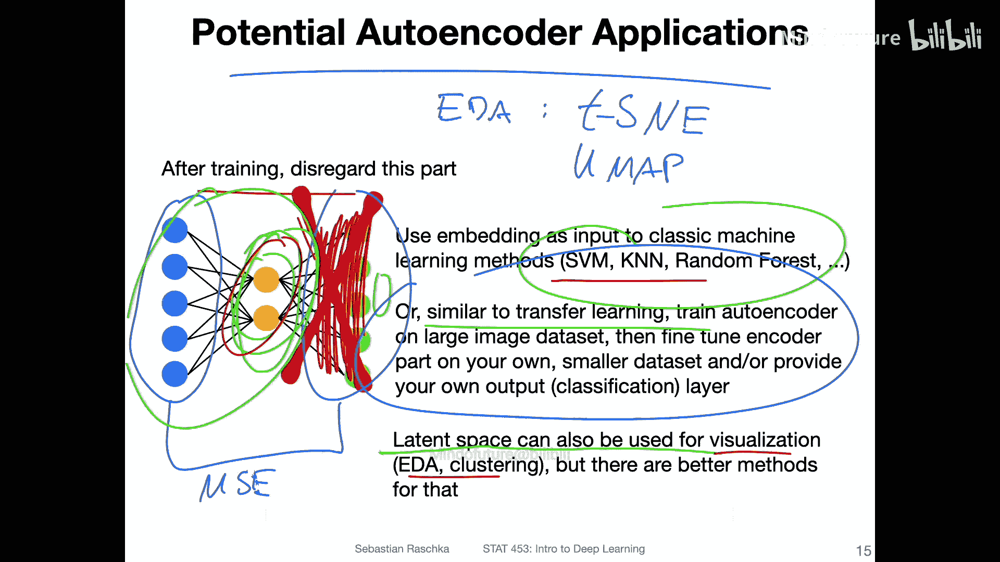
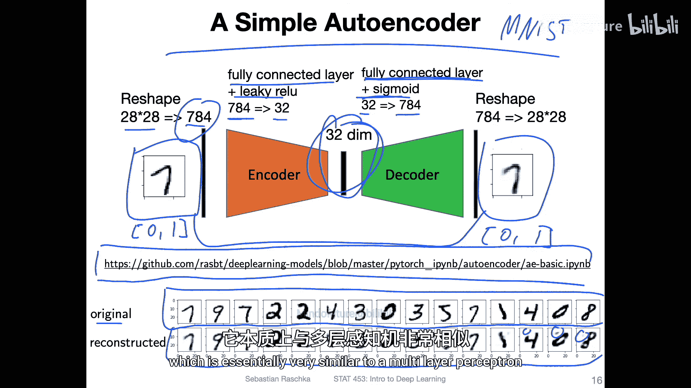
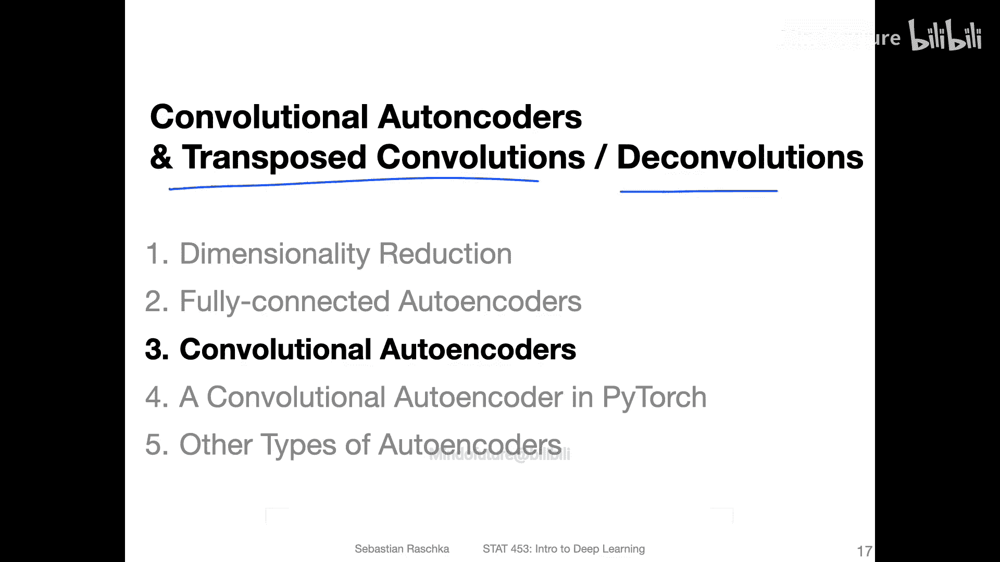

# 136：全连接自编码器 🧠

在本节课中，我们将要学习自编码器的基本概念，特别是最简单的类型——全连接自编码器。我们将了解其结构、工作原理、与主成分分析的区别以及潜在的应用场景。

---

## 自编码器简介

自编码器是一种特殊类型的神经网络。我们可以将全连接自编码器视为一个沙漏形状的多层感知机。

上图展示了一个非常简单的全连接自编码器的可视化结构。它本质上就是一个多层感知机。

## 编码器与解码器结构

让我们从观察上图开始。图中被圈出的部分是所谓的**编码器**。它本质上是一个全连接层。在PyTorch的语境下，可以将其视为一个线性层，例如一个具有5个输入和2个输出的全连接层。

在另一侧，我们拥有**解码器**。解码器本质上也是一个全连接层，但方向相反，具有2个输入和5个输出，旨在将数据恢复回原始维度。

在编码器和解码器之间，我们拥有所谓的**隐藏单元**，有时也称为**嵌入空间**、**潜在空间**或**瓶颈层**。之所以称为瓶颈，是因为它像瓶颈一样压缩了数据的维度。

网络的输出是**重构的输入**。整个过程是：将特征投影到一个更小的维度空间，然后再将其重构回来。

## 与主成分分析的区别

如果自编码器仅按上述方式设置，它将与上一视频中介绍的主成分分析相似，但存在关键区别。

主要区别在于，自编码器没有正交性约束。没有明确的方法来确保嵌入空间中的特征1和特征2是正交的，而主成分分析则要求特征正交，因为它是通过提取特征向量实现的。

另一个区别是，我提到我们使用了全连接层。但如果只有线性变换，模型能力会受限。在实践中，我们通常需要非线性变换的能力。

因此，在实践中，我们会在全连接层之后连接一个激活函数。例如，在PyTorch中，我们会有一个线性层，然后是一个非线性激活函数（如ReLU），接着是另一个线性层，最后可能再使用一个激活函数（如Sigmoid）。我会在后续讲解实现时解释为什么这里使用Sigmoid。

这个结构可以更复杂。中心隐藏层的单元数可以是任意的，也可以不止一个全连接层。就像多层感知机可以有一层、两层或更多隐藏层一样，自编码器的隐藏层数量也是任意的。为了简化展示，图中只展示了一个基本结构。

如前所述，如果不使用非线性激活函数，自编码器将类似于主成分分析。但在实践中，我们会使用非线性激活函数，因此它实际上比主成分分析更强大，因为它可以学习非线性变换。

## 学习机制与损失函数

上一张幻灯片中未提及的关键点是：拥有输入和重构输出的意义何在？这是为了学习这种变换。

我们计算输入和输出之间的差异，并利用它进行反向传播，从而使自编码器学会对数据进行良好的压缩。

具体过程是：自编码器从高维输入映射到较小的嵌入空间表示，然后再映射回高维。我们如何知道这是一个好的表示？如何知道它很好地压缩了数据？

这就是为什么我们需要将其投影回来。我们将其投影回原始空间，然后可以比较输出和输入。我们希望它们相似。如果它们相似，即输入数据能够被成功重构，那就意味着我的潜在表示必须捕获了关于输入数据的重要信息。因为如果中心部分不包含任何有用信息，我们将无法通过输出重构输入。

因此，这种设置确保了自编码器确实能够在嵌入空间中保留最有用的信息。

有多种损失函数可用于此目的，最简单的一种是L2差异或均方误差。我们会逐个比较每个输入和输出。例如，如果有5个输入和5个输出，我们会逐一比较它们，求和，然后可能取平均值，即计算均方误差。

公式表示为：
`MSE = (1/M) * Σ (input_i - output_i)^2`

这就是自编码器的基本设置。

## 为何使用自编码器？

这里有一个问题：如果我们能用主成分分析实现类似效果（主成分分析本质上是一种非常高效的线性变换或矩阵分解，比使用随机梯度下降训练自编码器更高效），那我们为什么还要关注自编码器呢？

答案是，正如之前所说，主成分分析是线性变换，而自编码器可以更强大，能够学习非线性变换。例如，在处理图像数据时，我们可以将全连接层替换为卷积层等。因此，对于更复杂的数据类型，我们有更多机会构建更好的模型。

## 自编码器的应用

在实践中，仅仅重构图像本身可能没有直接意义，因为如果我们已经有了输入图像，为什么还要对重构感兴趣呢？在常规自编码器中，重构仅用于计算均方误差损失，以学习嵌入空间。

训练完成后，我们可以移除解码器部分。稍后我会在代码示例中展示如何操作。移除后，我们只使用那个嵌入表示作为我们提取的特征。

例如，有些人可能在大型数据集上训练自编码器，生成所有嵌入，然后尝试在其上训练分类器（如使用支持向量机、K近邻、随机森林等传统机器学习方法）。当然，你也可以直接使用它，例如构建一个隐藏层更大的多层感知机，并在其顶部添加输出层。

自编码器的优势在于，它不需要标签信息，而普通的多层感知机需要。因此，你可以将其应用于大量未标记的数据。类似于迁移学习，你可以在非常大的数据集上训练自编码器，让它学习如何提取好的特征。然后，如果你只有该数据子集的标签，你可以使用传统方法在这些嵌入上训练模型。

你还可以使用潜在空间（即降维后的空间）进行可视化，例如，如果是二维的，可以用于探索性数据分析的散点图。当然，它不限于二维，也可以是更高维度。例如，如果你想进行聚类，而原始输入空间对于计算成对相似性来说太大，你也可以考虑使用自编码器进行降维。

然而，我必须说明，在实际应用中，对于非线性变换的降维，我可能不会推荐自编码器。有更好的技术，例如，如果你对可视化感兴趣，可以使用t-SNE或UMAP等技术进行降维，它们通常更稳健。

尽管如此，自编码器对于在大型未标记数据集上学习，并作为传统机器学习分类器的输入，仍然是非常好的技术。当然，自编码器还有许多更有趣的方面和应用，我们不会在第一讲中全部涵盖。例如，在下一讲中，我们将讨论变分自编码器，而这里的自编码器将构成变分自编码器的基础模型。因此，学习这个自编码器将帮助我们理解下一讲中的变分自编码器是如何工作的。

## 一个简单的实现示例

这里有一个使用全连接层实现的简单自编码器，应用于MNIST数据集。

左侧是一个手写数字“7”的图像。在MNIST中，它是28x28维的图像，我将其重塑为784维的特征向量。这个向量输入到我的全连接层，该层后接一个Leaky ReLU激活函数。

这个全连接层将输入图像从784维压缩到32维。隐藏空间的维度不必是2维，当然也可以是更多维。

然后，我使用另一个全连接层将32维的隐藏空间转换回784维的表示，这个全连接层后接一个Sigmoid激活函数。为什么使用Sigmoid？因为我将输入图像的像素值归一化到了0到1之间，而Sigmoid的输出范围也在0到1之间。我应用Sigmoid是为了获得与输入相同范围的像素值。

这样，我就可以计算原始像素和重构像素之间的均方误差，并最小化这个误差。

图中展示了原始MNIST图像和底部重构的图像。可以看到重构并不完美，存在一些伪影，但总体看起来相当不错。因此，我们非常简单的自编码器能够在这个32维空间中保留足够的信息来重构原始图像。想一想，32维大约是784维输入的20倍小，因此我能够将尺寸减少约20倍。

如果你对这个代码感兴趣，可以在GitHub上找到。我不会在这里详细讲解这段代码，因为在接下来的视频中，我想向你展示一个稍微更有趣的卷积自编码器，并且我为这个课程实现了一些代码来使其更有趣。所以我们将专注于一个更有趣的卷积自编码器示例。但如果你感兴趣，也可以找到这个简单自编码器的代码，它本质上与多层感知机非常相似。

## 总结与预告

在本节课中，我们一起学习了全连接自编码器的基本概念。我们了解了其沙漏形的编码器-解码器结构，它如何通过比较输入和重构输出来学习有效的低维表示，以及它与线性降维方法（如PCA）的关键区别在于其非线性变换能力。我们还探讨了自编码器在特征学习、降维和作为其他模型输入等方面的潜在应用。

在下一个视频中，我将介绍一些关于卷积自编码器的概念，其中会涉及转置卷积和反卷积（这只是同一事物的不同名称）。然后，在这个视频之后，我们将在PyTorch中实现它。

