# 137：卷积自编码器与转置卷积 🧠

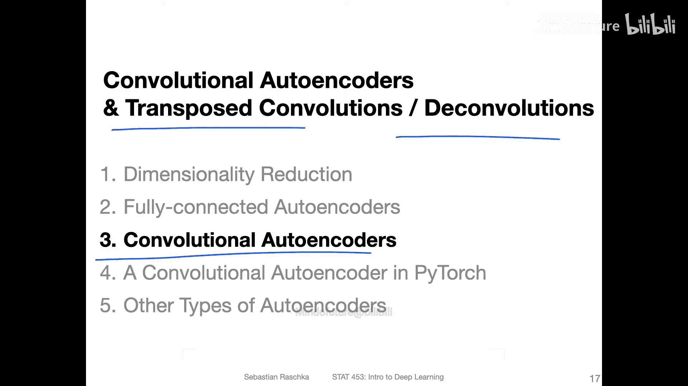

在本节课中，我们将学习卷积自编码器的基本结构，并重点探讨其核心组件——转置卷积（也称为反卷积或分数步长卷积）。我们将了解为什么需要它，以及它是如何工作的。

## 概述

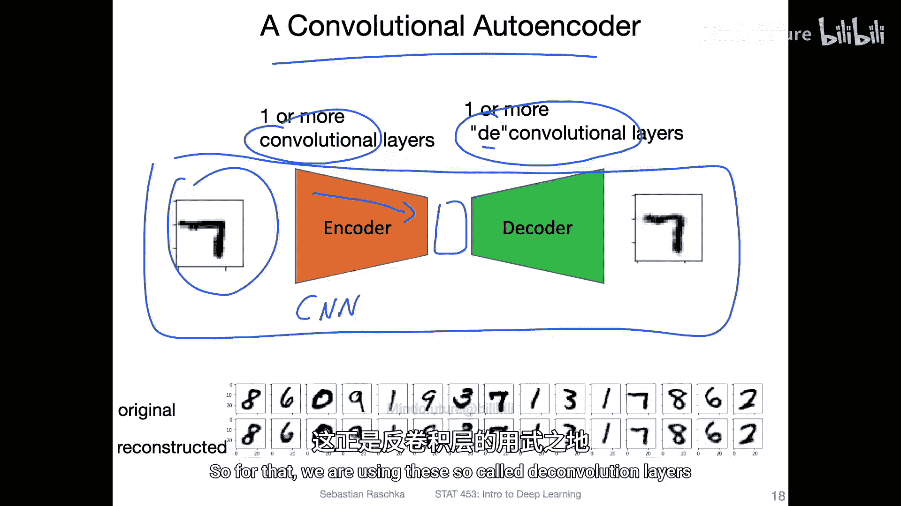

卷积自编码器在结构上与全连接自编码器相似，主要区别在于它使用卷积层作为编码器，并使用转置卷积层作为解码器。编码器通过卷积和池化操作将输入图像压缩为更小的潜在表示。解码器的任务则是将这个小的表示“还原”为原始尺寸的图像，这就需要一种能够“上采样”的操作，即转置卷积。

上一节我们介绍了自编码器的基本概念，本节中我们来看看如何将卷积操作应用于自编码器，并理解其逆向过程。

## 什么是转置卷积？🔄

转置卷积、反卷积或分数步长卷积，这些术语在深度学习中通常指代同一种操作：**增大输出的空间尺寸**。这与常规卷积（使输出变小）的目标相反。

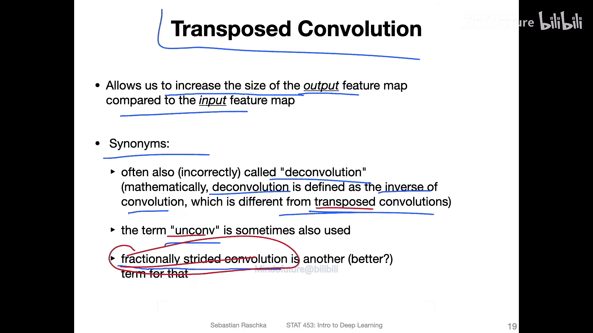

在数学上，严格的反卷积是卷积的逆运算。但在深度学习的实践中，我们通常只需要一个能实现上采样的卷积操作，而不必是精确的数学逆。因此，“转置卷积”这个名称更为常用，它形象地描述了从“小到大”的逆向过程。

## 转置卷积的工作原理

为了更好地理解，我们先回顾常规卷积，再对比转置卷积。

### 常规卷积（下采样）

考虑一个输入尺寸为 `5x5`，使用 `3x3` 卷积核且步长为 `2` 的卷积操作。其输出尺寸会减小为 `2x2`。卷积核在输入上滑动，每次计算一个输出值。

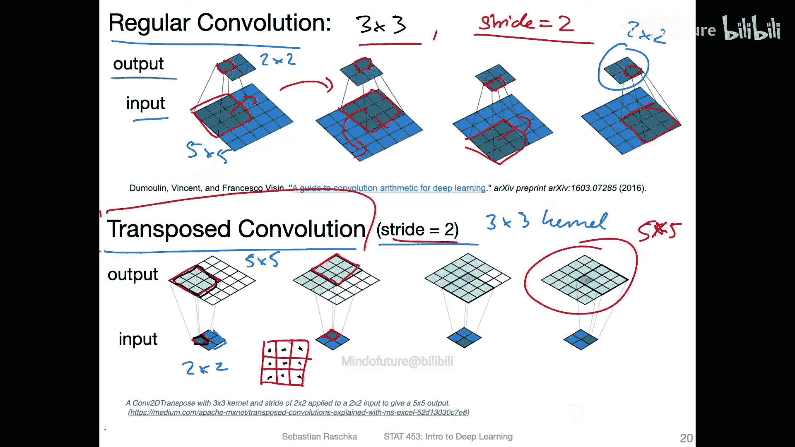

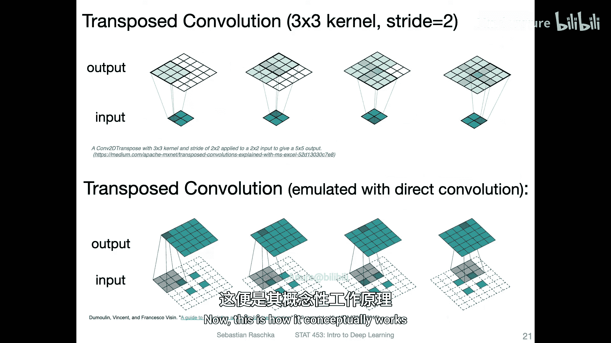

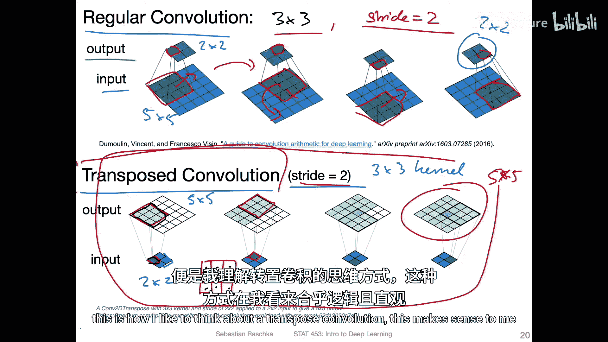

### 转置卷积（上采样）

现在，考虑其逆向过程：我们希望从一个 `2x2` 的输入，得到一个 `5x5` 的输出，同样使用 `3x3` 卷积核和步长 `2`。

**直观理解方式如下：**
1.  输入中的一个像素值，会与整个 `3x3` 卷积核的权重相乘，生成一个 `3x3` 的中间特征块。
2.  根据步长 `2`，将下一个输入像素对应的特征块放置在输出中向右移动2格的位置。
3.  重复此过程，最终这些特征块会叠加（在某些区域重叠），组合成更大的 `5x5` 输出特征图。

这种方式实现了从小图像到大图像的上采样。

## 转置卷积的实现方式

虽然上述方式易于理解，但在代码实现中，转置卷积通常通过**对输入进行填充和间隔后，再进行常规卷积**来模拟实现。这也解释了“分数步长卷积”这一名称的由来。

以下是两种视角的对比：
*   **直观视角**：输入像素“扩展”成卷积核大小的块，并按步长排列、叠加。
*   **实现视角（模拟）**：在输入特征图周围和内部元素之间添加特定的填充（Padding）和间隔，然后对其应用一个步长为1的常规卷积。

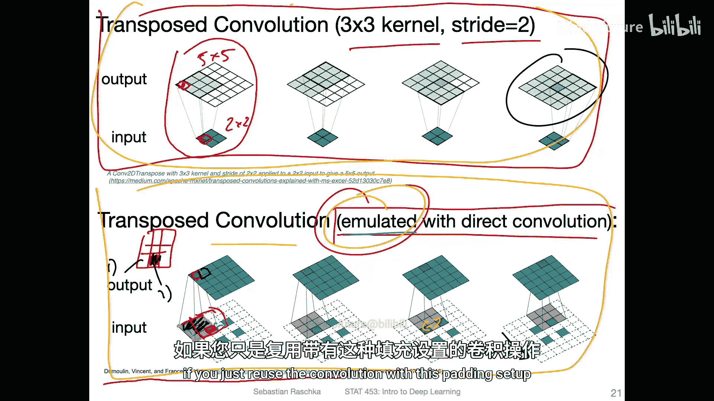

两种方式在数学上是等价的，最终都能实现上采样的效果。

## 输出尺寸计算公式 📏

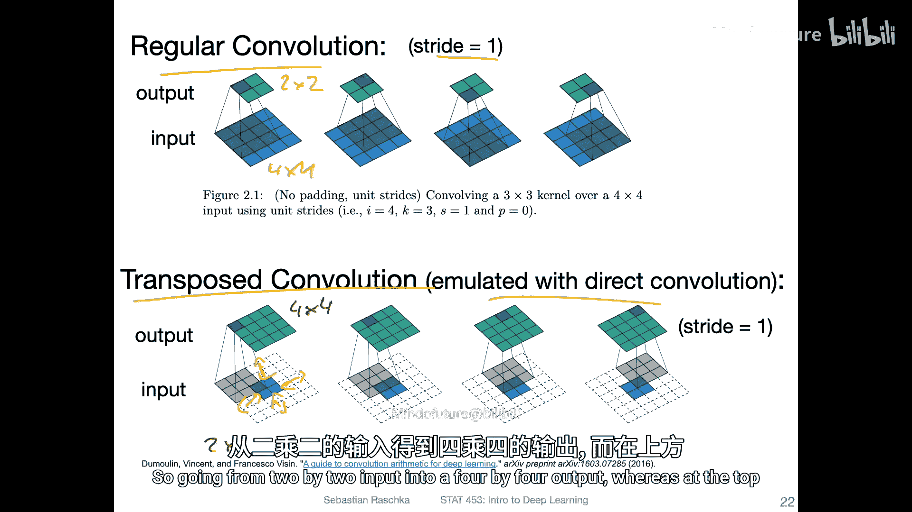

在PyTorch等框架中，可以使用以下公式计算转置卷积的输出尺寸：

**公式：**
`output_size = (input_size - 1) * stride - 2 * padding + kernel_size`

其中：
*   `input_size`: 输入特征图的高度或宽度。
*   `stride`: 步长。
*   `padding`: 填充。
*   `kernel_size`: 卷积核尺寸。

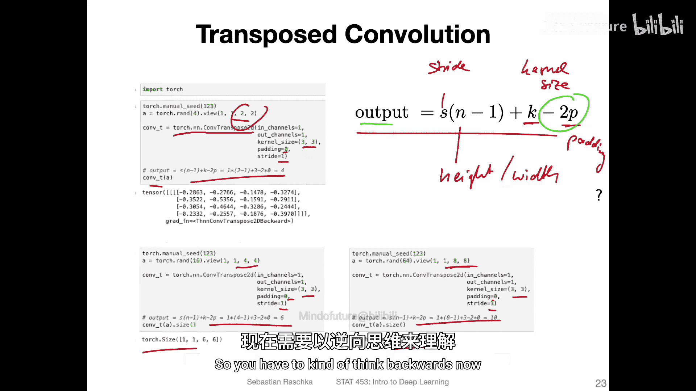

**注意**：在转置卷积中，**增加填充（padding）会增大输出尺寸**，这与常规卷积中填充会减小或维持输出尺寸的效果相反。

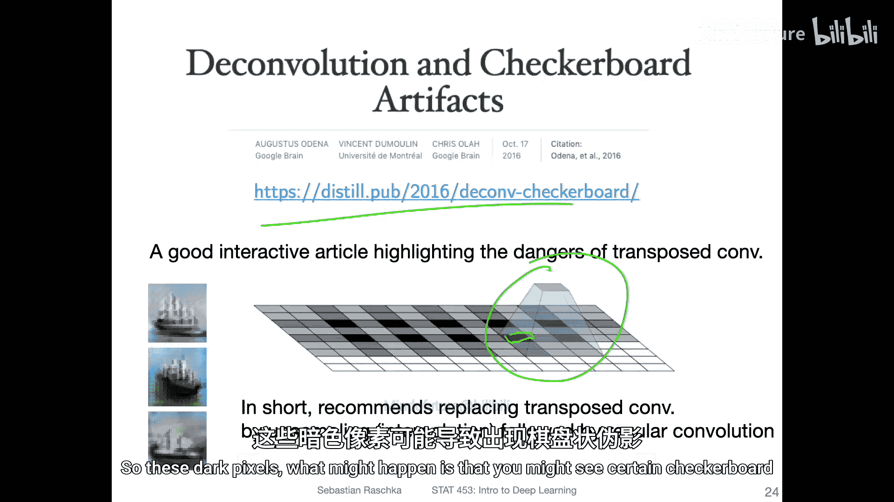

## 棋盘格效应与替代方案

在使用转置卷积时，一个潜在的问题是可能产生**棋盘格状伪影**。这是由于上采样过程中，特征块叠加时的不均匀重叠造成的，在生成的图像上表现为规则的格子状图案。

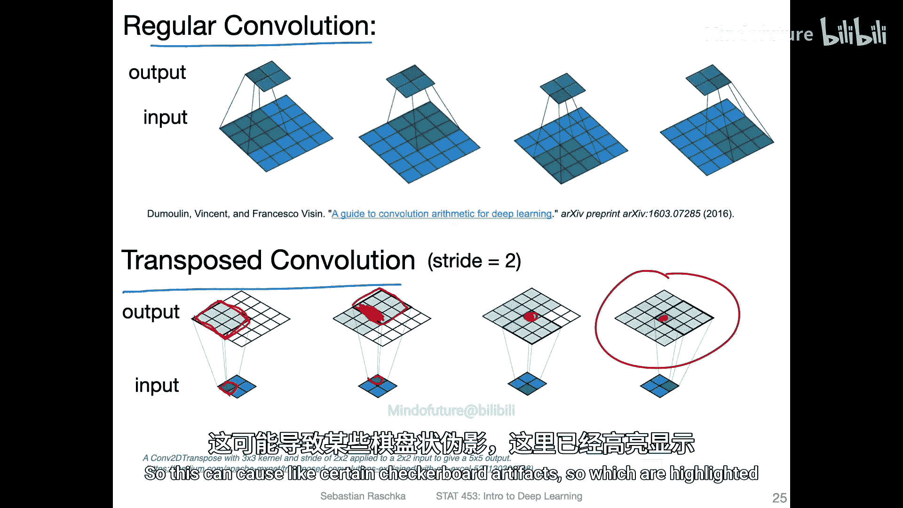

以下是解决此问题的常见方法：
*   **调整参数**：精心选择卷积核尺寸和步长，使其能整除，避免重叠。
*   **使用替代方案**：更稳健的方法是采用“上采样+常规卷积”的组合。
    1.  首先使用最近邻插值或双线性插值等方法将特征图放大到目标尺寸（上采样）。
    2.  然后使用一个步长为1的常规卷积层来平滑和细化放大后的特征图。

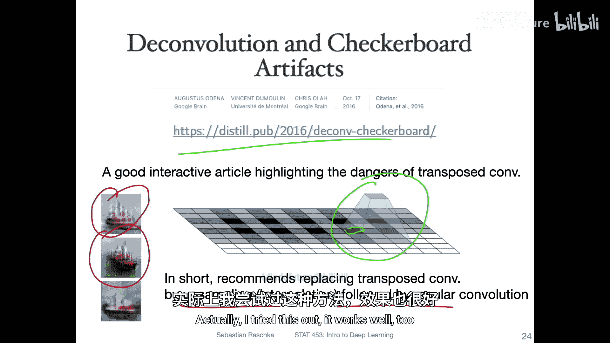

这种替代方案通常能有效避免棋盘格效应，在许多现代架构中都有应用。

## 总结

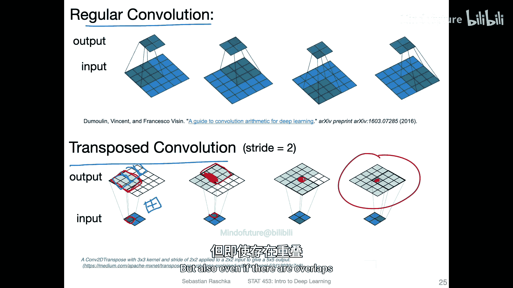

本节课中我们一起学习了卷积自编码器的解码关键——转置卷积。
*   我们了解了转置卷积的目的是实现上采样，将编码器压缩后的特征图还原为原始尺寸。
*   我们从直观和实现两个角度理解了其工作原理。
*   我们掌握了计算其输出尺寸的公式，并注意到其参数（如填充）对输出尺寸的影响与常规卷积相反。
*   最后，我们探讨了转置卷积可能带来的棋盘格效应，并学习了“上采样+卷积”这一实用替代方案。

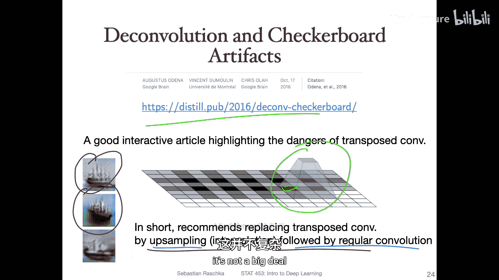

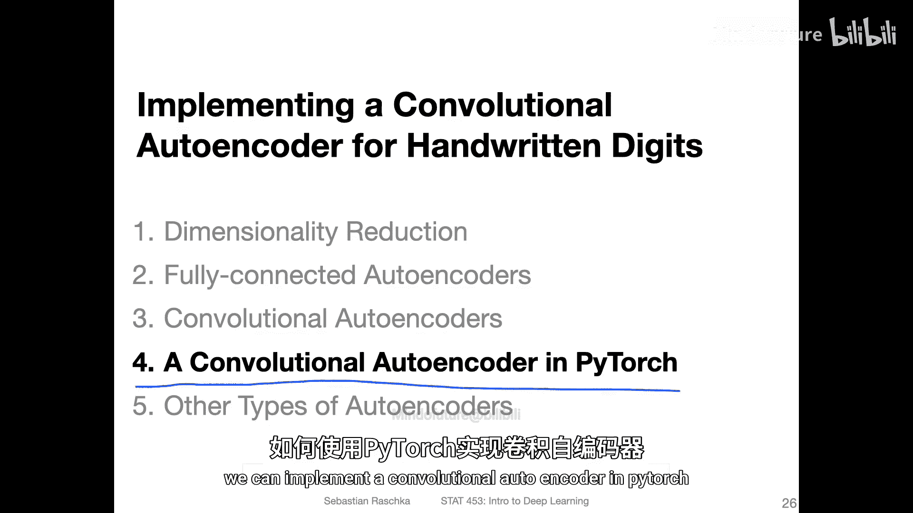

下一节，我们将使用PyTorch动手实现一个完整的卷积自编码器。