# 138：PyTorch中的卷积自编码器代码示例 🧠

在本节课中，我们将学习如何在PyTorch中实现一个卷积自编码器。我们将从导入必要的库开始，逐步构建模型，并解释其核心组件。最后，我们将训练模型并可视化结果，以理解自编码器如何压缩和重建图像。

---

## 导入库与设置

首先，我们导入所需的库。这包括PyTorch用于构建和训练模型，以及Matplotlib用于可视化结果。

```python
import watermark
import torch
import matplotlib.pyplot as plt
```

我们使用与之前相同的辅助函数和数据加载设置。这里我们只使用训练集，因为自编码器是无监督学习，我们只关心输入与重建输出之间的差异。

```python
# 数据加载设置
batch_size = 32
train_loader = ... # 加载MNIST训练集
```

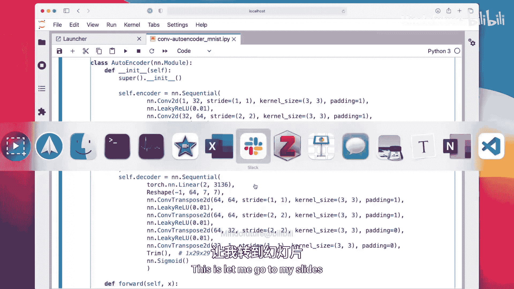

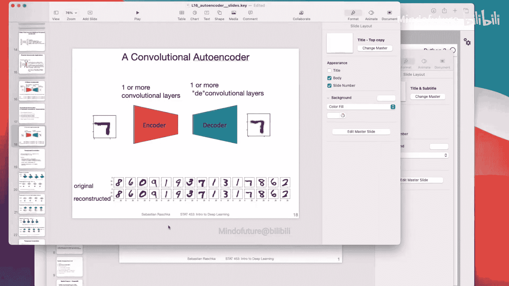

---

## 构建卷积自编码器模型

上一节我们介绍了自编码器的基本概念，本节中我们来看看如何用PyTorch实现一个卷积自编码器。我们将模型分为编码器和解码器两部分，这样便于后续单独使用它们。

以下是模型的核心结构定义：

```python
class ConvAutoencoder(torch.nn.Module):
    def __init__(self):
        super().__init__()
        # 编码器部分
        self.encoder = torch.nn.Sequential(
            torch.nn.Conv2d(1, 32, kernel_size=3),
            torch.nn.ReLU(),
            torch.nn.Conv2d(32, 64, kernel_size=3),
            torch.nn.ReLU(),
            torch.nn.Flatten(),
            torch.nn.Linear(3136, 2)  # 压缩到2维潜在空间
        )
        # 解码器部分
        self.decoder = torch.nn.Sequential(
            torch.nn.Linear(2, 3136),
            torch.nn.Unflatten(1, (64, 7, 7)),
            torch.nn.ConvTranspose2d(64, 32, kernel_size=3),
            torch.nn.ReLU(),
            torch.nn.ConvTranspose2d(32, 1, kernel_size=3),
            torch.nn.Sigmoid()  # 输出像素值在0-1之间
        )

    def forward(self, x):
        encoded = self.encoder(x)
        decoded = self.decoder(encoded)
        return decoded
```

编码器将28x28的灰度图像通过卷积层压缩为一个2维向量。解码器则尝试从这个2维向量重建出原始图像。使用Sigmoid激活函数是为了让输出像素值范围在0到1之间，与归一化的输入图像相匹配。

---

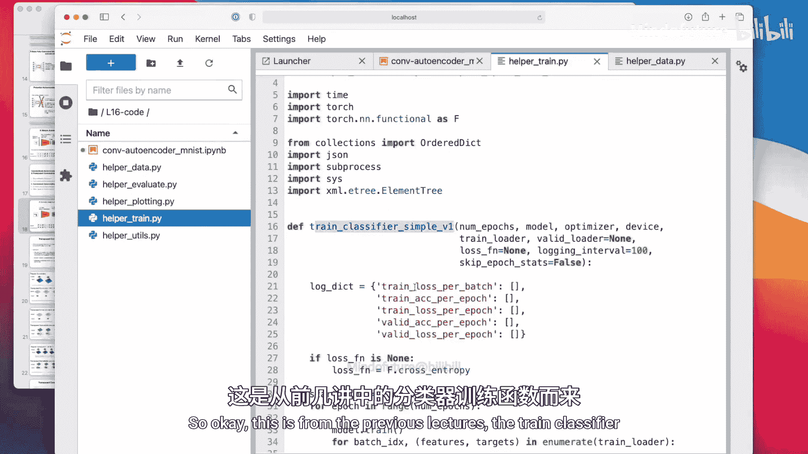

## 训练模型

现在，我们定义训练函数。与分类任务不同，自编码器的损失函数是输入图像与重建图像之间的均方误差。

以下是训练循环的核心部分：

```python
def train_autoencoder(model, train_loader, num_epochs=20):
    optimizer = torch.optim.Adam(model.parameters())
    criterion = torch.nn.MSELoss()  # 使用均方误差损失

    for epoch in range(num_epochs):
        for batch_idx, (features, _) in enumerate(train_loader):
            # 前向传播
            reconstructed = model(features)
            loss = criterion(reconstructed, features)

            # 反向传播与优化
            optimizer.zero_grad()
            loss.backward()
            optimizer.step()
```

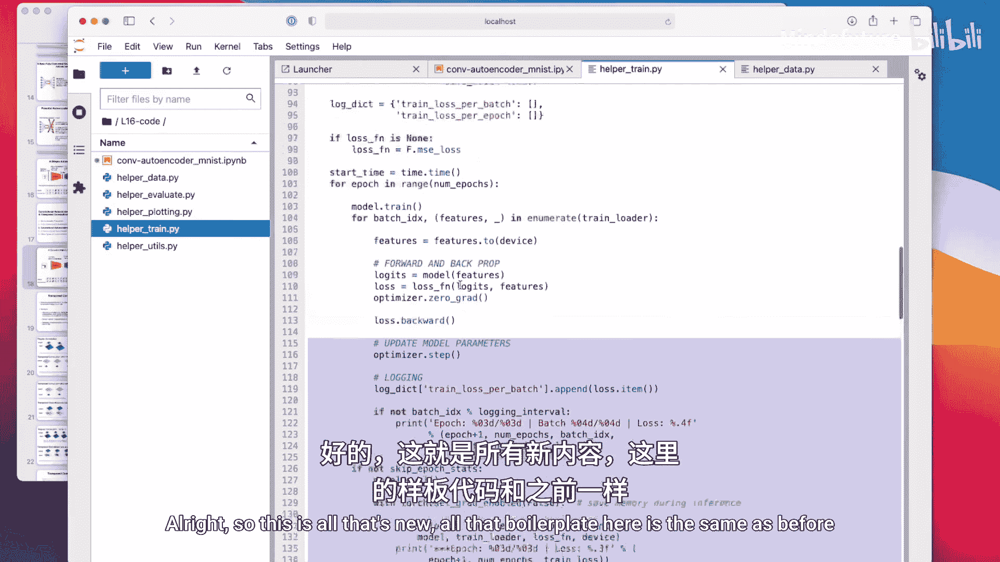

我们使用Adam优化器，训练20个周期。由于潜在空间只有2维，模型的重建结果会显得比较模糊，但这有助于我们理解信息压缩的极限。

---

## 可视化结果

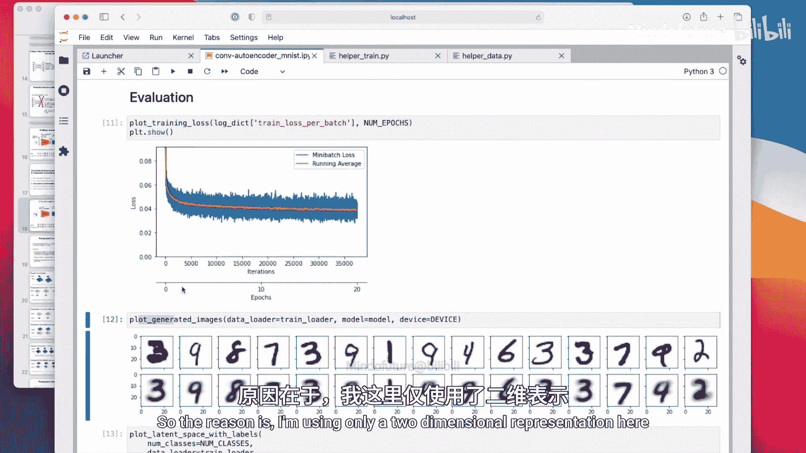

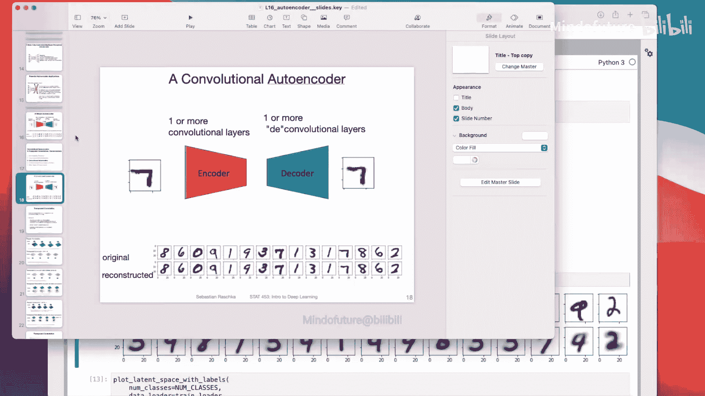

训练完成后，我们可以可视化原始图像与重建图像的对比，以及数据点在2维潜在空间中的分布。

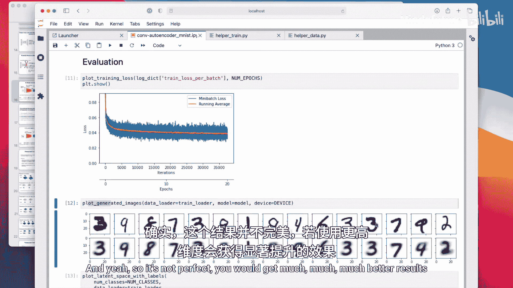

以下是可视化潜在空间的代码片段：

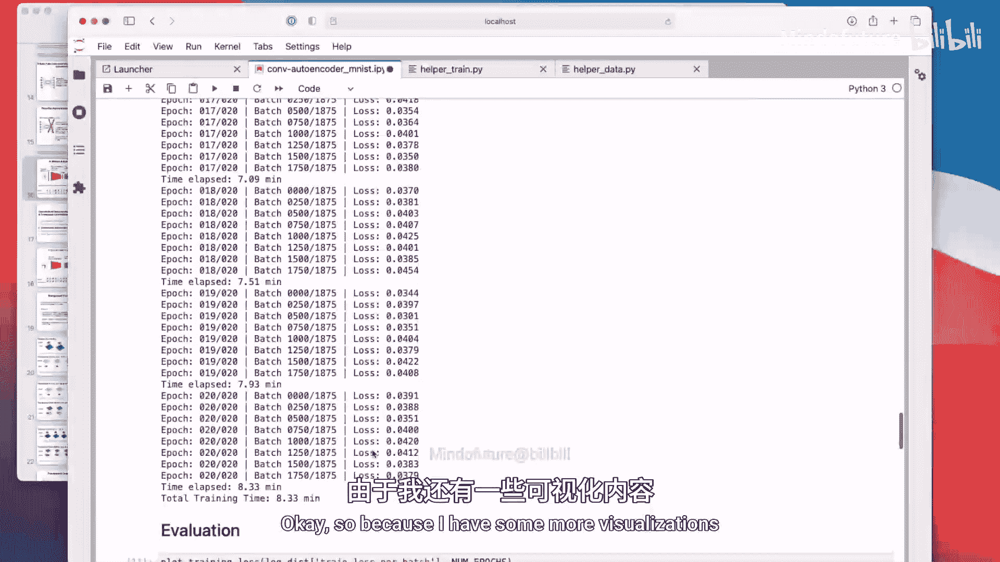

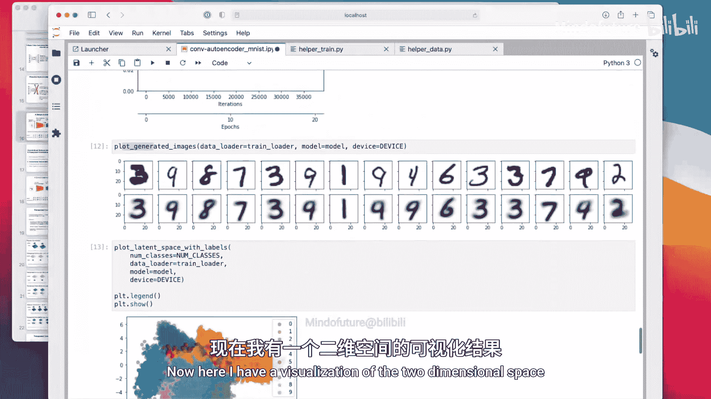

```python
def plot_latent_space(model, data_loader):
    model.eval()
    embeddings = []
    labels = []
    with torch.no_grad():
        for features, target in data_loader:
            encoded = model.encoder(features)
            embeddings.append(encoded)
            labels.append(target)
    # 将embeddings和labels转换为numpy数组并绘图
    # ... 绘图代码
```

在潜在空间图中，相似的数字（如所有“0”）会聚集在一起。然而，由于维度极低，不同类别的区域（如“8”和“9”）会有大量重叠，这解释了为什么模型有时会混淆它们。

---

## 使用解码器生成新图像

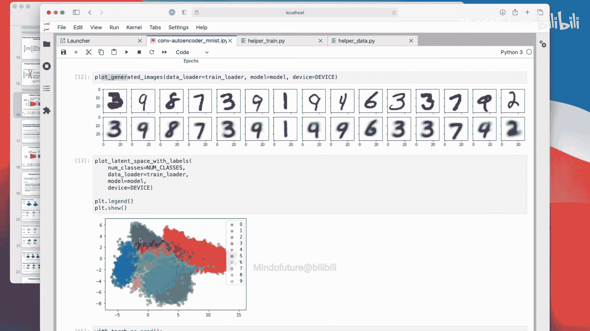

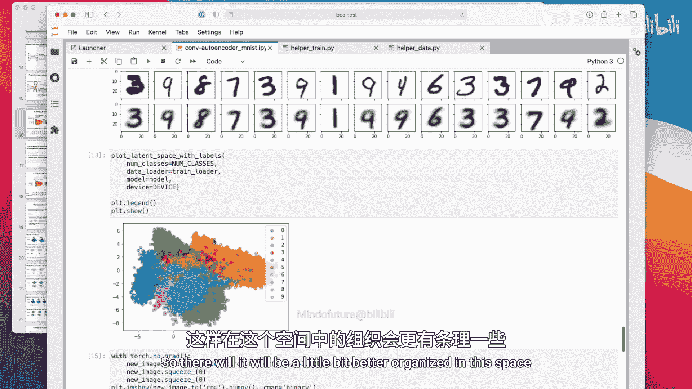

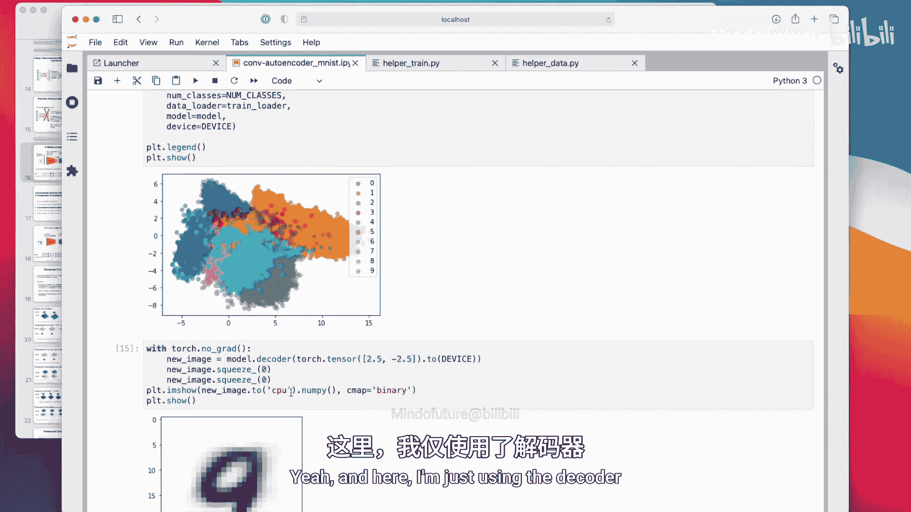

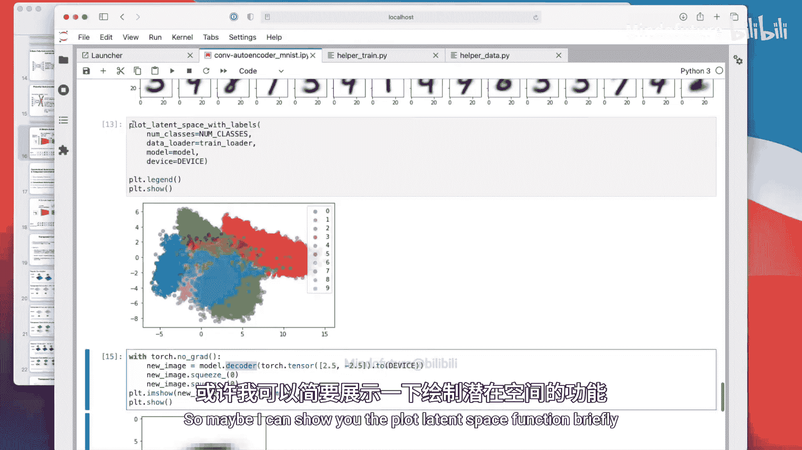

我们可以使用训练好的解码器，从潜在空间中的任意点生成新的图像。这展示了自编码器作为一种简单生成模型的能力。

以下是生成图像的示例：

```python
# 从潜在空间采样一个点，例如 (2.5, -2.5)
random_vector = torch.tensor([[2.5, -2.5]])
with torch.no_grad():
    generated_image = model.decoder(random_vector)
# 显示生成的图像
```

如果采样点位于训练数据分布之外，生成的图像可能看起来不真实或像是不同数字的混合体。这引出了对更先进模型（如变分自编码器）的需求，我们将在下一讲中介绍。

---

## 总结

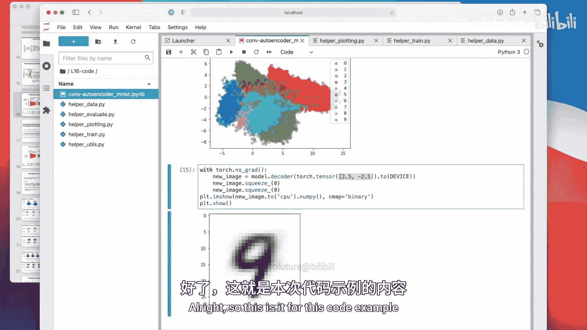

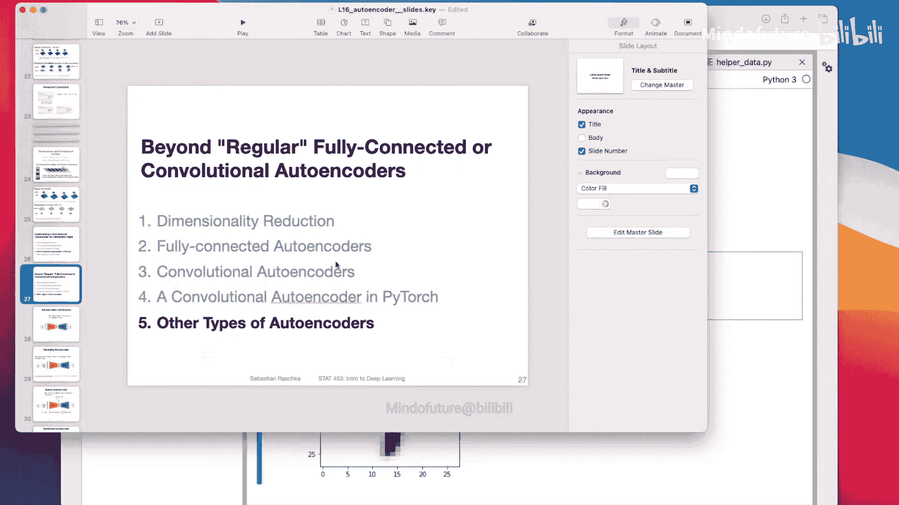

本节课中我们一起学习了如何在PyTorch中实现一个卷积自编码器。我们构建了将图像压缩到极低维度（2维）的编码器和试图重建图像的解码器。通过训练，我们观察到模型能够学习到数字的基本结构，但由于信息损失，重建结果较为模糊。我们还可视化并解释了2维潜在空间的结构，以及如何使用解码器从该空间生成新图像。这为理解更复杂的生成模型奠定了基础。