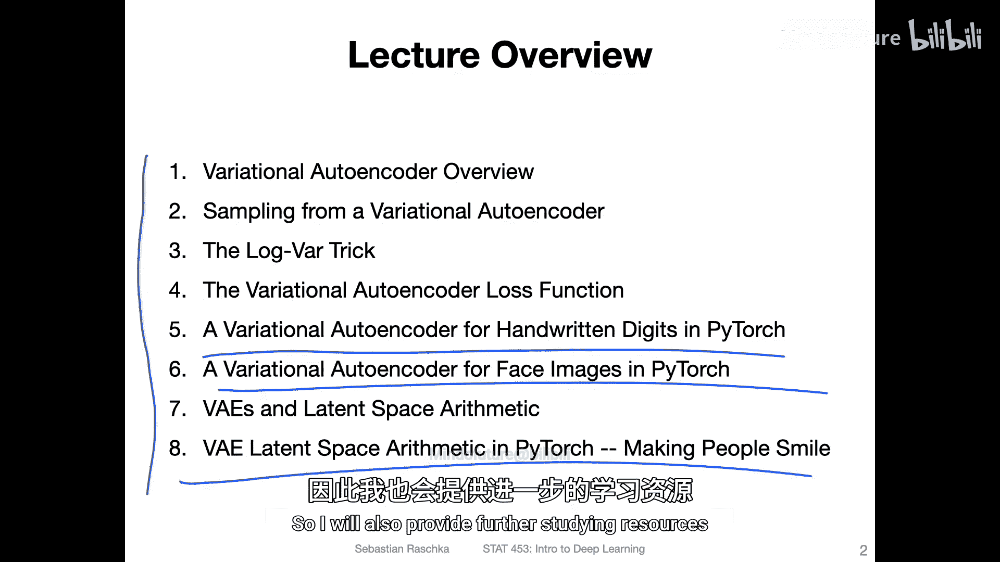
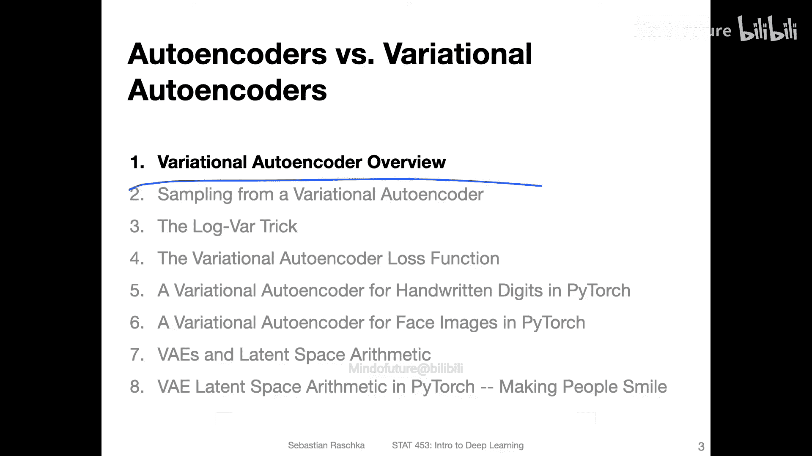

# 140：变分自编码器入门

在本节课中，我们将要学习一种特殊的自编码器——变分自编码器。它是一种强大的生成模型，能够从数据分布中采样并生成新的数据。

## 课程概述

上一节我们介绍了自编码器。自编码器是一种特殊的神经网络，由两部分组成：一个**编码器**，它接收输入并将其压缩为更低维度的表示；以及一个**解码器**，它接收这个低维表示并尝试重建输入。

我展示了一个例子，从低维空间中随机抽取坐标，并使用解码器生成与训练数据相似的新图像。因此，我们可以将其视为生成新数据的一种方式。

然而，当我们讨论更高维度的空间时，如果低维空间超过二维，这种方法效果不佳，因为存在一些挑战。我将在本次讲座中详细讨论这些挑战。

所以，本次讲座总体而言，我想讨论一种特定类型的自编码器，称为**变分自编码器**。这种变分自编码器在采样新数据方面表现更好。你可以将变分自编码器视为一种生成模型，我们可以用它从分布中采样并生成新数据。

因此，它是一种经过修改的自编码器版本，特别适合创建新数据。在深入探讨其工作原理之前，让我先给出讲座概述，然后我们将逐步学习变分自编码器的工作原理。当然，我也会再次展示一些代码示例，主要是MNIST数据集示例，但更有趣的是，我们将观察一个包含人脸图像的数据集，并学习如何让人脸“微笑”。

好的，我们开始吧。

## 今日主题

以下是今天要讨论的主题。真的不用担心，虽然看起来有8个主题，但这次我会尽量简短。我知道，我们的课程时间有限，学期只剩下几天了。你们都在忙于课程项目和其他课程，我理解这一点。所以我不想在学期末把事情搞得太复杂，只想给你们一个关于变分自编码器是什么的大致概述。

我只准备了25张幻灯片。我非常有信心能在我们常规的75分钟讲座时间内完成这次讲座。当然，我也有代码示例。

通过这次讲座，我希望给你们一个关于变分自编码器如何工作的大致概述。我也会提供一些未来的参考资料，如果你们感兴趣的话。因为变分自编码器背后也有很多数学基础，我们无法在这次讲座中涵盖，但你们中的一些人可能会对此感兴趣，所以我会提供进一步的学习资源。

好的，在下一个视频中，我们将从变分自编码器的概述开始。

本节课中我们一起学习了变分自编码器的基本概念及其作为生成模型的潜力。我们了解到，与标准自编码器相比，变分自编码器通过引入概率分布，能够更有效地在高维潜在空间中生成新的、合理的数据样本。