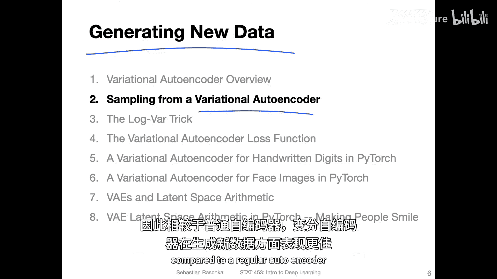
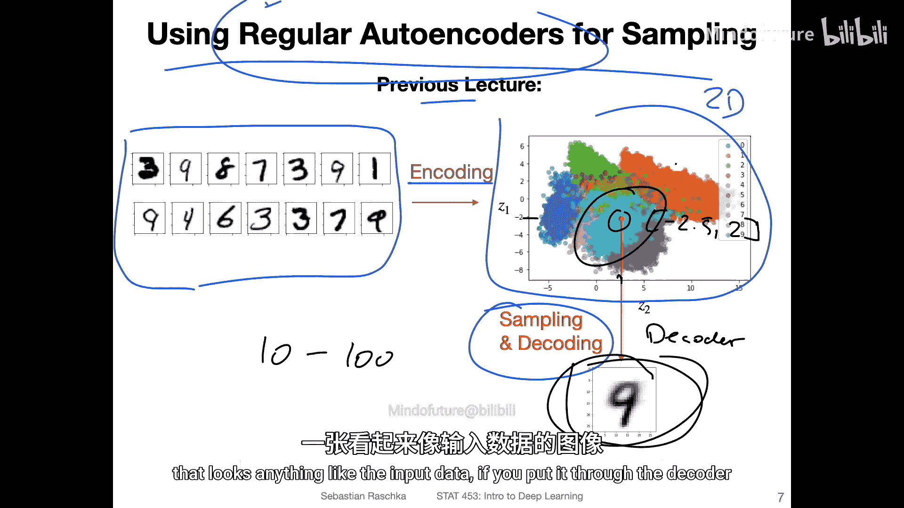
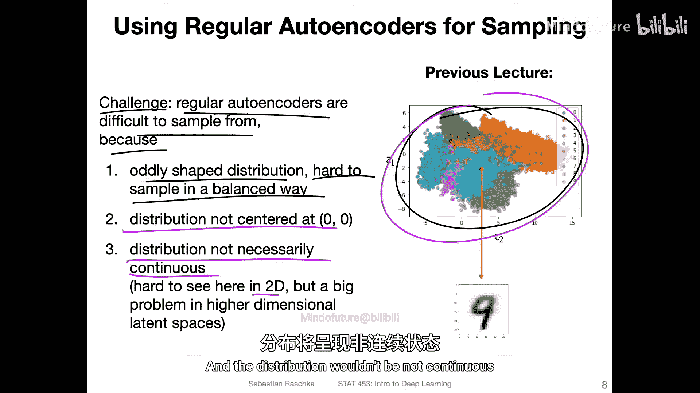
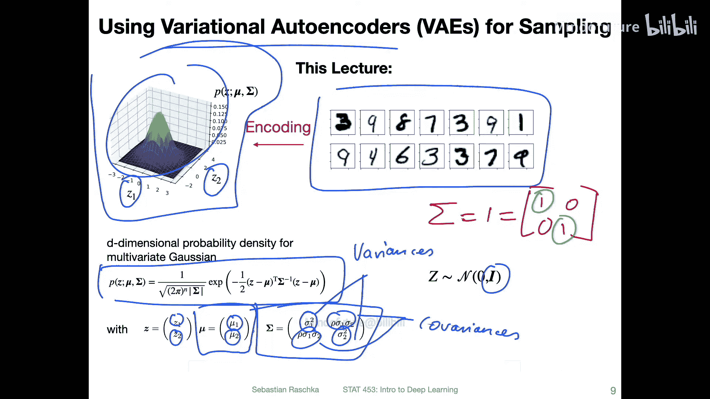
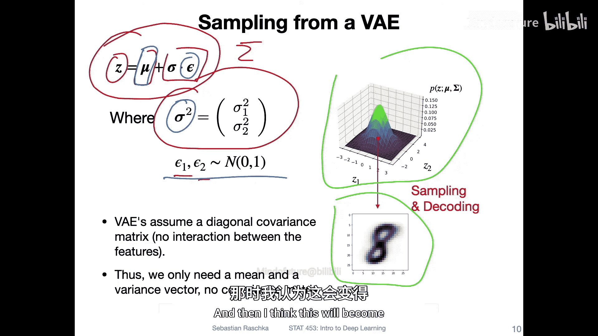
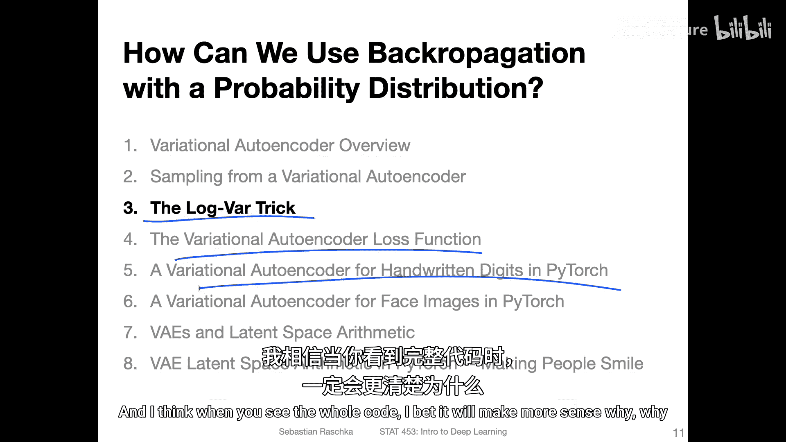
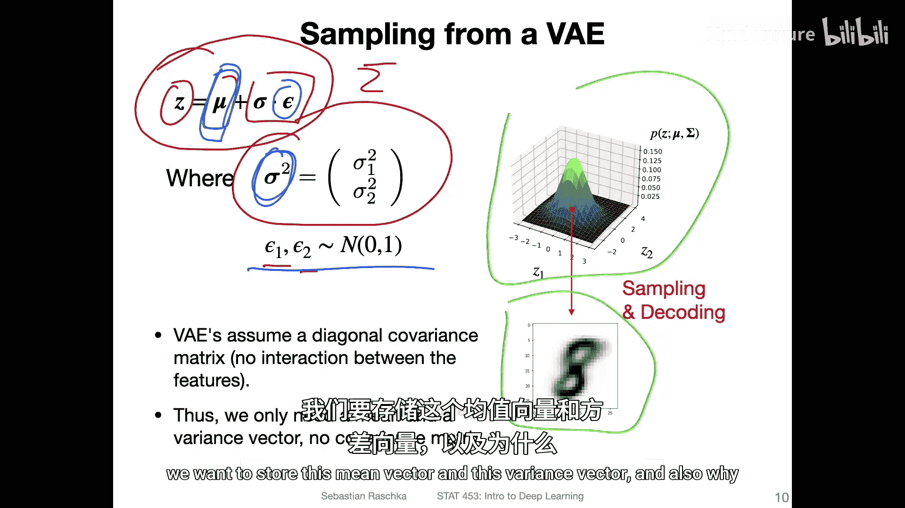
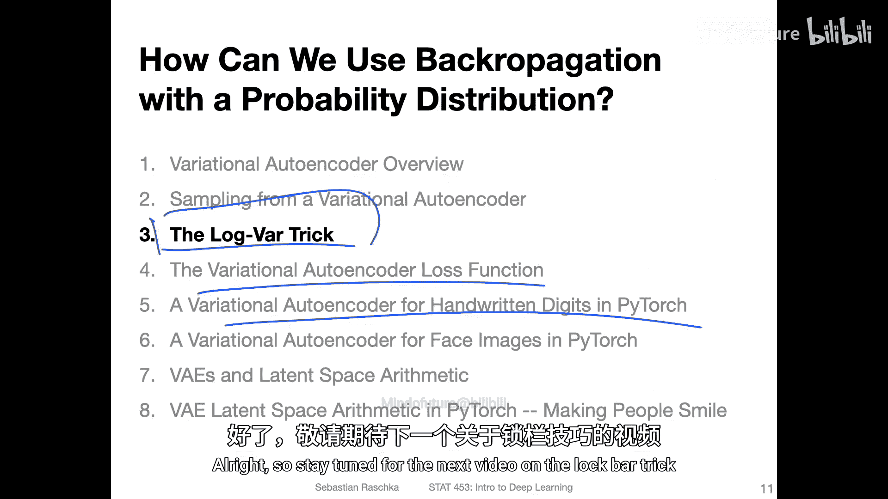

# 142：从变分自编码器采样 🎲



在本节课中，我们将探讨为什么变分自编码器在生成新数据方面优于普通自编码器。我们将逐步分析普通自编码器在采样时遇到的问题，并解释变分自编码器如何通过约束潜在空间的分布来解决这些问题。

## 普通自编码器的采样问题

上一节我们介绍了普通自编码器的基本结构。本节中我们来看看使用普通自编码器进行采样时面临的挑战。

在之前的讲座中，我们使用MNIST数据集，并通过编码器将其映射到一个二维的潜在空间。选择二维主要是为了可视化方便，实际上潜在空间的维度可以是任意的。通常，潜在空间的维度会小于输入维度，但更大的潜在空间能保留更多信息，从而有助于生成更好的重构图像。

在之前的代码示例中，我们观察了这个二维潜在空间，并随意选取了一个点（例如坐标 `(-2.5, 2)`）输入解码器，得到了一个手写数字图像。这个二维空间在特定区域看起来是连续且密集的。



然而，这只是因为维度很低。如果我们使用更高维度的潜在空间（例如10维或100维），数据点之间的距离会变得非常远，整个空间将不再是连续的。此时，如果随机选取一个高维空间中的点输入解码器，并不能保证生成一个看起来像有效输入数据的图像。

以下是普通自编码器采样时的主要问题：

*   **分布形状不规则**：潜在空间的分布可能形状怪异，没有固定模式，这使得均匀采样变得非常困难。
*   **分布位置不固定**：分布可能位于空间的任意位置，而非以原点为中心。
*   **分布不连续**：在高维空间中，数据点可能非常稀疏，导致分布不连续，存在大量“空白”区域。

因此，普通自编码器虽然擅长数据压缩，但在生成与训练数据相似的新数据方面表现不佳。

## 变分自编码器的解决方案



现在，让我们考虑变分自编码器。我们仍然使用相同的MNIST数据集，但在训练变分自编码器时，我们强制其潜在空间的分布服从**标准多元高斯分布**。

这里我们仍然以二维为例，但其维度同样是任意的。标准多元高斯分布的概率密度函数由均值向量和协方差矩阵决定。在变分自编码器中，我们通常假设协方差矩阵是一个**对角矩阵**，更具体地说，是一个**单位矩阵**。这意味着各个维度之间没有相关性（协方差为0），且每个维度的方差都为1。

其公式表示为：
`z ~ N(μ, σ²I)`
其中，`μ` 是均值向量，`σ²` 是方差向量，`I` 是单位矩阵。



由于我们明确了潜在空间的分布是连续的标准高斯分布，因此可以方便地从中采样。当我们从这个分布中抽取样本并输入解码器时，可以期望解码器生成合理的输出，因为这个分布是连续且没有间隙的。

## 采样方法与重参数化技巧

那么，我们如何从这个分布中采样呢？采样过程遵循以下公式：
`z = μ + σ ⊙ ε`
其中：
*   `μ` 是学习到的均值向量。
*   `σ` 是学习到的标准差向量（方差向量的平方根）。
*   `⊙` 表示逐元素相乘。
*   `ε` 是从标准正态分布中采样的随机噪声，即 `ε ~ N(0, I)`。

在实现中，编码器网络会输出 `μ` 和 `log(σ²)`（即对数方差）两个向量。使用对数方差是为了训练稳定性。然后，我们利用**重参数化技巧**来生成样本 `z`，这使得我们能够通过反向传播来训练均值和对数方差这两个参数，尽管采样过程本身是随机的。

具体代码如下所示（概念性）：
```python
# 编码器输出均值和对数方差
mu, log_var = encoder(x)
# 计算标准差
std = torch.exp(0.5 * log_var)
# 从标准正态分布采样随机噪声
eps = torch.randn_like(std)
# 使用重参数化技巧得到样本z
z = mu + eps * std
# 将z输入解码器
reconstructed = decoder(z)
```
关于重参数化技巧的详细原理和损失函数的构成，我们将在下一个视频中深入探讨，并结合PyTorch代码示例使其更加清晰。



## 总结







本节课中我们一起学习了变分自编码器相对于普通自编码器在数据生成方面的优势。关键在于，变分自编码器通过约束潜在空间服从标准高斯分布，解决了普通自编码器潜在空间分布不规则、不连续导致的采样困难问题。我们介绍了从该分布采样的公式 `z = μ + σ ⊙ ε` 以及实现中关键的重参数化技巧，为后续的代码实现打下了基础。