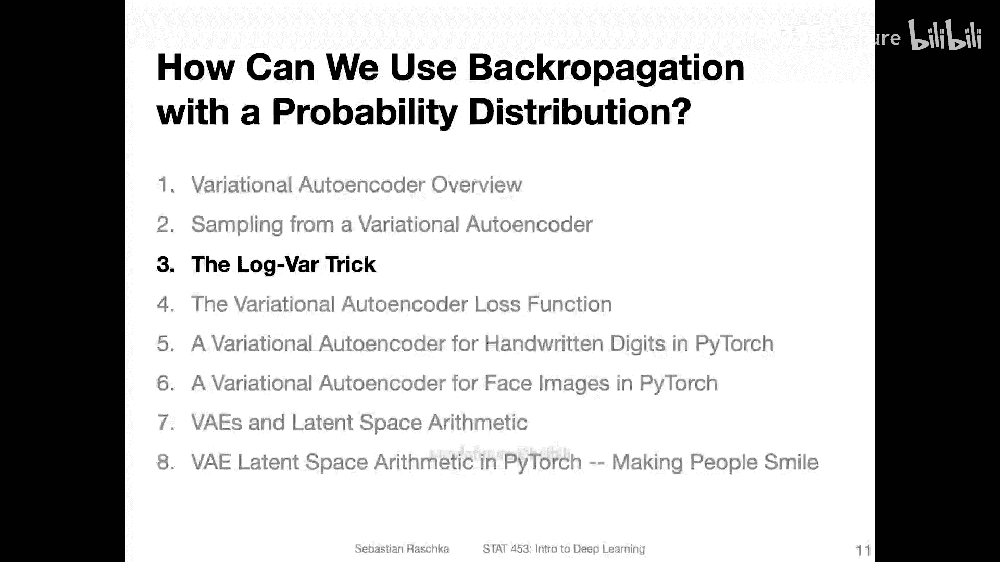
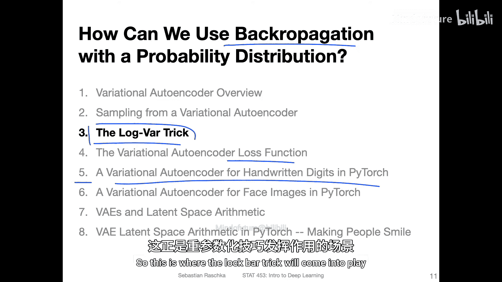
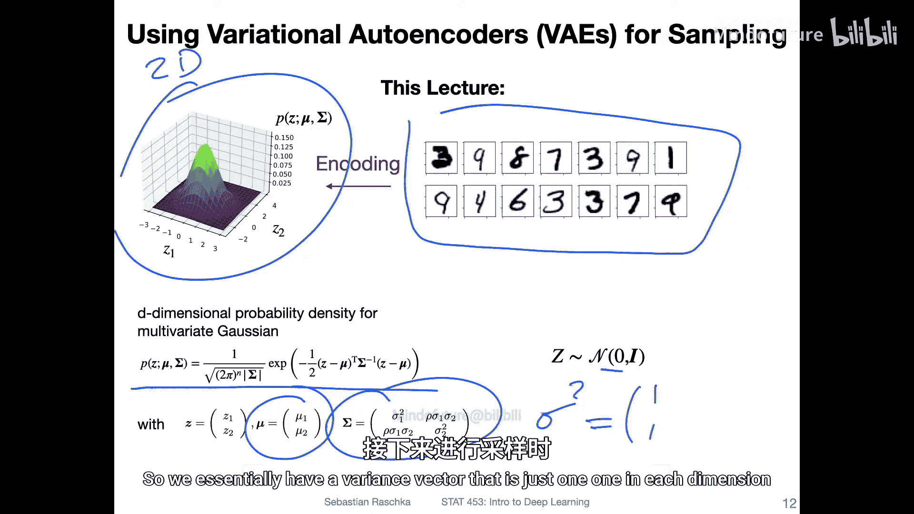
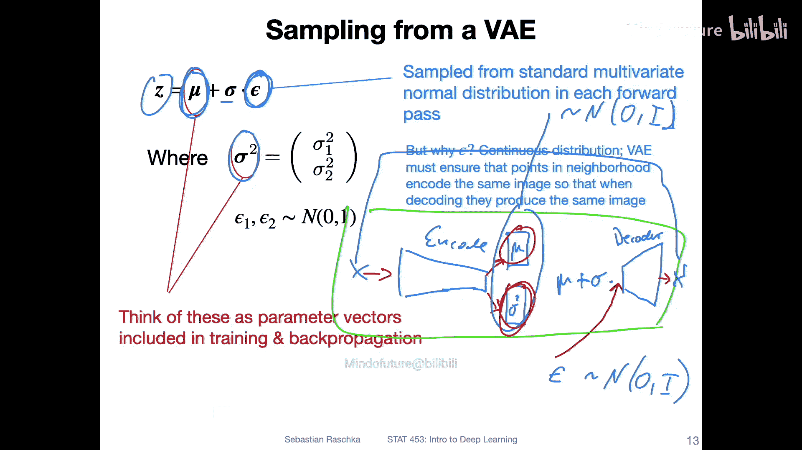
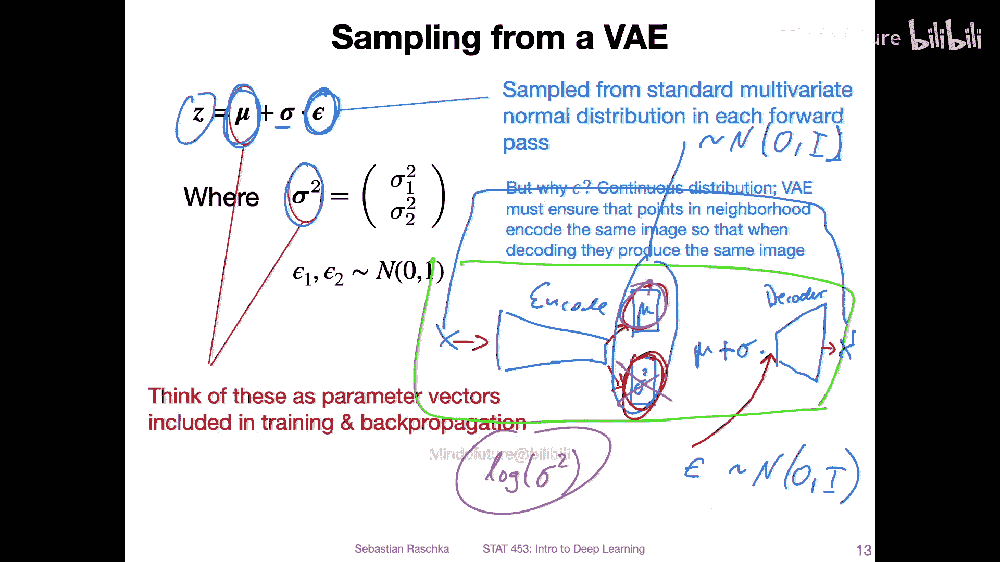
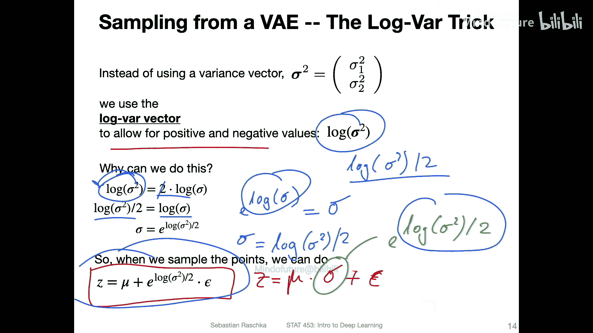
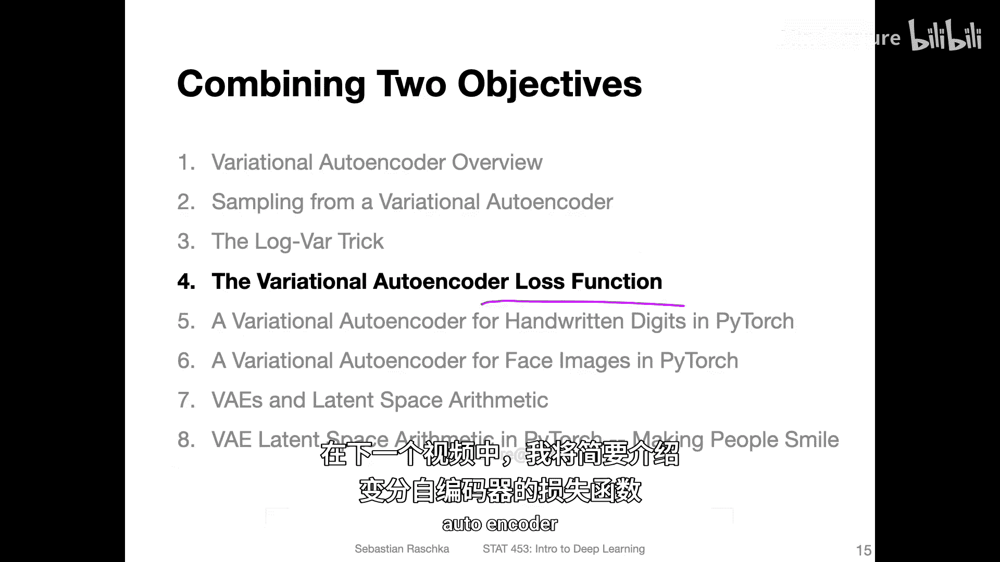

# 143：对数方差技巧

在本节中，我们将探讨变分自编码器实现中的两个关键点：损失函数和“重参数化技巧”。我们将首先解释重参数化技巧，然后在后续的代码示例中具体展示其应用。

## 重参数化技巧简介

变分自编码器本质上仍是一个神经网络，我们需要使用反向传播来训练它。然而，网络中间层涉及从概率分布中采样，这是一个随机过程。这带来了一个问题：我们如何通过一个随机变量进行反向传播？这正是重参数化技巧要解决的问题。

在深入细节之前，让我们简要回顾上一节的内容。

## 回顾：潜在空间分布

上一节我们讨论过，在训练变分自编码器时，我们希望其潜在表示遵循一个标准多元高斯分布。这意味着潜在空间的分布将是一个均值为零、方差为单位矩阵的多元高斯分布。

其概率密度函数如下，这里以一个二维高斯分布为例，它具有均值向量 **μ** 和协方差矩阵 **Σ**。因为是标准正态分布，所以 **μ** 是零向量，**Σ** 是单位矩阵 **I**，这意味着各维度间没有交互，每个维度的方差都是1。

## 采样过程

理解采样过程可能有些挑战。在变分自编码器的网络中，采样按以下方式进行：

1.  编码器网络会输出两个向量：一个均值向量 **μ** 和一个方差向量 **σ²**。
2.  我们从标准正态分布中独立采样一个随机向量 **ε**，即 **ε ~ N(0, I)**。
3.  我们通过以下公式生成一个潜在空间样本 **z**：
    **z = μ + σ ⊙ ε**
    其中 **⊙** 表示逐元素相乘。

这个 **z** 随后被送入解码器，生成重构数据 **x'**。我们的目标有两个：一是最小化原始输入 **x** 与重构输出 **x'** 之间的差异（重构损失）；二是让潜在变量 **z** 的分布接近标准正态分布（通过KL散度衡量）。我们将在下一节详细讨论损失函数。

## 为何使用对数方差？

在上一节的描述中，网络直接学习方差向量 **σ²**。但在实际实现中，我们通常学习**对数方差**向量 **log(σ²)**。

为什么要这样做？如果直接学习方差 **σ²**，它只能取正值。这在反向传播过程中可能使学习变得不稳定。相反，学习 **log(σ²)** 允许其值在正负区间内自由变化，这通常能使训练过程更稳定、更高效。

## 使用对数方差的采样公式

当我们使用对数方差时，采样公式需要进行相应的调整。新的采样公式如下：
**z = μ + exp(log(σ²) / 2) ⊙ ε**

这个公式是如何推导出来的？让我们逐步分析：

1.  首先，我们知道标准差 **σ** 是方差的平方根：**σ = sqrt(σ²)**。
2.  对等式两边取对数：**log(σ) = log(sqrt(σ²)) = (1/2) * log(σ²)**。
3.  因此，**σ = exp(log(σ)) = exp((1/2) * log(σ²))**。

所以，**exp(log(σ²) / 2)** 就等价于标准差 **σ**。这样，我们就用可正可负的 **log(σ²)** 替换了必须为正的 **σ²**，同时保持了采样过程的数学等价性。

## 网络结构对应调整

因此，在网络结构中，编码器不再直接输出均值向量 **μ** 和方差向量 **σ²**，而是输出均值向量 **μ** 和**对数方差**向量 **log_var**（即 **log(σ²)**）。

## 过渡到下一部分

如果以上描述仍显得抽象，请不要担心。在接下来的代码示例中，这一切将变得清晰具体。

下一节，我们将简要讨论变分自编码器的损失函数，然后最终看到第一个实际的代码示例。

## 本节总结

在本节中，我们一起学习了变分自编码器中的**重参数化技巧**。我们了解到，为了通过随机采样层进行反向传播，我们不是直接采样，而是通过一个可微的确定性变换（**z = μ + σ ⊙ ε**）来实现。同时，为了训练稳定性，网络实际输出的是**对数方差 log(σ²)** 而非方差本身，并在采样时通过 **σ = exp(log(σ²) / 2)** 进行转换。这为接下来理解损失函数和查看完整代码实现奠定了基础。