# 147：PyTorch中的VAE潜在空间算术 😊

在本节课中，我们将学习如何使用变分自编码器（VAE）的潜在空间进行算术操作，以实现对人脸图像的属性编辑，例如让人物微笑或戴上眼镜。

上一节我们介绍了VAE的基本原理和训练过程。本节中，我们来看看如何利用训练好的VAE模型，通过操作其潜在空间中的向量来修改生成图像的特定属性。

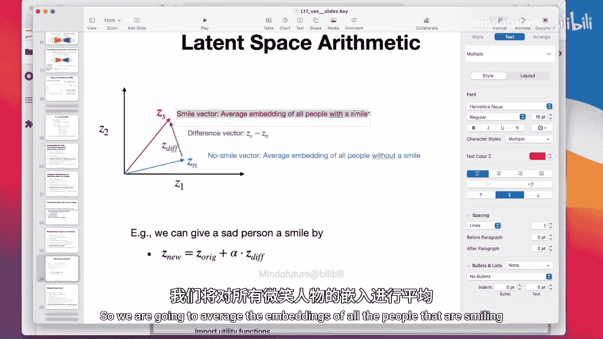

## 核心概念：潜在空间算术

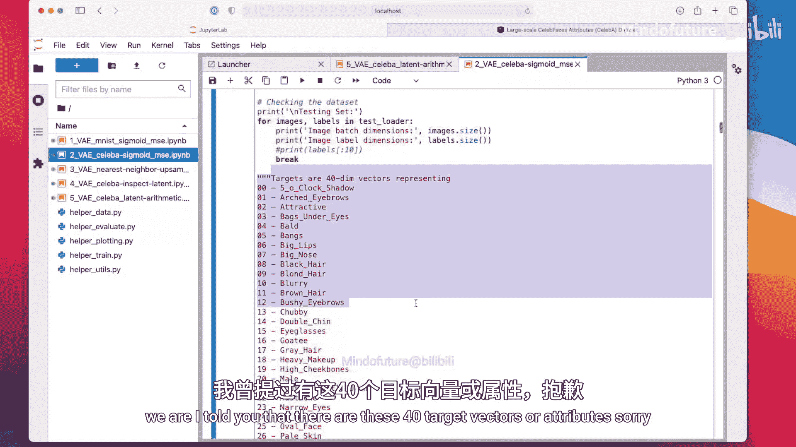

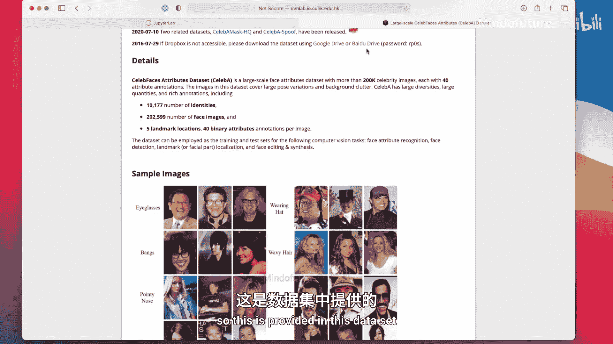

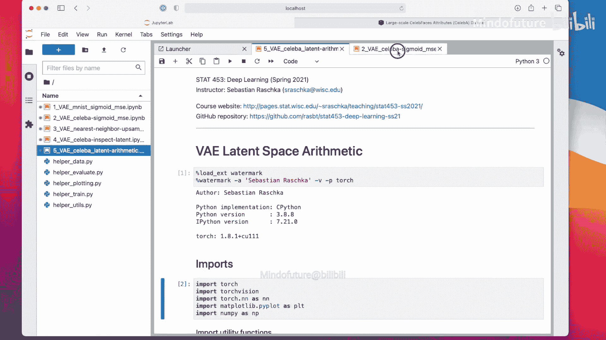

潜在空间算术的核心思想是，在VAE学习到的紧凑、连续的潜在表示中，某些方向对应着具体的语义属性。通过计算并沿着这些方向移动潜在向量，我们可以可控地改变生成图像的属性。

其基本公式可以概括为：
**新潜在向量 = 原始潜在向量 + α × 属性方向向量**

其中，`α` 是一个缩放因子，控制属性改变的强度。

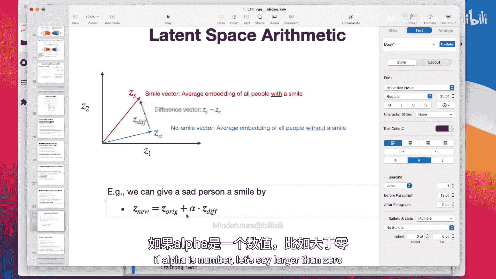

## 实现步骤概述

以下是实现“让人微笑”效果的主要步骤：

1.  **计算属性方向向量**：首先，我们需要在潜在空间中找到一个代表“微笑”属性的方向。
2.  **编辑潜在向量**：对于任意一张人脸图像的潜在编码，我们沿着“微笑”方向移动它。
3.  **解码生成新图像**：将修改后的潜在向量输入VAE的解码器，生成具有新属性（更微笑）的图像。

接下来，我们将详细分解这些步骤。

### 第一步：计算“微笑”方向向量

为了找到“微笑”在潜在空间中的方向，我们需要利用数据集中标注的标签。CelebA数据集提供了40个二元属性标签，其中第31个是“微笑”（Smiling）。

以下是计算“微笑”方向向量的逻辑：

1.  遍历数据集，筛选出所有“微笑”属性为真（`smiling=True`）的图像。
2.  将这些图像输入VAE编码器，得到它们的潜在向量（嵌入）。
3.  计算所有这些“微笑”潜在向量的平均值，得到“微笑中心”向量。
4.  同理，计算所有“不微笑”图像的潜在向量平均值，得到“无微笑中心”向量。
5.  “微笑”方向向量即为：`微笑中心向量 - 无微笑中心向量`。

在代码中，我们通过一个函数来实现上述计算过程。该函数的核心部分如下：

```python
def compute_average_faces(loader, feature_idx, encoding_fn=None):
    avg_with_feature = 0
    avg_without_feature = 0
    count_with = 0
    count_without = 0

    for images, labels in loader:
        # 根据标签筛选具有特定属性（如微笑）的图像
        has_feature = labels[:, feature_idx].bool()
        images_with_feature = images[has_feature]
        images_without_feature = images[~has_feature]

        # 使用编码函数获取潜在向量（若未提供，则使用原始图像）
        if encoding_fn is not None:
            emb_with = encoding_fn(images_with_feature)
            emb_without = encoding_fn(images_without_feature)
        else:
            emb_with = images_with_feature
            emb_without = images_without_feature

        # 累加向量和计数
        avg_with_feature += emb_with.sum(dim=0)
        avg_without_feature += emb_without.sum(dim=0)
        count_with += len(images_with_feature)
        count_without += len(images_without_feature)

    # 计算平均值
    avg_with_feature /= count_with
    avg_without_feature /= count_without

    return avg_with_feature, avg_without_feature
```

### 第二步：在原始像素空间与潜在空间的对比

在深入潜在空间操作前，我们可以先尝试在原始像素空间进行类似的“平均脸”加减法。例如，计算所有微笑人脸的平均图像和所有不微笑人脸的平均图像，得到它们的差异图像。然后将这个差异图像加到一张中性人脸上。

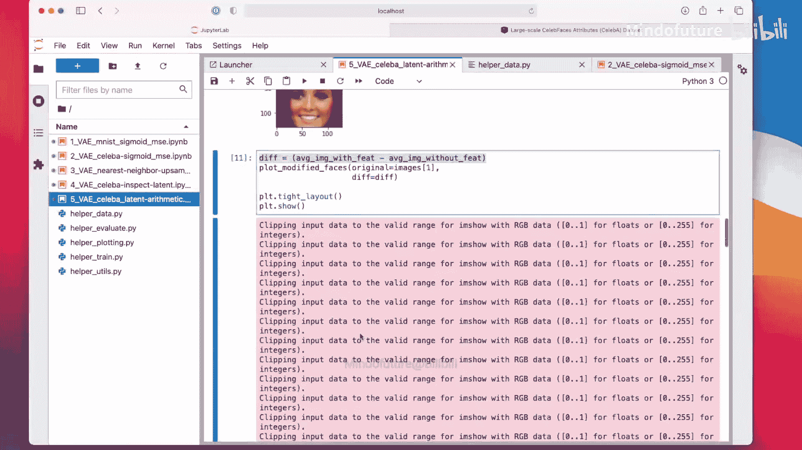

这种方法有时能产生粗略的效果，但通常会导致图像模糊、失真，因为它没有理解图像的高级语义结构。这凸显了在结构化的潜在空间中进行操作的优势。

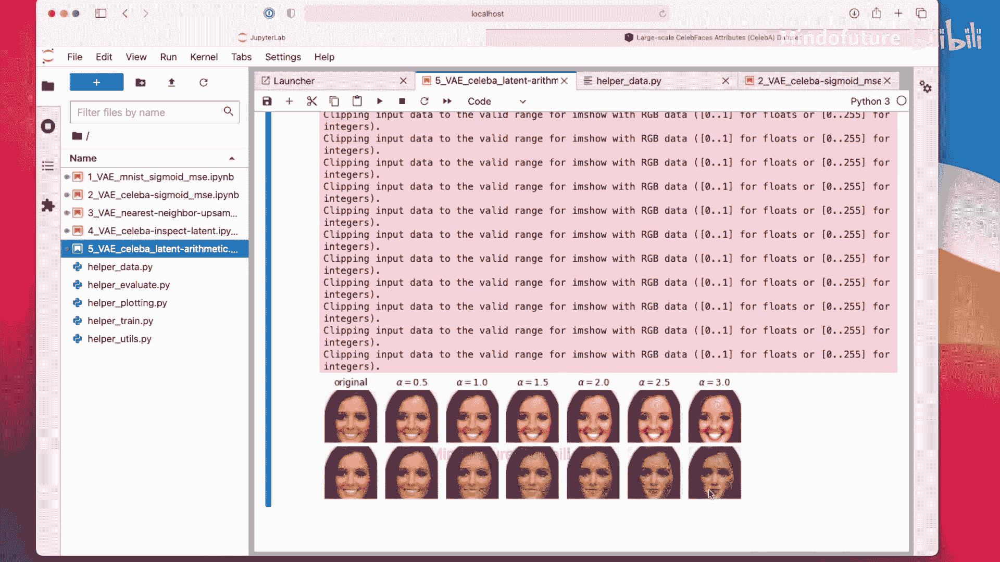

### 第三步：在潜在空间中编辑人脸

现在，我们使用训练好的VAE在潜在空间中进行操作。

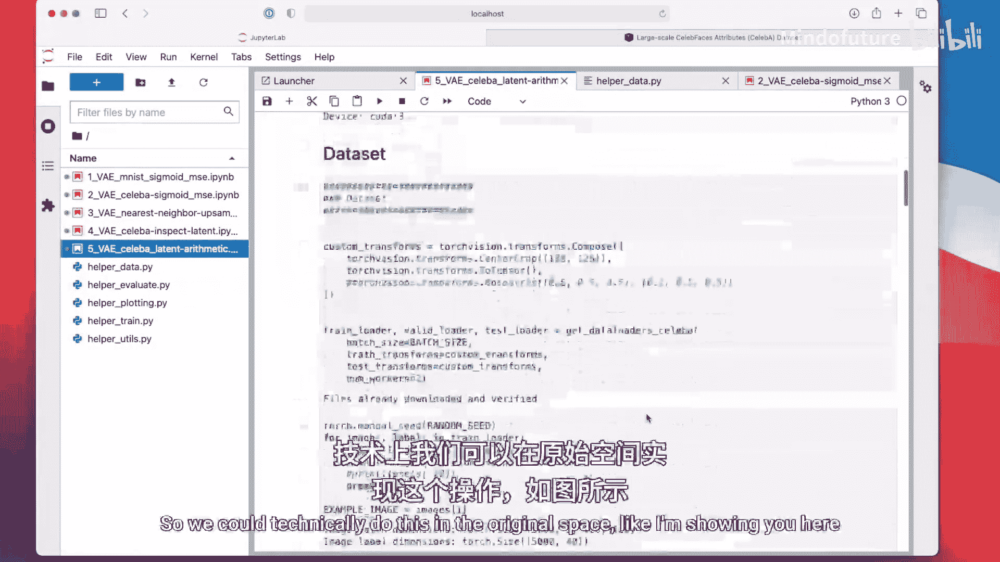

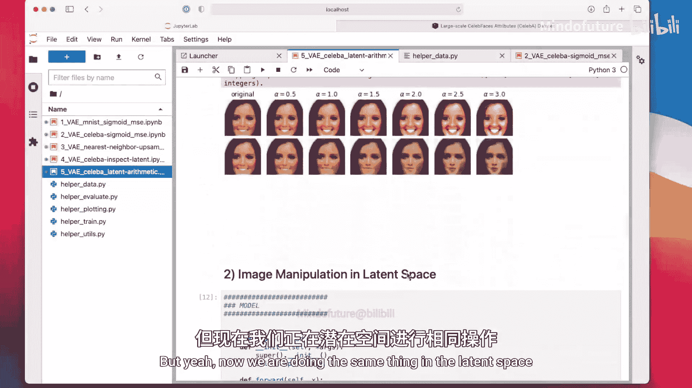

1.  **加载模型与数据**：加载预训练的VAE模型和CelebA数据加载器。
2.  **计算潜在空间方向**：使用上面定义的 `compute_average_faces` 函数，并传入VAE的编码器作为 `encoding_fn`，计算“微笑”方向向量。
    ```python
    smile_direction = avg_smile_latent - avg_no_smile_latent
    ```
3.  **选择并编码目标图像**：选择一张想要编辑的人脸图像，通过VAE编码器获取其潜在向量 `z_original`。
4.  **应用方向向量**：通过调整缩放因子 `alpha`，将方向向量加到原始潜在向量上。
    ```python
    z_modified = z_original + alpha * smile_direction
    ```
    - 当 `alpha > 0` 时，为图像增加微笑属性。
    - 当 `alpha < 0` 时，为图像减少微笑属性。
5.  **解码生成图像**：将修改后的潜在向量 `z_modified` 输入VAE解码器，重建出编辑后的人脸图像。

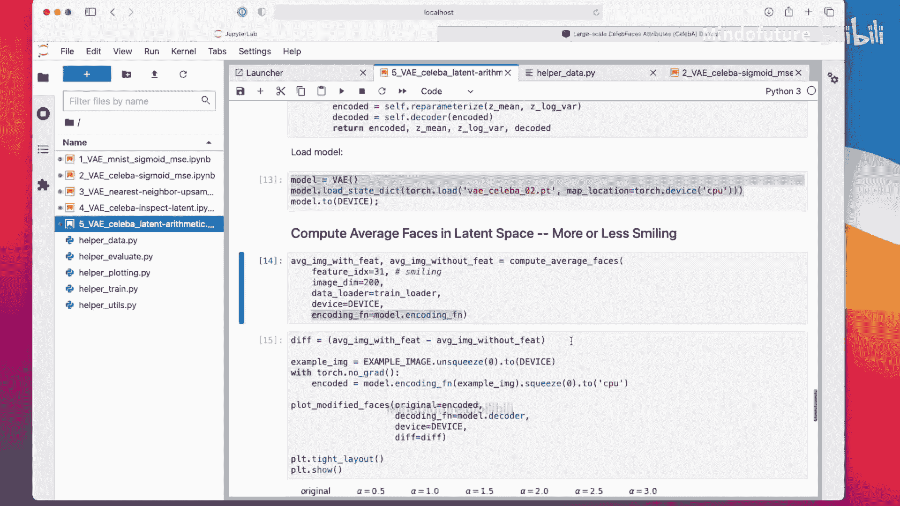

通过遍历不同的 `alpha` 值，我们可以生成一个从“不微笑”到“微笑”的平滑过渡序列。

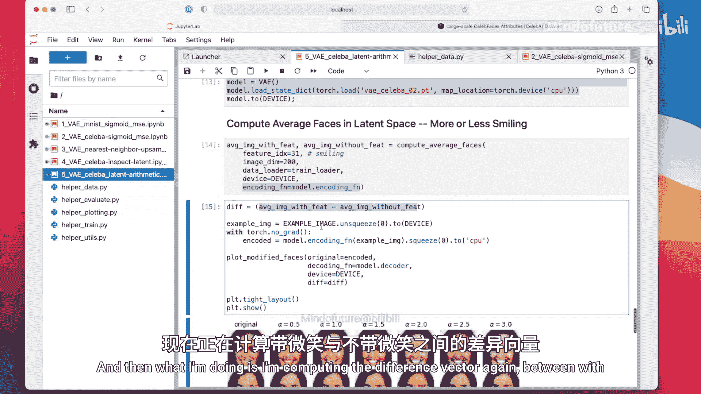

### 扩展应用：其他属性编辑

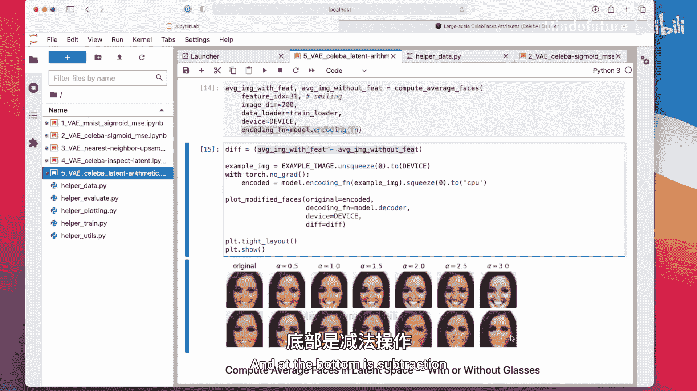

同样的方法可以应用于数据集中标注的其他属性。只需在计算 `compute_average_faces` 时更改 `feature_idx` 参数，例如将其改为对应“戴眼镜”（Eyeglasses）、“金发”（Blond Hair）等属性的索引，即可实现给人物添加/移除眼镜、改变发色等效果。

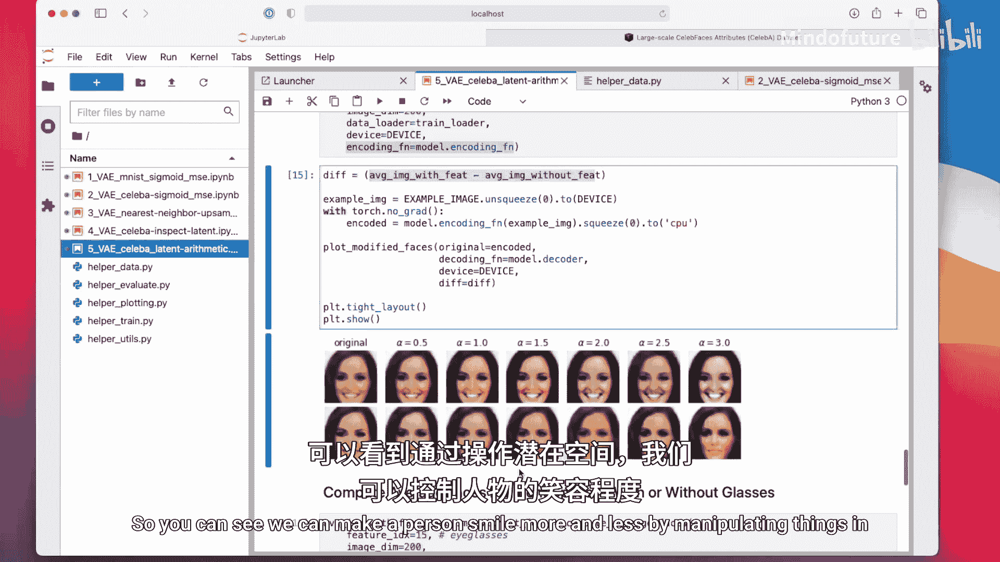

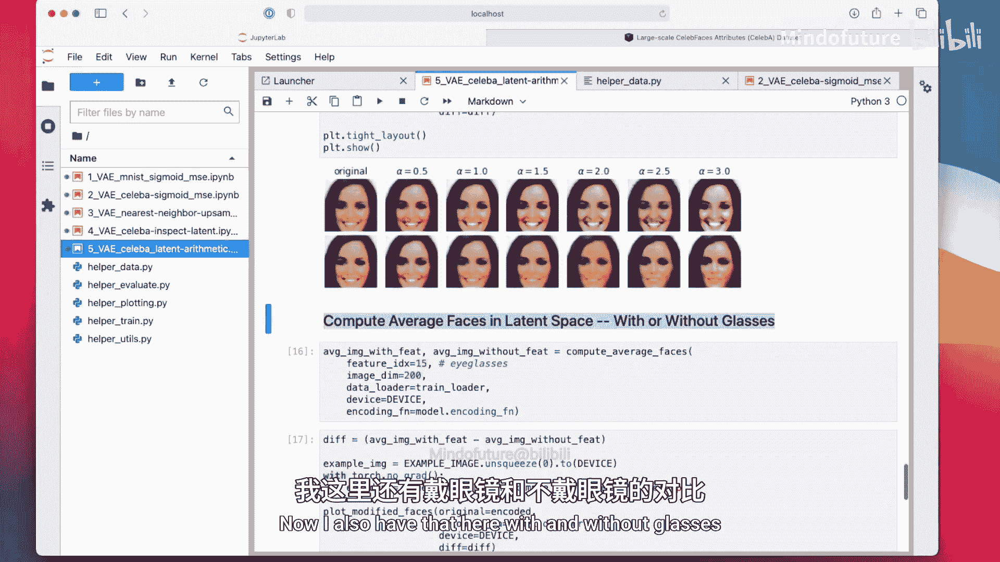

## 总结

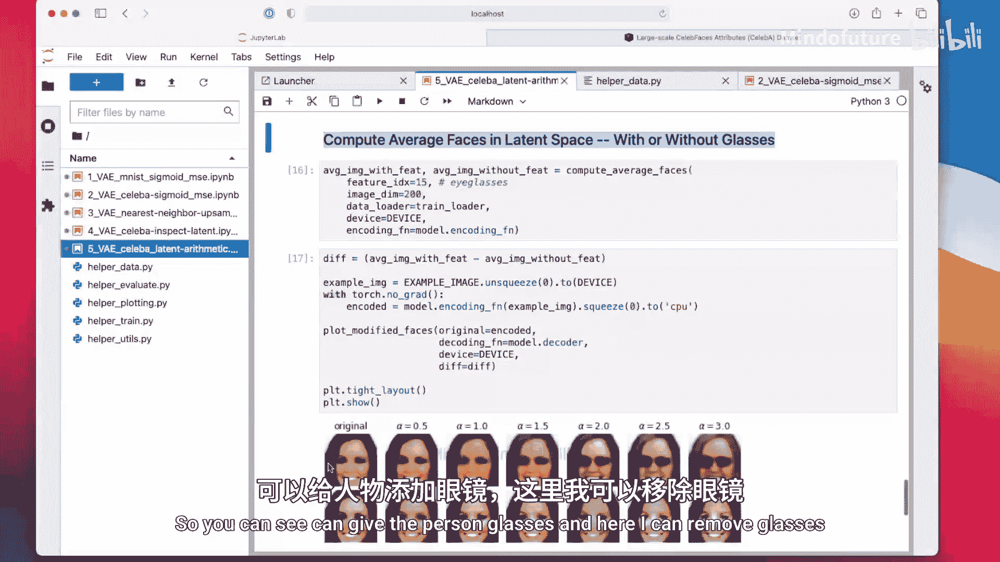

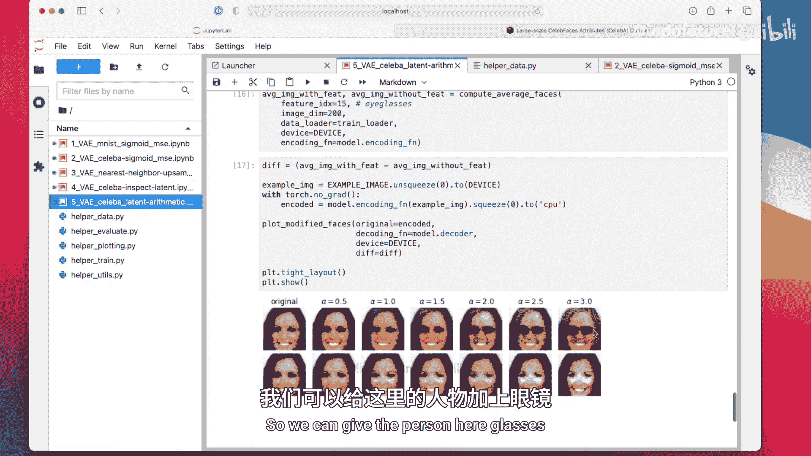

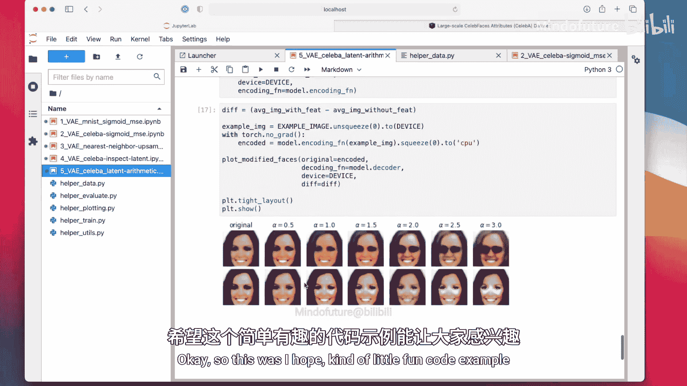

本节课中我们一起学习了VAE潜在空间算术的基本原理与实践。我们了解到，通过在潜在空间中计算代表特定语义属性（如微笑）的方向向量，并对图像的潜在编码进行简单的向量加减操作，就能实现可控的图像属性编辑。这种方法比直接在像素空间操作更有效，因为它利用了模型学习到的高级特征表示。虽然示例中使用的VAE重建质量有限，但该核心思想在更强大的生成模型（如GANs）中同样适用且效果更佳。

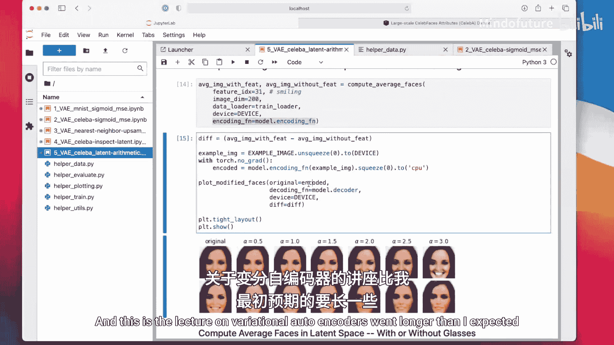

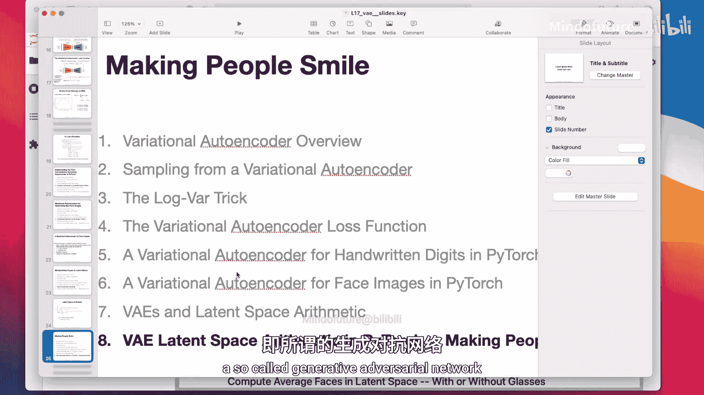

在下一讲中，我们将探讨另一种重要的隐变量生成模型——生成对抗网络（GAN）。