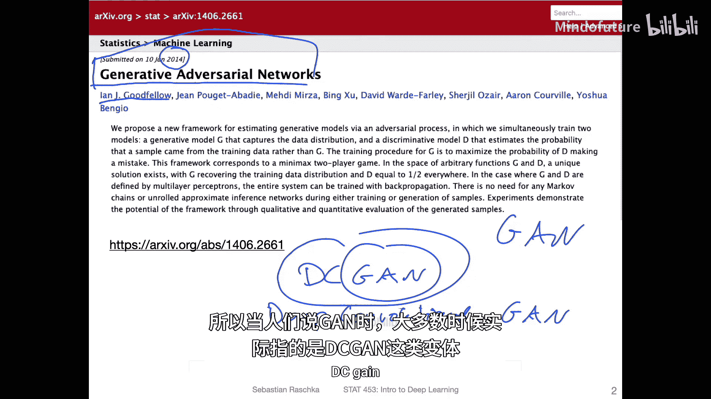
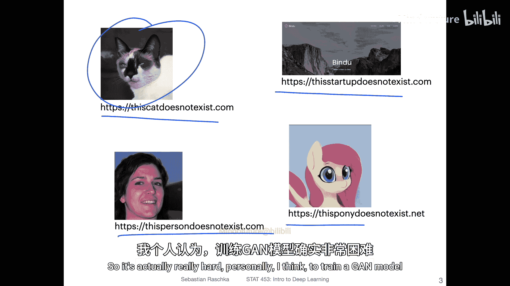
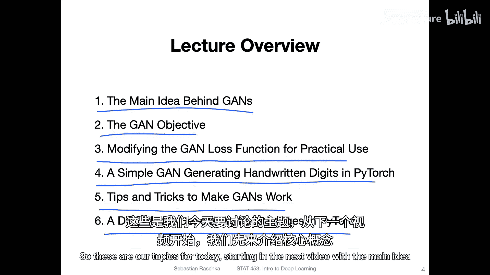

# 148：生成对抗网络入门

在本节课中，我们将要学习生成对抗网络的基本概念、原理及其实现。我们将从最原始的GAN模型开始，逐步深入到其卷积版本DCGAN，并探讨训练GANs时的一些实用技巧。

## 课程概述

生成对抗网络是深度学习中一个非常流行且强大的模型，主要用于生成新的数据。自2014年提出以来，已经衍生出成百上千种变体。本节课我们将聚焦于最基础的GAN模型，理解其核心思想，并通过代码实现来加深理解。我们还将讨论训练GANs的挑战和一些行之有效的技巧。

---

## 核心概念与主要思想

上一节我们介绍了GAN的广泛应用，本节中我们来看看GAN背后的核心思想。

生成对抗网络的核心思想是让两个神经网络——生成器和判别器——相互对抗、共同学习。

*   **生成器** 的目标是学习真实数据的分布，并生成足以“欺骗”判别器的假数据。其输入通常是随机噪声向量 `z`，输出是伪造的数据样本 `G(z)`。
*   **判别器** 的目标是成为一个“鉴定专家”，能够准确区分输入数据是来自真实数据集还是生成器制造的假数据。其输入是一个数据样本 `x`，输出是该样本为真实数据的概率 `D(x)`。

这个过程可以类比为**造假者（生成器）** 和**鉴定专家（判别器）** 之间的博弈。造假者不断改进技术以制造更逼真的赝品，而鉴定专家则不断学习以更精准地识别真伪。通过这种对抗训练，生成器最终能生成非常逼真的数据。

---

## GAN的目标函数

理解了GAN的基本框架后，我们现在需要定义一个量化的目标来指导这两个网络的训练，这就是GAN的目标函数。

在原始论文中，GAN的训练目标被表述为一个**极小极大博弈**问题。判别器 `D` 试图最大化它正确分类真实数据和假数据的能力，而生成器 `G` 则试图最小化判别器做出正确判断的能力。

其目标函数 `V(D, G)` 可以用以下公式表示：

**`min_G max_D V(D, G) = E_{x~p_data(x)}[log D(x)] + E_{z~p_z(z)}[log(1 - D(G(z)))]`**

**公式解析：**
*   `E_{x~p_data(x)}[log D(x)]`：判别器对于**真实数据** `x` 的输出概率 `D(x)` 的对数期望。判别器希望这个值越大越好（即 `D(x)` 接近1）。
*   `E_{z~p_z(z)}[log(1 - D(G(z)))]`：判别器对于**生成数据** `G(z)` 的输出概率 `D(G(z))` 的对数期望。判别器希望 `D(G(z))` 接近0，从而使 `log(1 - D(G(z)))` 变大；而生成器则希望 `D(G(z))` 接近1，从而使这项变小。

在实际训练中，这个原始目标函数可能导致梯度消失问题（当生成器很差时，判别器能轻易识破，导致生成器梯度很小，难以学习）。因此，一个更实用的改进是**翻转生成器的目标**：生成器不再最小化 `log(1 - D(G(z)))`，而是**最大化 `log(D(G(z)))`**。这为生成器在训练早期提供了更强劲的梯度信号。

---

## 训练一个简单的全连接GAN

理论部分已经介绍完毕，本节我们将动手实践，使用全连接神经网络构建一个简单的GAN来生成手写数字图像。

以下是构建和训练一个基础GAN的关键步骤列表：

1.  **准备数据**：加载MNIST手写数字数据集，并进行归一化等预处理。
2.  **构建生成器**：定义一个神经网络，输入是随机噪声向量 `z`，输出是28x28像素的图像数据（例如使用 `tanh` 激活函数将输出值约束在[-1, 1]区间）。
3.  **构建判别器**：定义一个神经网络，输入是28x28的图像（真实或生成的），输出是一个标量概率值（使用 `sigmoid` 激活函数）。
4.  **定义损失函数与优化器**：为生成器和判别器分别定义损失函数（通常使用二元交叉熵损失），并设置各自的优化器（如Adam）。
5.  **交替训练**：
    *   **训练判别器**：先用一批真实图像和一批由生成器产生的假图像训练判别器，使其能更好地区分真假。
    *   **训练生成器**：固定判别器的参数，用一批噪声输入生成器，并根据判别器对这批生成图像的判断（使用翻转后的目标）来更新生成器的参数，使其生成更逼真的图像。
6.  **迭代与评估**：重复交替训练步骤，并定期查看生成器输出的图像，以直观评估训练效果。

---

## 训练GAN的实用技巧

正如之前提到的，训练GAN非常具有挑战性。上一节我们完成了基础实现，本节中我们来看看一些能显著提高训练稳定性和结果质量的实用技巧。

以下是经过实践验证的一些重要技巧：

*   **使用卷积结构**：对于图像数据，使用卷积神经网络（即DCGAN架构）通常比全连接网络效果更好、更稳定。
*   **使用步长卷积代替池化层**：在判别器中使用卷积步长进行下采样，在生成器中使用转置卷积进行上采样。
*   **在生成器和判别器中使用批量归一化**：这有助于稳定训练，但生成器的输出层和判别器的输入层通常不加批量归一化。
*   **避免稀疏梯度**：使用LeakyReLU作为激活函数代替ReLU，特别是在判别器中，以防止梯度消失。
*   **使用Adam优化器**：经验表明，Adam优化器通常比SGD更适合训练GAN。
*   **为生成器和判别器设置不同的学习率**：例如，判别器的学习率可以略低于生成器。
*   **标签平滑**：在训练判别器时，对真实数据的标签使用略小于1的值（如0.9），可以防止判别器变得过于自信，从而有助于生成器的学习。

---

## 实现DCGAN生成人脸图像

掌握了训练技巧后，我们将应用这些知识，构建一个更强大的深度卷积GAN来生成逼真的人脸图像。

DCGAN是GAN的一个里程碑式变体，它明确规定了使用卷积层、批量归一化等组件，极大地提升了生成图像的质量和训练的稳定性。其核心架构原则包括：
*   判别器中用带步长的卷积层替代池化层。
*   生成器中用转置卷积层进行上采样。
*   去除全连接层（除了生成器的输入和判别器的输出）。
*   广泛使用批量归一化。

在本次实践中，我们将使用CelebA等人脸数据集进行训练。由于人脸图像比手写数字复杂得多，训练DCGAN需要更长时间、更多计算资源，并且对超参数调整更加敏感。成功训练后，生成器将能从未见过的随机噪声中合成出新颖的、逼真的人脸图像。

---

## 总结

本节课中我们一起学习了生成对抗网络的核心知识。我们从GAN的基本思想——生成器与判别器的对抗博弈——出发，深入分析了其目标函数。接着，我们亲手实现了一个用于生成手写数字的全连接GAN，并探讨了训练GAN时常见的问题与一系列实用的解决技巧。最后，我们介绍了更强大的DCGAN架构及其在人脸图像生成中的应用。虽然GAN的训练颇具挑战性，但理解其原理并掌握正确的方法后，它无疑是创造和理解复杂数据分布的强大工具。