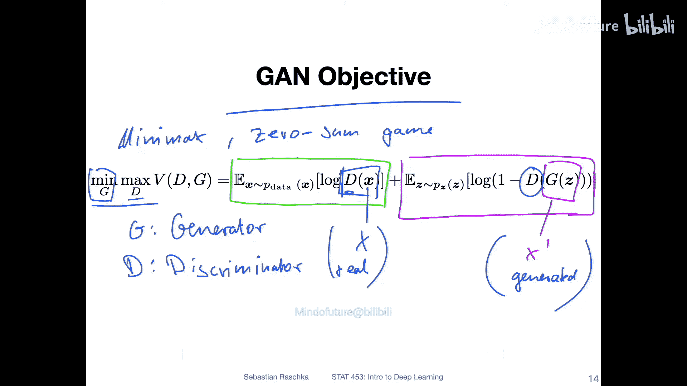
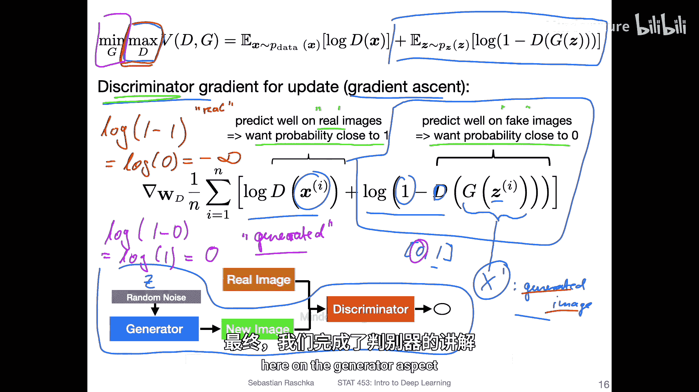
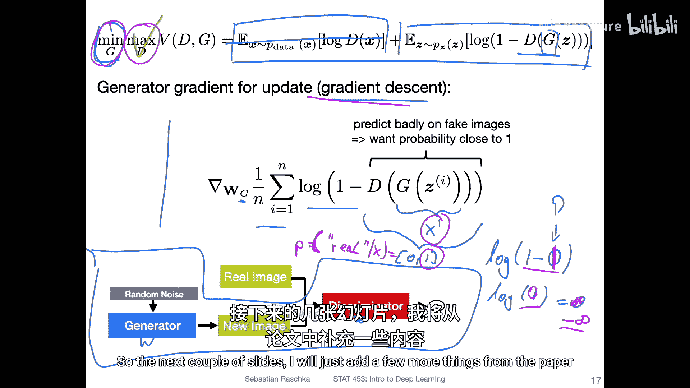
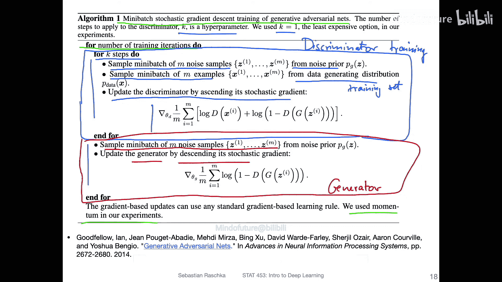
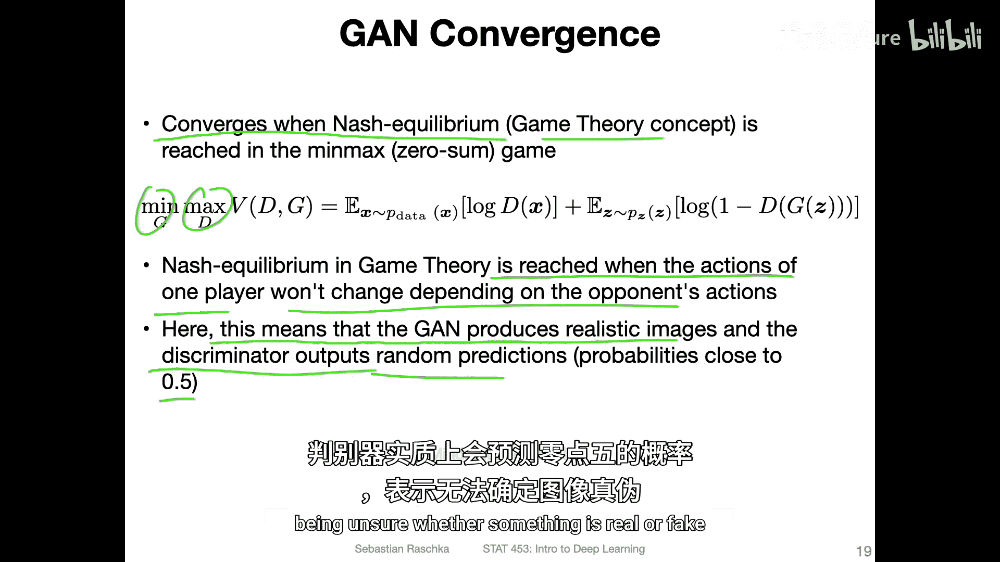
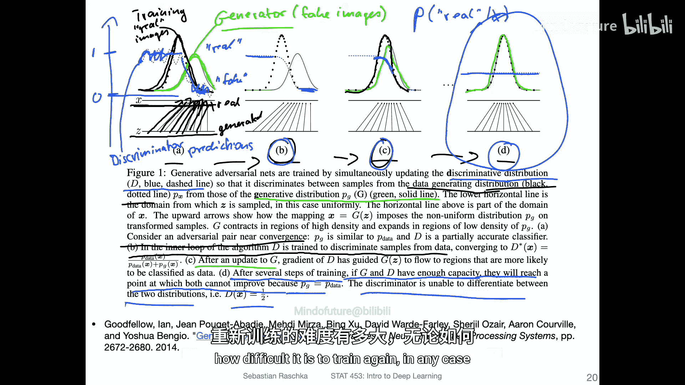
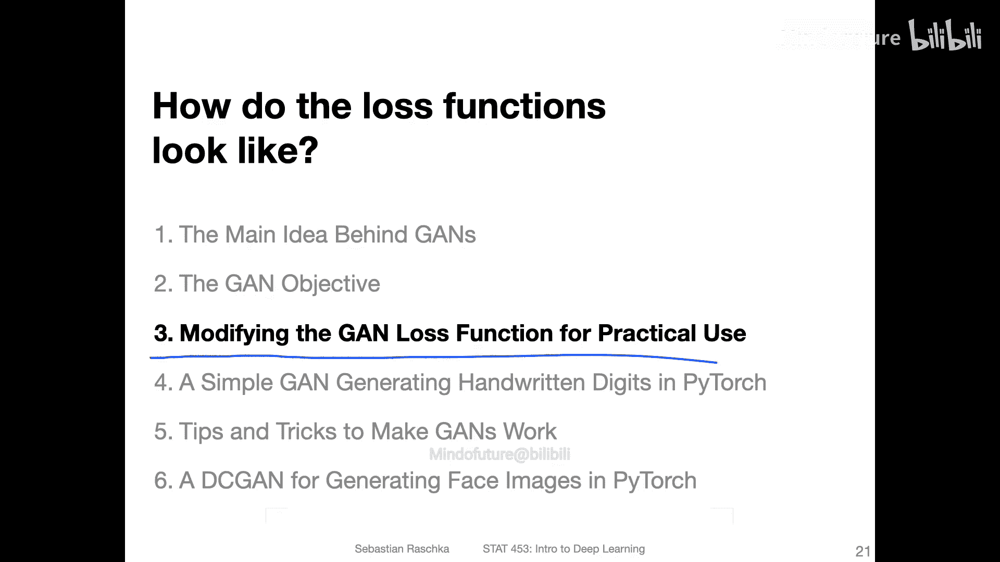

# 150：GAN目标函数详解 🎯

在本节课中，我们将深入探讨生成对抗网络（GAN）的核心——其目标函数。我们将详细拆解GAN的损失函数，理解判别器和生成器各自的优化目标，并解释整个模型如何通过“对抗”过程达到收敛。

---

## 概述



生成对抗网络（GAN）的训练过程被描述为一个“极小极大”博弈。其核心目标函数公式如下：

$$
\min_G \max_D V(D, G) = \mathbb{E}_{x \sim p_{data}(x)}[\log D(x)] + \mathbb{E}_{z \sim p_z(z)}[\log(1 - D(G(z)))]
$$

其中，$G$ 代表生成器，$D$ 代表判别器。$x$ 是真实数据，$z$ 是噪声输入，$G(z)$ 是生成的数据。$D(x)$ 和 $D(G(z))$ 是判别器对真实数据和生成数据为“真”的概率判断。

这个公式包含了两部分：判别器 $D$ 试图最大化它（正确区分真假），而生成器 $G$ 试图最小化它（让判别器犯错）。接下来，我们将分别剖析这两部分。

---

## 判别器的目标：最大化 🧠

上一节我们介绍了GAN的整体目标，本节中我们来看看判别器的具体优化任务。判别器的目标是最大化目标函数中与其相关的部分。

在训练判别器时，我们固定生成器 $G$，只更新判别器 $D$ 的参数。这对应于公式中的 $\max_D$ 部分。由于是最大化问题，我们使用梯度上升法。

以下是判别器损失函数的具体构成：

1.  **对真实数据的判断**：$\mathbb{E}_{x \sim p_{data}(x)}[\log D(x)]$
    *   我们希望判别器对真实数据 $x$ 输出一个接近 1 的概率值 $D(x)$，即认为它是“真”的。因为 $\log(1) = 0$，这是该部分的最大值。



2.  **对生成数据的判断**：$\mathbb{E}_{z \sim p_z(z)}[\log(1 - D(G(z)))]$
    *   我们希望判别器对生成数据 $G(z)$ 输出一个接近 0 的概率值 $D(G(z))$，即认为它是“假”的。因为此时 $1 - D(G(z)) \approx 1$，$\log(1) = 0$，这也是该部分的最大值。

**总结**：判别器的训练目标是，**对真实图像输出高概率（接近1），对生成图像输出低概率（接近0）**。通过梯度上升法更新其参数，使其在这两项上的总和最大。

---

## 生成器的目标：最小化 🎨

理解了判别器的目标后，现在我们将视角转向生成器。生成器的目标是最小化整体目标函数，即让判别器尽可能犯错。

在训练生成器时，我们固定判别器 $D$，只更新生成器 $G$ 的参数。这对应于公式中的 $\min_G$ 部分。这是一个最小化问题，因此我们使用梯度下降法。



生成器的损失主要来自目标函数的第二部分：$\mathbb{E}_{z \sim p_z(z)}[\log(1 - D(G(z)))]$。

*   生成器希望判别器对生成图像 $G(z)$ 的判断 $D(G(z))$ 尽可能高（接近1），即误以为生成图像是真实的。
*   因为当 $D(G(z)) \rightarrow 1$ 时，$\log(1 - 1) = \log(0) \rightarrow -\infty$，这使得损失函数值变得非常小（负无穷），从而达到**最小化**的目的。

**总结**：生成器的训练目标是，**生成足以“欺骗”判别器的图像，使得判别器对生成图像输出高概率（接近1）**。通过梯度下降法更新其参数，使 $\log(1 - D(G(z)))$ 最小。

---

## 训练算法流程 🔄

我们已经分别了解了生成器和判别器的目标，现在来看看它们如何交替工作。以下是原始GAN论文中提出的训练步骤：



以下是训练GAN的迷你批量随机梯度下降算法概要：

```python
for 训练轮数 in range(总迭代次数):
    for k 步: # 通常k=1
        # 1. 训练判别器
        采样 m 个噪声样本 {z_1, ..., z_m} 来自噪声分布 p_z(z)
        采样 m 个真实样本 {x_1, ..., x_m} 来自数据分布 p_data(x)
        使用梯度**上升**更新判别器 D，以最大化：
            (1/m) * Σ [log D(x_i) + log(1 - D(G(z_i)))]

    # 2. 训练生成器
    采样 m 个噪声样本 {z_1, ..., z_m} 来自噪声分布 p_z(z)
    使用梯度**下降**更新生成器 G，以最小化：
        (1/m) * Σ [log(1 - D(G(z_i)))]
```



**注意**：在实际操作中，为了更稳定的梯度，训练生成器时通常会改为最大化 $\mathbb{E}_{z \sim p_z(z)}[\log D(G(z))]$，这与最小化 $\log(1 - D(G(z)))$ 在理论上到达均衡点时是等价的，但能提供更有效的梯度信号。

---

## GAN的收敛：纳什均衡 ⚖️

一个自然的问题是：这种对抗过程何时会停止？GAN收敛的标志是达到**纳什均衡**。

*   在纳什均衡点，生成器和判别器的策略达到一个稳定状态，任何一方的单方面改变都无法获得额外收益。
*   具体表现为：**生成器生成的图像分布 $p_g(x)$ 与真实数据分布 $p_{data}(x)$ 几乎不可区分**。
*   此时，判别器对于任何输入图像，其预测为“真”的概率 $D(x)$ 都接近 **0.5**，即它完全无法区分图像是来自真实数据还是生成器。

下图概念性地展示了训练过程：

*(图中：黑色虚线表示真实数据分布，绿色实线表示生成数据分布，蓝色虚线表示判别器输出。从(a)到(d)展示了分布逐渐匹配，最终判别器输出趋于0.5的过程。)*

---

## 总结

本节课中我们一起学习了GAN目标函数的精髓：

1.  **目标函数**：GAN通过一个**极小极大博弈**公式进行训练，同时优化生成器 $G$ 和判别器 $D$。
2.  **判别器目标**：通过**梯度上升**，最大化其正确分类真假数据的能力。
3.  **生成器目标**：通过**梯度下降**，最小化其被判别器识破的能力，或者说最大化其“欺骗”成功率。
4.  **训练流程**：采用交替训练的方式，先更新判别器若干步，再更新生成器一步，如此循环。
5.  **收敛状态**：理想情况下，训练会收敛于**纳什均衡**点，此时生成数据分布匹配真实数据分布，判别器失去判别能力（输出概率为0.5）。




理解这个目标函数是掌握GAN工作原理的基础。在接下来的课程中，我们将探讨如何在实际训练中改进这个基础目标，以获得更稳定、更高质量的生成结果。