# 151：L18.3-修改GAN损失函数以实用 🛠️

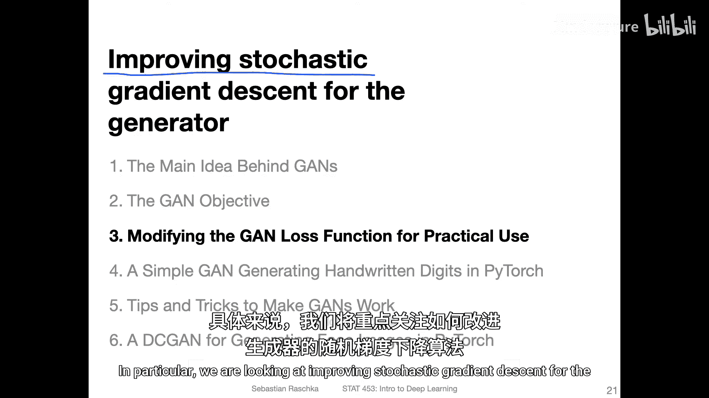

在本节课中，我们将探讨如何对生成对抗网络的训练过程进行一项关键修改，以解决生成器在训练初期可能遇到的梯度消失问题，从而提升训练效率和稳定性。

## 概述

在上一节中，我们介绍了GAN的基本原理和原始损失函数。本节中，我们将深入分析GAN训练中常见的一个问题——判别器过强导致生成器梯度消失，并学习一种通过修改损失函数来缓解此问题的实用技巧。

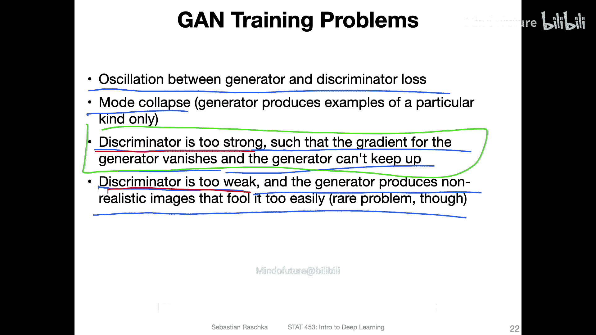

## GAN训练中的常见问题

在深入修改之前，我们先简要回顾GAN训练中可能遇到的一些挑战。理解这些问题有助于我们更好地理解后续修改的动机。

以下是GAN训练中几个典型问题：

1.  **生成器与判别器持续振荡**：两者的性能在训练过程中不断波动，难以达到稳定收敛的状态。
2.  **模式崩溃**：生成器倾向于只生成一种或少数几种能成功欺骗判别器的特定类型数据，导致生成样本缺乏多样性。
3.  **判别器过强**：由于分类任务通常比生成任务更简单，判别器可能在学习初期就变得非常强大。这会导致生成器的损失梯度变得极小，使其无法有效学习。
4.  **判别器过弱**：判别器无法有效区分真实与生成数据，导致生成器即使生成质量不高的样本也能轻易通过。

在实践中，**判别器过强**是一个尤为常见的问题，它直接阻碍了生成器的有效学习。接下来，我们将重点讨论如何通过修改损失函数来应对这个问题。

## 问题聚焦：判别器过强与梯度消失

现在，让我们聚焦于判别器过强导致生成器梯度消失的问题，并探讨其解决方案。

原始GAN论文中生成器的更新公式如下，其目标是让判别器 `D` 对生成图像 `G(z)` 的输出 `D(G(z))` 接近1：

`θ_g ← θ_g - η * ∇_θ_g log(1 - D(G(z)))`

生成器希望最小化 `log(1 - D(G(z)))`。当 `D(G(z))` 接近0时（判别器能轻易识破假图），该损失值接近 `log(1-0)=0`，这看似是生成器希望达到的“好”状态（损失小）。然而，问题在于此时的梯度信号非常微弱。

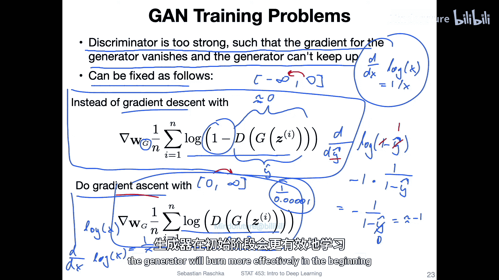

我们来计算一下梯度。设 `y_hat = D(G(z))`，则损失函数 `L = log(1 - y_hat)`。其导数为：
`dL/dy_hat = -1 / (1 - y_hat)`

在训练初期，生成器能力弱，`y_hat` 通常接近0。此时梯度 `dL/dy_hat ≈ -1`。这个梯度值虽然存在，但不够强，导致生成器学习效率低下，难以跟上快速进步的判别器。

## 解决方案：修改生成器目标函数

为了解决上述梯度微弱的问题，我们可以对生成器的目标函数进行一个巧妙的修改。

我们不要求生成器最小化 `log(1 - D(G(z)))`，而是要求它**最大化** `log(D(G(z)))`。也就是说，生成器的新目标是让判别器对生成图像给出**高置信度的“真”判断**。

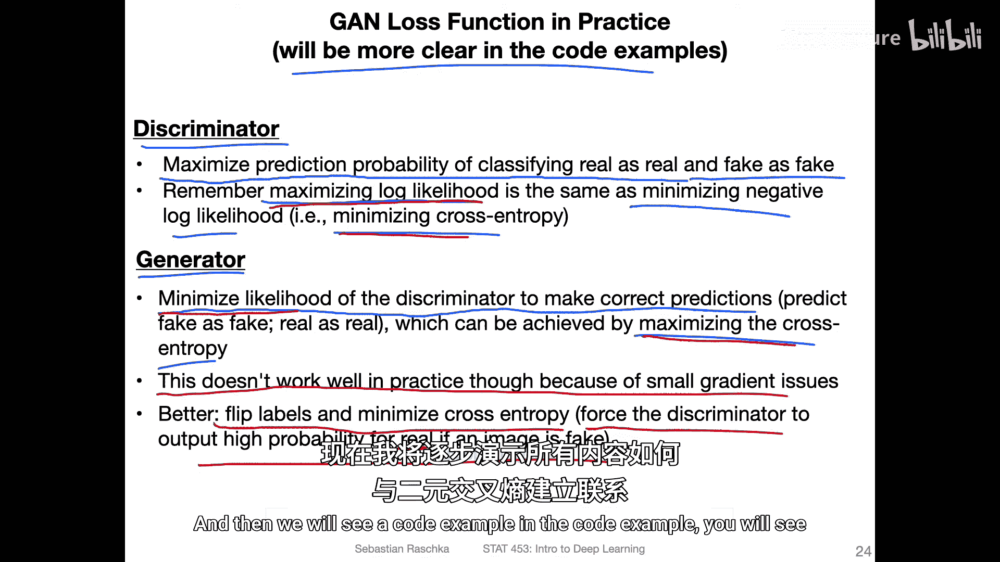

修改后的生成器更新公式变为：
`θ_g ← θ_g + η * ∇_θ_g log(D(G(z)))`

此时，损失函数 `L‘ = -log(D(G(z)))`（因为我们通常执行梯度下降来最小化损失）。其导数为：
`dL‘/dy_hat = -1 / y_hat`

关键区别在于：当 `y_hat` 接近0（判别器认为图像是假的）时，梯度 `dL‘/dy_hat` 会变得非常大（因为除以一个很小的数）。这为生成器在训练初期提供了**强得多的梯度信号**，使其能够更有效地开始学习，从而缓解了因判别器过强而导致的“无法启动”问题。

## 统一视角：转换为标准的梯度下降问题

前面我们看到了很多关于梯度上升和下降的讨论，可能显得复杂。但在实际代码实现中，我们可以将所有操作统一为标准的梯度下降，这将大大简化流程。

原始论文中，判别器的目标是最大化一个目标函数（梯度上升）。然而，在逻辑回归中我们知道，**最大化对数似然等价于最小化负对数似然（即交叉熵损失）**。因此，我们可以直接使用PyTorch中的二元交叉熵损失 `BCELoss` 来优化判别器，无需手动实现梯度上升。

对于生成器，原始目标是最小化判别器做出正确判断的概率。这同样可以转换为一个损失最小化问题。但正如我们之前分析的，直接转换得到的梯度可能太小。更好的实践是：**我们通过“翻转标签”来构造生成器的损失**。

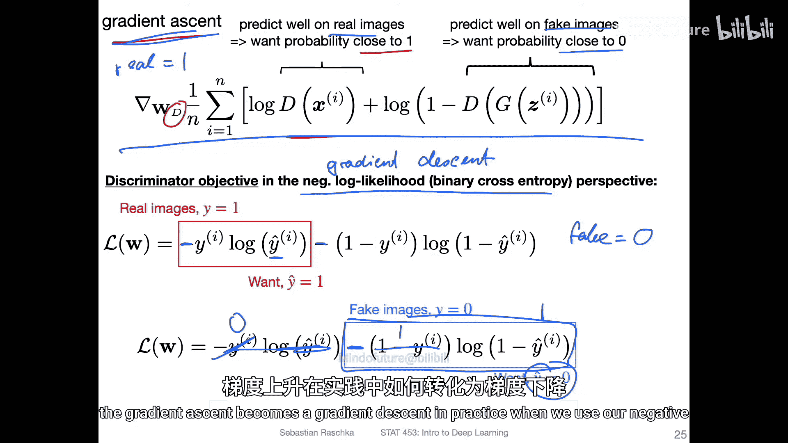

具体操作如下：

1.  **判别器训练**：对于真实图像，标签为1；对于生成器产生的假图像，标签为0。使用标准的二元交叉熵损失进行训练。
2.  **生成器训练**：我们将生成器产生的假图像**人为地标记为标签1**（即“真实”标签），然后同样使用二元交叉熵损失进行训练。这意味着我们在训练生成器时，要求它去最小化 `-log(D(G(z)))`，这与我们之前推导的“最大化 `log(D(G(z)))`”目标在梯度下降框架下是等价的，并且能提供更强的初始梯度。

通过这种“翻转标签”的技巧，我们成功地将GAN中两个对抗性网络的训练，都规约到了熟悉的**梯度下降最小化交叉熵损失**的范式之下，使得实现变得清晰且直接。

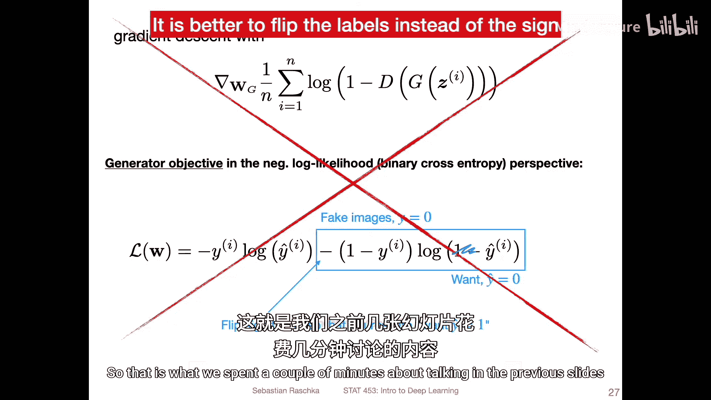

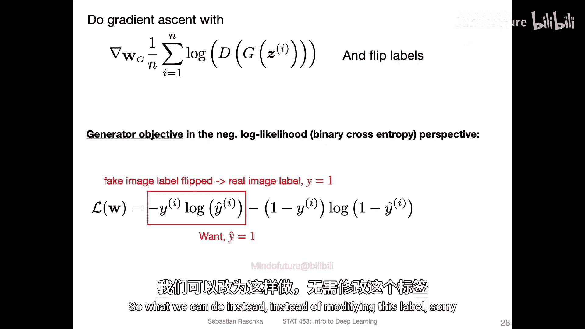

## 总结

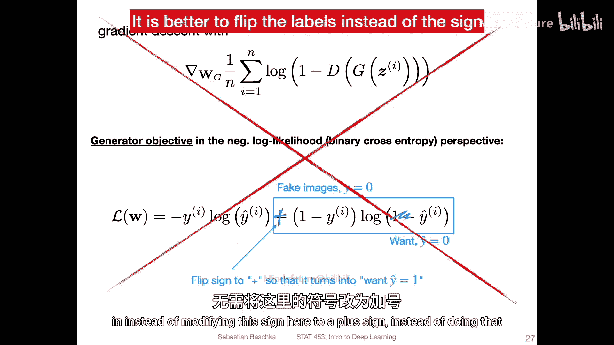

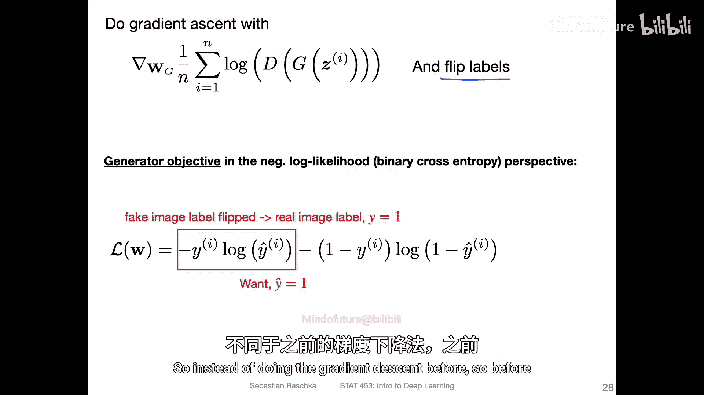

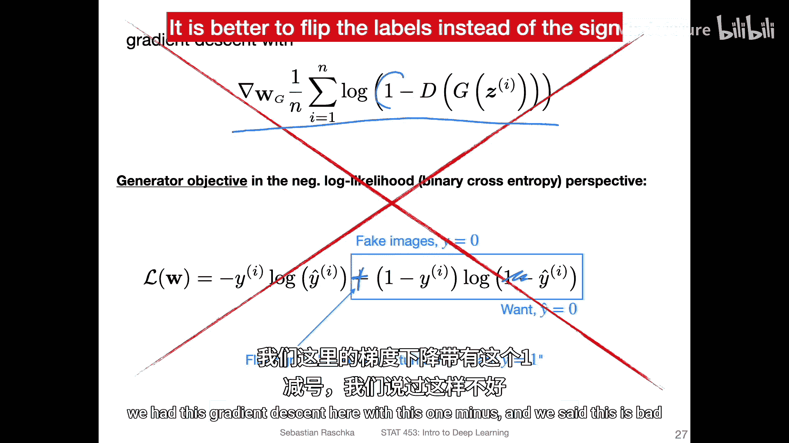

本节课中我们一起学习了如何通过修改GAN的损失函数来提升其训练的实用性和稳定性。

我们首先分析了GAN训练中判别器过强会导致生成器梯度消失的核心问题。然后，我们推导了将生成器目标从最小化 `log(1 - D(G(z)))` 改为最小化 `-log(D(G(z)))` 的动机，这能为生成器在训练初期提供更强的梯度信号。最后，我们介绍了如何通过“翻转标签”这一技巧，将整个GAN的训练过程统一到标准的二元交叉熵损失和梯度下降框架中，这极大地简化了后续的代码实现。

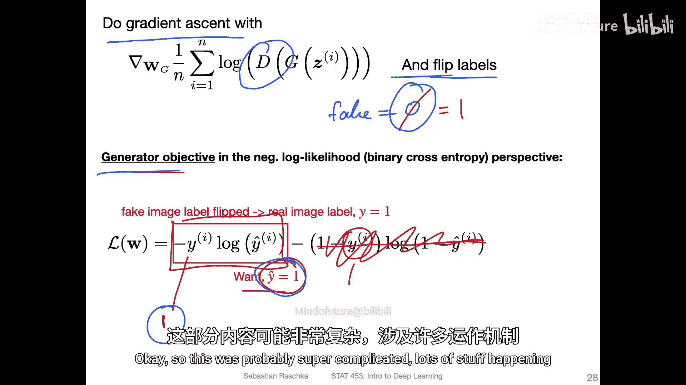

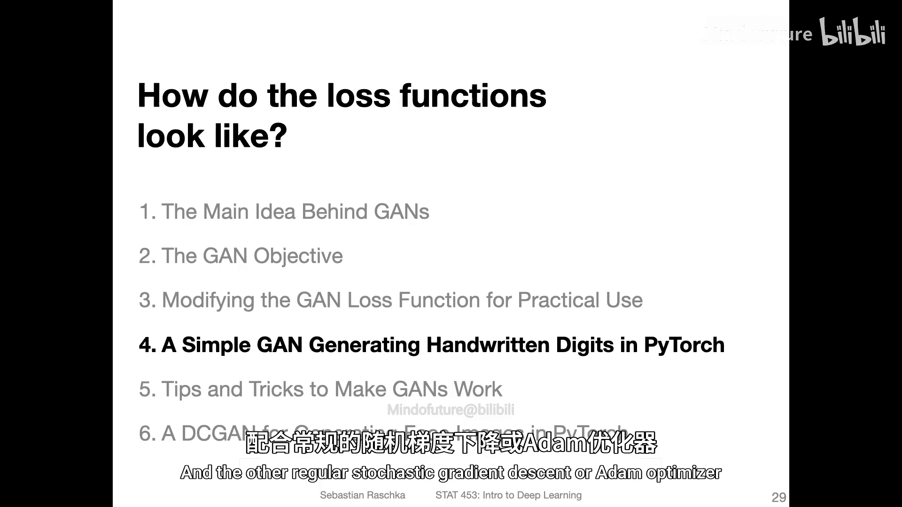

在下一节的代码示例中，你将看到如何清晰地应用这些概念，使用常规的优化器（如Adam）来同时训练判别器和生成器。