# 152：PyTorch中生成手写数字的GAN代码示例 🧠

在本节课中，我们将学习如何在PyTorch中实现一个生成对抗网络。我们将构建一个简单的、基于全连接层的GAN，用于生成手写数字图像。通过代码实践，我们将把上一节讨论的理论概念具体化。

## 概述与准备工作

上一节我们介绍了GAN的基本原理和数学符号。本节中，我们来看看如何用PyTorch代码实现它。虽然GAN的数学表达可能有些复杂，但代码实现实际上相当直观。

首先，我们进行常规的导入和设置。GAN的训练比训练一个分类器更具挑战性，原因之一是我们需要同时训练两个神经网络：生成器和判别器。

```python
import torch
import torch.nn as nn
import torch.optim as optim
from torchvision import datasets, transforms
from torch.utils.data import DataLoader
import matplotlib.pyplot as plt
```

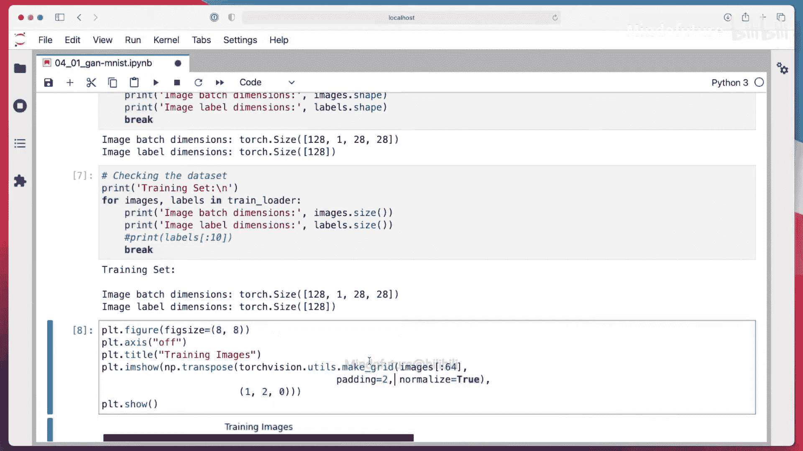

这意味着我们需要调整两个学习率，并找到它们之间合适的比例关系，这增加了模型的复杂性。

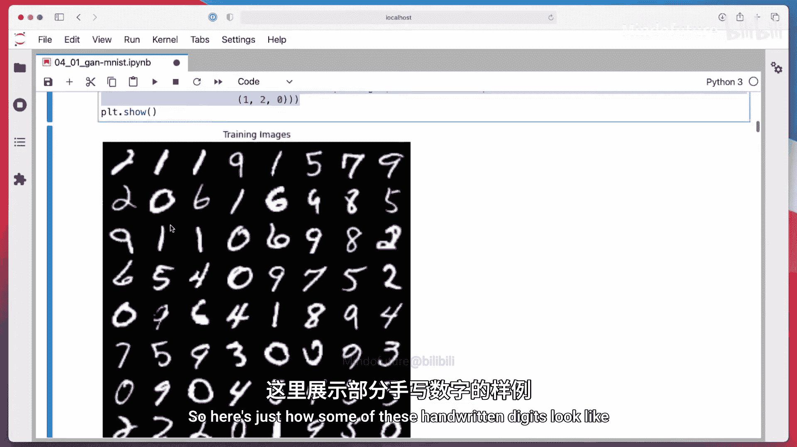

我们使用MNIST数据集，并将图像像素值归一化到`[-1, 1]`的范围，这比`[0, 1]`的范围效果更好。GAN是无监督算法，因此我们只需要图像数据，不需要标签。

```python
# 数据预处理
transform = transforms.Compose([
    transforms.ToTensor(),
    transforms.Normalize((0.5,), (0.5,)) # 将像素值从[0,1]映射到[-1,1]
])

# 加载MNIST训练集
train_dataset = datasets.MNIST(root='./data', train=True, download=True, transform=transform)
train_loader = DataLoader(train_dataset, batch_size=64, shuffle=True)
```

我们使用`torchvision.utils.make_grid`函数来快速可视化图像，这是一个非常方便的工具。

## 构建生成器与判别器模型 🏗️

现在，我们进入模型构建的核心部分。我们将分别实现生成器和判别器，两者都使用`nn.Sequential` API来构建。

生成器接收一个噪声向量（例如，100维），并通过一系列全连接层和激活函数，最终输出一个形状为`(C, H, W)`的“伪造”图像。为了使输出与输入图像范围一致，最后一层使用`Tanh`激活函数，将输出限制在`[-1, 1]`。

```python
class Generator(nn.Module):
    def __init__(self, latent_dim=100):
        super(Generator, self).__init__()
        self.model = nn.Sequential(
            nn.Linear(latent_dim, 256),
            nn.LeakyReLU(0.2),
            nn.Dropout(0.3),
            nn.Linear(256, 512),
            nn.LeakyReLU(0.2),
            nn.Dropout(0.3),
            nn.Linear(512, 1024),
            nn.LeakyReLU(0.2),
            nn.Dropout(0.3),
            nn.Linear(1024, 28*28*1), # 输出展平的图像
            nn.Tanh() # 将输出限制在[-1, 1]
        )

    def forward(self, z):
        # 输入z形状: (batch_size, latent_dim)
        img = self.model(z)
        # 将展平的输出重塑为图像格式: (batch_size, 1, 28, 28)
        img = img.view(img.size(0), 1, 28, 28)
        return img
```

判别器本质上是一个二分类器。它接收一张图像（真实或伪造），将其展平后输入全连接层，最后通过一个输出节点给出该图像为“真实”的置信度（logits）。我们使用带Logits的二元交叉熵损失函数。

```python
class Discriminator(nn.Module):
    def __init__(self):
        super(Discriminator, self).__init__()
        self.model = nn.Sequential(
            nn.Linear(28*28*1, 1024),
            nn.LeakyReLU(0.2),
            nn.Dropout(0.3),
            nn.Linear(1024, 512),
            nn.LeakyReLU(0.2),
            nn.Dropout(0.3),
            nn.Linear(512, 256),
            nn.LeakyReLU(0.2),
            nn.Dropout(0.3),
            nn.Linear(256, 1)
            # 注意：没有Sigmoid，因为使用BCEWithLogitsLoss
        )

    def forward(self, img):
        # 输入img形状: (batch_size, 1, 28, 28)
        flattened = img.view(img.size(0), -1)
        validity = self.model(flattened)
        return validity
```

接下来，我们初始化模型和优化器。一个关键点是，我们需要两个独立的优化器，分别用于更新生成器和判别器的参数。

```python
# 初始化模型
latent_dim = 100
generator = Generator(latent_dim)
discriminator = Discriminator()

# 初始化优化器
lr_g = 0.0002
lr_d = 0.0002
optimizer_G = optim.Adam(generator.parameters(), lr=lr_g, betas=(0.5, 0.999))
optimizer_D = optim.Adam(discriminator.parameters(), lr=lr_d, betas=(0.5, 0.999))

# 损失函数
adversarial_loss = nn.BCEWithLogitsLoss()
```

## 训练循环详解 🔄

训练GAN的核心在于交替训练判别器和生成器。以下是训练循环中每一步的详细说明。

首先，我们定义一些标签和用于监控训练进程的固定噪声向量。

```python
# 定义标签
real_label = 1.0
fake_label = 0.0

# 创建固定噪声用于可视化训练过程
fixed_noise = torch.randn(64, latent_dim)
```

在每个训练周期中，我们遍历数据加载器。对于每一批数据，我们执行以下步骤。

**第一步：训练判别器**
我们冻结生成器，只更新判别器。目标是让判别器能正确区分真实图像和生成器产生的伪造图像。

1.  用真实图像计算损失，希望判别器输出接近`1`（真实标签）。
2.  用生成器产生的伪造图像计算损失，希望判别器输出接近`0`（伪造标签）。
3.  将两个损失相加，反向传播并更新判别器参数。

```python
# 获取一批真实图像
real_imgs, _ = next(iter(train_loader))

# 训练判别器
optimizer_D.zero_grad()

# 计算真实图像的损失
real_pred = discriminator(real_imgs).view(-1)
loss_real = adversarial_loss(real_pred, torch.ones_like(real_pred) * real_label)

# 生成伪造图像
z = torch.randn(real_imgs.size(0), latent_dim)
fake_imgs = generator(z).detach() # 断开计算图，防止影响生成器梯度

# 计算伪造图像的损失
fake_pred = discriminator(fake_imgs).view(-1)
loss_fake = adversarial_loss(fake_pred, torch.ones_like(fake_pred) * fake_label)

# 合并损失并更新判别器
loss_D = (loss_real + loss_fake) / 2
loss_D.backward()
optimizer_D.step()
```

**第二步：训练生成器**
我们冻结判别器，只更新生成器。目标是让生成器产生的图像能够“欺骗”判别器，使其误认为是真实图像。

1.  再次用生成器产生伪造图像（这次不`detach`）。
2.  计算损失时，使用“翻转”的标签（`1`，即真实标签）。我们希望判别器对这些伪造图像的输出也接近`1`。
3.  反向传播并更新生成器参数。

```python
# 训练生成器
optimizer_G.zero_grad()

# 生成新的伪造图像
gen_imgs = generator(z)

# 计算生成器损失（使用翻转的标签：希望判别器将假图判为真）
gen_pred = discriminator(gen_imgs).view(-1)
loss_G = adversarial_loss(gen_pred, torch.ones_like(gen_pred) * real_label) # 标签为1

loss_G.backward()
optimizer_G.step()
```

在训练过程中，我们使用固定的噪声向量来生成图像，并定期保存，以便直观地观察生成器质量的演变。

## 结果可视化与总结 📈

训练完成后，我们可以绘制损失曲线并查看生成图像的变化。

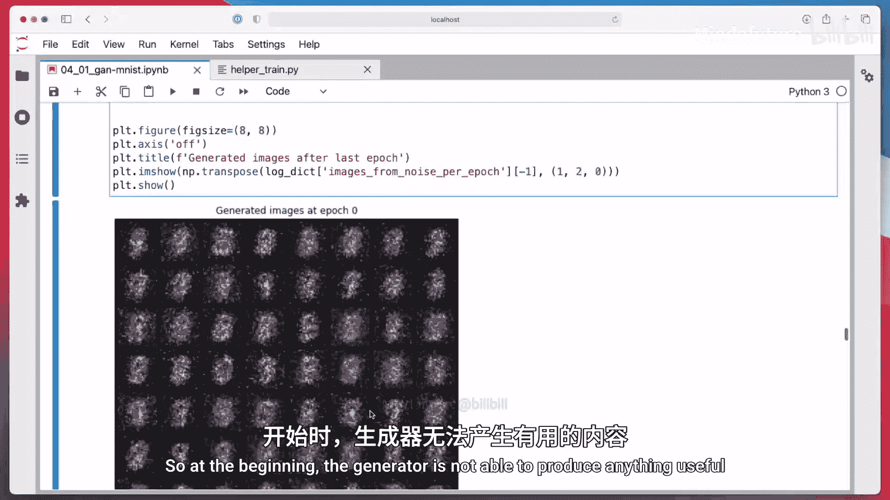

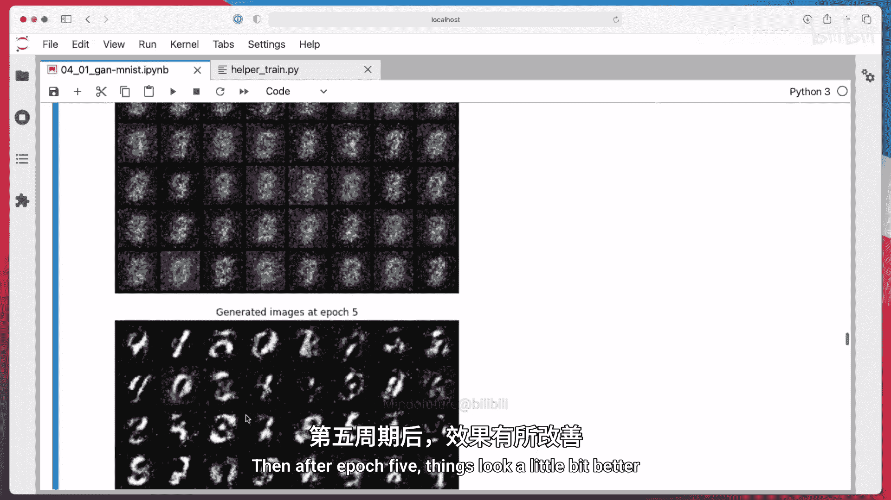

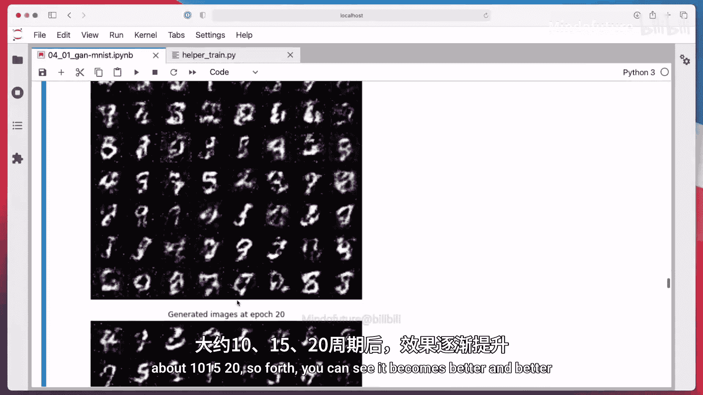

损失曲线中，判别器损失和生成器损失应该保持相对平衡，而不是一方急剧下降或上升。然而，仅凭损失数值很难完全判断训练效果，最终还需要通过生成的图像质量来评估。

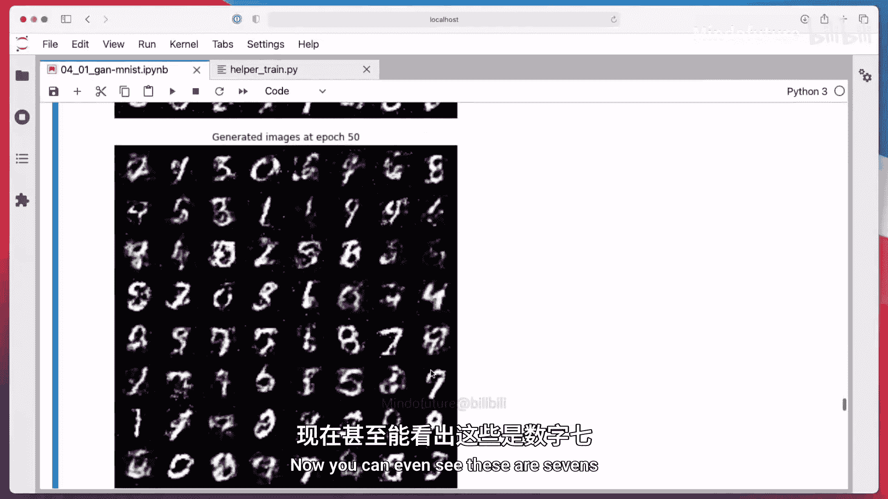

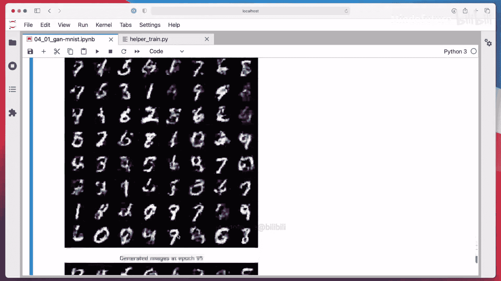

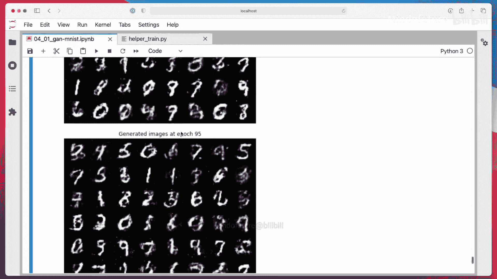

以下是生成图像在训练过程中的演变示例：
*   **第0周期**：生成器输出的是无意义的噪声。
*   **第5周期**：开始出现一些模糊的数字形状。
*   **第10、15、20周期**：数字形状逐渐变得清晰可辨。
*   **最后周期**：生成的手写数字已经具有合理的结构，尽管有些图像仍有瑕疵。

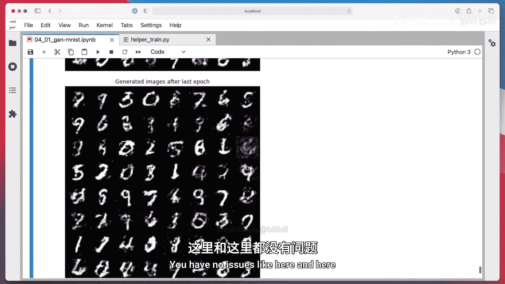

通过对比训练初期和末期的结果，可以清楚地看到生成器学会了从噪声中生成类似于MNIST数据的手写数字图像。

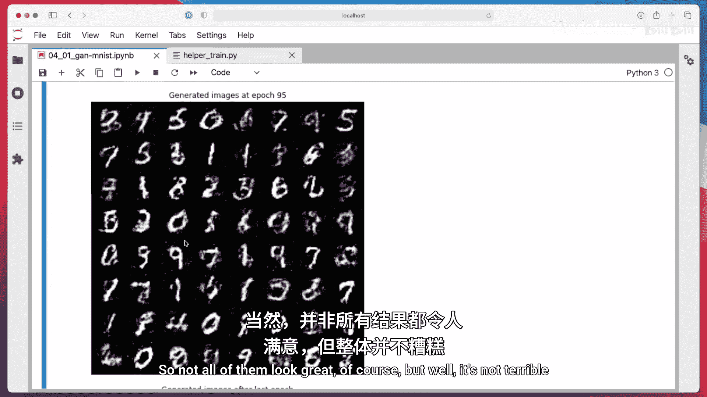

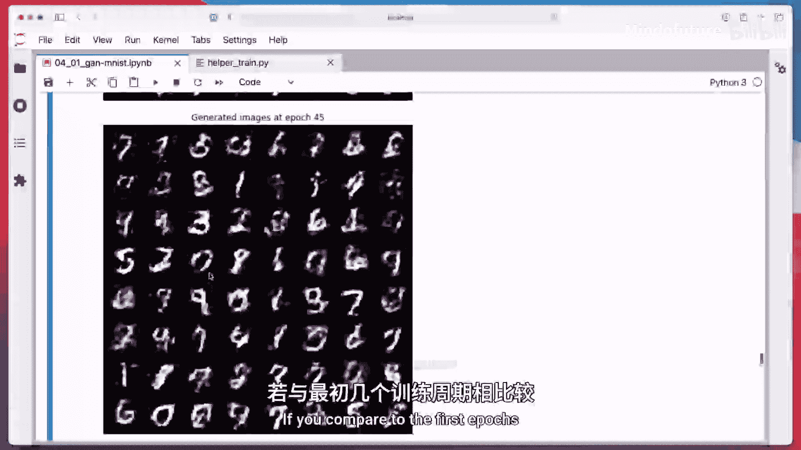

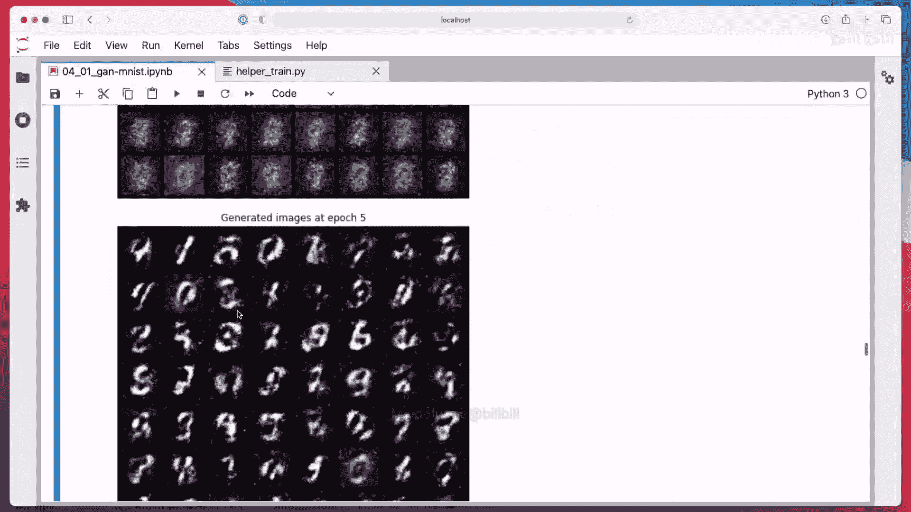

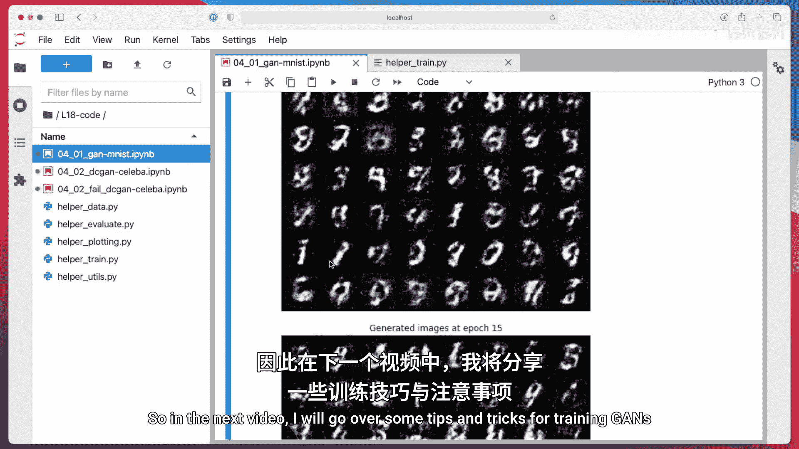

本节课中我们一起学习了如何在PyTorch中实现一个基本的全连接GAN来生成手写数字。我们涵盖了数据准备、模型构建、训练循环的详细步骤以及结果可视化。虽然这是一个简单的GAN，并且训练过程需要仔细调整超参数，但它清晰地展示了GAN的工作原理：两个网络通过对抗过程共同进步。在下一节中，我们将探讨一些训练GAN的实用技巧和策略，以应对更复杂的场景。