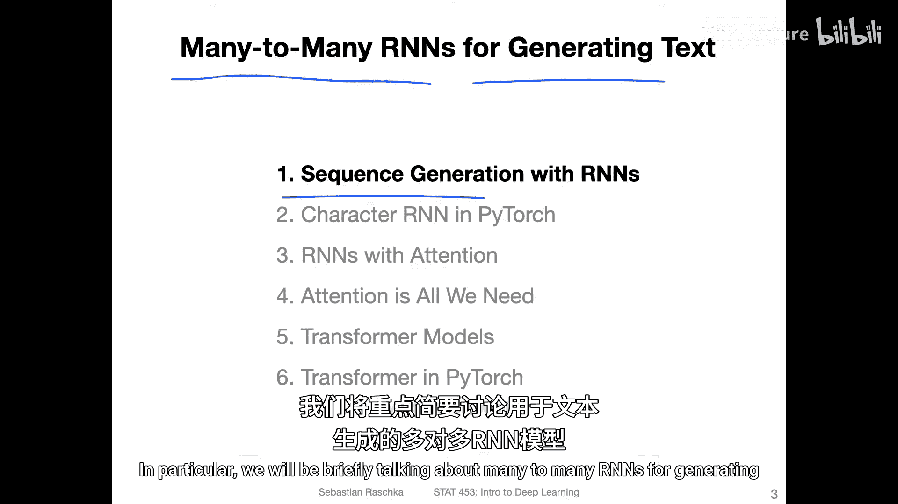
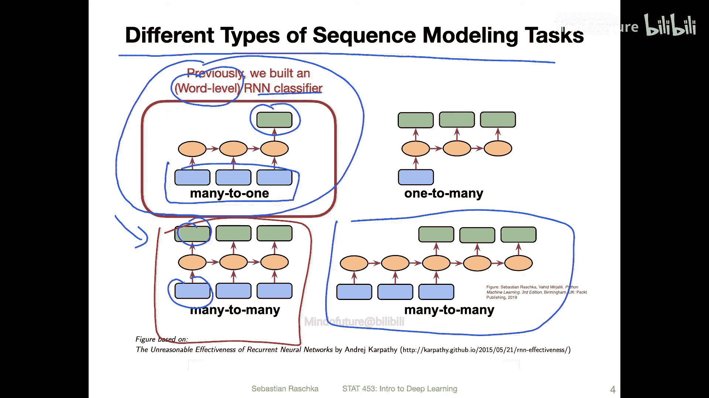
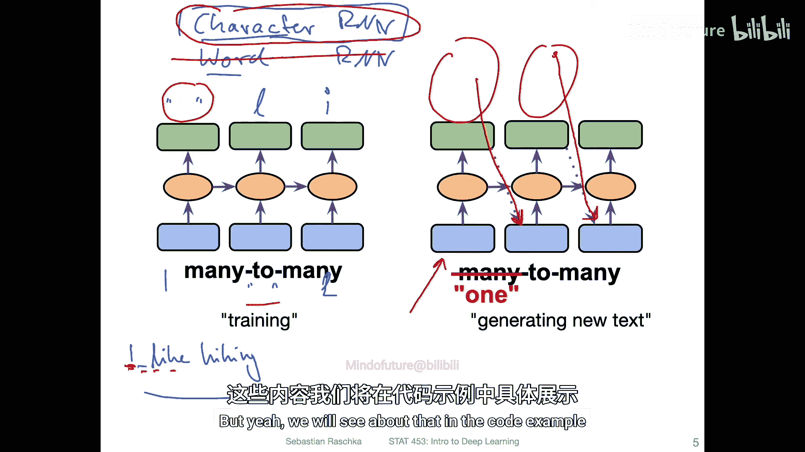
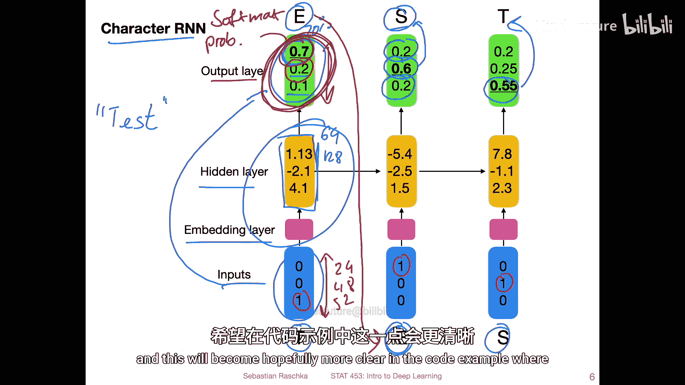
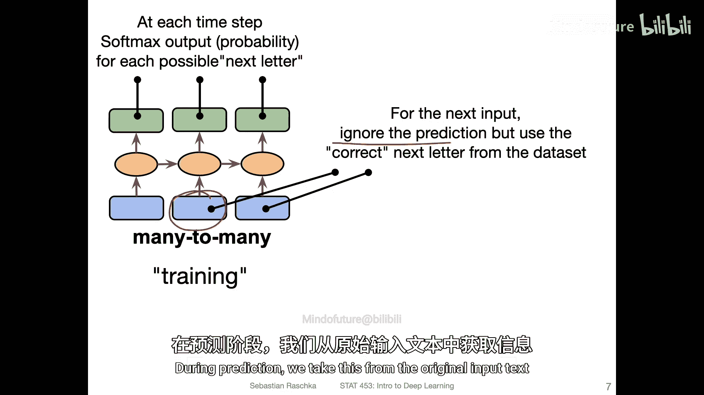
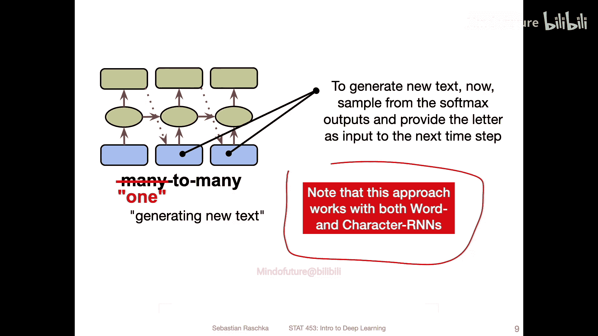
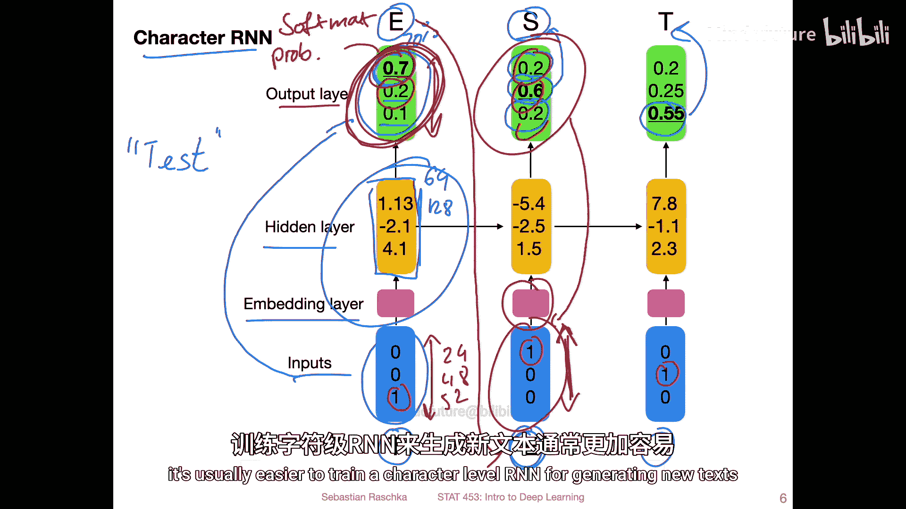
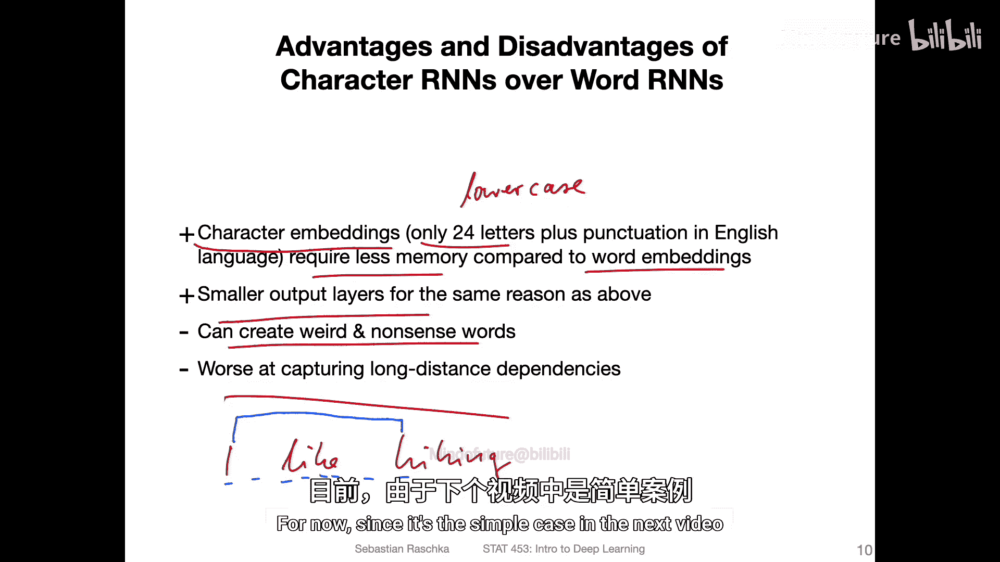
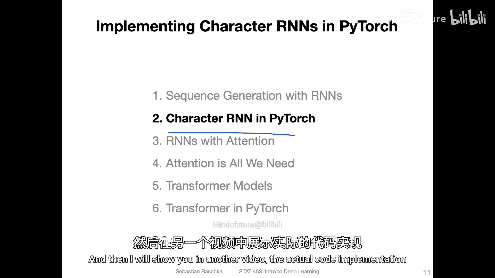

# 156：使用词RNN和字符RNN进行序列生成 📝

在本节课中，我们将要学习如何使用循环神经网络（RNN）来生成文本序列。我们将重点介绍两种主要方法：基于字符的RNN和基于单词的RNN，并解释它们的工作原理、训练过程以及各自的优缺点。

---

## 序列生成任务概览

上一节我们介绍了RNN在文本分类等“多对一”任务中的应用。本节中，我们来看看“多对多”架构，它专门用于生成新的序列，例如文本生成。

回忆这张图，它展示了不同类型的序列建模任务。之前我们使用“多对一”方法进行文本分类，即输入一个文本序列，输出一个情感标签。今天，我们将聚焦于用于文本生成的“多对多”架构。

在文本生成的“多对多”架构中，模型在每个时间步接收一个输入并产生一个输出。这与语言翻译的架构相关，但本视频我们首先关注这种基础的序列生成方法。

---

## 两种主要方法：字符RNN与词RNN

使用RNN生成文本主要有两种方法：字符级RNN和词级RNN。它们的核心区别在于输入和输出的基本单元（Token）是什么。

以下是两种方法的简要对比：
*   **字符级RNN**：每个输入和输出是一个**字符**（例如：`‘I’`, `‘ ’`, `‘L’`）。
*   **词级RNN**：每个输入和输出是一个**单词**（例如：`‘I’`, `‘like’`, `‘hiking’`）。

---

### 字符级RNN的工作原理

我们先以字符级RNN为例进行详细说明。它的训练目标是预测序列中的下一个字符。

**训练阶段**：
模型接收当前字符作为输入，并尝试预测下一个字符。这是一种自监督学习，因为标签（即下一个字符）直接来自输入数据本身。
例如，对于句子 `“I like hiking”`：
1.  输入 `‘I’`，模型应预测 `‘ ’`（空格）。
2.  输入 `‘ ’`，模型应预测 `‘L’`。
3.  输入 `‘L’`，模型应预测 `‘i’`。
4.  依此类推。

**推理/生成阶段**：
当我们想用训练好的模型生成全新文本时，过程如下：
1.  提供一个**随机字符**作为起始输入。
2.  模型输出一个**概率分布**，表示下一个可能字符的几率。
3.  我们并非总是选择概率最高的字符，而是根据这个分布进行**随机采样**。这引入了多样性，避免模型只是机械地重复训练数据。
4.  将采样得到的字符作为下一个时间步的输入。
5.  重复步骤2-4，即可逐步生成一个全新的字符序列。

为了让这个概念更清晰，我们来看一个具体的示意图。

假设一个简单的字符RNN处理文本 `“tes”`：
*   **输入**：每个字符（`T`, `E`, `S`）被转换为**独热编码向量**。向量长度等于字符表的大小（例如，小写字母26个）。
*   **输出**：模型在每个时间步输出一个**Softmax概率向量**，其长度与输入独热编码相同。向量中的每个值代表对应字符是下一个字符的概率。
*   **目标**：在训练中，我们希望正确字符（如图中的 `E`, `S`, `t`）的概率尽可能高。

模型通常包含一个**嵌入层**，将独热编码转换为密集向量，以及一个具有任意维度（如64、128）的**隐藏层**。这与RNN分类器的结构相似，但输出层现在预测的是字符（可视为类别标签），而非情感类别。

---

### 训练与推理的关键区别

理解训练和推理阶段的差异至关重要。

**训练时**：
我们使用原始文本中已知的“下一个字符”作为输入，来预测它。模型的输出仅用于计算损失（如交叉熵），以更新权重。输入流来自原始数据。

**推理时**：
我们将模型自己**预测**（并采样得到）的字符，作为下一个时间步的**输入**。这种“自回归”方式使得模型能够从零开始生成全新的文本序列。

---

## 词级RNN的考量

上述原理同样适用于词级RNN，但存在一些重要区别。

**主要挑战在于规模**：
*   词表通常非常庞大（例如2万个单词），远大于字符表（几十个）。
*   这意味着输出层的Softmax计算（在2万个选项上计算概率分布）和梯度更新会更具挑战性，计算成本更高。
*   虽然词嵌入层可以处理大词表，但输出层的巨大维度使得训练词级RNN生成器比字符级更困难。

---

## 字符RNN与词RNN的优缺点总结

最后，我们来系统对比一下两种方法的优劣。

以下是字符RNN和词RNN的优缺点对比：

**字符RNN的优点**：
*   **词表小**：字符集有限（如26个字母+标点），模型更轻量，训练更快。
*   **内存效率高**：嵌入层和输出层维度小，占用内存少。
*   **能生成新词**：可以组合出字典中不存在但拼写合理的单词。

**字符RNN的缺点**：
*   **可能生成无意义词**：容易组合出发音或拼写奇怪的字符序列。
*   **长程依赖捕捉能力弱**：单词被拆分成多个字符，导致模型需要处理更长的序列才能理解单词或句子间的关联，信息更容易丢失。

**词RNN的优点**：
*   **语义单元**：直接操作单词，生成的文本在单词级别总是正确的（无拼写错误）。
*   **更易捕捉语义**：理论上更容易学习单词之间的语义和句法关系。

**词RNN的缺点**：
*   **词表庞大**：导致模型参数多，训练复杂，输出层计算昂贵。
*   **无法处理未登录词**：无法生成或处理训练词表之外的单词。

---

## 课程预告与总结

本节课中我们一起学习了使用RNN进行序列生成的核心概念，重点区分了字符级和词级两种方法，并分析了各自的适用场景。

由于字符RNN相对更简单、更容易训练，在接下来的视频中，我们将首先使用PyTorch实现一个字符级RNN文本生成器。我们将深入其实现细节，特别是如何利用LSTM单元来构建和训练模型。

之后，我们会探讨更强大的**注意力机制**，它能够帮助RNN（尤其是词级RNN）更好地处理长序列和捕捉长程依赖关系。

