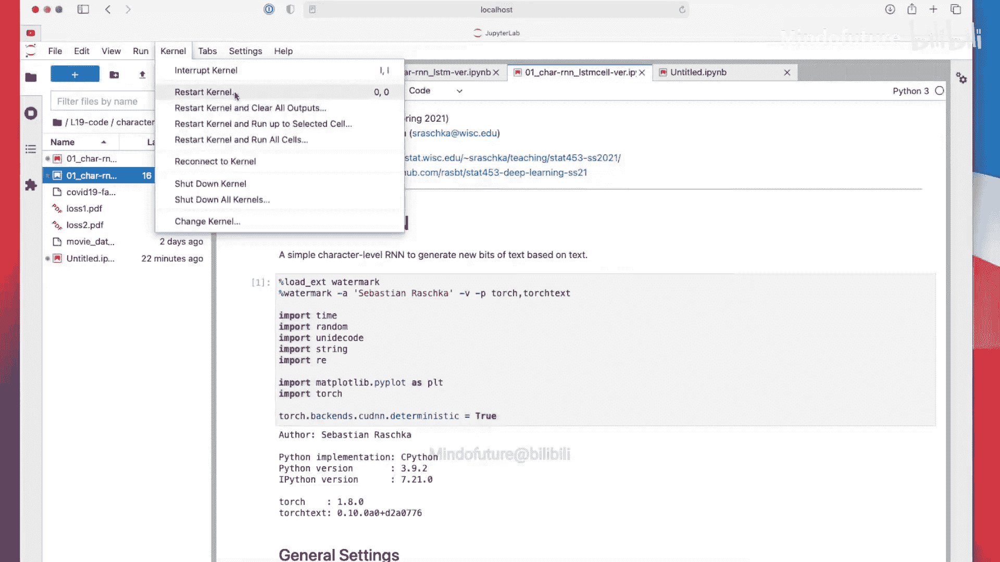
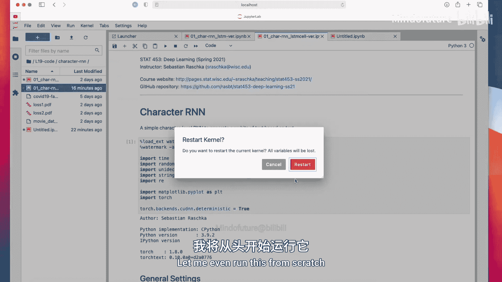
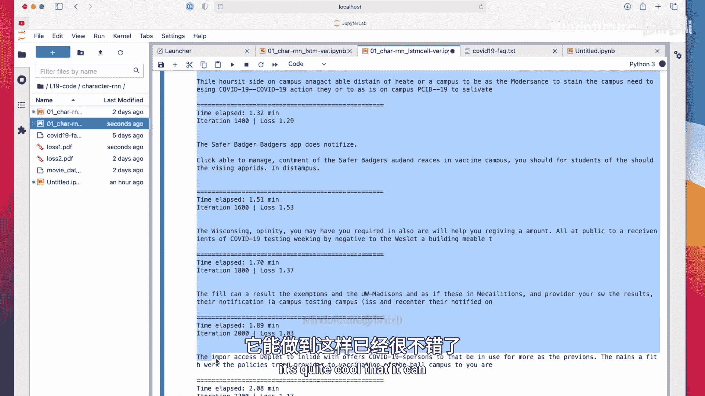
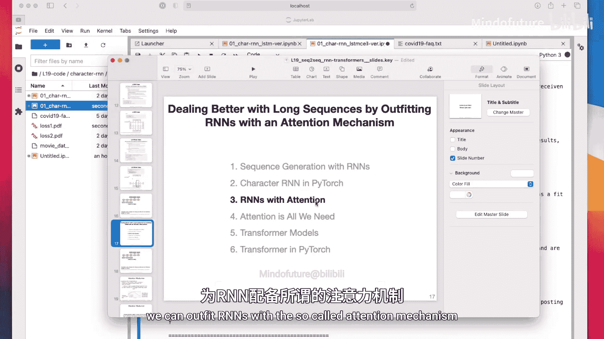

# 158：在PyTorch中实现字符RNN

在本节课中，我们将学习如何使用PyTorch实现一个基于字符的循环神经网络。我们将构建一个简单的LSTM模型，用于学习文本序列的模式，并能够生成新的文本。整个过程包括数据准备、模型定义、训练循环以及文本生成。

## 概述



上一节我们介绍了LSTM的基本概念和结构。本节中，我们来看看如何用PyTorch代码实现一个字符级的LSTM网络。我们将使用一个关于COVID-19的FAQ文本数据集，训练模型来预测序列中的下一个字符，并最终让它能够生成新的文本。



## 代码实现

### 1. 导入库与设置参数

首先，我们需要导入必要的Python库并设置一些超参数。为了保持代码简洁，所有内容都写在一个笔记本中。

以下是导入的库和初始化的超参数：

```python
import torch
import torch.nn as nn
import torch.optim as optim
import string
import random
import matplotlib.pyplot as plt

# 超参数
text_portions_size = 200  # 每个训练片段的长度
num_iterations = 5000     # 训练迭代次数
learning_rate = 0.001
embedding_size = 100      # 嵌入向量维度
hidden_size = 128         # LSTM隐藏层维度
```

我们将在CPU上运行此代码。虽然也可以在GPU上运行，但此处可能存在一些PyTorch版本兼容性问题，CPU运行足够快且稳定。

### 2. 准备数据

我们使用的数据集是威斯康星大学网站上的COVID-19 FAQ文本。所有字符都来自Python的`string.printable`集合，共100个可打印字符（包括数字、大小写字母和特殊符号）。

以下是数据加载和处理的函数：

```python
# 定义字符集
all_characters = string.printable
n_characters = len(all_characters)

# 加载文本数据
with open('covid_faq.txt', 'r', encoding='utf-8') as f:
    text = f.read()
print(f"文本总字符数: {len(text)}")

def get_random_text_portion(length):
    """从完整文本中随机截取指定长度的片段"""
    start_idx = random.randint(0, len(text) - length)
    return text[start_idx:start_idx + length]

def char_to_tensor(string):
    """将字符串转换为字符索引的张量"""
    tensor = torch.zeros(len(string)).long()
    for c in range(len(string)):
        tensor[c] = all_characters.index(string[c])
    return tensor

def get_random_training_sample():
    """获取一个随机的训练样本（特征和标签）"""
    # 获取随机文本片段
    random_string = get_random_text_portion(text_portions_size)
    # 转换为索引张量
    input_tensor = char_to_tensor(random_string)
    # 标签是输入向右移动一位（预测下一个字符）
    target_tensor = char_to_tensor(random_string[1:] + random_string[0])
    return input_tensor, target_tensor
```

`get_random_training_sample`函数返回两个张量：`input_tensor`是当前字符序列，`target_tensor`是下一个字符序列（即标签）。

### 3. 定义模型

我们将定义一个使用`nn.LSTMCell`的RNN模型。与使用`nn.LSTM`相比，`LSTMCell`让我们能更直观地控制每个时间步的前向传播。

以下是模型的定义：

```python
class CharRNN(nn.Module):
    def __init__(self, input_size, embedding_size, hidden_size, output_size):
        super(CharRNN, self).__init__()
        self.hidden_size = hidden_size
        # 嵌入层：将字符索引映射为稠密向量
        self.embedding = nn.Embedding(input_size, embedding_size)
        # LSTM单元
        self.lstm_cell = nn.LSTMCell(embedding_size, hidden_size)
        # 全连接输出层，预测下一个字符的概率分布
        self.fc = nn.Linear(hidden_size, output_size)

    def forward(self, char, hidden_state, cell_state):
        # char: (batch_size=1,)
        # 1. 通过嵌入层
        embedded = self.embedding(char) # 输出形状: (1, embedding_size)
        # 2. 通过LSTM单元
        hidden_state, cell_state = self.lstm_cell(embedded, (hidden_state, cell_state))
        # 3. 通过全连接层得到输出（未归一化的logits）
        output = self.fc(hidden_state)  # 输出形状: (1, output_size=n_characters)
        return output, hidden_state, cell_state

    def init_zero_state(self, batch_size=1):
        """初始化隐藏状态和细胞状态为零张量"""
        return (torch.zeros(batch_size, self.hidden_size),
                torch.zeros(batch_size, self.hidden_size))
```

模型的工作流程如下：
1.  输入一个字符索引。
2.  通过嵌入层得到该字符的向量表示。
3.  将嵌入向量与上一时间步的隐藏状态、细胞状态一起输入LSTM单元，得到新的隐藏状态和细胞状态。
4.  将新的隐藏状态通过一个全连接层，输出对下一个字符的预测（100个类别的logits）。

### 4. 训练循环

训练过程包括初始化模型、定义损失函数和优化器，然后进行多次迭代。每次迭代处理一个随机文本片段。

以下是训练循环的核心代码：

```python
# 初始化模型、损失函数和优化器
model = CharRNN(input_size=n_characters,
                embedding_size=embedding_size,
                hidden_size=hidden_size,
                output_size=n_characters)
criterion = nn.CrossEntropyLoss()
optimizer = optim.Adam(model.parameters(), lr=learning_rate)

losses = [] # 记录损失

for i in range(num_iterations):
    # 初始化隐藏状态和细胞状态
    hidden, cell = model.init_zero_state()
    total_loss = 0

    # 获取随机训练样本
    input_tensor, target_tensor = get_random_training_sample()

    # 遍历文本片段中的每一个字符
    for t in range(text_portions_size):
        # 准备当前时间步的输入和标签
        # 需要增加一个批次维度 (1,)
        input_char = input_tensor[t].unsqueeze(0)
        target_char = target_tensor[t].unsqueeze(0)

        # 前向传播
        output, hidden, cell = model(input_char, hidden, cell)
        # 计算当前时间步的损失
        loss = criterion(output, target_char)
        total_loss += loss

    # 计算平均损失并反向传播
    avg_loss = total_loss / text_portions_size
    optimizer.zero_grad()
    avg_loss.backward()
    optimizer.step()

    # 记录和打印损失
    losses.append(avg_loss.item())
    if i % 500 == 0:
        print(f'迭代次数 [{i}/{num_iterations}], 损失: {avg_loss.item():.4f}')
        # 此处可以调用评估函数，查看当前模型生成的文本
```

在每次迭代中，我们对一个长度为200的序列进行遍历。每个时间步，模型接收一个字符，预测下一个字符，并计算损失。所有时间步的损失被累加后求平均，然后进行反向传播和参数更新。

### 5. 文本生成与评估

训练过程中或训练后，我们希望模型能生成新的文本。生成文本时，我们需要一个“温度”参数来控制生成文本的多样性。

以下是文本生成（评估）函数：

```python
def evaluate(model, prime_str='TH', predict_len=100, temperature=0.8):
    """使用模型生成文本"""
    model.eval()
    with torch.no_grad():
        # 初始化状态
        hidden, cell = model.init_zero_state()
        # “预热”：用起始字符初始化隐藏状态
        for p in range(len(prime_str)-1):
            _, hidden, cell = model(char_to_tensor(prime_str[p]).unsqueeze(0), hidden, cell)

        # 输入最后一个起始字符，开始生成
        input_char = char_to_tensor(prime_str[-1]).unsqueeze(0)
        predicted_str = prime_str

        for p in range(predict_len):
            # 前向传播，得到预测的logits
            output, hidden, cell = model(input_char, hidden, cell)
            # 应用温度调节：output_dist = exp(logits / temperature)
            output_dist = output.data.view(-1).div(temperature).exp()
            # 根据调整后的分布进行随机采样，得到下一个字符的索引
            top_char = torch.multinomial(output_dist, 1)[0]
            # 将索引转换为字符
            predicted_char = all_characters[top_char]
            # 添加到生成字符串中
            predicted_str += predicted_char
            # 将预测的字符作为下一个时间步的输入
            input_char = char_to_tensor(predicted_char).unsqueeze(0)

        return predicted_str
```

**温度参数解释**：
*   **公式**：调整后的概率分布为 `exp(logits / temperature)`。
*   **高温（如1.5）**：概率分布更平缓，生成文本更多样、更有创造性，但也可能包含更多错误或 nonsense。
*   **低温（如0.5）**：概率分布更尖锐，模型更倾向于选择最高概率的字符，生成文本更确定、更保守，但多样性降低。
*   **温度=1.0**：为标准Softmax操作。

在训练循环中，我们可以定期调用`evaluate`函数来观察模型生成文本质量的变化。

## 总结





本节课中我们一起学习了如何在PyTorch中实现一个字符级的LSTM循环神经网络。我们从数据准备开始，将文本转换为模型可处理的张量。然后，我们定义了一个使用`LSTMCell`的RNN模型，并详细阐述了其前向传播过程。接着，我们编写了训练循环，使模型能够通过随机截取的文本片段学习字符序列的模式。最后，我们实现了一个文本生成函数，并引入了“温度”参数来控制生成文本的随机性和多样性。通过这个简单的示例，我们可以看到RNN如何学习文本的局部结构并生成新的字符序列。虽然本例生成的文本可能不够连贯，但它展示了序列生成模型的基本原理。在后续课程中，我们将介绍更强大的技术，如注意力机制，来进一步提升生成模型的能力。