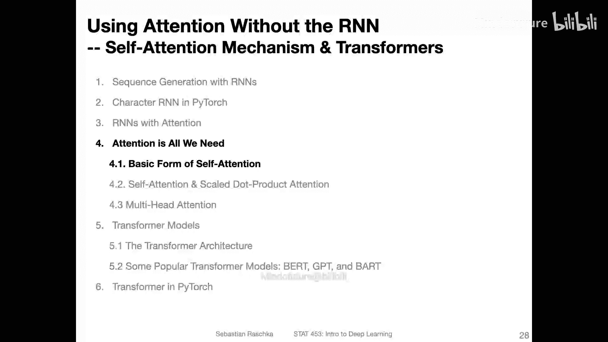
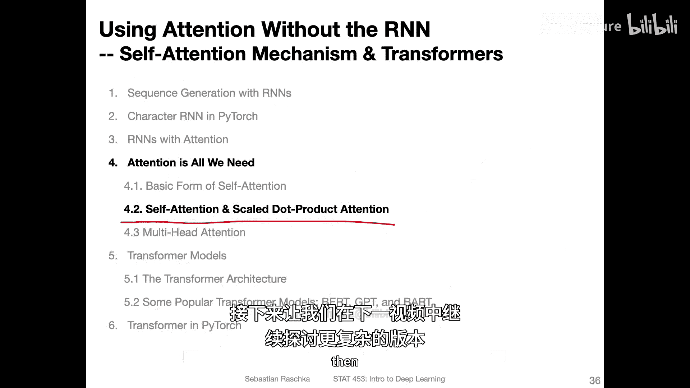

# 160：不使用RNN的注意力——自注意力的基本形式 🧠

在本节课中，我们将学习一种不依赖循环神经网络（RNN）的注意力机制，即自注意力。这是理解现代Transformer模型的基础。我们将从基本概念入手，逐步拆解其工作原理。

---

在上一节中，我们介绍了带有注意力机制的循环神经网络（RNN）。这种机制帮助RNN更好地处理长序列。

现在，我们将进行一个大胆的尝试：移除RNN部分。我们将探讨一个仅使用注意力机制，而不包含RNN的模型。

我们将要探讨的这种特定注意力类型被称为**自注意力**。它是所谓的**Transformer网络**背后的核心原理之一。Transformer模型是目前处理长序列和文本数据的最先进模型。

由于涉及许多小主题，为了避免视频过长，我决定将其进一步细分为几个小节。在本视频中，我们将先了解其宏观概念，然后介绍一种非常基础的自注意力形式，这纯粹是为了教学目的，以理解自注意力背后的基本原理。之后，我们将探讨原始Transformer模型中使用的更复杂形式，其中包括一个称为**多头注意力**的概念。在介绍完这些概念后，我们将看看它们是如何组合成Transformer模型的。我还会介绍一些有趣的见解，并讨论如今流行的几种变体。最后，我们将以在PyTorch中实现Transformer模型作为结束。

好的，这里我们先简要回顾一下上一节的内容。我们有一个带有注意力机制的RNN。它的工作原理是：对于每个生成的单词（例如，我们称这里的RNN为RNN #1），以及一个双向RNN，在每个时间步，这里的RNN会生成一个输出单词。除了接收前一个隐藏状态外，它还接收一个**上下文向量**，这个向量依赖于这里的整个序列输入。我们这里有整个序列，以及它们的隐藏表示，然后我们用这些**注意力权重**乘以它们。注意力权重是由神经网络计算出的值的归一化版本。这就是上一节的内容。其核心思想是，我们以加权形式将整个序列作为输入。

现在，我们将从该模型中移除所有序列处理部分。我们不再使用任何循环、卷积或其他专门用于顺序处理输入的结构。我们将朝着所谓的**Transformer模型**迈进，它仅依赖于**自注意力机制**。自注意力机制一次性处理整个序列，这实际上也非常有利于并行化。实际上，Transformer模型的训练成本相当高，但它们能更好地利用GPU。与RNN一次生成一个内容不同，Transformer可以并行运行计算，因为要计算下一步，必须先完成上一步。因此，Transformer在并行化计算方面要好得多。

与“多对多”RNN类似，Transformer也有编码器和解码器部分，但这里不使用RNN或LSTM，而是使用一种称为**堆叠注意力层**的结构。这就是我们努力实现的大图景，我们将一步一步地完成。

这些幻灯片的基本依据是这篇名为 **《Attention Is All You Need》** 的论文。这是2017年具有开创性意义的基础论文，它提出的原始Transformer架构在当时超越了所有其他方法。自2018年以来，基于Transformer的自然语言处理领域发展迅猛。你可以看到它开始时规模也相对较小（这里的Y轴，我认为是参数数量，单位是百万）。例如，这个模型有83亿个参数。你可以看到这些模型的规模呈巨大增长曲线，同时其受欢迎程度也急剧上升。当然，训练830亿个参数对于普通人来说是不可行的，因此如今也有研究小组专注于开发小型Transformer模型。无论如何，这只是一个大图景，表明Transformer模型非常有趣，并且有许多不同的变体。我们讨论的是这个基础版本。如果你有兴趣，可以后续了解其他模型。我也会简要介绍GPT-2和BERT模型，它们也是基础模型，因为它们采用了自监督学习技术，这些技术后来也被其他类型的Transformer所采用。

好的，回到**自注意力机制**。在讨论Transformer中使用的自注意力机制之前，我想先介绍一种非常基础的形式，以便循序渐进地引入这个主题。

这种非常基础的形式，我们可以将其视为一个包含三个步骤的过程：
1.  推导**注意力权重**，它是当前输入（序列中的一个元素，可以看作句子中的一个单词）与所有其他输入之间相似性或兼容性的一种形式。
2.  一旦我们有了权重（我将在下一张幻灯片展示如何推导），我们通过Softmax函数对它们进行归一化。这与我们在RNN中计算归一化注意力权重时所做的类似。
3.  然后，在步骤4中，我们将根据归一化权重和相应的输入计算**注意力值**。

整个过程看起来与我们之前在RNN注意力机制中展示的非常相似。在RNN注意力机制中，这里的注意力值也是一个加权和。

这里，每个 `x` 代表一个输入单词。我们假设句子中有 `T` 个单词。对于每个单词，我们都有一个注意力权重。让我们称这个单词为 `j`，从 `j=1` 到 `T`。那么，`a_{ij}` 就是第 `i` 个单词与第 `j` 个单词之间的注意力权重。我们用它来计算句子中第 `i` 个单词的注意力值。信息可能有点密集，让我们一步一步来看。我也会展示如何计算这些注意力权重 `a`。

在顶部，我再次展示了上一张幻灯片的内容，我们计算了对应于第 `i` 个输入（第 `i` 个单词）的输出。每次我在这里写“输入”，比如一个句子，那么“第 `i` 个输入”就是第 `i` 个单词。

那么，我们如何计算这些注意力权重呢？在这种简单的、非常基础的自注意力形式中（仅用于入门目的），我们假设通过第 `i` 个输入单词和第 `j` 个单词之间的**点积**来计算。然后，我们对句子中的所有单词（`T` 个单词）重复此操作。这样，我们得到 `e_{i1}, e_{i2}, e_{i3}, ..., e_{iT}`。当我们使用Softmax函数计算归一化形式时，所有这些归一化后的值将求和为1，这些就是我们的注意力权重。

为了总结前面的幻灯片，这里有一个我们刚刚讨论内容的可视化表示。

假设我们有这个输入序列。这里的输入序列，你可以把它看作一个句子。每个 `x` 是一个向量，代表一个单词。我说向量是因为这是一个**词嵌入**。我们在RNN的上下文中讨论过这个，例如，我们将单词转换为整数索引，然后从嵌入矩阵中检索其嵌入。所以，嵌入本质上就是一个连续值向量，代表每个特定的单词。

然后，在第一步，我们计算相似性。让我们称当前输入为**查询**。例如，`i` 可以是1，即第一个单词。当然，我们会为每个单词都这样做，但假设我们从第一个单词开始，然后执行步骤1、2、3，接着移动到第二个单词，做同样的事情。所以，这里的输出 `a_i` 在第一步是 `i=1`，第二步是 `i=2`，依此类推。最后，我们会把它们全部堆叠起来，本质上得到一个矩阵。

我有点超前了，还是一次解释一件事。我们可以使用点积来计算相似性。为什么用点积？这只是我们计算向量之间兼容性或相似性的一种方式。我们也可以考虑其他函数，比如余弦相似性（本质上就是归一化的点积）。但为了简单起见，我们使用点积。我们在这里计算查询 `x_i` 与句子中每个其他单词的点积。注意，这里是 `x_1`, `x_2`... 对于每一个，我们都计算这个相似性，它是一个标量（单个数字）。然后，我们将其通过Softmax函数，使它们归一化。现在，我们有了归一化的注意力分数，它们的值在0到1之间，并且总和为1。然后，我们在这里对它们进行求和。我们得到注意力值，它是一个向量。因为 `x_j` 是我们的输入单词，`j` 从1到 `T`。我们在这里遍历所有输入。所以，我们现在用对应的 `a` 对这些输入进行加权。我们做的是：加权这个输入，然后加上这个加权的输入，再加上那个加权的输入... 这最终给我们一个向量。本质上，它就像一个词嵌入，只不过现在它包含了关于整个序列的信息。原来的词嵌入只包含关于单词本身的信息。所以，无论单词在句子中的什么位置，无论句子开头是什么样子，单词“Hello”在放入模型时总是具有相同的嵌入（在RNN中也是如此）。但是，现在相反，我们这里的输出，如果我们以单词1作为查询，它也是这个单词（比如“Hello”）的一种表示，只不过它包含了“Hello”在所有其他单词上下文中的信息。因为我们有这个加权步骤。所以，我们现在有了一个更强大的、包含上下文的词嵌入向量。

我们所做的本质上是：在提取信息方面，不仅仅是单独考虑每个单词，我们现在有了**感知其上下文的单词表示**。这就是我称之为非常简单的自注意力基本形式。当然，这不是Transformer中使用的形式，但这只是为了引入主题。我认为，这总结了整个概念，即注意力背后的主要思想之一：**推导上下文**。

好的，在下一节中，让我们看看更复杂的版本。

---

**本节课总结**：
在本节课中，我们一起学习了自注意力的基本概念。我们从回顾带注意力的RNN开始，然后移除了RNN部分，引入了仅依赖注意力的模型构想。我们重点介绍了一种基础的自注意力形式，它通过计算查询单词与句子中所有单词的点积相似性，经Softmax归一化后得到注意力权重，最后通过加权求和生成包含上下文信息的单词表示。这个过程是理解现代Transformer模型强大能力的基石。下一节，我们将深入探讨Transformer中使用的、更复杂的自注意力机制。