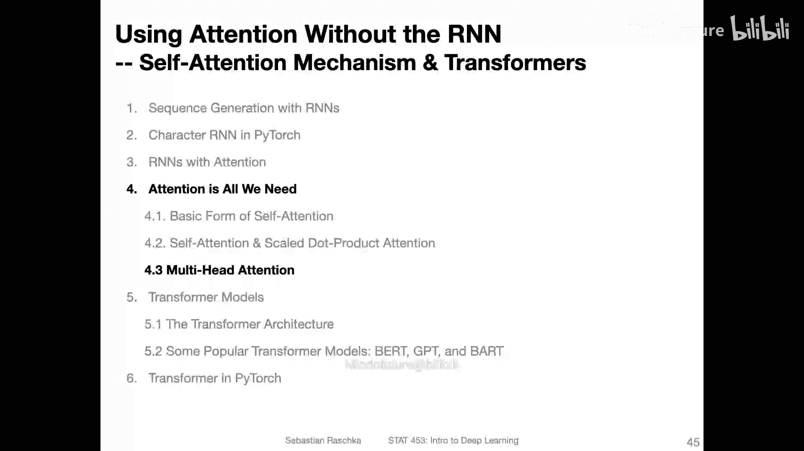
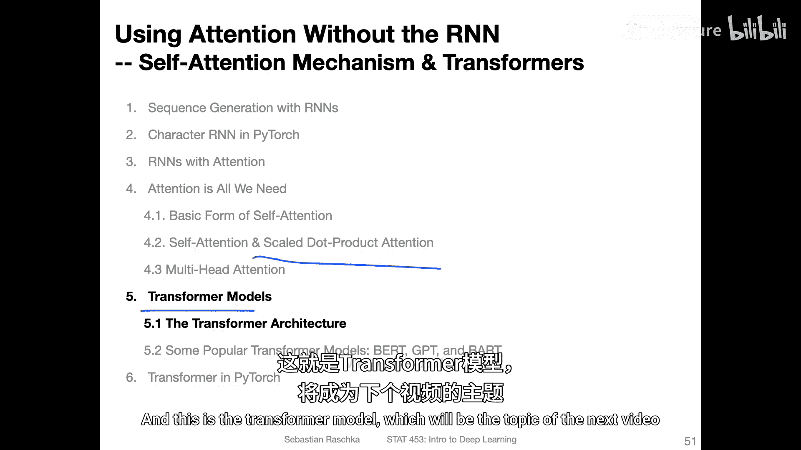

# 162：多头注意力机制 🧠

在本节课中，我们将学习多头注意力机制。这是Transformer模型的核心组件之一。我们将看到，它本质上是将上一节介绍的缩放点积注意力机制并行地应用多次，以捕捉序列中不同部分的信息。

上一节我们详细介绍了缩放点积注意力机制。本节中，我们来看看如何将其扩展为更强大的多头注意力。

多头注意力机制的思想是并行地应用多个缩放点积注意力“头”。这类似于卷积神经网络中使用多个卷积核来提取不同特征。每个注意力头都使用自己独立的权重矩阵，这使得模型能够同时关注输入序列的不同方面。

以下是多头注意力机制的核心步骤：

1.  **线性投影**：对于每个注意力头，输入序列分别通过三组不同的权重矩阵（**W_Q**, **W_K**, **W_V**）进行投影，生成该头独有的查询、键和值。
2.  **并行计算注意力**：每个头独立计算其缩放点积注意力。对于一个头，其计算过程如下：
    `注意力头输出 = softmax( (Q * K^T) / sqrt(d_k) ) * V`
    其中，Q、K、V是该头独有的投影结果。
3.  **拼接输出**：将所有注意力头的输出在特征维度上进行拼接。
4.  **最终线性投影**：将拼接后的结果通过一个最终的线性层（**W_O**）进行投影，以整合所有头的信息并输出最终维度。

在原始的《Attention Is All You Need》论文中，使用了8个注意力头。假设输入嵌入维度 `d_model = 512`，那么每个头的键/查询/值维度 `d_k = d_v = d_model / h = 512 / 8 = 64`。经过8个头并行计算后，每个头输出一个 `T x 64` 的矩阵。将它们拼接后，得到 `T x 512` 的矩阵，再经过一个 `512 x 512` 的线性层 **W_O**，最终输出保持为 `T x 512` 的维度。这种设计使得模型可以方便地使用残差连接。

多头注意力机制是一个相对简单的概念。它通过并行运行多个缩放点积注意力模块，使模型能够从不同子空间协同关注序列信息，从而增强了模型的表示能力。

本节课中，我们一起学习了多头注意力机制。我们了解到，它通过并行使用多组权重矩阵来计算注意力，并将结果拼接整合，从而让模型能够同时捕捉输入的不同特征。现在，我们已经掌握了自注意力、缩放点积注意力和多头注意力这些核心概念。在下一节中，我们将看到这些组件如何组合在一起，构成完整的Transformer模型。