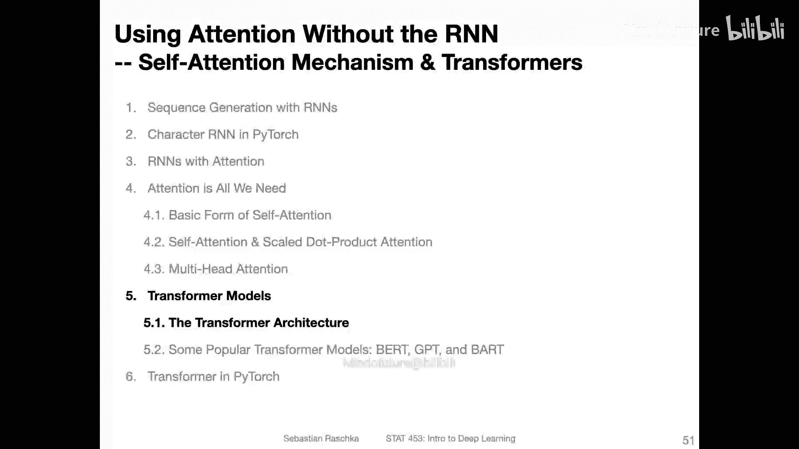
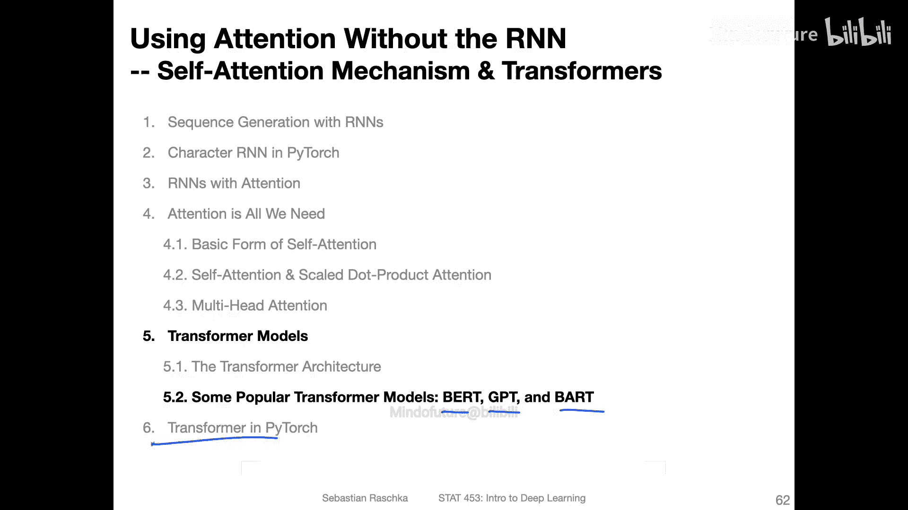

# 163：Transformer架构详解 🧠

在本节课中，我们将详细解析Transformer架构。Transformer是“Attention Is All You Need”论文中提出的革命性模型，它完全基于注意力机制，摒弃了传统的循环和卷积结构，在机器翻译等序列任务上取得了巨大成功。

## 概述

在之前的三个视频中，我们为理解Transformer模型奠定了基础。我们首先介绍了自注意力的基本形式，然后讨论了论文中的缩放点积注意力，接着讲解了多头注意力机制，即并行运行多个缩放点积注意力。这些都是原始Transformer模型的核心组件。在本节中，我们将更详细地探讨Transformer的架构。

## 回顾缩放点积注意力

在深入Transformer之前，我们先简要回顾缩放点积注意力，因为它不仅是Transformer的一部分，而且有助于我们巩固记忆。

以下是缩放点积注意力的五个步骤总结：

1.  **构造查询、键和值**：假设输入X的每一行代表一个单词，列代表词嵌入维度。我们通过乘以不同的权重矩阵（WQ, WK, WV）来生成查询、键和值。在原始论文中，它们的维度是相同的。
2.  **计算查询与键的矩阵乘法**：这一步计算单词之间的关系。例如，结果矩阵的第一行第二列代表第一个单词与第二个单词的关联度。
3.  **缩放**：将上一步的结果除以键向量维度的平方根（√dk）。这是为了防止点积值过大或过小，导致Softmax函数输出过于尖锐（接近0或1），从而产生较小的梯度，不利于训练。
4.  **应用Softmax**：对缩放后的结果应用Softmax函数进行归一化，得到注意力权重。
5.  **与值矩阵相乘**：将注意力权重与值矩阵相乘，得到最终的输出。对于第一个单词的输出，它现在包含了句子中所有其他单词的信息。

这个过程的核心思想是为每个单词整合整个句子的上下文信息。

## 多头注意力机制

多头注意力是并行运行多个上述缩放点积注意力过程，然后将结果拼接并通过一个全连接层。

具体来说，我们生成多组查询、键和值矩阵（例如h组），并行计算h个注意力输出，将它们拼接起来，最后乘以一个权重矩阵WO。这允许模型在不同的表示子空间中共同关注来自不同位置的信息。

## Transformer架构总览

现在，我们来看Transformer的整体架构。它初看可能很复杂，但我们可以逐一拆解理解。

Transformer主要分为两部分：**编码器**和**解码器**。

*   **编码器**：接收输入句子，并生成其表示。
*   **解码器**：接收编码器的输出以及“右移”的输出序列，然后生成目标句子（例如翻译结果）的概率，一次生成一个单词。

架构中有几个关键部分：
*   **多头注意力**：出现在编码器和解码器中。
*   **掩码多头注意力**：仅出现在解码器中，用于防止模型在训练时“偷看”未来的单词。
*   **残差连接**：类似于残差网络中的思想，将层的输入直接加到输出上，有助于梯度流动和模型训练。
*   **前馈神经网络**：每个编码器和解码器层中都包含一个全连接的前馈网络。
*   **层归一化**：在残差连接之后应用，用于稳定训练。

编码器和解码器结构会重复堆叠N次（在原始论文中N=6），每一层的结构相同但参数不共享。

## 掩码多头注意力

掩码多头注意力与普通多头注意力的概念基本相同，关键区别在于它会对序列中未来的位置进行掩码。

解码器是自回归的，即一次生成一个单词。在训练时，虽然我们知道完整的目标句子，但在预测第t个单词时，模型不应该看到t时刻之后（未来）的单词。掩码通过将未来位置的注意力权重在Softmax之前设置为负无穷大来实现，这样Softmax之后它们的概率就变成了0。

例如，在翻译“I like planes”为德语“Ich mag Flugzeuge”时，当模型只生成了“Ich”，正在预测第二个单词时，它会将“mag”和“Flugzeuge”的位置掩码掉。

## 位置编码

自注意力机制本身对单词在序列中的位置不敏感。为了给模型注入位置信息，Transformer使用了**正弦位置编码**。

位置编码是一个与词嵌入维度相同的向量，它根据单词在序列中的位置，使用不同频率的正弦和余弦函数计算生成。这个向量会直接加到单词的词嵌入向量上。这样，即使相同的单词出现在不同位置，其输入表示也会有所不同。

## 相加与层归一化

架构图中随处可见的“Add & Norm”层包含两部分：
*   **Add**：指残差连接，即将子层（如注意力层或前馈网络层）的输入加到其输出上。
*   **Norm**：指**层归一化**。它与批归一化相关，但计算均值和方差的方向不同。在Transformer的语境中，它通常是在特征维度（例如，跨多个注意力头的维度）上进行归一化，有助于稳定训练过程。

## 注意力可视化

原始论文中提供了注意力权重的可视化示例。我们可以将注意力看作一个矩阵，显示每个单词关注其他单词的程度。

例如，对于某个单词，其注意力权重可能强烈集中在少数几个相关的单词上。不同的注意力头会学习到不同的关注模式，这表明使用多头注意力是有效的，它们可以捕获句子中不同类型的关系。

## 总结

本节课我们一起深入学习了Transformer的架构。我们回顾了其核心组件缩放点积注意力和多头注意力，并系统剖析了Transformer编码器-解码器的整体结构，包括掩码注意力、位置编码、残差连接和层归一化等关键设计。这些设计使得Transformer能够高效地处理序列数据，并成为当今许多强大模型（如BERT、GPT）的基础。在接下来的视频中，我们将从宏观层面探讨一些更现代的Transformer架构变体。