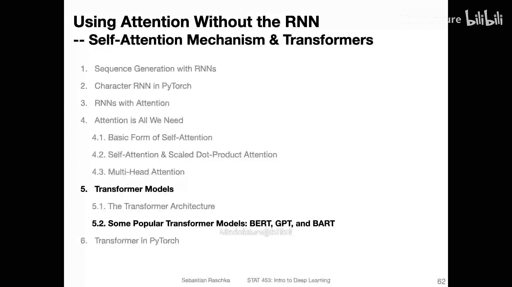
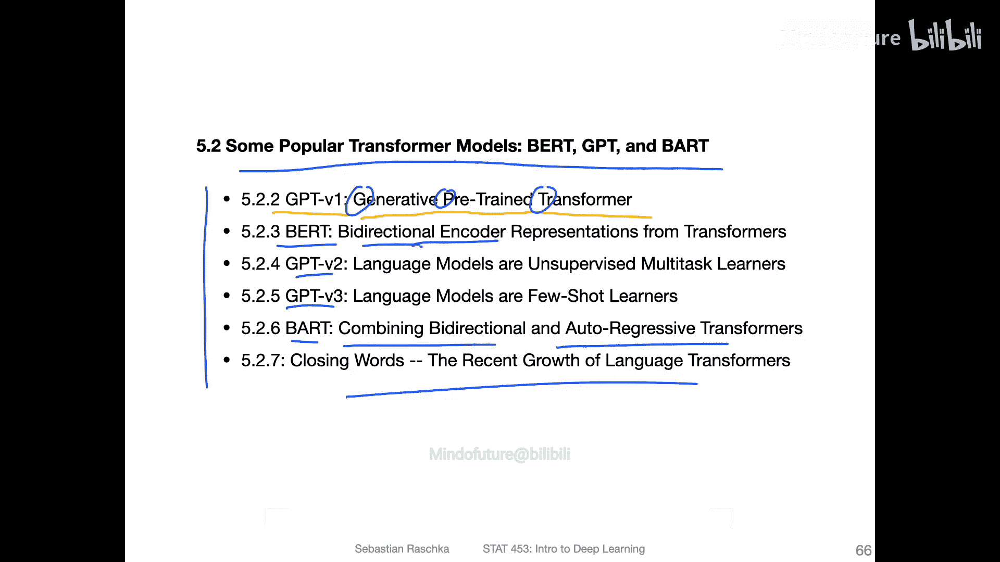

# 164：一些流行的Transformer模型——BERT、GPT与BART概述 🧠

在本节课中，我们将学习基于Transformer架构的几种流行模型，包括BERT、GPT和BART。我们将了解它们的基本概念、核心差异以及它们如何利用自监督学习在大规模无标签数据上进行预训练。

上一节我们介绍了注意力机制、自注意力、多头注意力以及它们如何共同构成Transformer架构。本节中，我们来看看基于此架构的一些具体且广为人知的模型实现。

## Transformer架构回顾

首先，简要回顾一下原始的Transformer架构。它源自论文《Attention Is All You Need》。我们将要讨论的模型，如BERT和GPT，都基于这一基础架构。当然，它们进行了一些修改，但从根本上说，BERT借鉴了编码器部分，而GPT借鉴了解码器部分。在后续视频中，我们将看到这些模型如何与这个基础模型相关联。

从宏观角度看，所有这些Transformer模型成功的关键仍在于两点：
1.  **自注意力机制**，用于编码长距离依赖或上下文关系。
2.  **自监督学习**，用于利用大规模无标签数据集。

## 自监督学习与预训练

自监督学习，有时也称为无监督预训练，其核心思想是从数据本身的结构中构造标签，而不是依赖昂贵的人工标注。

例如，在Transformer模型中，一个常见的任务是**预测下一个词**。这仍然是一个监督学习过程，因为我们使用分类损失来预测下一个词。但与常规监督学习不同，这个标签是从文本本身提取的，即下一个词。因此，这被称为自监督学习，因为标签在某种意义上是由数据自身创建的。

Transformer的训练方法通常分为两个步骤：
1.  **预训练**：在大型无标签数据集上使用自监督学习进行训练。
2.  **下游任务训练**：在通常较小的有标签数据集上，针对特定下游任务进行训练。

下游任务可以是语言翻译、文本分类、文本摘要或问答等。这类似于我们之前讨论过的迁移学习。

以下是两种主要的针对下游任务的训练方法：

**基于微调的方法**：这种方法会更新整个模型的参数。例如，在预训练模型的基础上，为电影评论分类任务添加一个分类层，然后在有标签数据集上训练，并更新模型的所有参数。

**基于特征的方法**：这种方法不更新预训练模型。相反，它从模型的最后几层（例如最后一层或最后四层）提取上下文嵌入。这些嵌入包含了句子的上下文信息，被认为比常规词嵌入更好。然后，将这些固定嵌入作为特征输入，训练一个新的模型（例如逻辑回归或LSTM）来完成分类等任务。

我们将在讨论BERT模型时更详细地探讨这种方法。

## 即将介绍的模型概览

在接下来的视频中，我将分别介绍这些不同的模型。我原本打算在一个视频中涵盖所有内容，但发现内容过多。当然，这部分是可选材料，你可以自行决定是否观看。

以下是我将在后续视频中涵盖的主题：
*   **原始GPT模型**：即生成式预训练Transformer，其核心是单向的（自回归）下一个词预测。
*   **BERT模型**：即双向编码器表示，其核心是双向的上下文理解。
*   **GPT-2和GPT-3模型**：GPT模型的后续版本。
*   **BART模型**：它结合了BERT的双向编码能力和GPT的单向自回归解码行为。

之后，我还会简要讨论Transformer的计算效率等更广泛的话题。最后，我们将一起看一个代码示例。

本节课中，我们一起学习了BERT、GPT和BART等流行Transformer模型的概述，了解了它们共有的自监督预训练范式以及针对下游任务的两种主要方法（微调与特征提取）。在接下来的课程中，我们将深入探讨每个模型的独特之处。