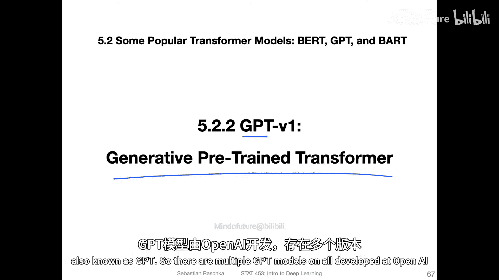
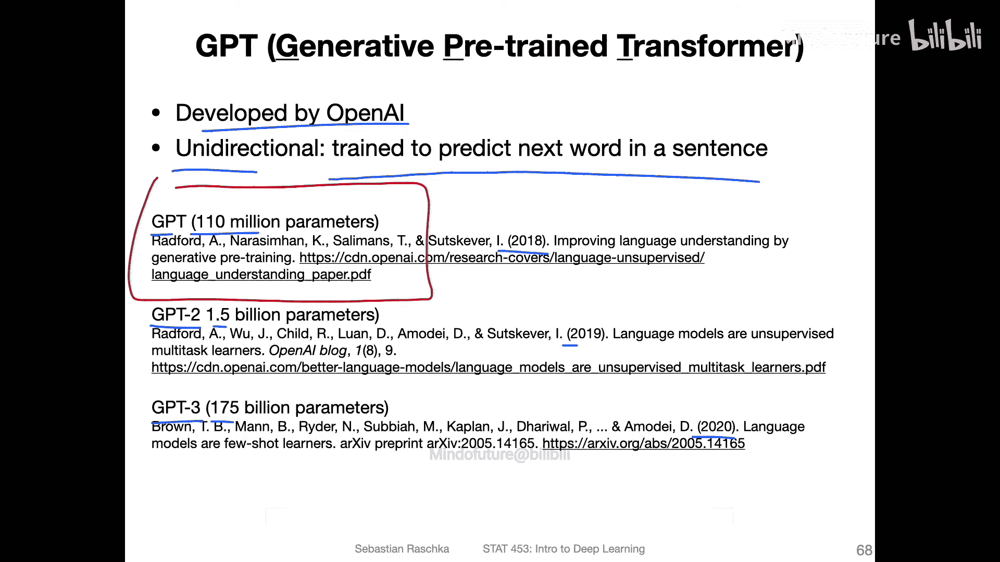
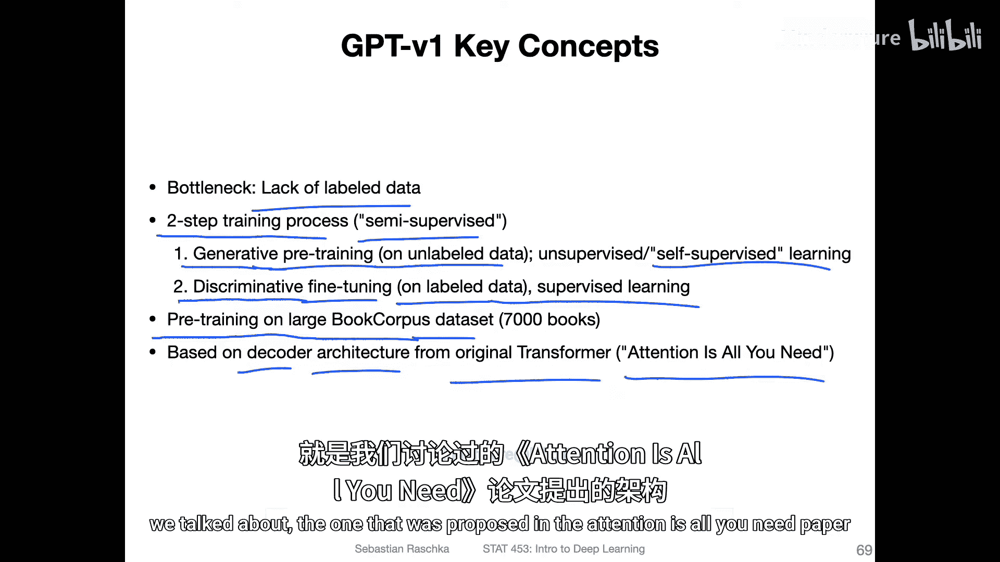
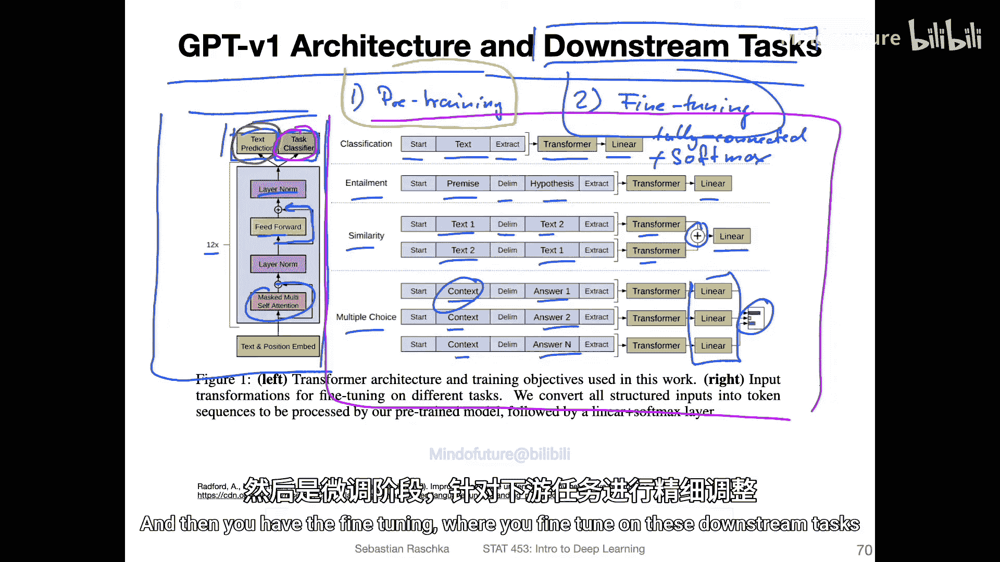
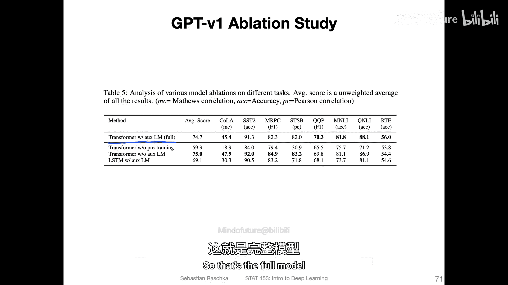
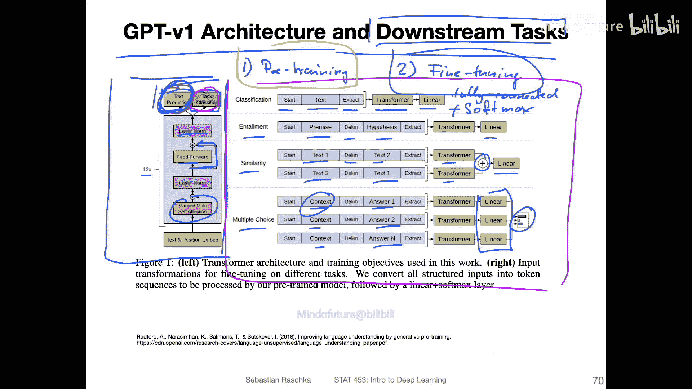
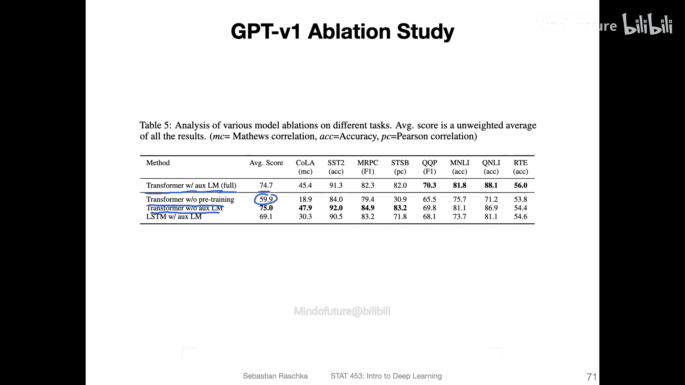
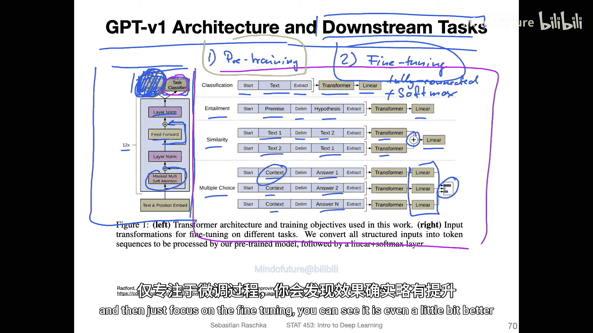
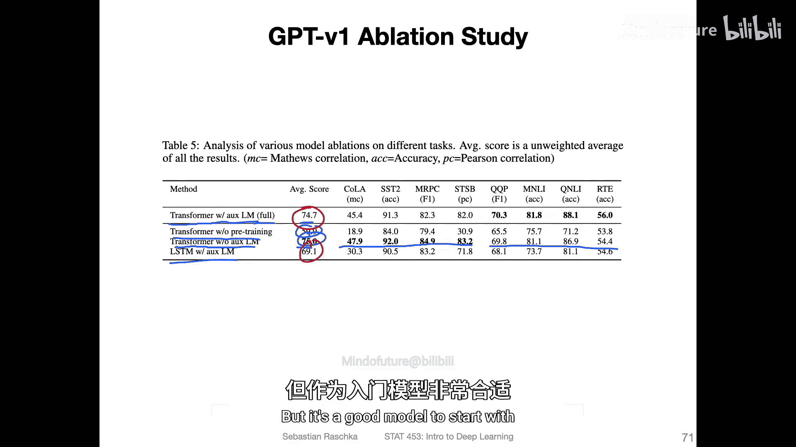
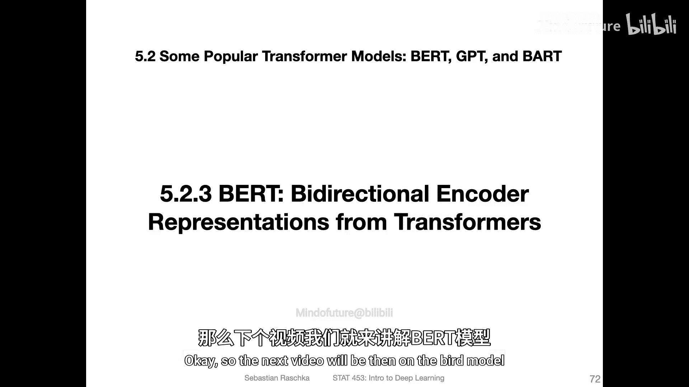

# 165：GPT-v1 - 生成式预训练Transformer 🧠

在本节课中，我们将学习生成式预训练Transformer模型，即GPT-v1。我们将了解其核心思想、两阶段训练过程、模型架构以及它在不同下游任务上的应用方式。

---

## 模型概述与核心思想

GPT模型由OpenAI开发，其共同特点是它们都是**单向**的。这意味着模型主要被训练来预测句子中的下一个词。

截至目前，共有三个主要版本。GPT版本1于2018年发布，拥有1.1亿个参数。GPT版本2于2019年发布，参数达到15亿，规模扩大了十倍以上。GPT版本3于2020年发布，参数高达1750亿。本视频将重点介绍GPT版本1。

GPT模型背后的一个核心假设是：**缺乏标注数据是限制大型语言模型性能提升的主要瓶颈之一**。

因此，论文中提出了一个两阶段的训练过程，作者称之为**半监督学习**。通常，半监督学习意味着同时利用标注和未标注的数据。

这里的半监督过程就是我之前视频中简要概述的两步法：第一步是预训练，第二步是微调。预训练阶段被称为**生成式预训练**，即使用大型未标注数据集来预训练Transformer模型。如今，这也被称为自监督学习。

第二步是**判别式微调**，即使用与特定任务相关的、规模较小的标注数据集。例如，电影评论分类任务。这本质上是一种使用预训练模型的监督学习，是迁移学习的一种形式。

预训练本身使用了一个名为“书籍语料库”的数据集，该数据集包含7000本未出版的书籍。所使用的架构基于我们讨论过的原始Transformer模型中的**解码器**部分。

---

## 模型架构与任务适配

下图可视化了GPT的架构及其用于微调的不同下游任务。

让我们先从架构开始。左侧部分看起来与《Attention Is All You Need》论文中的原始Transformer非常相似。这里也有跳跃连接、层归一化、前馈网络层以及带掩码的多头自注意力层等。

因此，从这方面看，它只是原始Transformer论文中的一个解码器。不同之处在于，这里使用了**12个**Transformer块，而原论文中只有6个。

另一个需要注意的是，输出部分有两个框：一个称为“文本预测”，另一个是“任务分类器”。同样，首先进行的是下一个词预测的预训练。

预训练完成后，再针对不同的下游任务进行微调。首先，这个“文本预测”框象征着预训练任务，即下一个词预测。而“任务分类器”框则象征着用于微调的下游任务。

然而，在微调期间，即在预训练完成后，可以保留“文本预测”部分，并同时训练两者。这意味着，在更新模型以进行任务预测的同时，也可以有一个用于预测下一个词的损失函数。因此，这里有两个不同的线性层：一个用于下一个词预测，另一个用于任务预测。作者实验了保留这部分对微调是否有益，我将在下一张幻灯片展示结果。

现在，让我们聚焦于不同的任务。假设我们已经完成了下一个词预测的预训练，现在开始针对不同任务进行微调。右侧展示了他们研究的不同任务以及输入应如何格式化的可视化。

*   **分类任务**：他们提供一个起始标记、主要文本和一个提取标记（类似于结束标记或序列结束标记）。然后将其输入Transformer，并通过一个额外的线性输出层。这就像一个全连接层分类器，最后可以使用Softmax激活函数，并使用交叉熵损失进行训练。
*   **蕴含任务**：这类似于逻辑中的蕴含关系。输入包含一个前提、一个分隔符和一个假设。本质上这也是一种分类任务，判断真假。
*   **相似性任务**：比较两段文本是否相似或测量其相似度。输入包含文本一、分隔符和文本二。为了保持对称，可能还会输入文本二后跟文本一。将两者通过同一个Transformer后，将得到的嵌入向量相加，然后通过一个全连接层。作者可能使用类似L2距离的度量，来最小化相似文本间的距离，最大化不同文本间的距离。
*   **多项选择任务**：输入包含上下文和一个可能的答案，然后是上下文与另一个答案，依此类推。本质上这也是一种分类任务，模型需要从N个可能的答案中选择最可能的一个。

再次强调，主要思想是分为两个步骤：第一步是预训练，训练模型进行下一个词预测；第二步是微调，针对这些下游任务进行微调。

---

## 消融实验与性能分析

这里进行了一项消融研究，探讨在微调时移除下一个词预测任务是否会使性能变得更好或更差。

他们将完整的模型称为“带辅助语言模型的Transformer”。这里的辅助语言模型本质上就是之前提到的“文本预测”部分。

可以看到，完整模型取得了相当好的性能，综合得分为74.7。

接下来是“未经预训练的Transformer”，即不进行预训练，直接进行微调。可以看出，未经预训练的Transformer模型性能明显差很多。这表明预训练确实有很大帮助。

然后是“不带辅助语言模型的Transformer”。可以看到，在某些任务上，去掉辅助语言模型（即下一个词预测任务）后，性能甚至稍微好了一点。

因此，如果你预训练模型进行下一个词预测，然后在微调时去掉这部分，只专注于微调任务，可以看到在某些任务上性能甚至略有提升，但并非所有任务都如此。

为了比较，他们还使用了常规的LSTM模型。可以看到，LSTM的性能比完整模型要差。

---

## 总结与后续

按照今天的标准，GPT版本1已经是一个非常旧的模型，因为现在已经有了GPT版本2和3。但它是一个很好的入门模型。

在下一节介绍其他GPT模型之前，我们将讨论BERT模型，它使用Transformer的方式略有不同。之所以先介绍BERT再介绍其他GPT版本，是因为在BERT的论文中，作者特别将他们的模型与GPT-1进行了比较。从某种程度上说，这是按时间顺序安排的：GPT版本1，然后是BERT，接着是GPT版本2和3。

本节课中，我们一起学习了GPT-v1模型。我们了解了其作为单向模型的核心特点、为解决标注数据瓶颈而提出的生成式预训练与判别式微调两阶段训练过程，以及其基于Transformer解码器的架构。我们还看到了模型如何通过不同的输入格式适配分类、蕴含、相似性等多种下游任务，并通过消融实验认识到预训练的重要性。GPT-v1为后续更强大的大语言模型奠定了基础。