# 166：BERT - 来自Transformer的双向编码器表示 🤖

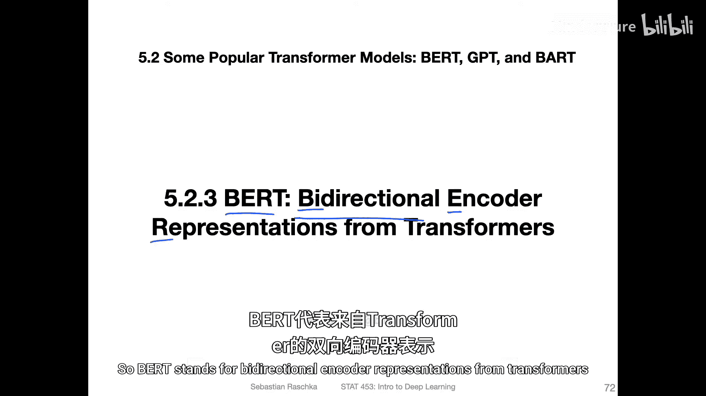

在本节课中，我们将要学习BERT模型。BERT是“来自Transformer的双向编码器表示”的缩写，它通过创新的双向预训练任务，显著提升了模型对文本上下文的理解能力。

---

在上一节视频中，我们讨论了GPT-1模型。GPT-1是一个单向的Transformer模型，其预训练任务是预测下一个词，因此它从左到右地处理输入序列。

BERT则是一个双向的Transformer模型。B代表“双向”，全称是“来自Transformer的双向编码器表示”。

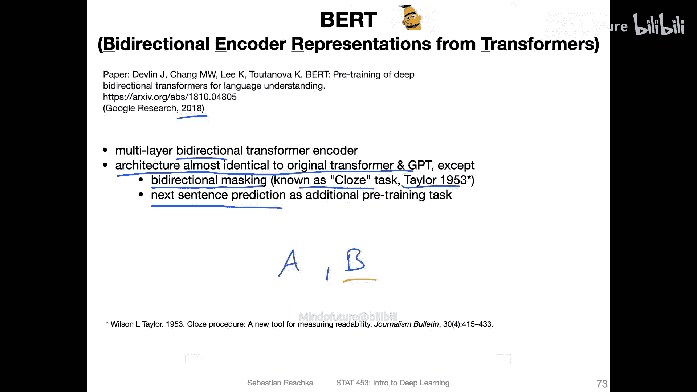

BERT由谷歌研究院在2018年左右开发。其核心概念是双向性，即通过掩码语言模型进行双向预训练，而不是像GPT那样从左到右进行预测。这是一个非常简单的概念，稍后会有幻灯片具体说明其工作原理。

BERT的主要架构本质上与原始Transformer和GPT相同，都基于原始Transformer论文，包含多头注意力机制等。不同之处在于，BERT采用了双向掩码，这也被称为“完形填空”任务。相关论文对此有引用。

BERT有两种预训练方法。一种是双向掩码语言模型，另一种是下一句预测。下一句预测是一个二元分类任务，模型需要判断给定的两个句子中，句子B是否是句子A在原文中的下一句。稍后也会有幻灯片对此进行说明。

以上是BERT的概述，接下来我们将通过更多细节幻灯片进行深入探讨。

现在，让我们更详细地了解BERT。首先从底部开始，看看BERT的输入是什么样子的。

这里有一张来自原始论文的图。顶部是作为输入的词元。例如，假设你有两个句子。第一个句子是“my dog is cute”。第二个句子是“he likes playing”。可以看到这里已经进行了一些分词处理，每个词元基本上是一个单词。同时，某些动词如“playing”被分成了“play”和“ing”两个独立的词元，这表明还进行了一些预处理或词干提取。

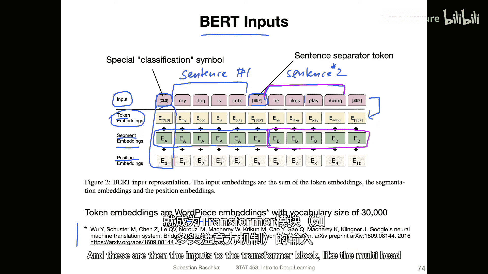

这些输入随后会被添加一个特殊的分类标记和一个句子分隔符。接着，它们会经过一个称为“词片段模型”的过程，以生成所谓的词片段嵌入。这是一种特定的创建嵌入向量的方法，我们不会详细讨论。如果你感兴趣，可以参考这篇论文。这只是一种获取嵌入向量的不同方法。

现在，你有了这些词元嵌入，它们是将单词映射成的实值向量。此外，还有段嵌入。它们也是实值向量。对于第一个句子中的每个位置，段嵌入是相同的。对于第二个句子也是如此。段嵌入用于表示一个词元嵌入是来自第一个句子还是第二个句子。

此外，还有位置嵌入。你可能还记得原始Transformer论文中的正弦位置嵌入，这里也有一种位置嵌入形式。词元嵌入、段嵌入和位置嵌入这三者会被加在一起。求和后的结果就是Transformer块的输入，例如多头注意力机制的输入。

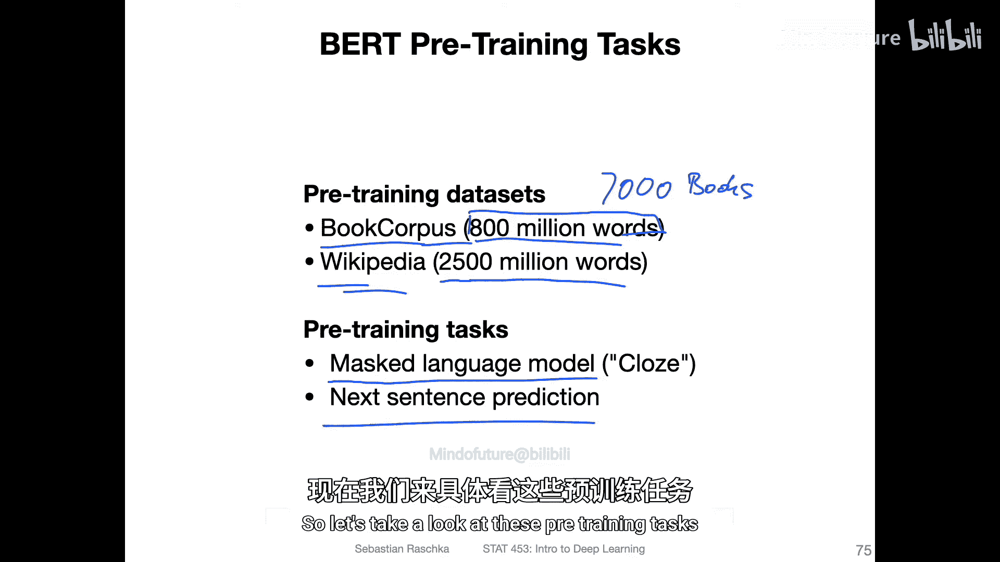

总的来说，使用这些输入，BERT执行预训练任务。这些任务在两个数据集上进行：一个是包含8亿单词的书籍语料库数据集，这个数据集也被GPT使用过；另一个是维基百科数据集，包含25亿单词。

在这些数据集上执行的预训练任务就是我之前提到的掩码语言模型和下一句预测。BERT有两种不同的训练任务。接下来让我们看看这些预训练任务。

首先是预训练任务一：掩码语言模型。其工作原理是，随机选择输入中15%的单词进行标记。有时人们也称之为“掩码”，但我称之为“标记”，因为并非所有被选中的词都会被真正掩码。

假设你有一个输入句子：“the quick brown fox jumps over the lazy dog”。你会以15%的概率随机选择单词。例如，我们选择了单词“fox”。然后，对于这些被标记的单词，80%的情况下会被替换为一个特殊的掩码标记；10%的情况下会被替换为一个随机单词；10%的情况下会保持原样。所以，有时“fox”会变成“[MASK]”，有时会变成“coffee”或其他随机词，有时则保持不变。

模型的任务是预测正确的单词应该是什么。即使单词被替换成了随机词或保持不变，模型也需要判断哪个词应该在这个位置。这使得模型在某种意义上具有双向性，因为没有从左到右的顺序概念，它只是随机挑选需要预测的标记或单词。

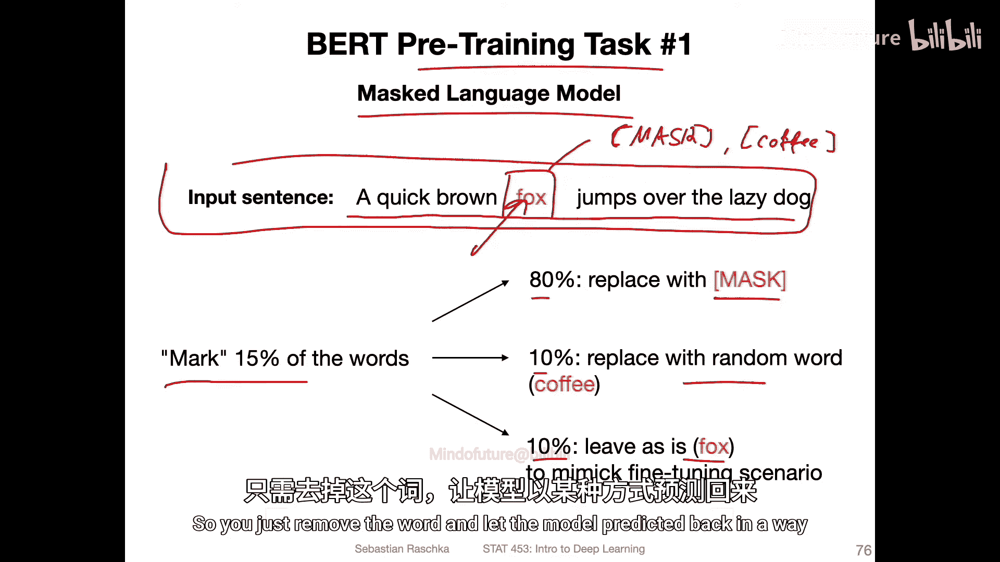

这种方式也是自监督的，因为你不需要人工标注。你本来就知道正确的单词，因为你拥有完整的句子，你只是移除了单词并让模型预测回来。

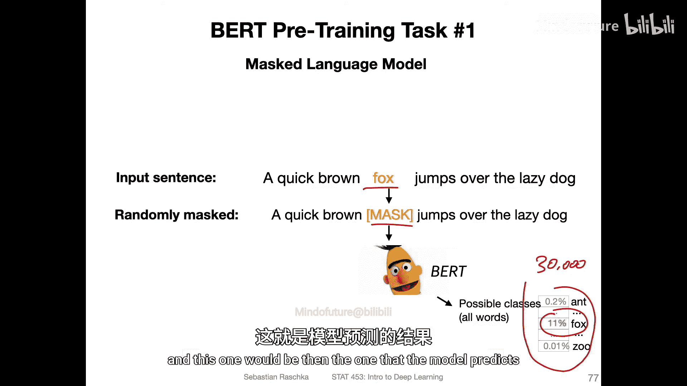

这里还有一个例子。假设我们用掩码标记替换了这个单词，这是那15%被标记单词中80%的情况。然后它通过BERT模型，模型需要预测正确的单词。例如，会有一个softmax函数。如果词汇表大小是30000，这里就会有30000个概率值，总和为1。然后你会选择预测概率最高的那个，例如“fox”，这就是模型的预测结果。

第二个任务是下一句预测。这是一个平衡的二元分类任务，标签是“是下一句”和“不是下一句”，各占50%。具体做法是，取一个输入句子A，例如“the man went to the store”（这是论文中使用的例子），然后取第二个句子B“he bought a gallon [MASK] milk”。注意，他们结合了两种预训练任务，下一句预测也包含了掩码。

在这个例子中，A和B是原文中实际相连的句子，所以真实标签是“是下一句”。下图是一个标签为“不是下一句”的例子。同样，第一个句子是“the man went to the store”，这里被掩码了。第二个句子是“penguins are flightless birds”。在这个例子中，A和B不是原文中相连的句子。模型需要识别这些句子是否彼此相连。这是模型学习理解文本的另一种方式。

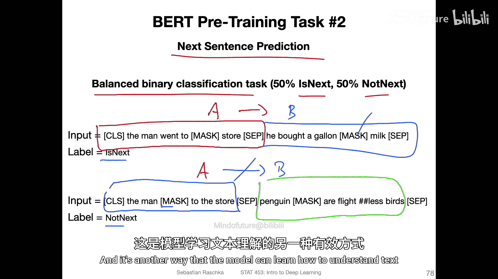

这里有一张来自原始BERT论文的插图，说明了预训练过程以及针对下游任务的微调。

左侧说明了预训练过程。我们有这些带掩码的句子A和句子B。任务有两个：一个是下一句预测，我们有一个特殊的分类标记，模型需要判断B是否是A的下一句；另一个是预测这些被掩码的词。例如，如果这里有一个被掩码的标记（图中用M表示），模型需要预测哪个词应该放在那里。

这就是预训练。预训练之后，我们可以针对其他任务微调我们的模型。例如，图中展示了一个问答任务的例子，左侧提供问题，右侧提供相关段落，模型需要生成答案。但你也可以微调模型进行分类任务，例如，你可以拼接两个句子，然后进行分类，比如电影评论分类。

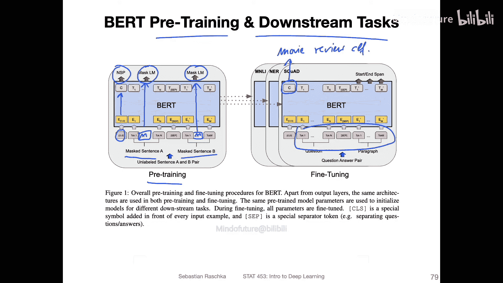

这只是一个示意图。还记得我们讨论GPT时，我提到过处理下游任务有两种不同的方式。

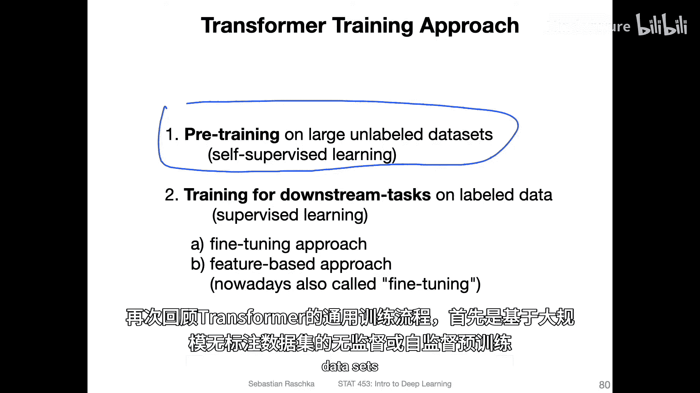

这里再次展示了Transformer的一般训练流程：首先是无监督或自监督的预训练，在大规模无标签数据集上进行，如图左侧所示。

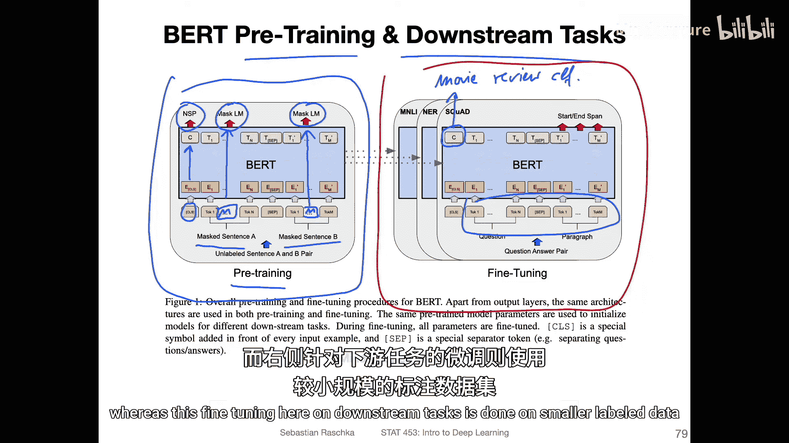

预训练是在无标签数据上进行的，而针对下游任务的微调则是在较小的有标签数据集上进行的。

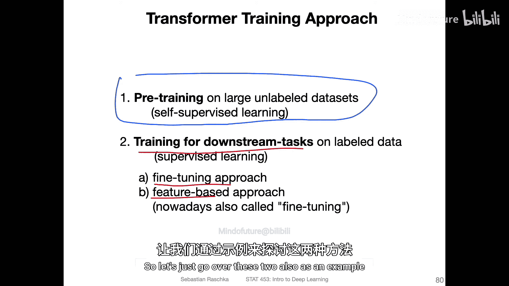

对于这些下游任务，主要有两种方法。微调是BERT论文中主要讨论的方法，这种方法会更新整个模型的所有参数。

但还有一种我之前提到的基于特征的方法，BERT论文中也做了一些相关实验。让我们也来回顾一下这两种方法。

微调本质上是通过添加一个分类层来实现的。例如，如果你有不同的类别，你可以在模型末尾添加一个全连接层。假设你的模型原本训练用于下一句预测，输出层可能只有一个值或两个值（取决于二元分类的实现方式）。但如果你想将其用于一个有10个或100个不同类别的任务，你可以在末尾添加一个全连接层，然后使用softmax输出概率，并用交叉熵损失来训练这个模型。

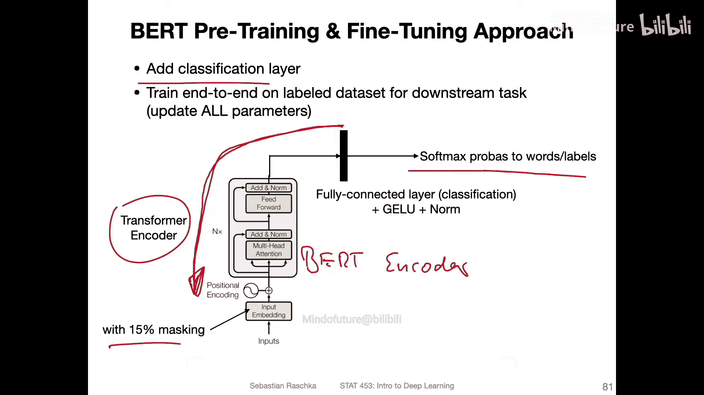

当你这样做时，你实际上会更新整个模型。这里只是原始Transformer编码器的截图作为示意，但BERT编码器看起来会类似，它包含双向训练，其中15%的标记被选中，其中80%被掩码，10%被随机词替换，10%保持不变。微调就是在预训练后，为了分类任务更新整个模型的所有参数。

第二种方法是端到端训练。另一种方法，让我先说明一下。关于这种微调方法，论文中给出了结果。例如，他们将BERT与其他方法如ELMo进行了比较。我们还没有讨论过ELMo，但本讲座要涵盖的内容已经很多了，所以我并没有详尽地介绍所有模型。我们在这里讨论了OpenAI的GPT模型，你可以看到无论是BERT的基础版本还是大型版本，在多项任务上的表现都优于GPT。实际上，在所有任务上，如果你考虑大型版本，我认为小型版本也表现更好。因此，通过掩码语言模型和下一句预测的双向训练，它们超越了单向的GPT模型。这是在针对不同任务进行微调后的结果。每个任务对应不同的有标签数据集，你可以在这里看到这些数据集的大小。

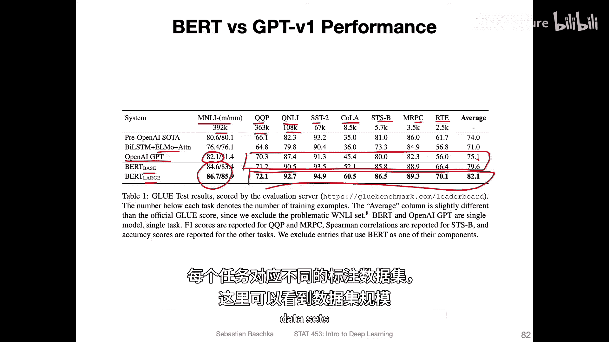

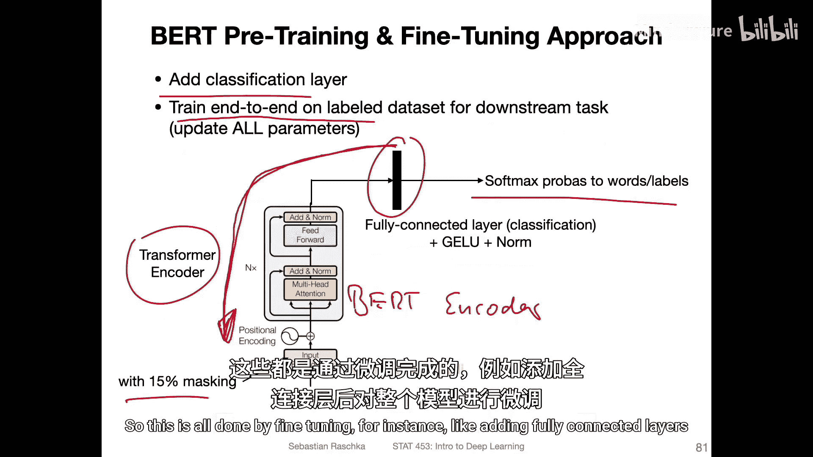

这些都是通过微调完成的，例如添加全连接层，然后微调整个模型。

现在，另一种方法是基于特征的训练。如今，我认为这种方法更为流行。当我观察不同的人使用BERT时，这种方法要流行得多。例如，有一种叫做“ProtBERT”的模型，人们对蛋白质做了类似的事情，他们在氨基酸序列（即蛋白质序列）上训练了一个BERT模型，训练后他们只查看嵌入向量，观察这些嵌入如何聚类，并在这些嵌入上训练分类器。他们发现这些嵌入信息非常丰富，包含了很多关于蛋白质的信息。

基于特征训练的想法是：在预训练之后，保持BERT模型冻结，不更新任何参数。如果你有一个新的数据集，比如你的电影评论数据集，你只需使用那个BERT模型来创建嵌入向量。例如，你可以下载一个在大型语料库上以这种自监督学习方式预训练好的BERT模型。然后，为你数据集中所有较小的训练集样本创建所有这些嵌入向量。接着，你只在这些嵌入向量上训练一个新模型。你将这些嵌入向量视为你模型的输入特征。这个模型可以是RNN、逻辑回归、多层感知机或一维卷积网络，可以是任何你喜欢的模型。但如今最常见的是，人们只训练一个简单的多层感知机或逻辑回归。这是一种标准的监督学习，就像你在这门课中学到的那样，只是现在使用这些BERT嵌入作为输入，类似于RNN可以使用词嵌入，你现在可以使用BERT模型的嵌入作为任何其他模型的输入。

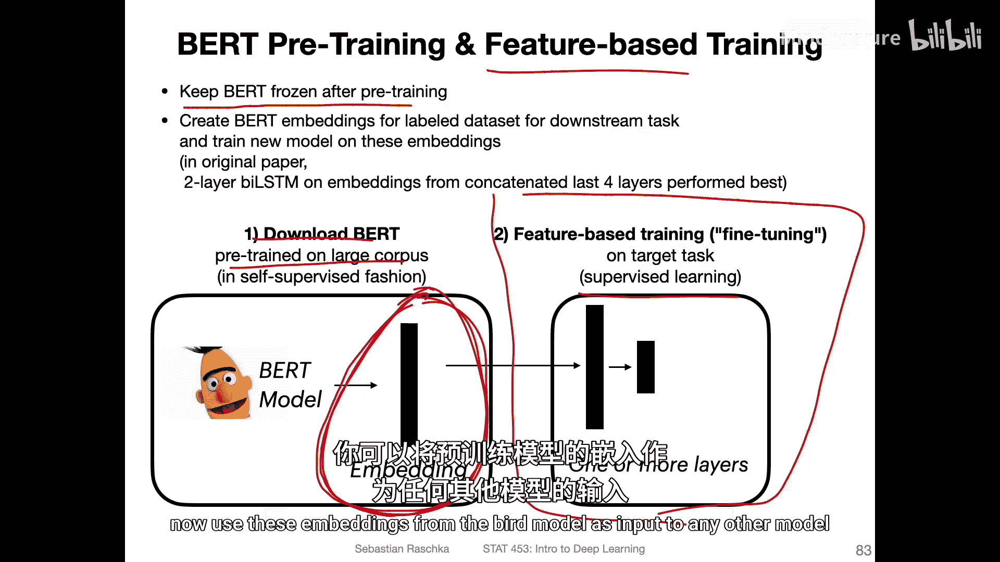

此外，他们在论文中也研究了这种方法，发现它的表现也相当不错。虽然不如微调方法好，但相当不错。所以，微调方法的结果在这里。基于特征的方法结果在这里，你可以看到，当他们拼接BERT模型最后四个隐藏层的输出，然后在其上训练一个双向LSTM模型时，他们发现这种方法的性能几乎与微调的BERT模型相同。

我认为微调需要更多的工作，因为你必须将整个模型加载到内存中并更新整个模型。如今许多语言模型可能相当大。我认为BERT小型版本大约有1亿参数，大型版本可能有3亿左右。因此，训练模型成本较高，特别是如果你只有CPU或单个GPU。这样一来，基于特征的方法更具吸引力，因为你只需运行模型一次来生成这些嵌入，之后就不必担心训练BERT模型，只需处理这些嵌入即可。

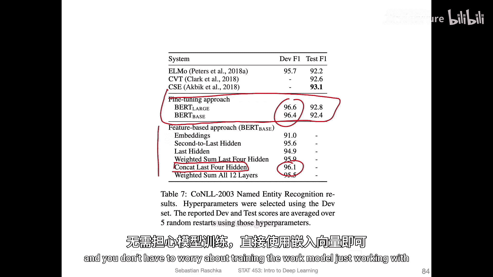

好了，这就是BERT模型的概要。在下一个视频中，我们将回到GPT模型，因为在2019年，即BERT发布一年后，GPT模型有了更新。

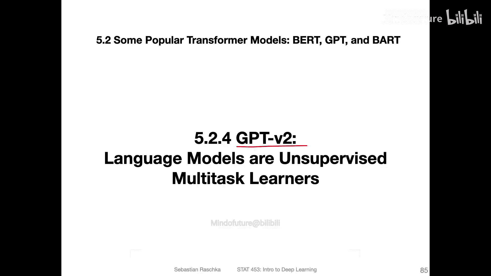

---

**总结**

本节课中，我们一起学习了BERT模型。我们了解到BERT是一种基于Transformer架构的双向编码器，其核心创新在于通过掩码语言模型和下一句预测这两个自监督任务进行预训练。这使得模型能够更好地理解文本的上下文信息。我们还探讨了将预训练的BERT模型应用于下游任务的两种主要策略：微调整个模型或将其作为静态特征提取器。这些方法使得BERT在多种自然语言处理任务上取得了突破性的成果。