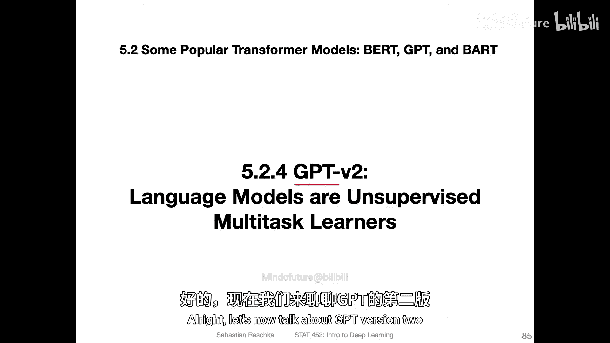
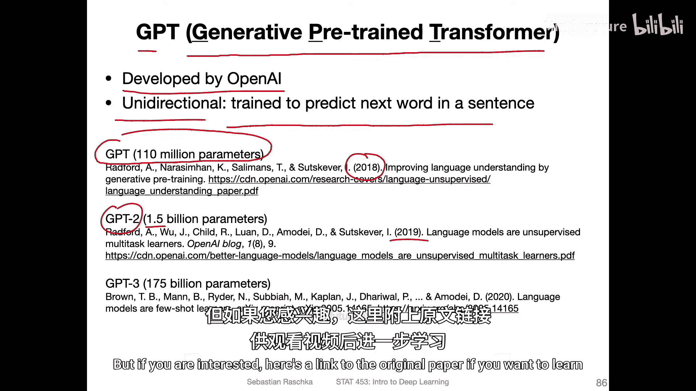
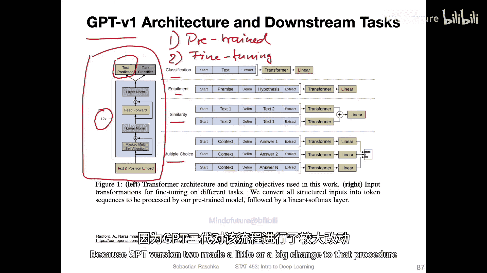
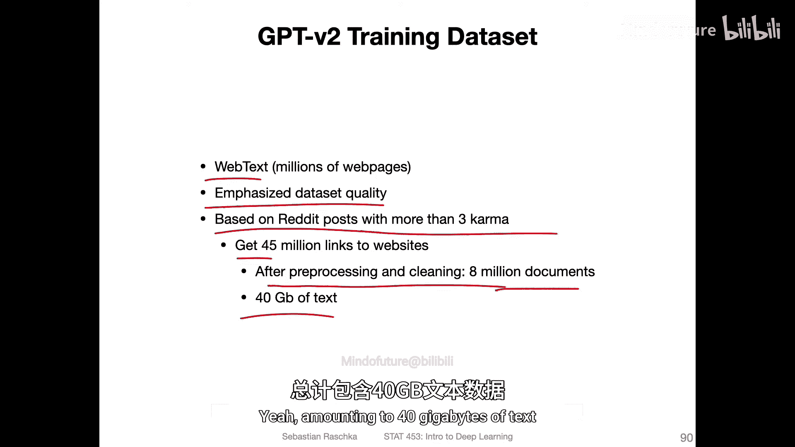
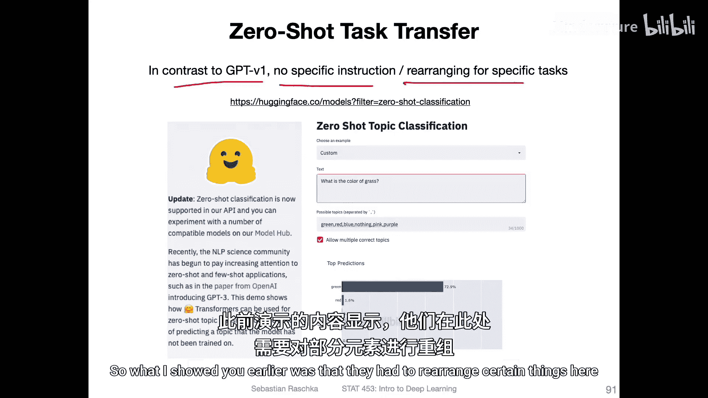
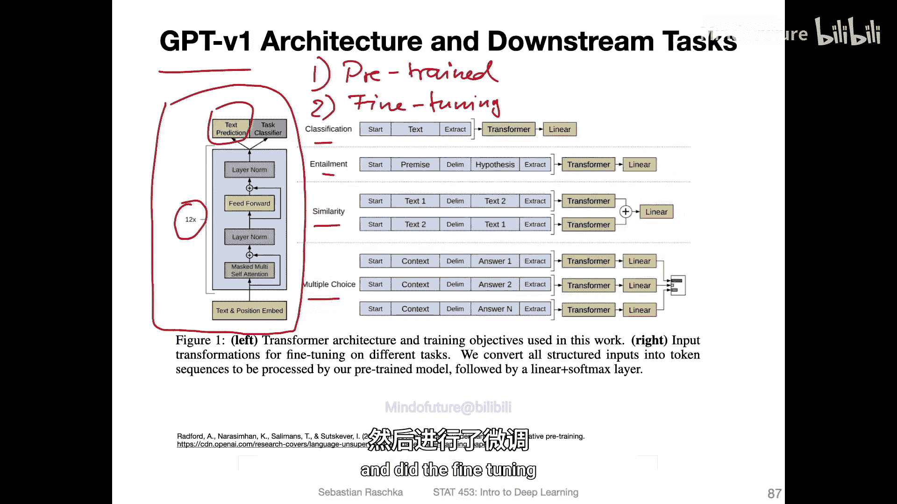
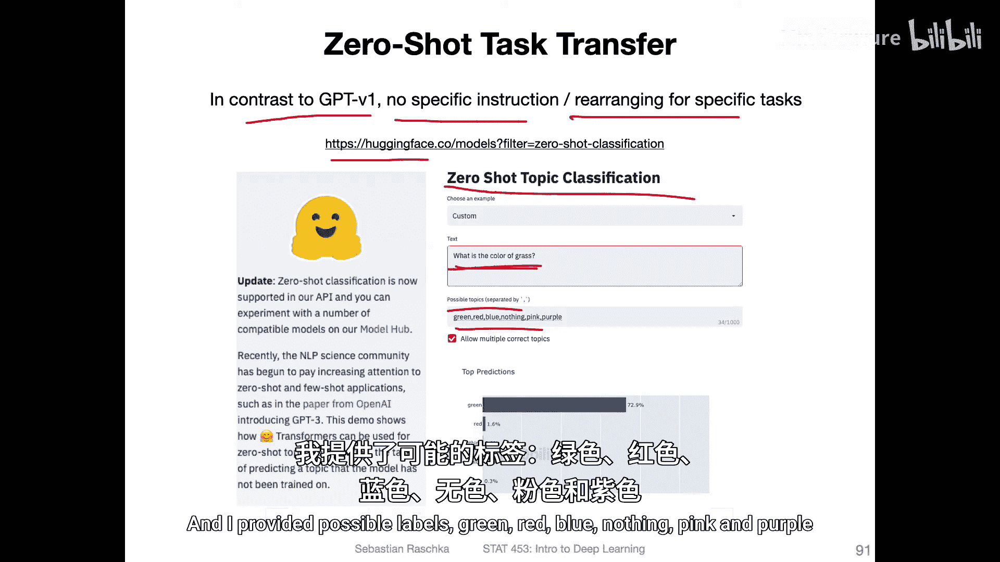
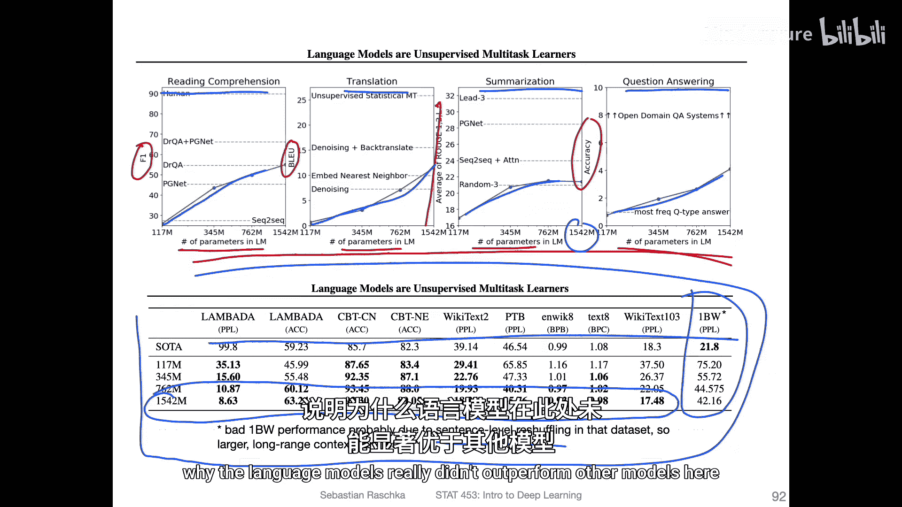
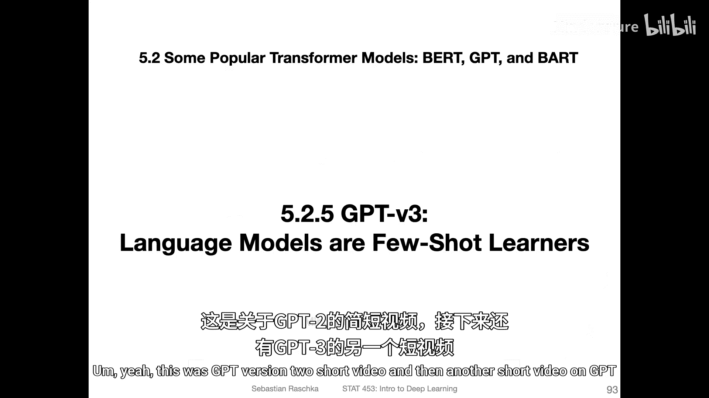

# 167：GPT-2 - 语言模型是无监督多任务学习者 🧠

在本节课中，我们将学习GPT-2模型。GPT-2是OpenAI在GPT-1基础上推出的一个更强大的语言模型。我们将了解它的核心架构、训练数据、以及其标志性的“零样本迁移”能力，并与GPT-1进行对比。

## GPT-2概述

上一节我们介绍了GPT-1模型。现在，我们来探讨它的下一代版本——GPT-2。

GPT代表“生成式预训练Transformer”。这些模型由OpenAI开发，其一个基本特性是它们是**单向模型**，训练目标是预测句子或序列中的下一个词。这与BERT模型的双向语言建模方法形成对比。

GPT-1是一个拥有1.1亿参数的模型，于2018年发布。GPT-2于一年后发布，其参数量达到了**15亿**，规模扩大了超过10倍。我们不会深入所有细节，但如果你感兴趣，可以在课后查阅原始论文。

## GPT-1架构回顾

为了更好地理解GPT-2的改进，我们先简要回顾GPT-1的架构。

GPT-1采用了一个包含12个Transformer块的解码器架构。其训练分为两个步骤：
1.  **预训练**：在大型无标签数据集上进行，目标是**下一个词预测**。
2.  **微调**：在特定下游任务（如分类、蕴含、相似性、多选题）的有标签数据集上进行微调。

我之所以回顾这些，是因为GPT-2对这个流程做了一个重大改变。

## GPT-2的核心概念

GPT-2与GPT-1的相似之处在于，它同样采用**单向**的预训练和下一个词预测目标。

然而，与GPT-1相比，GPT-2模型规模显著更大。他们的论点是：**参数越多，性能越好**。同时，更大的数据集也有助于提升模型性能。

但最关键的不同点在于，GPT-2**不再进行任何微调**。它使用了一种称为**零样本迁移**的方法。这大致与零样本学习相关，但并不完全相同。其核心思想是，通过为模型提供任务描述和输入内容，让模型直接执行任务，而无需针对该任务进行专门的训练。稍后我们会看到一个例子。

## 架构与数据集的改进

GPT-2的整体架构与GPT-1相似，当然规模更大，但依然基于原始的Transformer解码器。他们调整了层归一化和残差层的位置，但这属于次要的实现细节。

以下是GPT-2的主要改进：

*   **词汇表大小**：几乎翻倍。
*   **上下文长度**：从512个输入标记增加到1024个，使其能捕捉更长的上下文。这对于零样本迁移中需要同时提供任务描述和输入的场景尤其有用。

这些改动共同造就了一个拥有**15亿参数**的模型。

在数据集方面，GPT-2使用了规模更大、质量更高的“网络文本”数据集，包含数百万网页。他们通过以下方式提升质量：

*   数据来源于Reddit帖子（点赞数超过3的帖子），以确保链接到的网站质量。
*   进行了去重和大量的网页预处理与清洗。

最终，他们从4500万个Reddit链接中，经过处理得到了800万份文档，总计约40GB的文本数据。

## 零样本任务迁移示例

如前所述，GPT-2与GPT-1的关键区别在于它无需针对特定任务进行微调或结构调整。

以下是一个零样本主题分类的例子（通过Hugging Face平台演示）。Hugging Face是一家专注于语言模型（特别是基于Transformer的模型）的公司。

在这个例子中，模型仅接受过“预测下一个词”的训练，并未预先见过这些特定的分类标签。操作方式是：
1.  提供一个输入句子。
2.  提供一组可能的标签（用逗号分隔）。

例如，输入是“我割草了”，提供的可能标签是“绿色、红色、蓝色、无、粉色、紫色”。模型成功预测出了“绿色”。这展示了模型无需额外训练，仅凭任务描述就能进行分类的能力。

## 模型规模与性能结果

论文中的实验结果显示了模型规模的影响。

以下是论文中的一些发现：

*   在阅读理解、翻译、文本摘要和问答等多种任务上，**模型参数越多，性能通常越好**（评估指标数值越高越好）。
*   虽然GPT-2并非在所有任务上都超越当时的其他专门方法，但这并非其核心目标。其重要意义在于证明了**无需微调，模型也能自动学习理解文本并执行多种任务**，这本身令人印象深刻。
*   在某些任务上，GPT-2表现非常出色，甚至超过了其他方法。但在一个名为“BW”的任务上表现不佳。一个可能的解释是，该数据集的句子顺序被打乱了，这破坏了文本的上下文连贯性。而Transformer模型（包括GPT-2）的优势正是考虑上下文，句子被打乱无疑削弱了其优势。

## 总结

本节课中，我们一起学习了GPT-2模型。我们了解到GPT-2是一个参数量达15亿的巨型单向语言模型，其核心创新在于摒弃了针对下游任务的微调步骤，转而采用**零样本迁移**，通过将任务描述与输入结合来让模型执行新任务。此外，GPT-2使用了更大规模、更高质量的数据集，并扩展了上下文长度。实验表明，更大的模型规模通常能带来更好的性能，并且该模型在多种任务上展现出了强大的零样本学习能力。