# 168：GPT-3 - 语言模型是少样本学习者 🧠

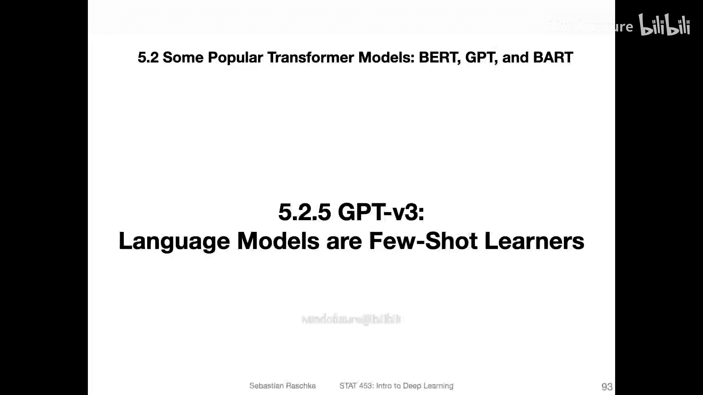

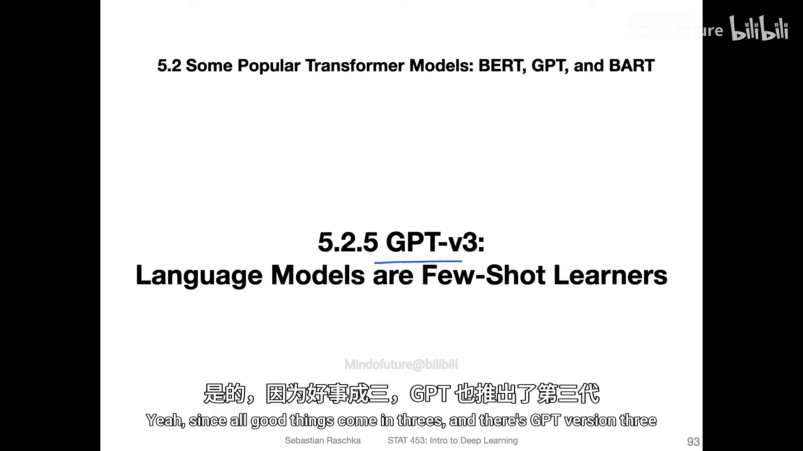

在本节课中，我们将学习GPT-3模型的核心特点。GPT-3是GPT系列模型的第三个版本，其规模远超之前的模型，并引入了新的上下文学习范式。

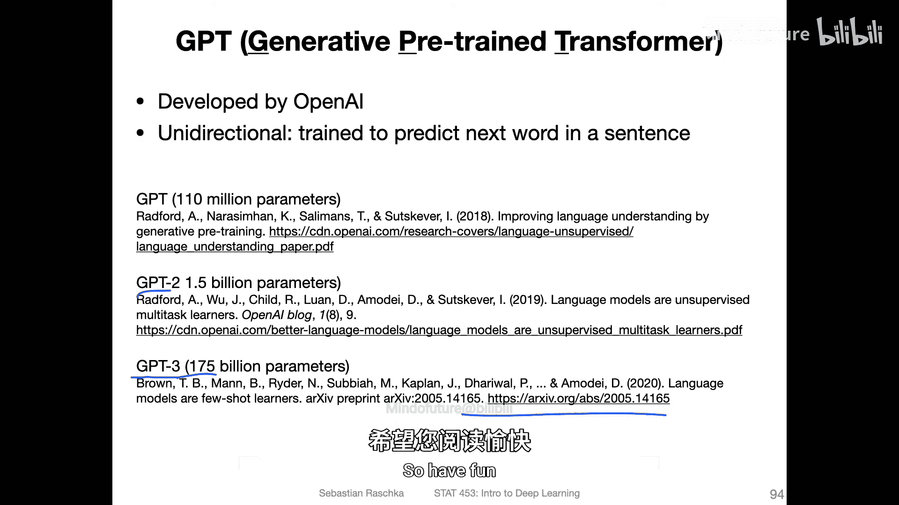

## 模型规模与架构 🏗️

上一节我们介绍了GPT-2，本节中我们来看看GPT-3的规模与架构变化。

GPT-3的参数量达到了**1750亿**，远超前代模型的15亿参数。

其整体架构与GPT-2相似，但规模更大，层数更多。主要改进包括：
*   上下文长度从224个标记增加到**2048**个。
*   词嵌入维度从1600大幅增加到约**12800**。

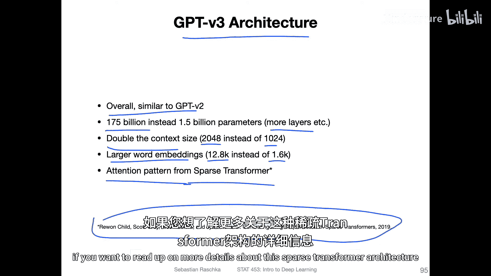

为了应对计算复杂度，GPT-3采用了来自**稀疏Transformer**的注意力机制模式。因为标准的注意力机制计算量随序列长度呈二次方增长，非常昂贵。稀疏注意力是一种优化方法，旨在降低这种计算成本。

## 训练数据集 📚

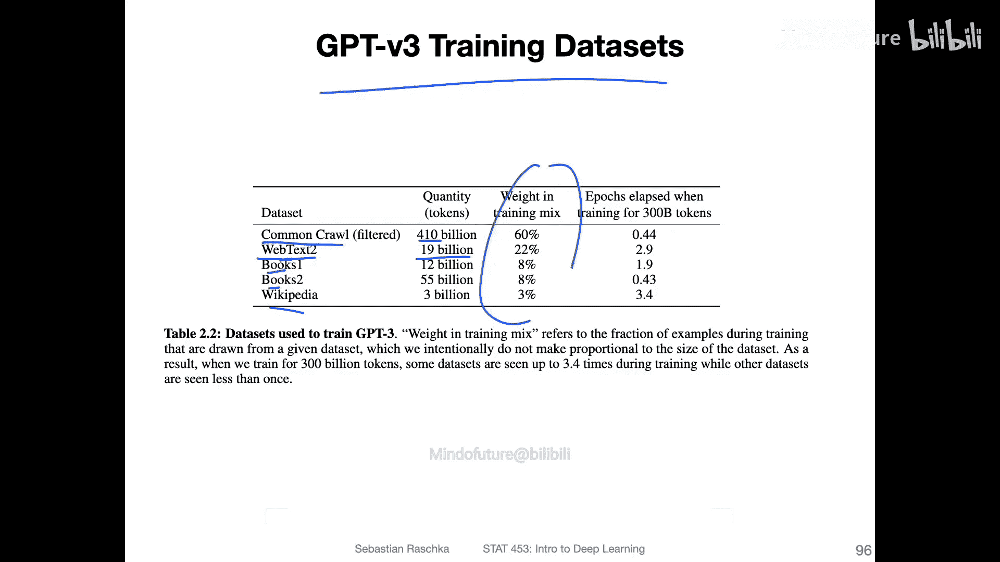

GPT-3使用的训练数据集规模也显著扩大。

以下是其使用的部分数据集：
*   **WebText2**：包含190亿个标记的网络文本数据集。
*   **Common Crawl (C1)**：一个包含100亿个标记的大型数据集。
*   此外还包括书籍数据集和维基百科数据集。

在训练过程中，这些数据集会按照一定的权重比例进行混合使用。

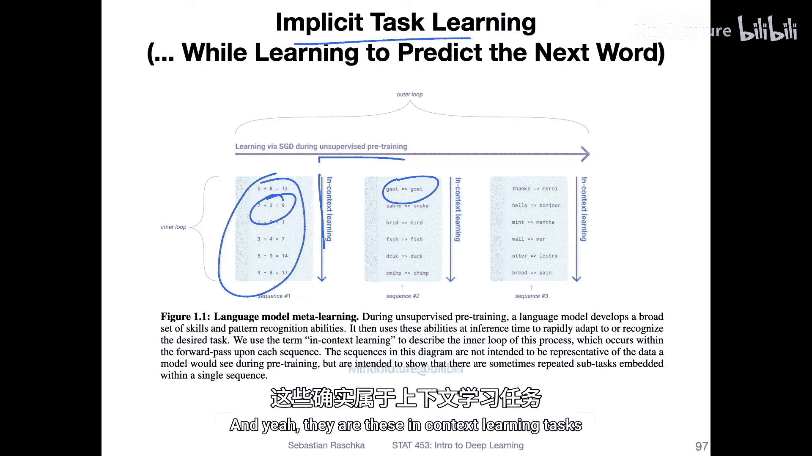

## 隐式任务学习与上下文学习 🔄

GPT-3在无监督预训练（自监督学习）过程中，模型隐含地学会了多种任务。研究者将此预训练过程称为“外循环”。

由于训练文本中蕴含了丰富的信息，模型能够学会一种称为“上下文学习”的能力。这意味着模型通过观察输入文本中的模式和示例，无需显式的梯度更新，就能学会执行新任务，例如拼写纠正等。

## 少样本学习范式 🎯

与GPT-2类似，GPT-3同样不进行下游任务的微调。然而，GPT-3扩展了任务提示的方式。

以下是GPT-3采用的三种学习范式：
1.  **零样本**：仅向模型提供任务描述和输入。例如：`翻译英文为法文：cheese ->`
2.  **单样本**：除了任务描述，还提供一个示例。例如：`翻译英文为法文：sea otter -> loutre de mer`，然后给出新的输入：`cheese ->`
3.  **少样本**：在上下文窗口中提供多个示例（通常10-100个），然后给出新的输入。例如提供多个`英文词 -> 法文词`的配对，最后询问`cheese ->`

这与GPT-1等模型使用的传统微调有本质区别。传统微调需要根据示例进行梯度下降来更新模型权重，属于监督学习。而GPT-3仅将示例作为输入上下文，模型需要自行推断出任务模式。

## 性能表现 📈

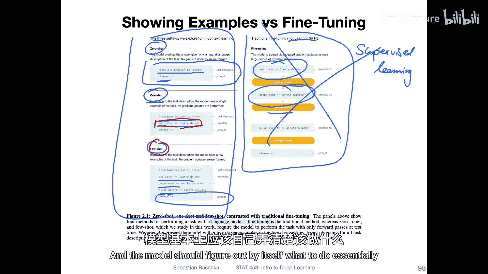

提供更多示例有助于提升模型性能。

在涉及参数规模的实验中，可以观察到一致的规律：**单样本**和**少样本**学习的性能始终优于**零样本**学习，提升幅度接近一个常数。

特别值得注意的是，当使用非常庞大的语言模型（如GPT-3）并结合少样本示例时，它甚至可以在一些任务（如 trivia 问答）上超越之前专门为该任务训练的最先进模型。这非常令人印象深刻，因为GPT-3本身并未针对问答进行训练，它仅仅是根据看到的几个示例自行“领悟”了如何回答问题。

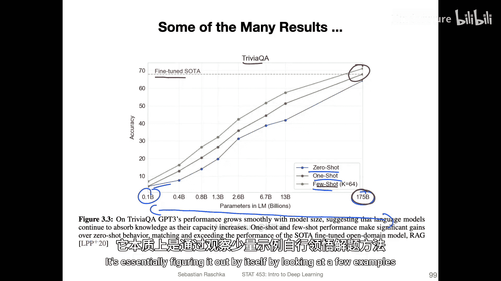

## 总结 ✨

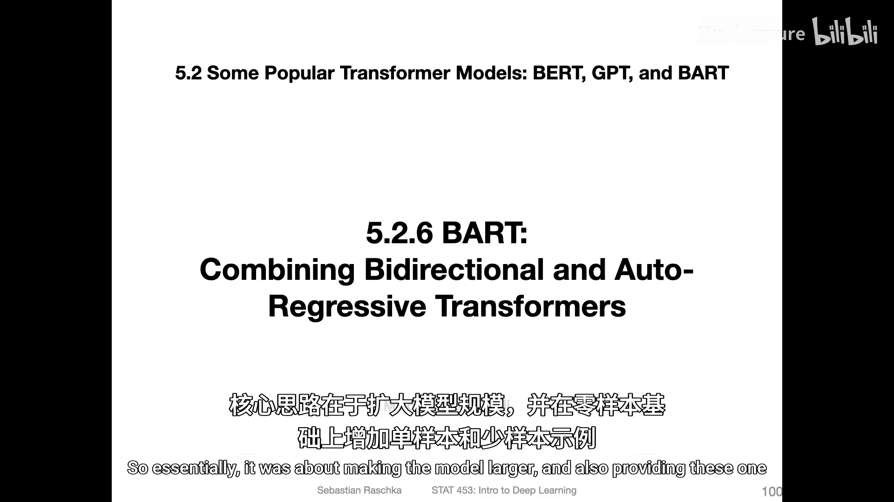

本节课中我们一起学习了GPT-3模型。

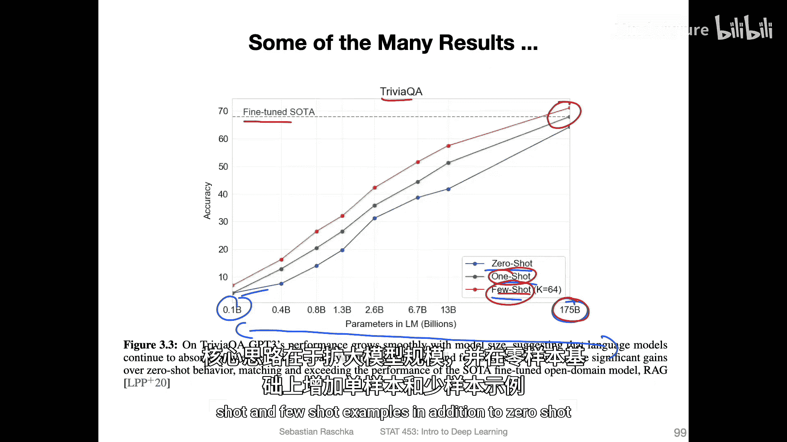

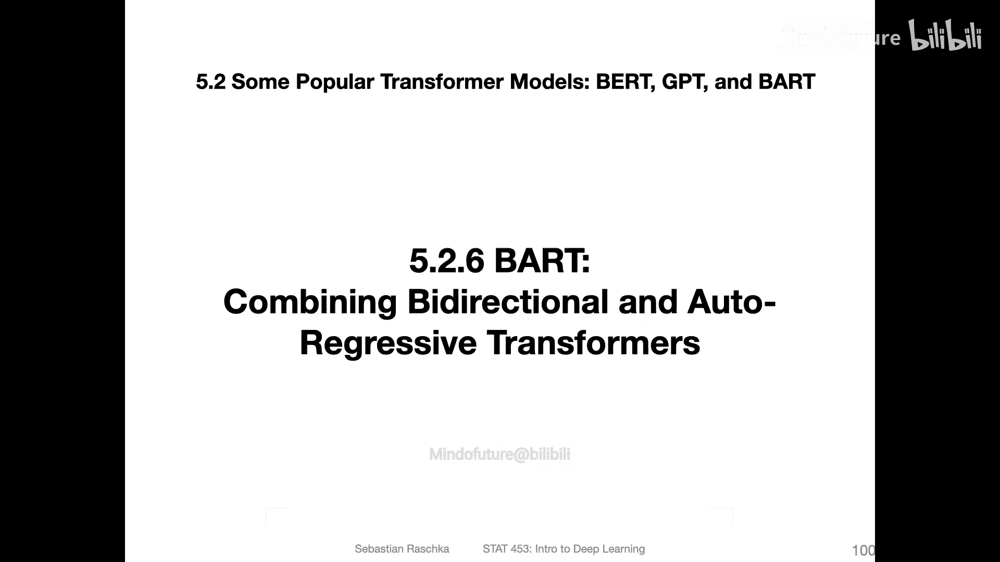

GPT-3的核心在于构建了**超大规模**的语言模型（1750亿参数），并系统性地探索了**少样本上下文学习**的范式。实验证明，通过提供少量示例作为输入上下文，大模型能够在不进行参数更新的情况下，有效理解和执行新任务，其性能甚至可以超越专门训练的模型。这展示了大规模预训练语言模型强大的泛化和推理能力。