# 169：BART - 结合双向与自回归Transformer

在本节课中，我们将要学习一个名为BART的模型。BART结合了BERT的双向编码器与GPT的自回归解码器，旨在同时胜任分类和文本生成任务。

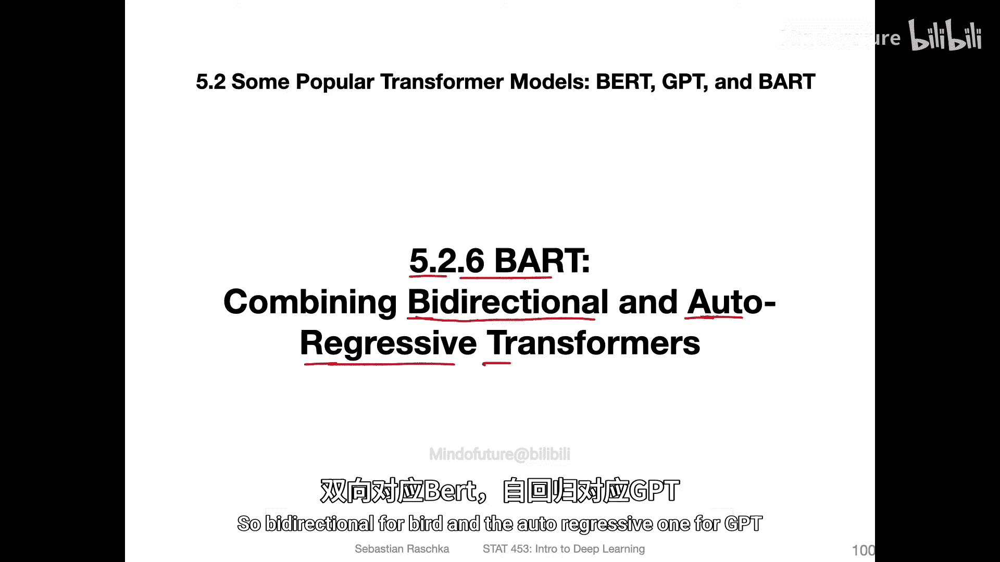

上一节我们介绍了BERT和GPT等主流Transformer模型，本节中我们来看看一个旨在结合两者优势的模型。

## BART的设计理念

BART的全称是**Bidirectional and AutoRegressive Transformers**。它由Facebook AI Research于2019年提出。其核心思想是结合BERT和GPT的优势。

BERT的双向（自编码）特性使其擅长理解整个句子的上下文，因此在下游任务（如分类）中表现良好。然而，BERT在需要逐词生成的文本生成任务（如问答、摘要）上并不理想。

GPT的自回归（单向）特性使其在文本生成任务上表现出色，因为它能基于已生成的词来预测下一个词。但GPT在处理需要同时理解整个输入序列的任务（如分类）时存在局限。

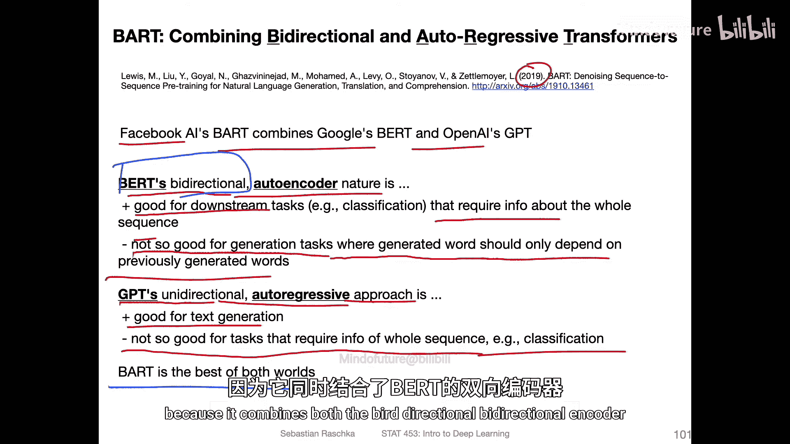

BART的论点在于，它结合了双向编码器和自回归解码器，从而实现了“两全其美”。

## BART的架构

BART本质上是一个**BERT编码器**加上一个**GPT解码器**，并引入了一些额外的噪声变换。

以下是BART架构的示意图：

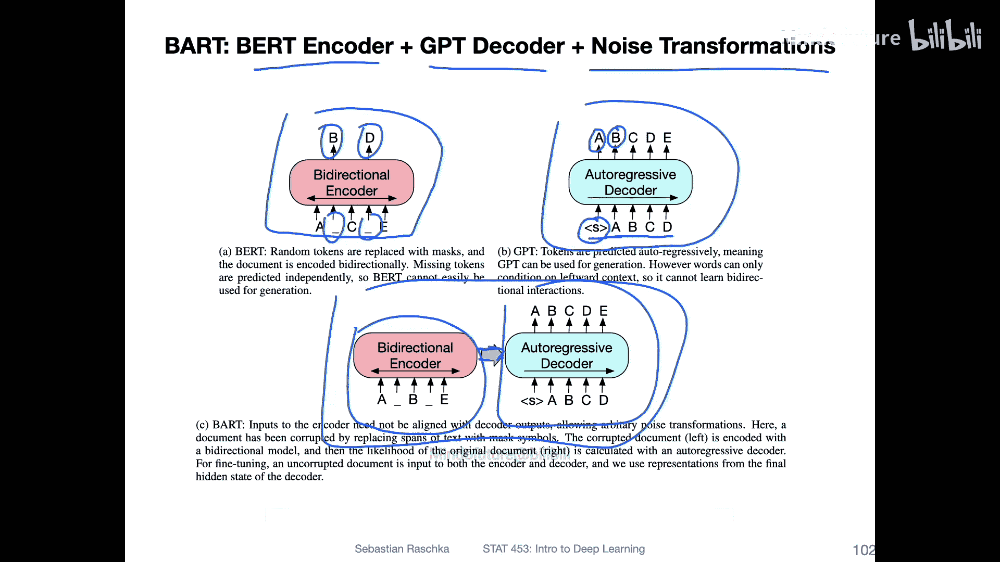

*   **左侧编码器**：这是一个类似BERT的双向编码器。它接收经过噪声处理的输入序列。
*   **右侧解码器**：这是一个类似GPT的自回归解码器。它接收编码器的输出，并逐词生成，以重建原始的、未受噪声干扰的文本。

这种架构让人联想到原始的Transformer模型（来自《Attention Is All You Need》论文）。在原始Transformer中，编码器处理整个输入序列，解码器则进行自回归预测。BART的不同之处在于其预训练阶段引入了**去噪自编码器**的概念。

## 噪声变换方法

在预训练阶段，BART通过向输入文本施加各种噪声，然后训练模型去恢复原始文本来学习。这类似于去噪自编码器的思想。

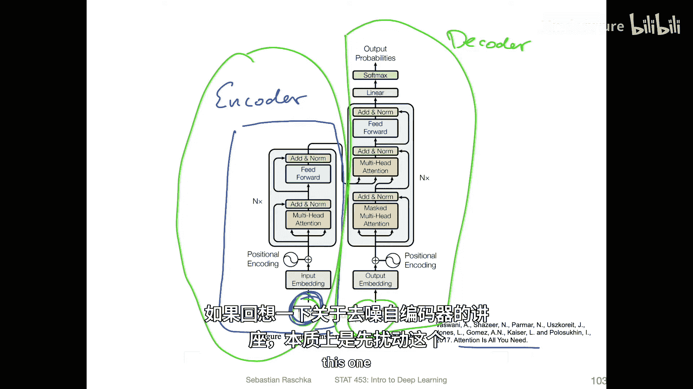

以下是论文中提出的几种噪声变换方法示例：

以下是这些噪声变换的简要说明：
*   **Token Masking**：类似于BERT，随机将一些词元替换为`[MASK]`。
*   **Token Deletion**：随机从输入中删除一些词元。模型必须确定哪些位置缺失了词元。
*   **Text Infilling**：随机用单个`[MASK]`标记替换多个连续词元的片段。模型需要预测缺失的片段长度及其内容。
*   **Sentence Permutation**：将文档按句子分割，然后随机打乱句子顺序。
*   **Document Rotation**：随机选择一个词元，然后旋转文档使其以该词元开头。模型需要识别文档的真正起始位置。

研究表明，不同的噪声变换方法都能带来良好的性能，而结合使用多种方法效果更佳。

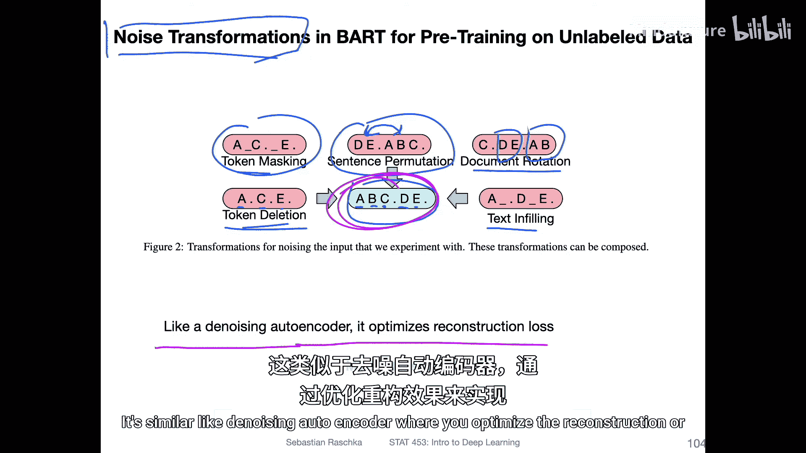

## 下游任务微调

预训练完成后，BART可以针对不同的下游任务进行微调。

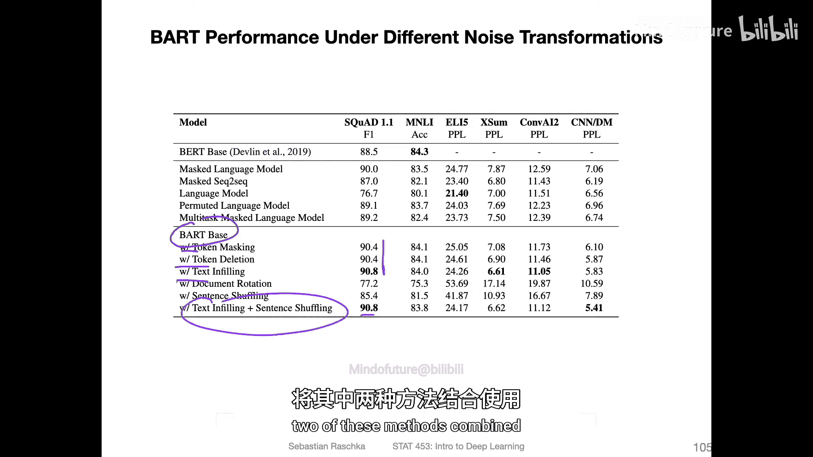

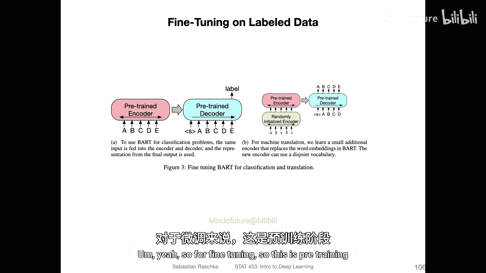

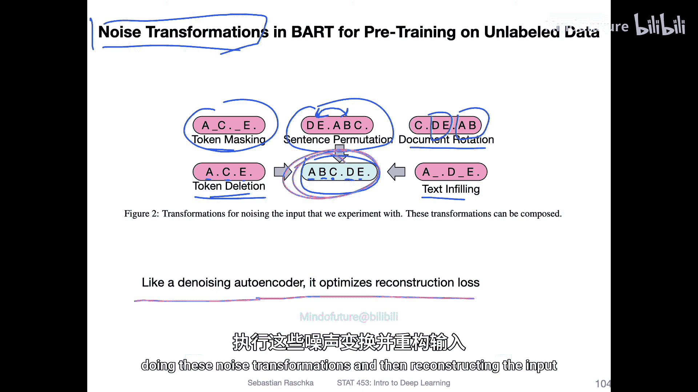

对于**判别式任务**（如文本分类、情感分析），可以直接使用编码器的输出，连接一个分类层进行预测。

对于**生成式任务**（如机器翻译、摘要生成、问答），则利用整个编码器-解码器架构进行序列到序列的生成。

在特定任务如机器翻译中，论文描述了一种设置：在预训练的BART编码器前，添加一个**新的、随机初始化的编码器**。这个新编码器负责处理源语言，其输出再送入预训练的BART编码器-解码器，最终生成目标语言。

## BART的性能表现

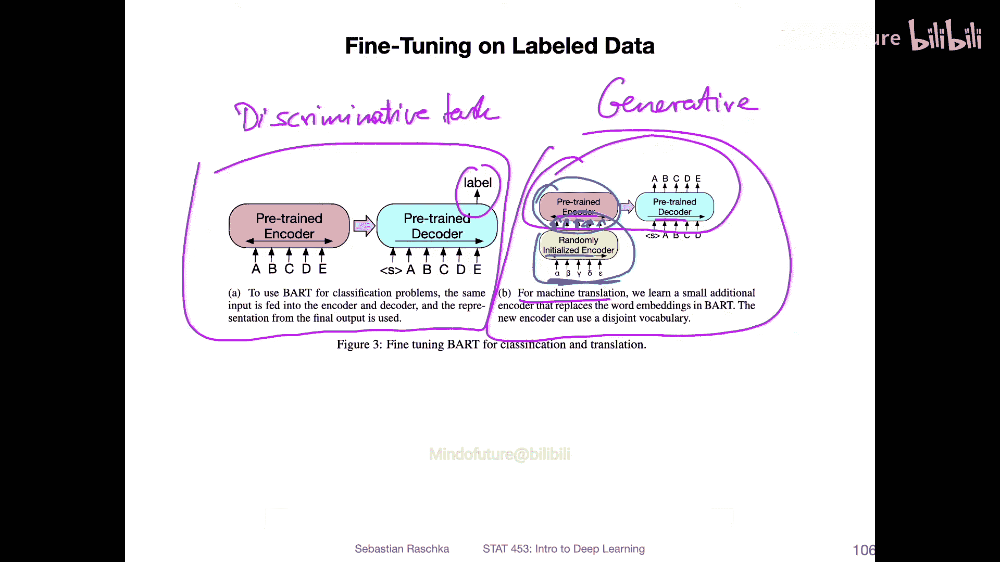

BART在多项任务上展现了强大的竞争力。

在**判别式任务**上，其性能与当时最先进的纯双向模型（如RoBERTa，一种BERT的变体）相当甚至更优。

在**生成式任务**上，如抽象问答、对话响应生成和文本摘要，BART则达到了当时的领先水平，证明了其结合双向理解和自回归生成能力的有效性。

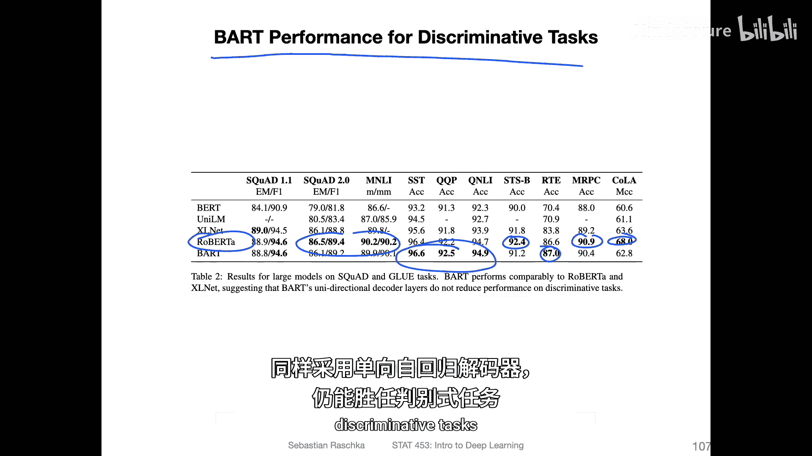

## 总结

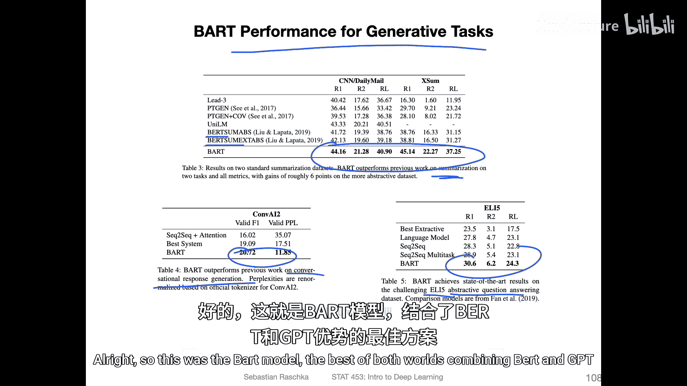

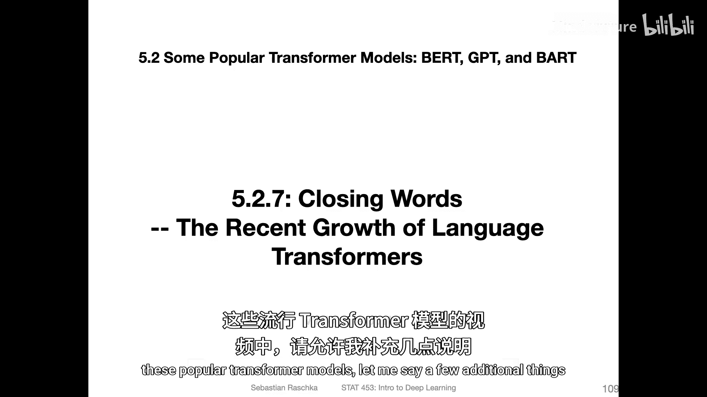

本节课中我们一起学习了BART模型。BART通过结合BERT的双向编码器和GPT的自回归解码器，并引入去噪预训练目标，成功地将双向上下文理解能力与序列生成能力融合在一个模型中。这使得BART能够同时在文本分类等判别式任务和机器翻译、摘要生成等生成式任务上取得优异表现，实现了“双向”与“自回归”的优势互补。