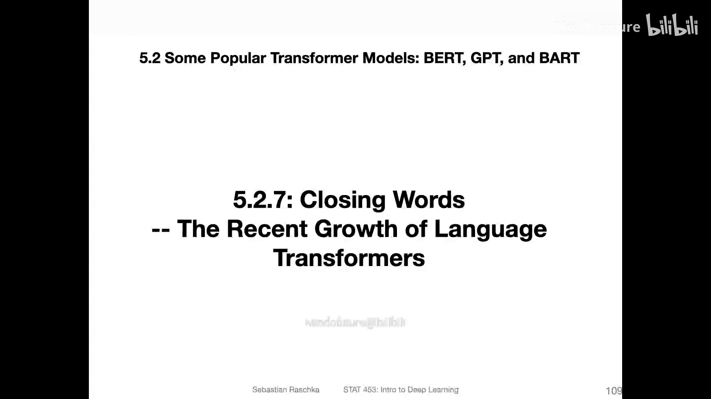
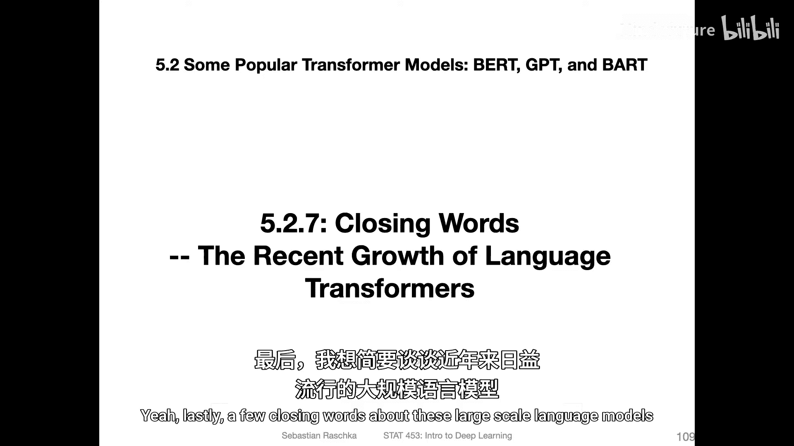
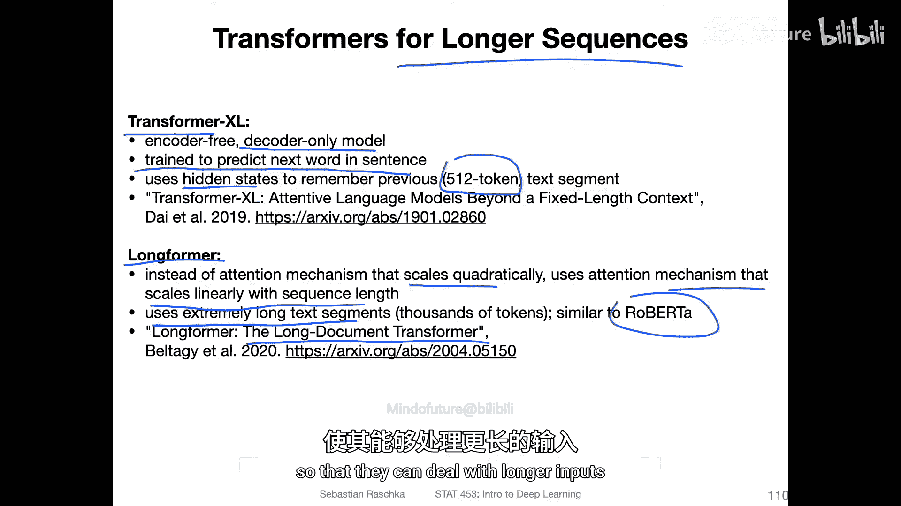
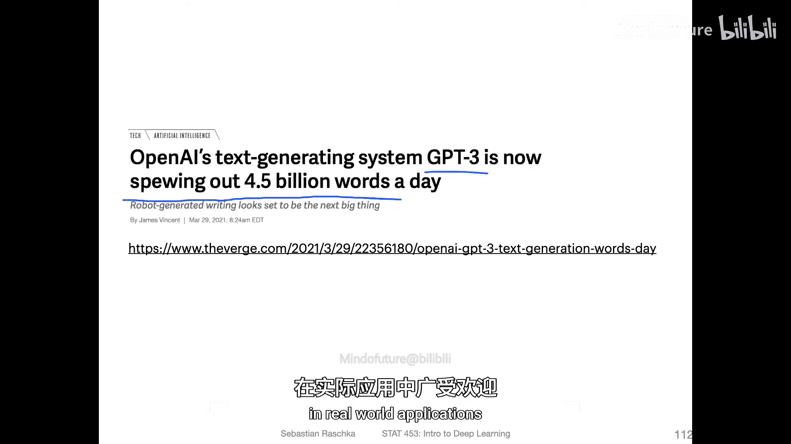
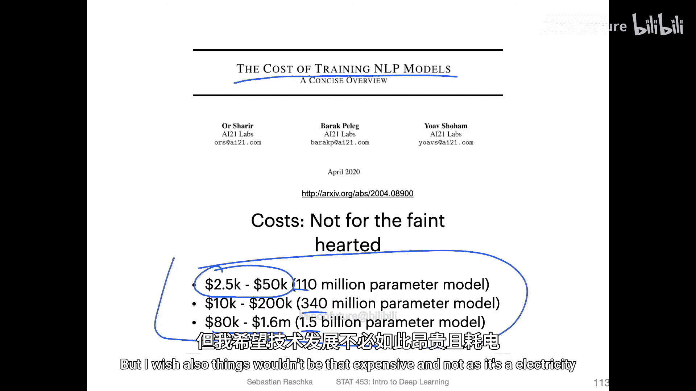
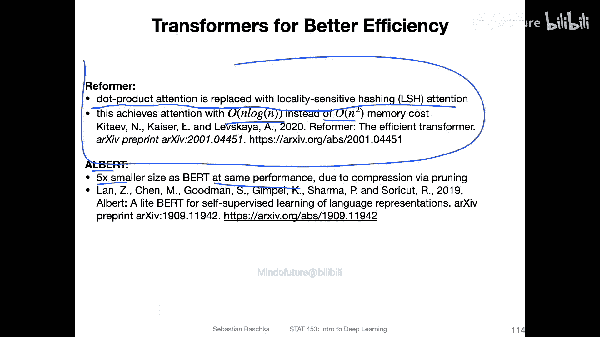
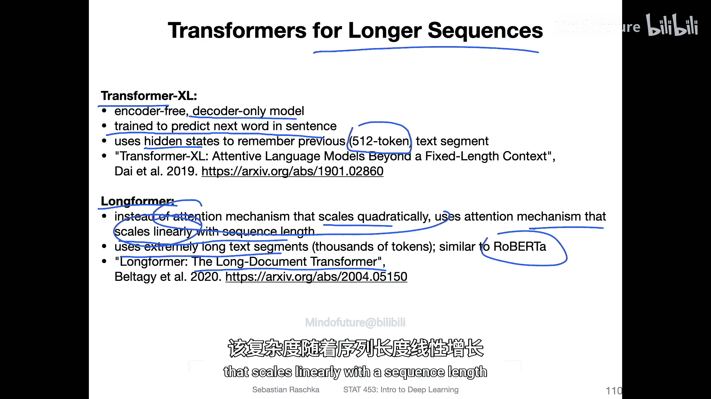
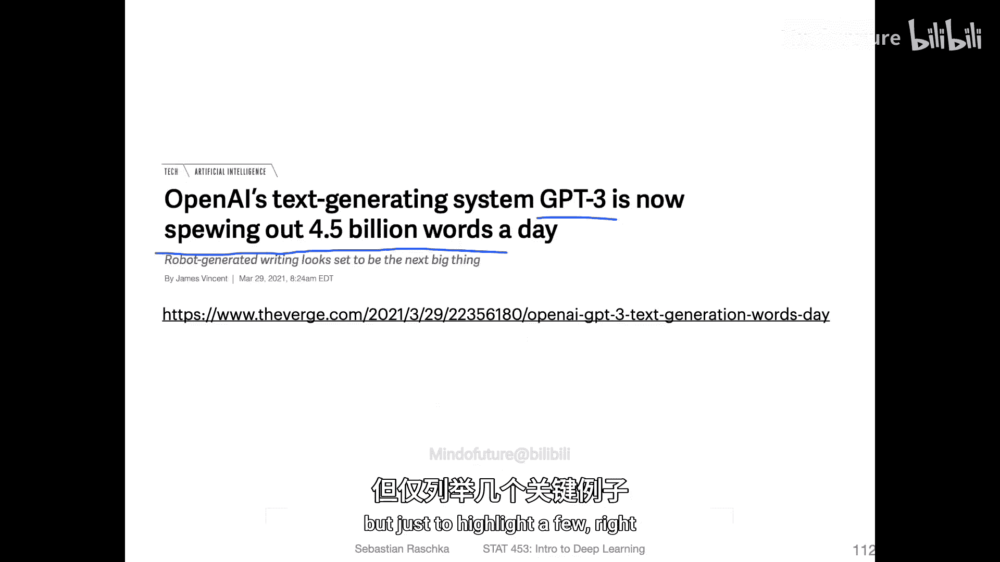
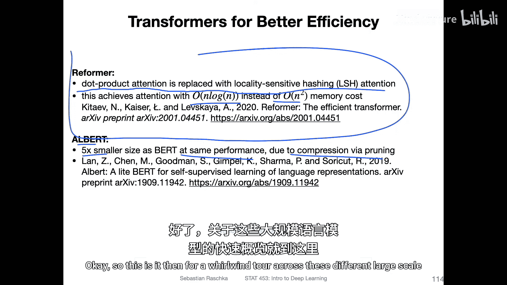
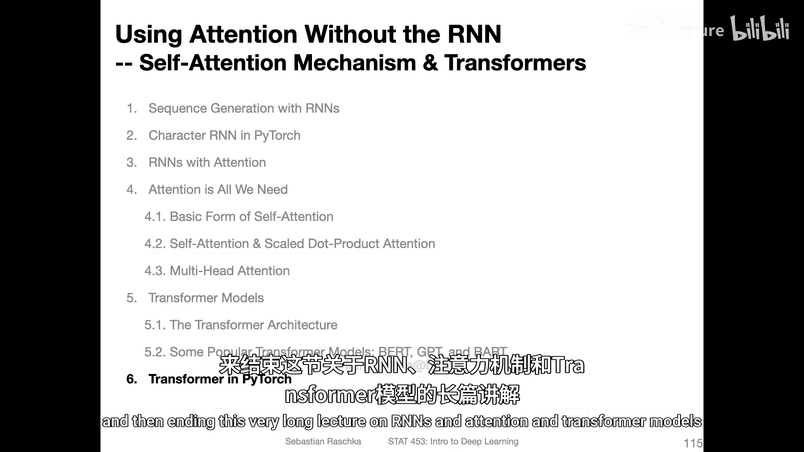

# 170：语言Transformer的近期发展 🚀

在本节课中，我们将探讨近年来广受欢迎的大规模语言模型的最新发展趋势。我们将了解模型规模的增长、面临的挑战以及旨在提升效率的创新方法。

上一节我们介绍了Transformer架构及其核心变体，本节中我们来看看该领域近期的关键动向。

## 处理长序列的模型 🔄

随着模型发展，处理更长文本序列的需求日益增长。标准的Transformer模型因其注意力机制的计算复杂度与序列长度呈二次方增长，在处理长文档时面临效率挑战。因此，研究人员开发了多种专门处理长序列的模型。

以下是两种具有代表性的方法：

*   **Transformer-XL**：这是一个类似于GPT的解码器模型，同样以预测句子中的下一个词为目标。其核心创新在于引入了某种隐藏状态来连接多个输入片段。这使其能够处理远超传统GPT-1模型512个令牌限制的文本，其思路类似于在Transformer模型中融入了RNN的记忆能力。
*   **Longformer**：该模型的全称是“长文档Transformer”。它开发了一种新的注意力机制，使其计算复杂度仅与序列长度呈**线性增长**，而非二次方增长。这使得模型能够高效处理包含数千个令牌的长文本段落。

## 模型规模的增长趋势与成本 📈

一个明显的趋势是，语言模型的参数量变得越来越大。

根据一份图表显示（截至2019年），模型的参数量从ELMo、GPT-1（1.1亿参数），到BERT（3.4亿参数）、GPT-2（15亿参数），直至GPT-3（1750亿参数），不断攀升。

然而，模型规模的急剧扩大也带来了严峻挑战：

1.  **训练成本高昂**：训练这些模型需要巨大的计算资源。据估计，训练1.1亿参数的GPT-1模型成本在2.5万至5万美元之间，而像BERT-large或GPT-2这样的更大模型，训练成本可能高达数十万甚至数百万美元。
2.  **环境与可及性**：高昂的成本不仅涉及金钱，还包括巨大的电力消耗和环境成本。同时，如此庞大的模型通常需要数千个GPU和复杂的工程技巧才能训练，这对大多数研究者和机构而言难以企及。

## 提升模型效率的方法 ⚡

幸运的是，许多研究正致力于开发更高效的模型，以应对规模扩大带来的挑战。

以下是几种提升效率的代表性方法：

*   **Reformer**：该方法用局部敏感哈希机制替代了标准的点积注意力，实现了接近**O(N log N)** 的计算复杂度和内存成本，而非原来的**O(N²)**。
*   **ALBERT**：这是一个比原始BERT小5倍的模型版本，但通过参数共享等技术，达到了与BERT相当的性能。
*   **Sparse Transformer**：该方法使用了稀疏注意力模式，以减少计算量。
*   **Longformer**：如前所述，其线性复杂度的注意力机制本身就是一种效率提升。
*   **DistilBERT**：这是一个通过知识蒸馏技术得到的、更小更快的BERT版本，旨在保持性能的同时提升可及性。
*   **模型剪枝**：例如一些方法在模型训练完成后，通过剪枝技术移除不重要的参数，从而压缩模型大小。

本节课中我们一起学习了大规模语言模型在长序列处理、规模增长与成本以及效率优化三个方面的近期发展。我们看到，尽管模型正变得越来越大、越来越强大，但学术界和工业界也在积极寻找方法，让这些技术变得更高效、更环保、更易于使用。在下一节，我们将通过一个简短的代码示例来结束关于RNN、注意力和Transformer模型的漫长讲座。