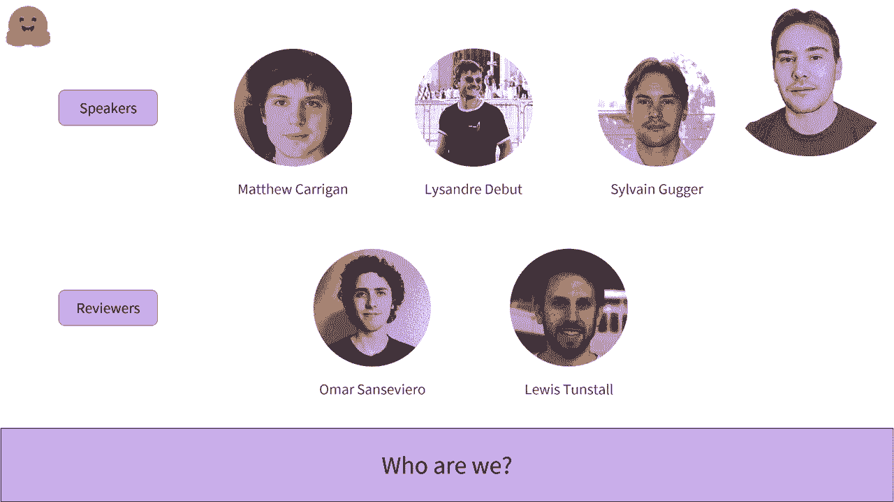

# 课程一：欢迎来到 Hugging Face 课程 🎉

在本节课中，我们将要学习 Hugging Face 课程的整体介绍、课程结构、学习前提以及讲师团队。我们将了解这门课程的目标、内容安排以及学习它需要具备的基础知识。

## 课程概述

欢迎来到 Hugging Face 课程。该课程旨在教授关于 Hugging Face 生态系统的所有知识。我们将其用作模型中心以及开源库。

以下是课程目录。课程分为三个部分，难度逐渐增加。目前，只有第一部分已发布。

## 课程结构与内容

上一节我们介绍了课程的整体目标，本节中我们来看看课程的具体安排和发布时间。

第一部分将教授使用变换器模型的基础知识，如何在自己的数据集上微调模型，以及如何将结果分享给社区。我们正在积极开发接下来的两个部分。

我们计划的大致时间线是在 2021 年秋季发布第二部分，最后一部分在 2021 年底和 2022 年初发布。请注意这只是预计时间，请勿过早准备。

## 学习前提

了解了课程内容后，我们来看看学习这门课程需要哪些基础知识。

第一章不需要技术知识，是了解预训练模型能做什么以及它们如何对你或你的公司有用的良好介绍。

接下来的几章需要良好的 Python 知识，以及基本的机器学习和深度学习知识。

如果你不知道训练集和验证集是什么，或者什么是梯度下降，你应该先学习一些入门课程，例如由深度学习研究院发布的课程。

最好你对某个深度学习框架有一些基础知识，例如 PyTorch 或 TensorFlow。这门课程中介绍的每一部分材料在这两个框架中都有对应版本，因此你可以选择最熟悉的那一个。

## 讲师团队介绍

在开始学习之前，让我们认识一下开发本课程的团队。以下是讲师的简要自我介绍。

*   **马修**：我是 Hugging Face 的机器学习工程师。我在开源团队工作，负责维护 TensorFlow 代码。之前，我在 Parsley 担任机器学习工程师，该公司最近被 Auto 收购。在那之前，我是在爱尔兰都柏林三一学院的博士后研究员，研究计算遗传学和视网膜疾病。
*   **亚历山大**：我是 Hugging Face 的机器学习工程师。我专门在开源团队工作。我在 Hugging Face 工作了几年，和我的团队成员一起开发了本课程中大部分工具。
*   **西尔万**：我是 Hugging Face 的研究工程师，也是 Transformers 库的主要维护者之一。之前，我在 FAA AI 工作，帮助开发 FastAI 库以及在线课程。在此之前，我是一名在法国教授数学和计算机科学的老师。

## 总结

本节课中我们一起学习了 Hugging Face 课程的欢迎介绍。我们了解了课程旨在全面介绍 Hugging Face 生态系统，其内容分为三个由浅入深的部分。学习后续章节需要具备 Python、机器学习及深度学习框架的基础知识。最后，我们认识了负责开发本课程的讲师团队。接下来，我们将正式开始学习如何使用强大的变换器模型。