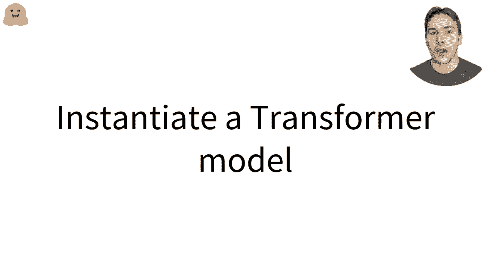
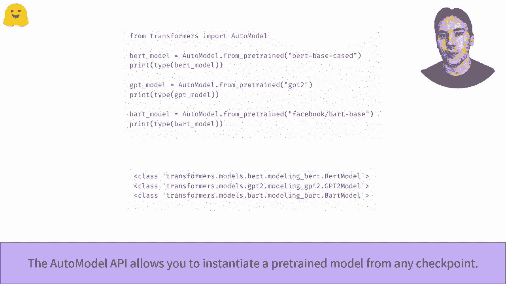
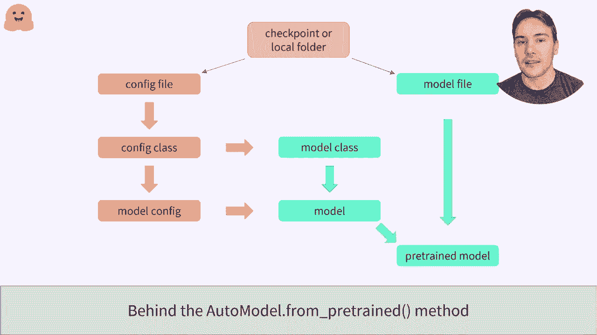
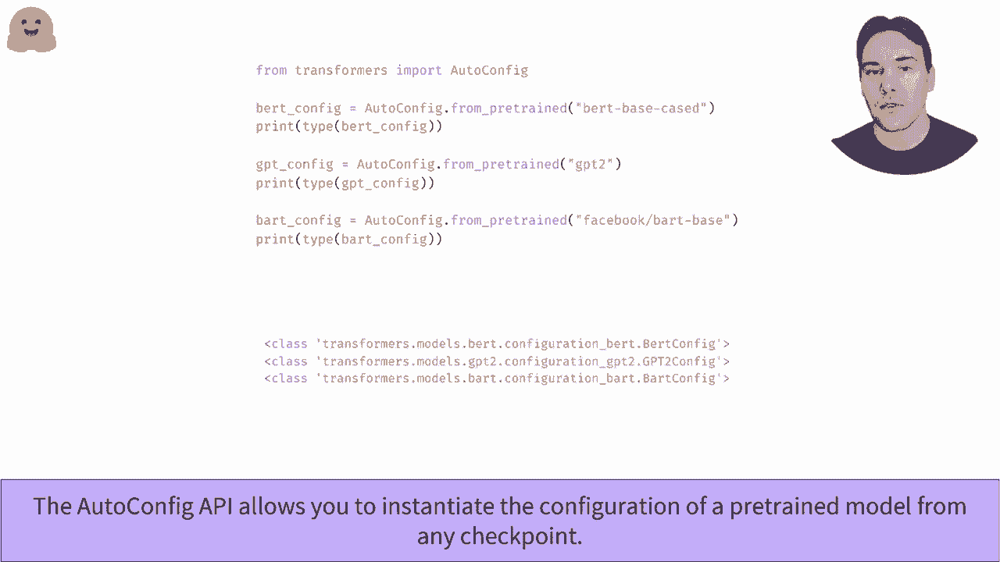
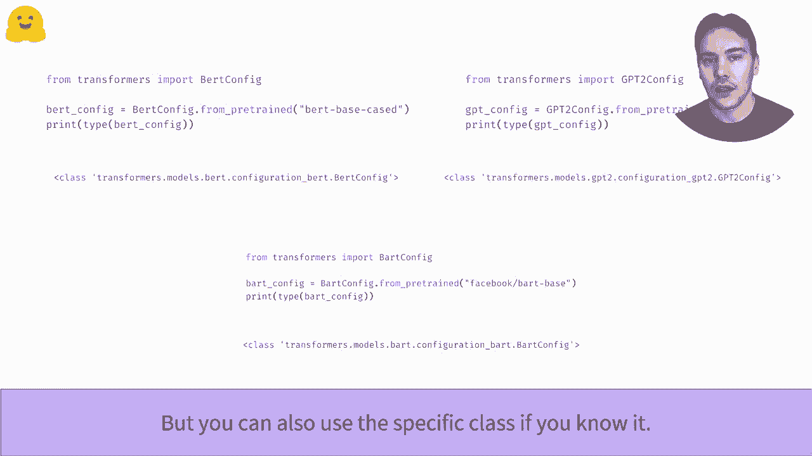
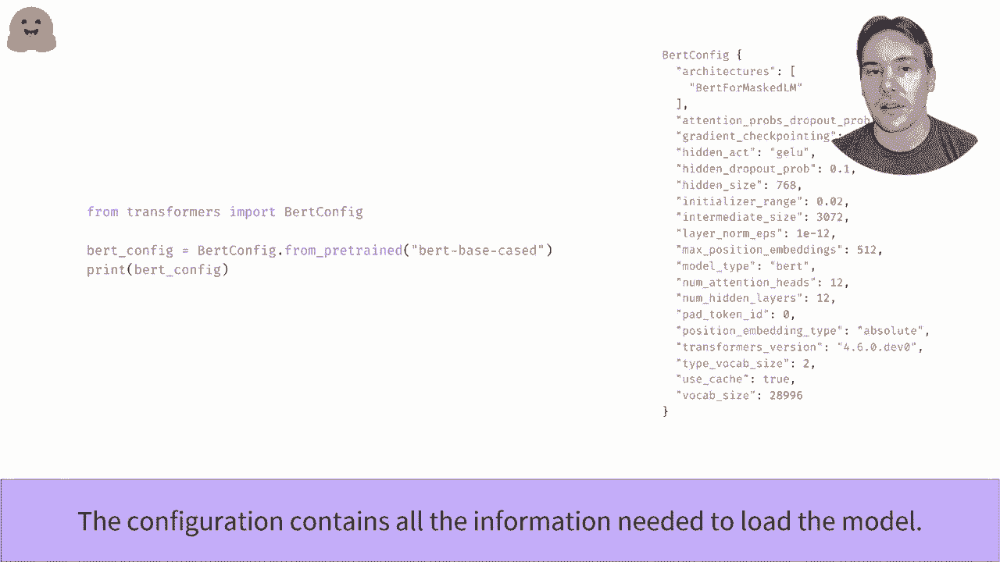
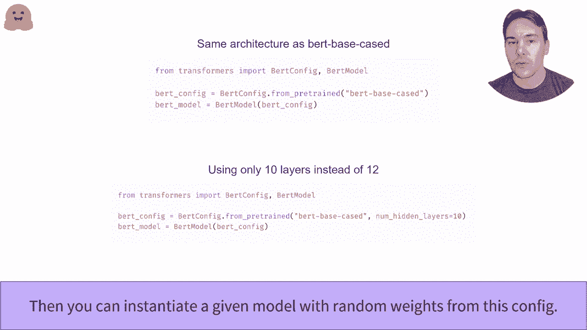
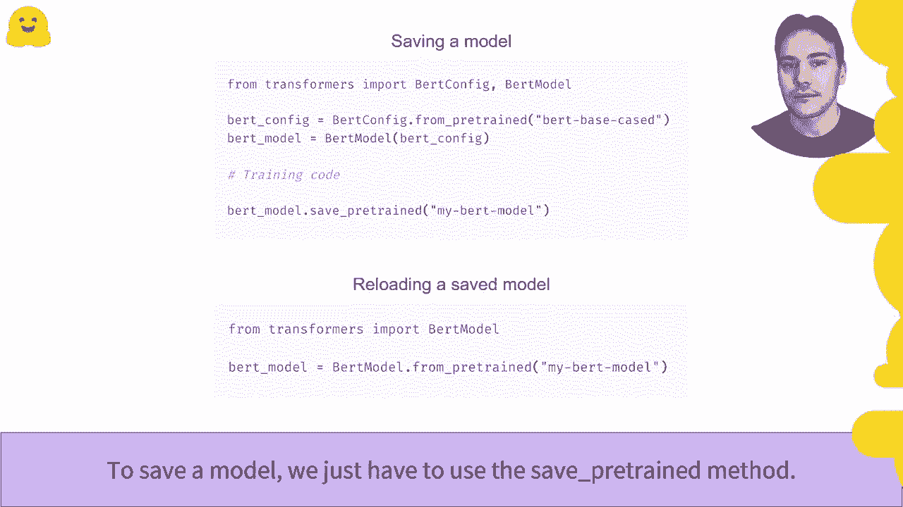

# Transformers 原理细节及 NLP 任务应用！P10：L2.3- 实例化 Transformer 模型 (PyTorch) 🚀


在本节课中，我们将学习如何从 Hugging Face Transformers 库中实例化一个 Transformer 模型。我们将了解 `AutoModel` 类的工作原理，如何加载预训练权重，以及如何从头开始创建和保存自定义模型。

## 概述

我们将从 `AutoModel` 类开始，它是加载任何预训练模型的最便捷方式。接着，我们会深入其背后的机制，学习如何使用 `AutoConfig` 和特定模型类来更精细地控制模型加载。最后，我们将学习如何保存和重新加载微调后的模型。



## 使用 AutoModel 类加载模型

上一节我们介绍了 Transformers 库的基本概念，本节中我们来看看如何实际加载一个模型。`AutoModel` 类是加载模型最直接的方法。

`AutoModel` 类允许你从 Hugging Face Hub 上的任何检查点实例化一个预训练模型。它会自动根据检查点名称选择正确的模型类，构建对应的模型架构，并加载预训练权重。

例如，当给定一个 BERT 检查点时，它会实例化一个 BERT 模型；给定 GPT-2 检查点时，则会实例化 GPT-2 模型。


## AutoModel 的内部机制



了解了便捷的加载方式后，我们来看看 `AutoModel` 背后是如何工作的。这个过程主要分为几个步骤。

在幕后，`AutoModel` API 首先接受一个检查点名称（如 `bert-base-uncased`）。它会从 Hub 下载并缓存该检查点的配置文件和模型权重文件。你也可以指定一个包含有效配置文件和模型权重的本地文件夹路径。

以下是实例化模型的关键步骤：
1.  **读取配置**：API 会打开配置文件，确定应该使用哪个配置类（如 `BertConfig`, `GPT2Config`）。
2.  **实例化配置**：使用该配置类创建一个配置对象，它包含了构建模型架构所需的所有参数。
3.  **选择模型类**：根据配置类找到对应的模型类（如 `BertModel`, `GPT2Model`）。
4.  **初始化模型**：结合配置实例化模型。此时模型权重是随机初始化的。
5.  **加载权重**：最后，从模型权重文件中加载预训练权重到模型中。


## 使用 AutoConfig 管理配置

上一节我们看到了配置在模型加载中的核心作用，本节中我们来看看如何直接操作配置。`AutoConfig` 类可以帮助我们轻松加载和管理模型配置。

为了从任何检查点或包含配置文件的文件夹加载模型的配置，我们可以使用 `AutoConfig` 类。与 `AutoModel` 类似，它会自动选择正确的配置类。

```python
from transformers import AutoConfig

config = AutoConfig.from_pretrained("bert-base-uncased")
```

我们也可以直接使用特定模型的配置类，这在需要精确控制模型架构时非常有用。

```python
from transformers import BertConfig



config = BertConfig.from_pretrained("bert-base-uncased")
```


## 理解模型配置

配置对象是创建模型架构的蓝图。它包含了模型的所有结构参数。



例如，与 `bert-base-uncased` 检查点相关的 BERT 模型配置包含以下关键信息：
*   **层数 (`num_hidden_layers`)**：12
*   **隐藏层大小 (`hidden_size`)**：768
*   **词汇表大小 (`vocab_size`)**：28996


## 从配置创建随机初始化模型



掌握了配置之后，我们可以利用它来创建模型。我们可以创建一个与预训练检查点架构相同但权重随机初始化的模型，用于从头开始训练。

```python
from transformers import BertConfig, BertModel

# 加载配置
config = BertConfig.from_pretrained("bert-base-uncased")
# 从配置创建模型（随机权重）
model = BertModel(config)
```

我们还可以在加载配置时，通过关键字参数修改模型的任何部分。例如，下面的代码创建了一个只有 10 层（而不是默认的 12 层）的随机初始化 BERT 模型。



```python
from transformers import BertConfig, BertModel

# 修改配置参数
config = BertConfig.from_pretrained("bert-base-uncased", num_hidden_layers=10)
model = BertModel(config)
```


## 保存与加载模型

模型训练或微调完成后，我们需要保存它。保存模型非常简单。

我们使用 `.save_pretrained()` 方法。下面的代码将模型保存在当前工作目录下名为 `my_bert_model` 的文件夹中。



```python
model.save_pretrained("./my_bert_model")
```

保存的模型可以通过 `.from_pretrained()` 方法重新加载。

```python
from transformers import BertModel
model = BertModel.from_pretrained("./my_bert_model")
```


## 总结

本节课中我们一起学习了在 PyTorch 环境下实例化 Transformer 模型的全过程。

我们首先介绍了使用 `AutoModel` 类一键加载预训练模型的便捷方法。然后，我们深入探讨了其背后的机制，了解了 `AutoConfig` 类如何帮助我们管理和修改模型配置。我们还学习了如何从配置创建随机初始化的模型，以及如何保存和重新加载我们自己的模型。



通过掌握这些核心方法，你已经具备了灵活使用 Hugging Face Transformers 库构建和定制 NLP 模型的基础能力。要了解如何将模型分享到社区，请查看关于“模型推送（push to hub）”的教程。

