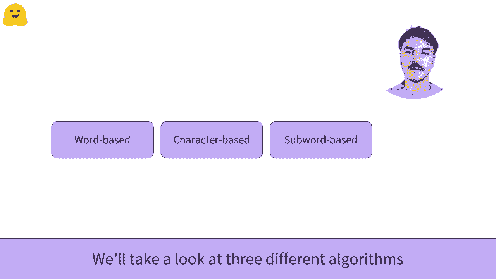
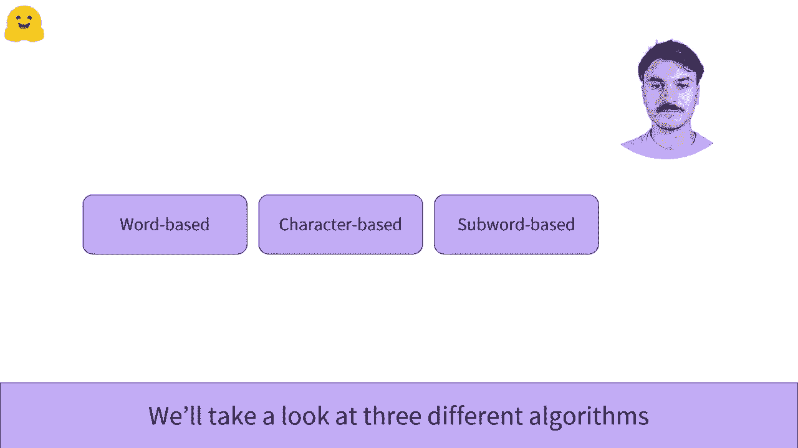

# Transformers 原理细节及 NLP 任务应用！P12：L2.5 - Tokenizers 分词器概述 🔤

在本节课中，我们将要学习自然语言处理中的一个核心组件：分词器。我们将了解为什么需要将文本转换为数字，并初步认识三种主要的分词方法。

在自然语言处理领域，我们处理的大部分数据由原始文本组成。然而，机器学习模型无法以原始形式读取或理解文本。它们只能处理数字。因此，分词器的目标是将文本转换为数字。

有几种可能的方法来进行这种转换，目标是找到最有意义的表示。我们将查看三种不同的组织算法。我们将逐一进行比较。因此，我们建议你按以下顺序观看视频。

上一节我们介绍了分词器的基本目标，本节中我们来看看具体有哪些方法。

以下是三种主要的分词方法：

1.  **基于词的分词**：将文本按单词或标点符号进行分割。例如，句子 `“I love NLP.”` 会被分割为 `[“I”, “love”, “NLP”, “.”]`。
2.  **基于字符的分词**：将文本分解为单个字符。例如，`“cat”` 会被分割为 `[“c”, “a”, “t”]`。
3.  **基于子词的分词**：一种折中方案，将单词分解为更常见的子单元。例如，`“unhappiness”` 可能被分解为 `[“un”, “happi”, “ness”]`。

本节课中我们一起学习了分词器在NLP中的重要性及其三种基本类型：基于词、基于字符和基于子词。理解这些方法是后续深入学习Transformer模型和具体NLP任务应用的基础。