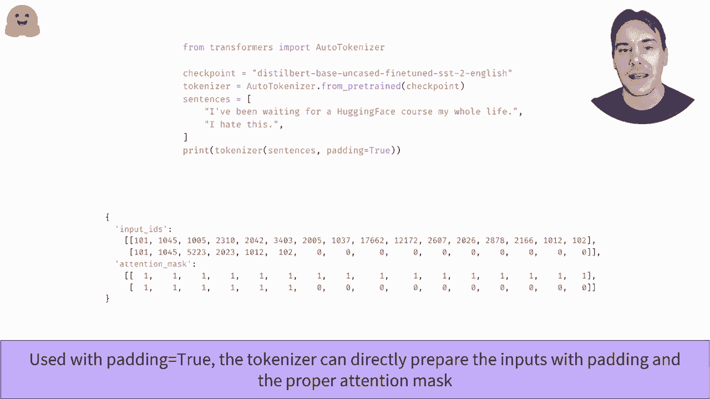

# Transformers 原理细节及 NLP 任务应用！P17：L2.10- 批处理输入(PyTorch) 📚

在本节课中，我们将要学习如何将多个输入序列有效地组合在一起进行批处理。这是使用深度学习模型处理自然语言任务时的关键步骤，尤其是在处理长度不一的句子时。

## 概述

批处理允许我们一次性处理多个数据样本，从而提高计算效率。然而，当处理文本时，句子长度通常不一致，这给批处理带来了挑战。本节将介绍如何通过填充和注意力掩码来解决这个问题，确保模型能够正确处理批量输入。

## 批处理的挑战

上一节我们介绍了模型的基本输入流程。本节中我们来看看当需要同时处理多个句子时会遇到什么具体问题。

当我们想要对多个句子进行分类时，首先需要将它们转换为模型可以理解的数字形式，即输入ID。然而，不同的句子通常包含不同数量的单词（标记）。

例如，对两个句子进行情感分析，经过标记化和映射后，我们得到两个长度不同的列表。试图将这两个长度不同的列表直接组合成一个张量（如PyTorch的`Tensor`或NumPy的`ndarray`）会导致错误，因为张量要求所有维度规则且一致。

## 解决方案：填充

为了克服长度不一的限制，最常用的方法是对较短的句子进行“填充”，使其长度与批次中最长的句子一致。

以下是填充的两种思路：
1.  将较短的句子填充到与最长的句子等长。
2.  将较长的句子截断到与最短的句子等长。

一般来说，我们优先选择填充短句子的方法。只有在句子长度超过了模型能处理的最大限制时，我们才会考虑截断长句子，因为截断可能会丢失对分类至关重要的信息。

用于填充的值不能随机选择。Transformer模型使用一个特定的“填充标记”，其对应的ID可以在分词器的词汇表中找到，通常通过`tokenizer.pad_token_id`属性获取。

```python
# 示例：获取填充标记的ID
pad_token_id = tokenizer.pad_token_id
```

填充后，所有句子的长度就变得一致，可以顺利组合成一个批次张量。

## 填充带来的新问题

现在，我们有了长度一致的句子，可以将它们组合成一个批次进行前向传播。但是，如果我们分别将两个原始句子输入模型，再将它们与填充后的批次结果进行比较，会发现结果并不相同。

这是Transformer库的一个错误吗？并非如此。如果你还记得，Transformer模型的核心是自注意力机制。自注意力层在计算每个标记的上下文表示时，会关注序列中的所有其他标记。当我们在一个句子旁边添加了无意义的填充标记时，这些填充标记也会被纳入注意力计算中，从而影响该句子的最终表示。因此，得到不同的输出是符合逻辑的。

## 最终方案：注意力掩码

为了确保填充后的批量输入能与单独处理每个句子的结果保持一致，我们需要引导注意力层忽略那些填充标记。

这是通过“注意力掩码”来实现的。注意力掩码是一个与输入ID张量形状完全相同的张量，由0和1组成。
*   **1** 表示对应的标记是真实内容，注意力层应该考虑它。
*   **0** 表示对应的标记是填充部分，注意力层应该忽略它。

将注意力掩码与输入ID一起传递给模型，就能获得与单独处理每个句子时相同的结果。

```python
# 伪代码示意：注意力掩码的作用
# input_ids = [ [句子1的ID...], [句子2的ID + pad_id...] ]
# attention_mask = [ [1,1,1,...], [1,1,1,...,0,0] ] # 0对应填充位置
# output = model(input_ids, attention_mask=attention_mask)
```

## 使用分词器自动处理

幸运的是，我们无需手动进行填充和创建掩码。Hugging Face的`transformers`库中的分词器为我们自动完成了这一切。

当你对多个句子调用分词器并将参数`padding`设置为`True`时，它会自动执行以下操作：
1.  将批次内的所有句子填充到相同长度。
2.  生成对应的注意力掩码。



```python
# 示例：使用分词器进行自动批处理
encodings = tokenizer([sentence1, sentence2], padding=True, truncation=True, return_tensors="pt")
# encodings 现在包含：
# - input_ids: 填充后的输入ID张量
# - attention_mask: 自动生成的注意力掩码张量
```


## 总结

本节课中我们一起学习了Transformer模型批处理输入的核心方法。我们了解到，由于句子长度不一，直接批处理会失败，需要通过填充使长度一致。但填充会干扰注意力机制的计算，因此必须引入注意力掩码来屏蔽填充位置的影响。最终，利用`transformers`库的分词器，我们可以通过设置`padding=True`来一键完成填充和掩码生成，从而高效、正确地处理批量文本输入。这是将模型应用于实际NLP任务流水线中的重要一环。