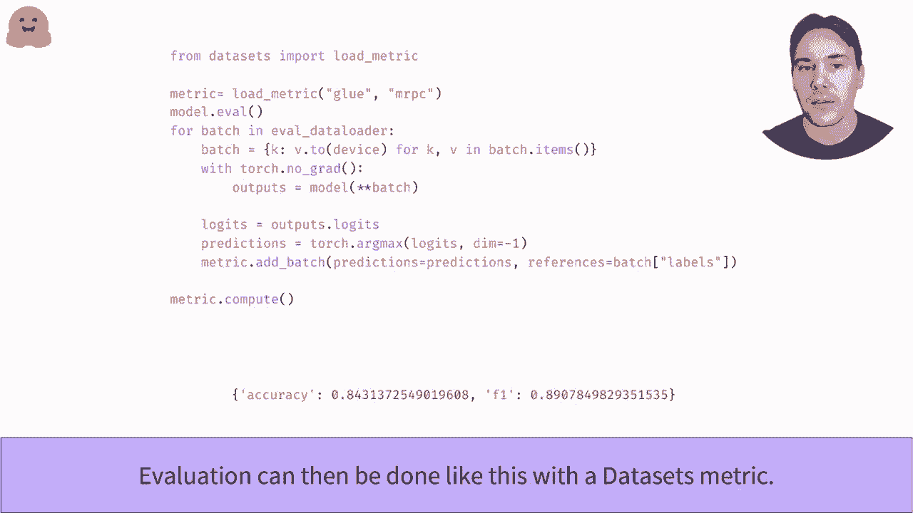

# 课程 P22：L3.5 - 使用 PyTorch 编写训练流程 🧠

在本节课中，我们将学习如何按部就班地编写自己的 PyTorch 训练循环。我们将实现一个完整的训练流程，不依赖于特定的高级 API，从而让你能够轻松定制循环以满足不同需求，并有助于手动调试训练过程中可能出现的问题。

## 概述：训练循环的基本原理

在深入代码之前，我们先了解训练循环的基本草图。其核心步骤是：取一批训练数据输入模型，通过标签计算损失值。这个损失值本身没有意义，但它用于计算模型权重的梯度（即每个权重的导数）。优化器随后利用这些梯度来更新模型权重，使其性能提升。这个过程会使用新的数据批次不断重复。

如果对上述任何概念感到陌生，建议复习深度学习基础知识。

## 准备数据与数据加载器

上一节我们介绍了训练循环的原理，本节中我们来看看如何准备数据。我们将使用 GLUE 基准测试中的 MRPC 数据集，并建议使用动态填充的数据集库来处理数据。如果你不熟悉这个库，可以参考相关视频。

以下是数据准备的步骤：

1.  定义 PyTorch 数据加载器，它负责将数据集元素转换为批次。
2.  使用数据填充器作为 `collate_fn` 函数。
3.  对训练集进行洗牌，以确保不会按固定顺序遍历样本。

为了检查一切是否按预期工作，可以尝试获取一个数据批次并检查其结构。与单个数据集元素类似，它是一个字典，但这次字典中的值是张量，其形状为 `[批次大小, 序列长度]`。

## 创建与初始化模型

下一步是将训练数据送入模型。现在需要实际创建一个模型。正如在模型 API 视频中所见，我们使用预训练模型，并将分类头的输出数量调整为数据集的类别数量。

同样，为了确保一切顺利，我们将一个批次传递给模型，并检查是否没有报错。

如果提供了标签，Transformers 库的模型会直接返回损失值。我们将能够利用这个损失值来计算梯度。

## 配置优化器

我们需要一个优化器来执行训练步骤。这里我们使用 AdamW 优化器，它是 Adam 优化器的一个变体，具有适当的权重衰减。当然，你可以选择任何喜欢的优化器。

利用之前计算出的损失，通过 `loss.backward()` 进行反向传播以计算梯度。请检查能否在没有错误的情况下执行 `optimizer.step()`。之后，**不要忘记使用 `optimizer.zero_grad()` 将梯度归零**，否则下一步的梯度会累积到已计算的梯度之上。

## 完善训练循环：学习率调度与 GPU 加速

我们已经有了基本的训练循环，但可以添加两项内容使其更完善。

第一个是学习率调度器，用于在训练过程中逐步降低学习率。Transformers 库中的 `get_linear_schedule_with_warmup` 函数是一个便捷工具，用于轻松构建调度器。你也可以使用任何 PyTorch 学习率调度器。

其次，为了加速训练，我们需要使用 GPU。第一步是使用 `torch.cuda.is_available()` 来检查是否有可用的 GPU 实例。然后，你需要将模型和数据移动到 GPU 设备上（例如 `model.to(device)`）。请确保这几行代码配置正确，否则训练时间可能会大大延长。

## 组合完整的训练循环

现在，我们将所有内容组合在一起。

首先，使用 `model.train()` 将模型置于训练模式。这会激活某些层（如 Dropout）在训练时的特定行为。

然后，我们遍历整个训练数据集，迭代指定的轮数（epoch）。在每次迭代中，我们回顾已经看到的所有步骤：
1.  将数据发送到 GPU。
2.  计算模型输出，特别是损失。
3.  使用 `loss.backward()` 计算梯度。
4.  使用优化器执行一步更新（`optimizer.step()`）。
5.  更新学习率调度器（`scheduler.step()`）。
6.  将优化器的梯度归零（`optimizer.zero_grad()`）。

## 模型评估

训练完成后，我们可以使用数据集库中的评估指标来评估模型性能。

首先，使用 `model.eval()` 将模型置于评估模式，这会停用像 Dropout 这样的层。然后进行所有评估步骤。如我们在训练视频中看到的，模型输出的是 logits，我们需要应用 `argmax` 函数将其转换为预测类别。

评估指标对象有一个 `add_batch` 方法，我们可以用来发送中间预测结果。一旦评估循环结束，只需调用 `metric.compute()` 方法即可获取最终评估结果。

恭喜你，你已经独立构建并训练了一个模型！

## 总结

本节课中，我们一起学习了如何使用 PyTorch 从零开始编写一个完整的训练循环。我们涵盖了数据准备、模型初始化、优化器配置、学习率调度、GPU 加速以及最终的模型评估。掌握这些核心步骤将使你能够灵活定制训练流程，并深入理解模型训练的内部机制。