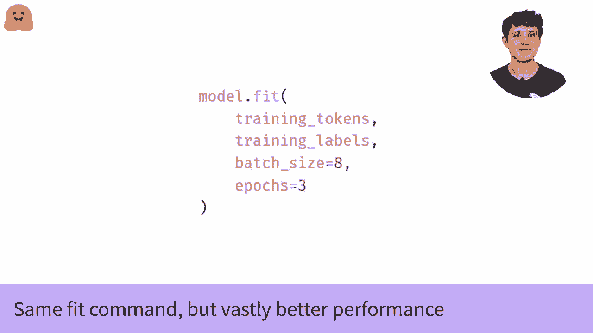

# 课程 P28：L4.5 - 使用 TensorFlow 进行学习率调度 🎛️

在本节课中，我们将学习如何在使用 TensorFlow 微调语言模型时，通过调整学习率来提升训练效果。我们将重点介绍如何设置一个更合适的初始学习率，以及如何实现学习率衰减策略，从而使模型训练更加稳定和成功。

---

## 为何需要调整学习率？

在我们之前的模型微调视频中，基础代码虽然可以工作，但仍有改进空间。其中，学习率的设置是关键。默认的学习率设置通常不适合Transformer模型的训练，直接使用可能导致训练不稳定或效果不佳。

上一节我们介绍了微调的基础，本节中我们来看看如何优化学习率。

## 调整学习率的两个方面

我们需要改变默认学习率的两个主要方面：

1.  **初始值过高**：Adam优化器默认的学习率是 `1e-3`（即0.001），这对于训练Transformer模型来说通常过高。一个更好的起点是 `5e-5`，这比默认值低了20倍。
2.  **恒定学习率不理想**：在整个训练过程中使用固定的学习率并非最佳。如果能在训练过程中逐渐降低学习率，甚至最终降至0，模型往往能获得更好的性能。这就是学习率衰减调度器的作用。

## 实现多项式衰减调度

“多项式衰减”这个名称可能听起来复杂，但其默认实现实际上是一个简单的线性衰减。首先，我们需要告诉调度器训练将持续多久，以便它以正确的速度进行衰减。

以下是计算总训练步数（批次数）的代码：

```python
# 计算总训练步数
steps_per_epoch = len(train_dataset) // batch_size
total_steps = steps_per_epoch * num_epochs
```

这段代码的作用是：用训练集的大小除以批次大小，得到每个epoch的批次数，再乘以总epoch数，从而得到整个训练过程的总批次数。

知道了总步数后，我们就可以将其传递给调度器。

## 学习率衰减曲线

使用默认选项时，多项式衰减调度呈现为线性衰减。它从我们设定的初始值（例如 `5e-5`）开始，以恒定速率下降，直到在训练结束时达到0。

那么为什么叫“多项式”衰减呢？因为通过调整参数，你可以实现更高阶（非线性）的衰减曲线。但在默认情况下，它是一个线性函数。了解线性函数是多项式的一种特例，可以帮助你理解其命名。

## 如何在代码中使用调度器

我们不再通过字符串简单指定优化器，而是导入并配置它，以便使用我们的自定义学习率调度。

以下是配置步骤：

1.  从TensorFlow中导入优化器。
2.  使用我们定义的学习率调度器来初始化优化器。
3.  使用这个新的优化器以及你选择的损失函数来编译模型。

示例代码如下：

```python
import tensorflow as tf

# 1. 定义学习率调度器（线性衰减）
lr_schedule = tf.keras.optimizers.schedules.PolynomialDecay(
    initial_learning_rate=5e-5,
    decay_steps=total_steps,
    end_learning_rate=0.0
)

# 2. 使用调度器初始化优化器
optimizer = tf.keras.optimizers.Adam(learning_rate=lr_schedule)

# 3. 使用新优化器编译模型（损失函数保持不变，例如‘sparse_categorical_crossentropy’）
model.compile(optimizer=optimizer,
              loss='sparse_categorical_crossentropy',
              metrics=['accuracy'])
```

现在，我们就拥有了一个配置了高性能学习率策略的模型。

## 开始训练

由于我们已经用新的优化器和学习率重新编译了模型，因此训练步骤本身无需任何更改。你可以直接调用与之前相同的 `.fit()` 方法。

```python
model.fit(train_dataset, epochs=num_epochs, validation_data=val_dataset)
```

现在，模型将在一个良好的初始学习率下开始训练，并伴随着平稳的衰减，从而获得更优的性能。



---


## 总结

本节课中我们一起学习了如何优化Transformer模型的训练过程。核心在于两点：首先，将初始学习率从默认的 `1e-3` 调整到更合适的 `5e-5` 左右；其次，使用 **`PolynomialDecay`** 调度器实现学习率的线性衰减。通过导入优化器并传入自定义的学习率参数来编译模型，我们能够使训练更加稳定，最终提升模型的性能。