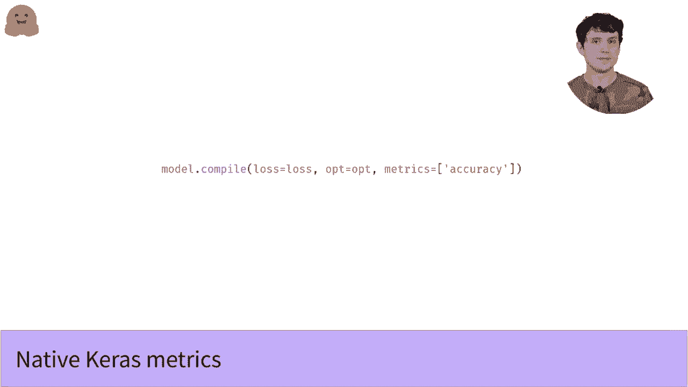

# Transformers 原理细节及 NLP 任务应用！P29：L4.6- TensorFlow 预测和评估指标 📊

在本节课中，我们将学习如何使用训练好的 Transformer 模型进行预测，并评估其性能。我们将介绍如何从模型获取预测结果，以及如何计算准确率、F1分数等关键评估指标。

---

## 模型预测 🔮

上一节我们介绍了模型的训练与微调。本节中，我们来看看如何使用训练好的模型对新数据进行预测。

好消息是，由于我们使用的是标准的 Keras 模型，因此可以直接使用 Keras 的标准预测方法。你只需将经过分词器处理的文本数据传递给模型的 `predict` 方法，即可获得输出结果。

我们的模型可以根据配置输出几种不同类型的内容。大多数情况下，你需要的是 **logits**（有时也被称为 logits）。它们是网络最后一层在应用 softmax 激活函数之前的原始输出。

如果你想将 logits 转换为模型预测各类别的概率，只需对其应用 softmax 函数。

**代码示例：获取概率**
```python
import tensorflow as tf

# 假设 logits 是模型的原始输出
probabilities = tf.nn.softmax(logits, axis=-1)
```

如果我们想将这些概率转化为具体的类别预测，方法也非常简单：只需为每个样本选择概率最大的类别。这可以通过 `argmax` 函数实现。

**代码示例：获取类别预测**
```python
# 获取每个样本预测概率最大的类别索引
class_predictions = tf.argmax(probabilities, axis=-1)
```
`argmax` 函数将返回一个整数向量，其中每个元素代表对应样本预测概率最大的类别索引（例如，0 代表类别0，1 代表类别1）。

实际上，如果你只关心最终的类别预测，可以完全跳过 softmax 步骤，因为最大 logits 值对应的总是最大概率。

至此，你已经掌握了获取模型概率输出和类别预测的全部必要知识。

---

## 评估指标 📈

如果你希望对模型进行基准测试或用于研究，可能需要更深入地分析预测结果。计算模型的评估指标是一种有效的方法。

在我们之前的数据集和微调视频中，使用的是 MRPC 数据集，它属于 GLUE 基准测试的一部分。GLUE 中的每个数据集（以及 Hugging Face `datasets` 库中的许多其他数据集）都预定义了一些评估指标，我们可以使用数据集的 `load_metric` 函数轻松加载。

对于 MRPC 数据集，内置的指标是 **准确率** 和 **F1 分数**。
*   **准确率**：衡量模型预测正确的样本占总样本的百分比。
*   **F1 分数**：一种综合考虑了精确率与召回率的指标，用于衡量模型在这两者之间的权衡。

为了计算这些指标来评估我们的模型，我们只需将模型的预测结果与真实的标签进行对比。

**代码示例：计算指标**
```python
from datasets import load_metric

# 加载 MRPC 数据集的评估指标
metric = load_metric("glue", "mrpc")

# 假设 predictions 是模型预测的类别，references 是真实标签
metric_results = metric.compute(predictions=class_predictions, references=true_labels)
print(metric_results)
```

---

## 在 Keras 训练中使用指标 🏃‍♂️

如果你熟悉 Keras，可能会注意到上述方法是在训练结束后一次性计算指标。但在 Keras 中，你可以在训练过程中实时计算多种指标，这能让你对训练进展有更直观的洞察。

使用 Keras 内置指标非常简单。与指定损失函数和优化器类似，你可以在编译模型时通过 `metrics` 参数来指定。

**代码示例：在模型编译时添加指标**
```python
# 在编译模型时添加评估指标
model.compile(
    optimizer='adam',
    loss='sparse_categorical_crossentropy',
    metrics=['accuracy']  # 这里可以添加多个指标，即使只有一个也要放在列表中
)
```
请注意，与损失函数不同，`metrics` 参数必须接收一个列表，即使你只指定一个指标。

一旦模型编译时指定了指标，它就会在训练、验证和预测（如果提供了标签）过程中报告这些指标的值。

你甚至可以编写自定义的指标类。虽然这超出了本课程的范围，但如果你需要的指标（例如 F1 分数）在 Keras 中没有内置实现，这将非常有用。相关的 TensorFlow 文档链接已提供在下方供你参考。

---

## 总结 ✨



本节课中，我们一起学习了如何使用训练好的 Transformer 模型进行预测和评估。


1.  我们了解了如何通过 `predict` 方法获取模型的 **logits** 输出，并利用 **softmax** 函数和 **argmax** 函数将其转换为概率和最终的类别预测。
2.  我们介绍了如何为特定数据集（如 MRPC）加载和计算预定义的评估指标，例如 **准确率** 和 **F1 分数**。
3.  我们还探讨了如何在 Keras 模型编译时直接集成评估指标，以便在训练过程中进行实时监控。

掌握这些步骤，你就能完整地走完一个模型的训练、预测和评估流程，从而有效地衡量和改进模型的性能。