# Transformers 原理细节及 NLP 任务应用！P34：L6.2 - 模型、分词器与数据处理 🧠

在本节课中，我们将深入探讨 Transformers 库的内部工作原理。我们将重点关注模型的类型、API 以及将文本转换为模型可处理格式的分词器。通过解构 `pipeline` API，我们将理解文本预处理、模型推理和后处理的完整流程。

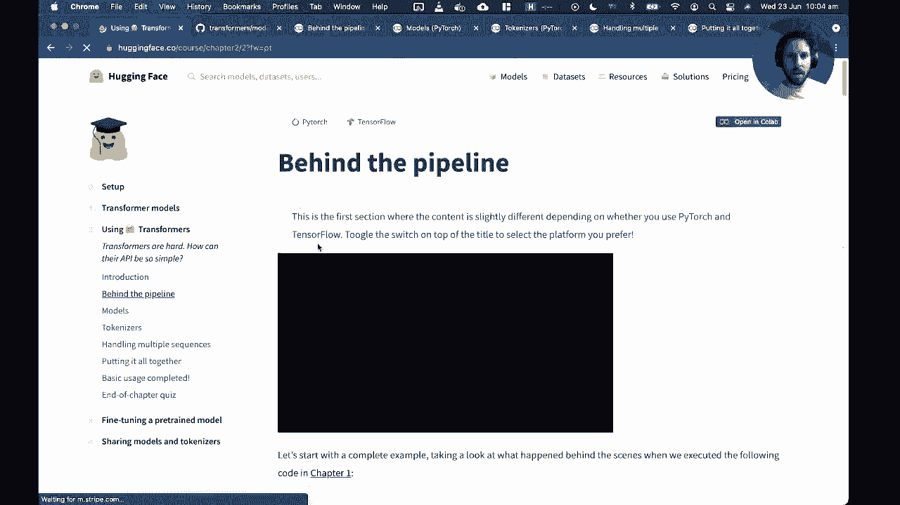

## 概述：从 Pipeline 到内部组件

在第一课中，我们使用了 `pipeline` API。这个 API 封装了文本预处理、模型推理和后处理的所有复杂性，使得像情感分析这样的任务变得非常简单。本节中，我们将解读这个函数内部发生了什么，理解不同的分词方法，并学习如何保存和加载模型与分词器。最后，我们将探讨如何处理长度不同的句子，因为深度学习框架需要标准化的矩形输入。

## 模型架构与加载 🏗️

上一节我们介绍了 `pipeline` 的高层概念，本节中我们来看看模型的具体架构和加载方式。

Transformers 库中的每个模型都有一个对应的建模文件。例如，BERT 的建模文件包含了用于不同任务（如序列分类、问答）的源代码。`BertModel` 类负责创建输入的上下文嵌入。

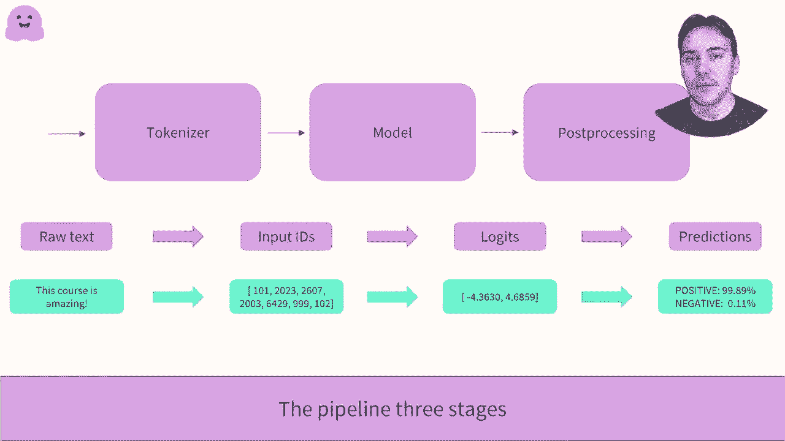


### 模型的核心组件

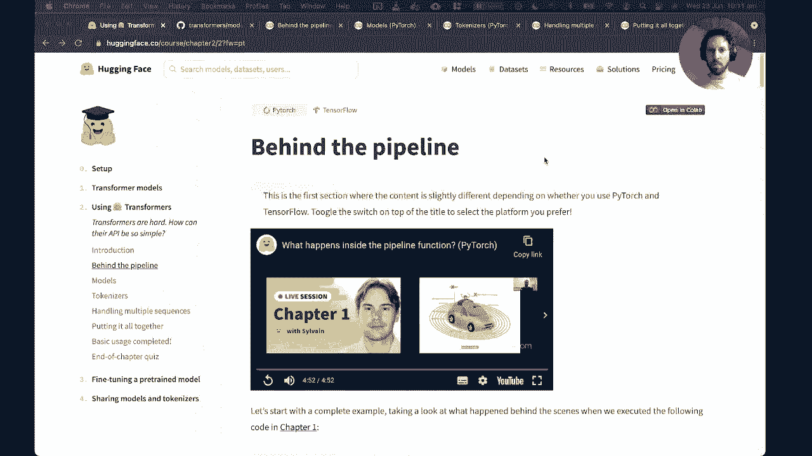

`BertModel` 类相对简单，主要包含：
*   **嵌入层**：将输入的标记（tokens）转换为向量表示。
*   **编码器**：一个由多个 Transformer 层堆叠而成的模块，负责将标记嵌入转换为上下文化的表示。


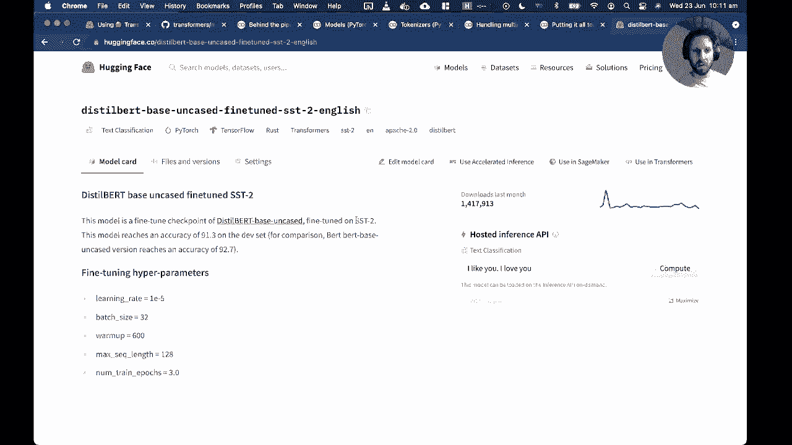

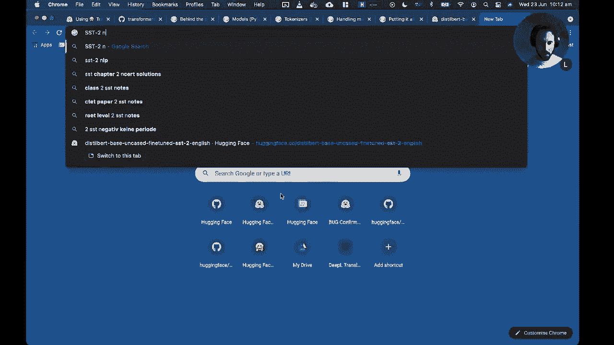

理解代码是掌握 Transformer 工作原理的关键。逐步跟踪输入在前向传播中的流程，能帮助你深入理解模型机制。

### 使用 AutoModel 加载模型

Transformers 库提供了 `AutoModel` API 来方便地加载预训练模型。它会根据给定的检查点名称自动选择正确的模型类。

```python
from transformers import AutoModel

model = AutoModel.from_pretrained("bert-base-uncased")
```

`AutoModel` 只会实例化模型的主体部分（即预训练主干网络）。对于分类等任务，我们需要使用带有任务特定头部的类，例如 `AutoModelForSequenceClassification`。

```python
from transformers import AutoModelForSequenceClassification

model = AutoModelForSequenceClassification.from_pretrained("distilbert-base-uncased-finetuned-sst-2-english")
```

### 模型的配置与保存

每个模型都有一个配置对象，它包含了构建模型架构所需的所有信息（如层数、隐藏层大小）。

```python
from transformers import AutoConfig

config = AutoConfig.from_pretrained("bert-base-uncased")
print(config)
```

你可以修改配置参数来创建不同架构的模型，但请注意，随意更改预训练模型的配置（如层数）可能会影响其在下游任务上的性能。

保存和加载模型非常简单：

```python
# 保存模型
model.save_pretrained("./my_model_directory")

# 加载模型
model = AutoModelForSequenceClassification.from_pretrained("./my_model_directory")
```

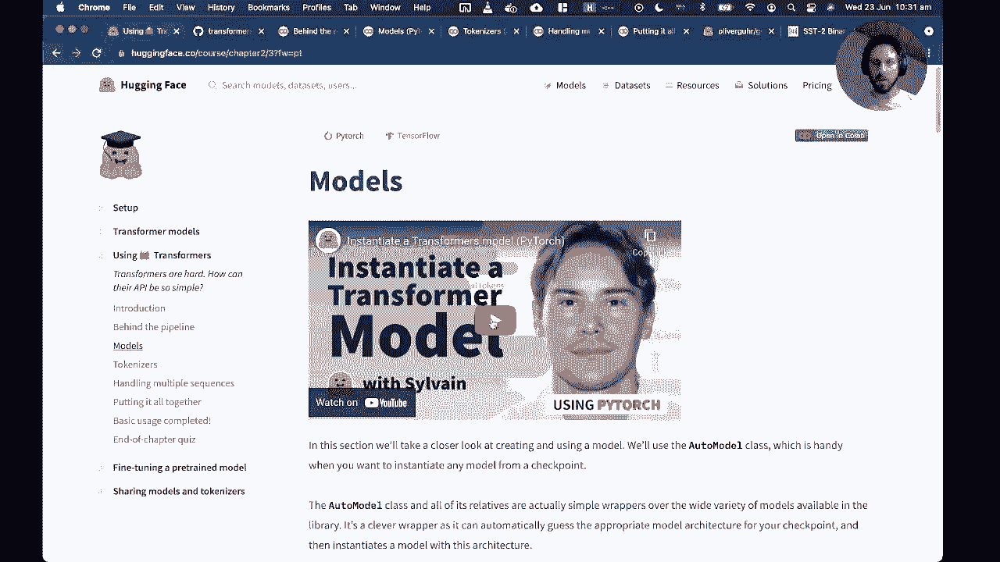


保存的目录会包含 `config.json`（配置）和 `pytorch_model.bin`（权重）两个文件。

## 分词器：文本到数字的桥梁 🔤

我们已经了解了模型如何加载和运行，接下来看看如何将原始文本准备成模型所需的格式，这就是分词器的工作。

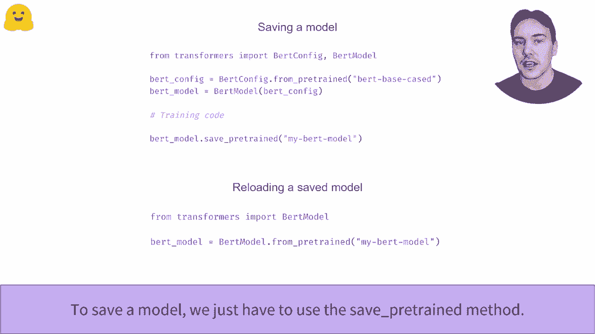


分词器的目标是将文本转换为数字，因为机器学习模型只能处理数值。有几种不同的分词策略：

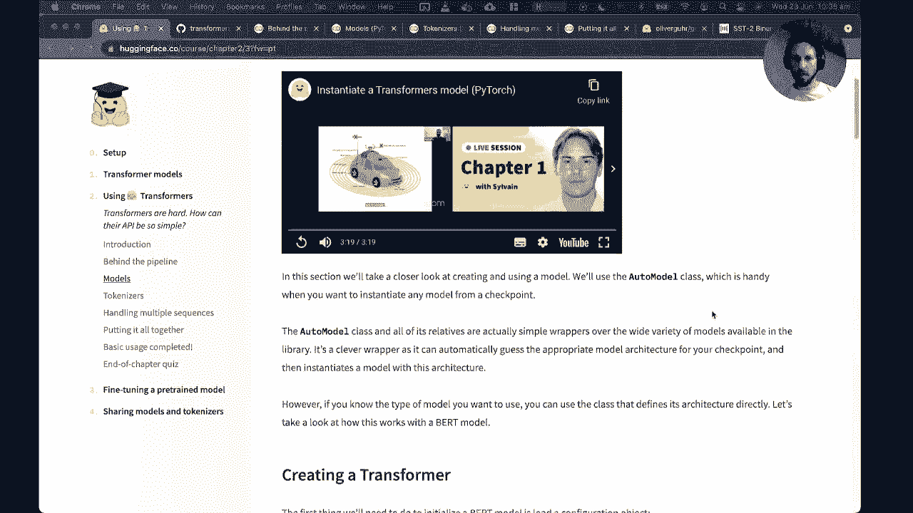

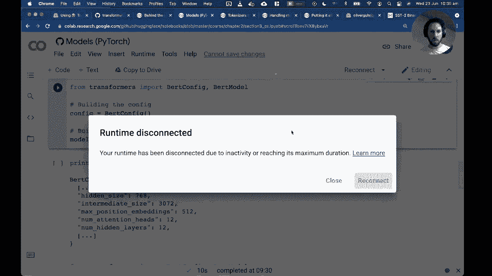

### 主要的分词策略

以下是三种主要的分词方法：

1.  **基于词的分词**：按空格或标点将文本拆分成单词。缺点是词汇表可能非常庞大，且无法处理未登录词（OOV）。
2.  **基于字符的分词**：将文本拆分成单个字符。优点是词汇表很小，但模型需要从字符序列中学习单词含义，训练难度较大。
3.  **基于子词的分词**：一种折中方案，将单词拆分成更常见的子词单元（如词根、前缀、后缀）。这是目前最流行的方法，例如 BERT 使用的 **WordPiece** 和 GPT-2 使用的 **Byte-Pair Encoding (BPE)**。

### 使用 Transformers 分词器

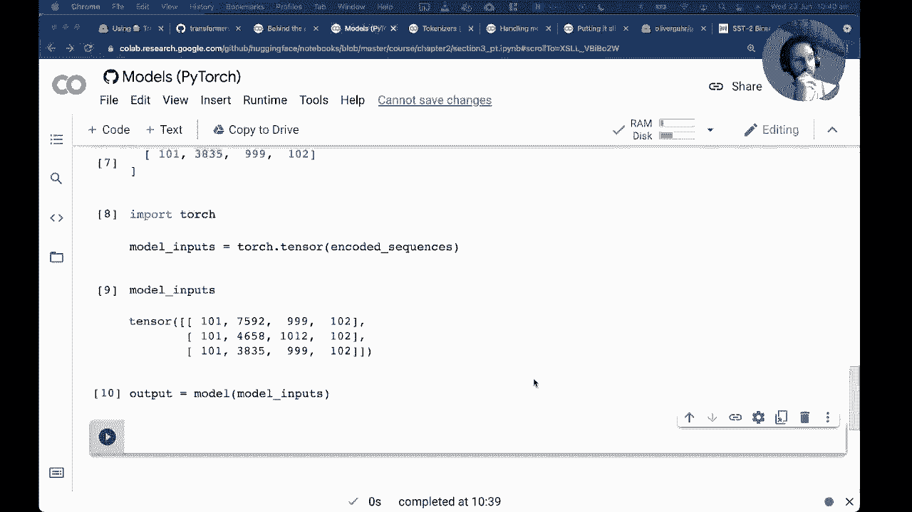


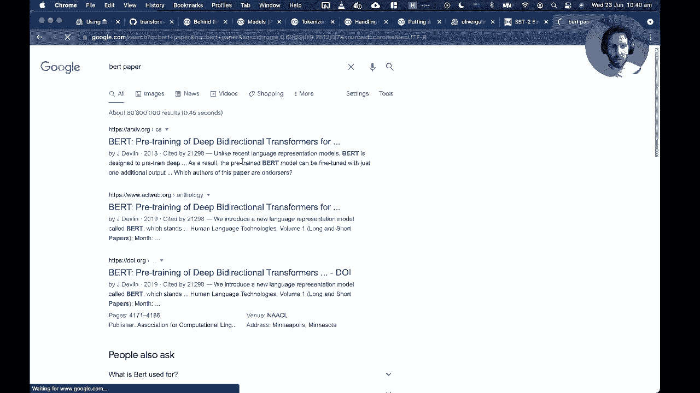

Transformers 库提供了 `AutoTokenizer` 来自动加载与模型匹配的分词器。


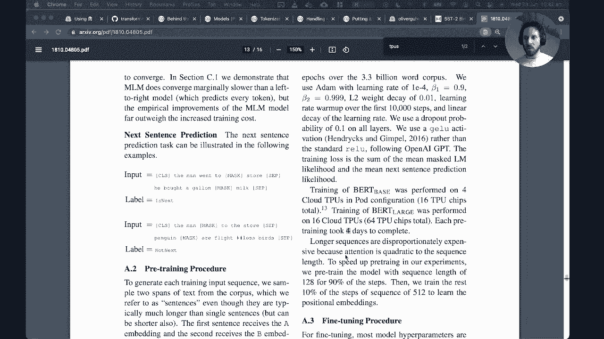

```python
from transformers import AutoTokenizer

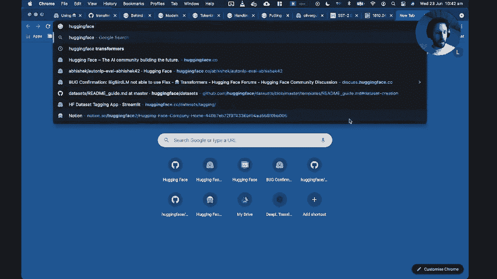

tokenizer = AutoTokenizer.from_pretrained("bert-base-uncased")
```

对文本进行分词：

```python
text = "Using a Transformer network is simple."
tokens = tokenizer.tokenize(text)
print(tokens)
# 输出：['using', 'a', 'transformer', 'network', 'is', 'simple', '.']

# 转换为模型所需的输入ID
input_ids = tokenizer.convert_tokens_to_ids(tokens)
print(input_ids)
```

更常见的做法是直接使用分词器的 `__call__` 方法，它一次性完成所有步骤（添加特殊标记、填充、截断等）。

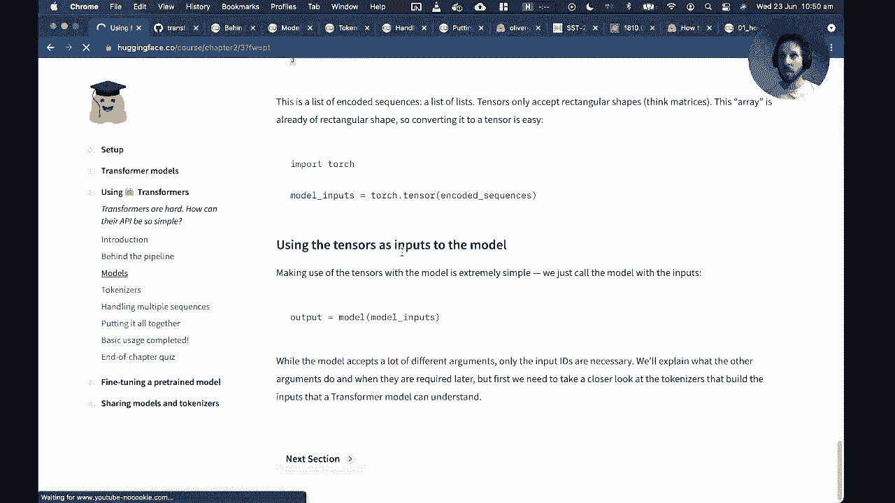


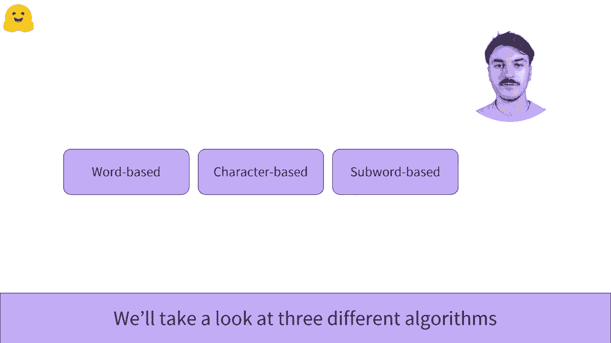

## 批处理与动态填充 ⚙️


在实际应用中，我们通常需要同时处理多个句子。这些句子的长度往往不同，但模型需要统一的矩形输入。这就需要用到填充和注意力掩码。

### 填充与截断

以下是处理变长序列的关键步骤：

*   **填充**：在较短的序列末尾添加特殊的填充标记（如 `[PAD]`），使其长度与批次中最长的序列一致。
*   **截断**：当序列超过模型的最大处理长度时，将其截断。
*   **注意力掩码**：一个与输入形状相同的二进制张量，用于告诉模型哪些位置是真实的标记（值为1），哪些是填充标记（值为0），以便在注意力计算中忽略填充部分。

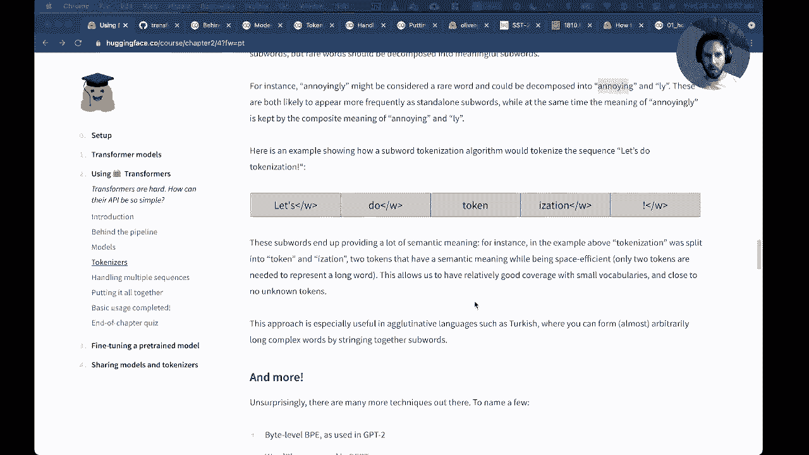

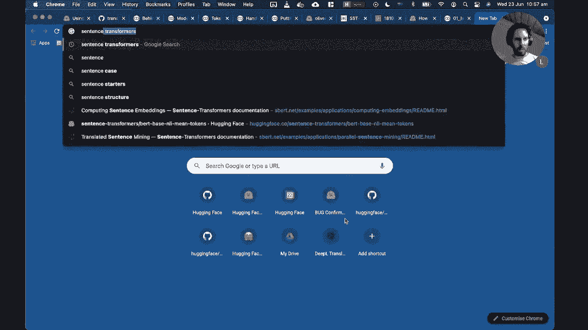

所有这些都可以通过分词器自动完成：

```python
sentences = ["My dog is cute.", "I like to play football."]

# 自动填充和创建注意力掩码
encoded_input = tokenizer(sentences, padding=True, truncation=True, return_tensors="pt")
print(encoded_input)
# 输出包含：`input_ids` (填充后的ID), `attention_mask` (注意力掩码)
```

### 填充策略

你可以控制填充的位置：

```python
# 默认在右侧填充
tokenizer.padding_side = "right"
# 可以改为左侧填充
tokenizer.padding_side = "left"
```

## 实战：解构情感分析 Pipeline 🔍

现在，让我们把学到的所有知识结合起来，手动复现情感分析 `pipeline` 的功能，以彻底理解其内部流程。

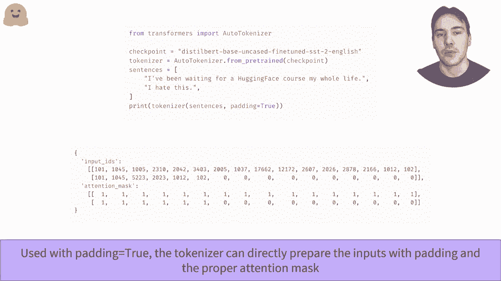


### 步骤一：加载模型和分词器

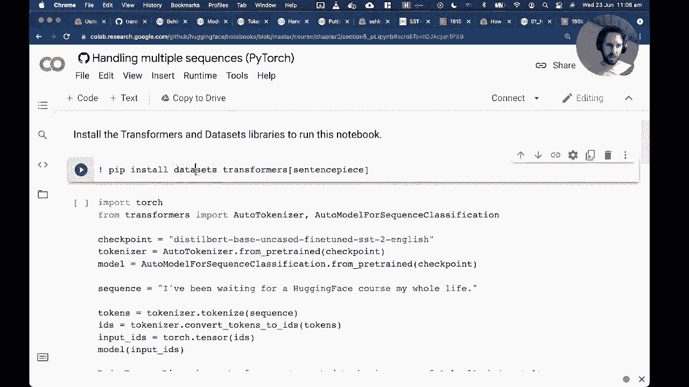

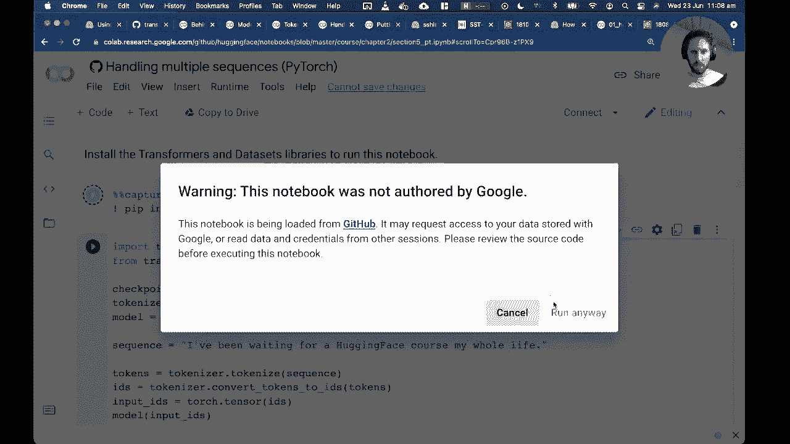

首先，加载与 pipeline 默认使用的相同模型和分词器。

```python
from transformers import AutoModelForSequenceClassification, AutoTokenizer

model_name = "distilbert-base-uncased-finetuned-sst-2-english"
model = AutoModelForSequenceClassification.from_pretrained(model_name)
tokenizer = AutoTokenizer.from_pretrained(model_name)
```

### 步骤二：文本预处理（分词）

使用分词器将原始文本转换为模型输入。

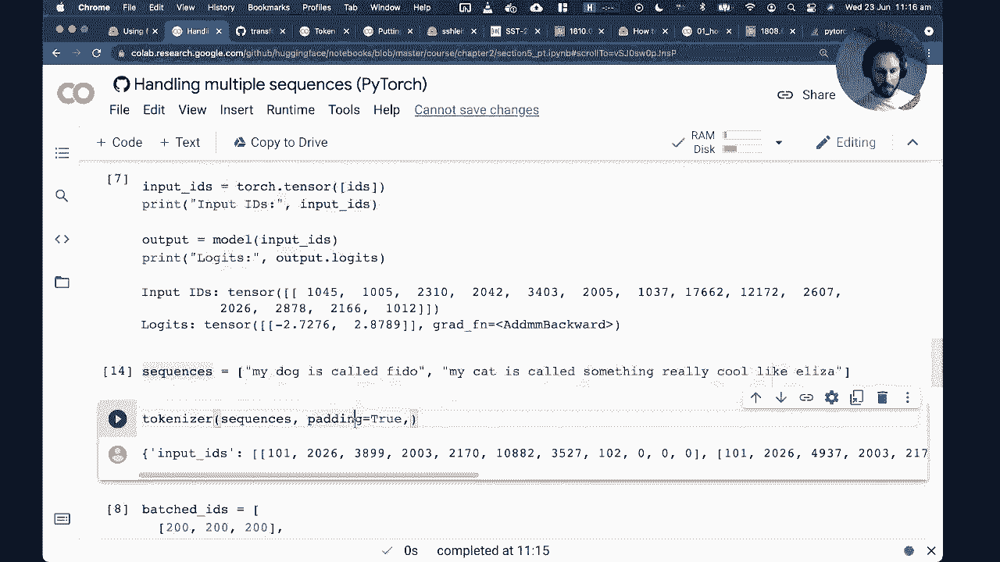


```python
sentences = ["I love this movie!", "This film is terrible."]
inputs = tokenizer(sentences, padding=True, truncation=True, return_tensors="pt")
```

### 步骤三：模型推理

将处理好的输入传递给模型。

```python
with torch.no_grad():
    outputs = model(**inputs)
logits = outputs.logits
```

### 步骤四：后处理

将模型输出的 logits 转换为概率和标签。

```python
import torch.nn.functional as F

probabilities = F.softmax(logits, dim=-1)
print(probabilities)

# 获取预测标签
predicted_class_ids = torch.argmax(probabilities, dim=-1)
# 使用模型配置中的标签映射
labels = [model.config.id2label[_id] for _id in predicted_class_ids.tolist()]
print(labels)
```

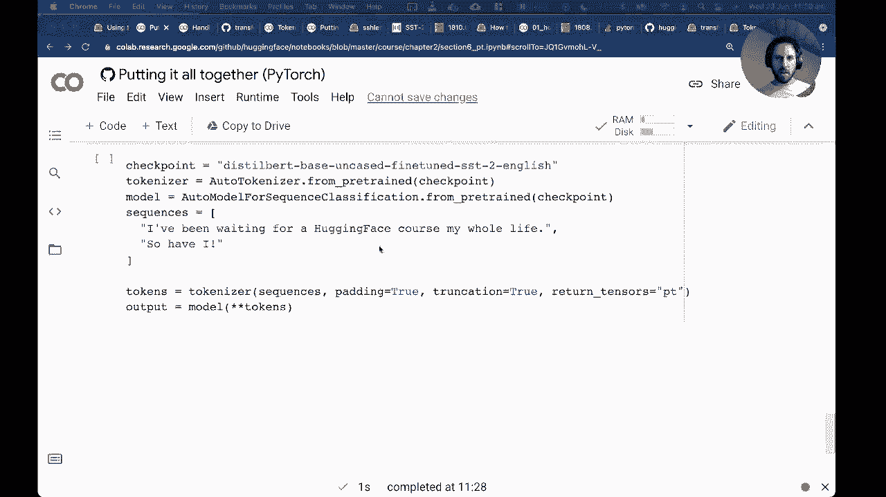


## 总结与回顾 🎯

本节课中，我们一起深入探索了 Transformers 库的核心组件。

*   我们学习了如何使用 `AutoModel` 和 `AutoTokenizer` 加载预训练模型及其对应的分词器。
*   我们剖析了模型架构，理解了嵌入层和编码器的作用。
*   我们探讨了三种主要的分词策略（词、字符、子词），并重点了解了基于子词的分词为何成为主流。
*   我们掌握了处理批量变长文本的关键技术：**填充**、**截断**和**注意力掩码**，并知道如何通过分词器自动实现这些功能。
*   最后，我们通过手动实现情感分析流程，将模型、分词器和数据处理的知识融会贯通，彻底解构了 `pipeline` 的黑箱。

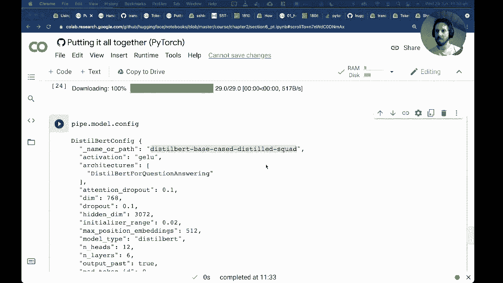


理解这些基础组件是灵活使用 Transformers 库、进行模型微调和解决复杂 NLP 任务的基石。